# 🌐 KFM Web Core API (`web/src/core/api`)


> **One sentence:** This folder is the **single, governed doorway** for the web UI to talk to the backend—so the UI stays fast, testable, and (most importantly) **evidence-safe**. 🧭

---

## 🧭 Quick links

- 📘 **Master pipeline + invariants:** `../../../../docs/MASTER_GUIDE_v13.md`
- 🧱 **Backend API home:** `../../../../src/server/`
- 🧾 **Contracts & schemas:** `../../../../src/server/contracts/` + `../../../../schemas/`
- 🗺️ **UI app root:** `../../../../web/`

---

## 🧩 Why this folder exists

KFM is built on two non-negotiables:

1. **📜 Contract-first** — API shapes (OpenAPI / GraphQL) are first-class artifacts. The UI does *not* invent its own payload formats.
2. **🔎 Provenance-first** — anything shown in the UI (including AI/analysis outputs) must be traceable to cataloged evidence (STAC/DCAT/PROV), not “floating” JSON blobs.

So `web/src/core/api` exists to enforce a clean boundary:

- UI components focus on **state + rendering + interactions** 🖱️
- The API client handles **requests + errors + caching + telemetry** 🧪
- Backend enforces **redaction/classification + contracts + governance** 🛡️

> [!IMPORTANT]
> **API boundary rule:** The web UI must not query Neo4j (or any database) directly.  
> All data access flows through backend services (`src/server/`) and their contracts. ✅

---

## 🗂️ Directory layout (where you are)

```text
📁 web/
└─ 📁 src/
   └─ 📁 core/
      └─ 📁 api/
         ├─ 📄 README.md   👈 you are here
         └─ … (client + domain modules live here)
```

> [!TIP]
> If you’re ever unsure “should I call fetch here?”, the answer is: **only through this folder**. 💡

---

## ✅ What belongs in `core/api` (and what doesn’t)

### ✅ Put here
- A **single HTTP client** wrapper (fetch/axios) with:
  - base URL resolution (dev/prod)
  - headers (auth, request-id, content negotiation)
  - timeouts + abort handling (critical for map/timeline UX)
  - standardized error types
  - retry rules (idempotent requests only)
- Domain clients that match backend contracts, e.g.:
  - `datasets` (metadata + download links)
  - `catalog` (STAC/DCAT browsing/search)
  - `tiles` (vector/raster/3D tiles endpoints)
  - `analysis` (NDVI/time-series, derived artifacts)
  - `story` (Story Nodes submit/read)
  - `focus` (Focus Mode Q&A w/ citations bundle)
  - `graphql` (typed GraphQL requests when needed)

### 🚫 Don’t put here
- UI state management (stores/hooks)
- Business rules that belong on the server (classification decisions, redaction logic)
- “One-off” `fetch()` calls inside React components
- Any secret tokens, API keys, or long-lived credentials 🔐

---

## 🔌 API surface philosophy (how it should feel to use)

The API should read like a **typed, minimal SDK** that mirrors the server contracts:

```ts
// ✅ UI calls expressive domain methods:
await api.datasets.get(datasetId)
await api.catalog.search({ bbox, datetime, q })
await api.tiles.getStyle({ era })
await api.story.submit(storyNodePayload)
await api.focus.ask({ question, contextBundleId })

// 🚫 UI should not do this:
await fetch("/api/whatever?random=true")
```

---

## 🧬 Request flow (KFM-style)

```mermaid
sequenceDiagram
  autonumber
  participant UI as 🖥️ React UI
  participant API as 🌐 web/src/core/api
  participant SVC as 🧱 src/server (REST/GraphQL)
  participant CAT as 🗂️ Catalogs (STAC/DCAT/PROV)
  participant G as 🕸️ Graph (Neo4j)

  UI->>API: request(domainMethod)
  API->>SVC: HTTP/GraphQL (contracted)
  SVC->>CAT: validate evidence refs + metadata
  SVC->>G: query graph (server-side only)
  SVC-->>API: response (redacted + classified)
  API-->>UI: typed payload + safe errors
```



---

## 🧪 Usage examples (patterns)

> These examples show the **intended usage shape**. Exact method names/types come from your generated contracts + local wrappers.

### 1) Dataset metadata (GeoJSON or tile links)
```ts
import { api } from "@/core/api";

const ds = await api.datasets.get("ks_hillshade_v1");
console.log(ds.title, ds.spatialExtent, ds.distributions);
```

### 2) Map-driven requests with cancellation (pan/zoom safe)
```ts
const controller = new AbortController();

try {
  const results = await api.catalog.search(
    { bbox, datetime: "1850-01-01/1900-12-31", q: "railroad" },
    { signal: controller.signal }
  );
  // render results
} catch (err) {
  if (api.errors.isAbort(err)) return; // user panned away
  throw err;
}

// later…
controller.abort();
```

### 3) Story Node submission (governed narrative)
```ts
await api.story.submit({
  title: "The growth of rail corridors",
  claims: [
    {
      text: "Rail expansion accelerated after …",
      evidence: [{ stacItem: "stac:item:railroads_1880", prov: "prov:activity:…" }]
    }
  ]
});
```

### 4) Focus Mode ask (must return citations)
```ts
const answer = await api.focus.ask({
  question: "What sources support the claim that river courses shifted here?",
  contextBundleId: "focus_bundle:saline_river_1860_1900"
});

// answer.text + answer.citations[] + answer.confidence + answer.disclaimer
```

### 5) GraphQL query (only when contract says so)
```ts
const data = await api.graphql.query(/* GraphQL */ `
  query TimelineEvents($bbox: BBoxInput!, $range: DateRange!) {
    events(bbox: $bbox, dateRange: $range) {
      id
      title
      startDate
      endDate
      evidence { stacItem prov }
    }
  }
`, { bbox, range });
```

---

## 🧯 Errors & safety defaults (the “boring but critical” part)

### Error types (recommended)
- `ApiError` — non-2xx response (includes status + safe message)
- `ValidationError` — response violated expected contract (treat as “bug”)
- `NetworkError` — DNS/offline/timeout
- `AuthError` — 401/403
- `RateLimitError` — 429
- `AbortError` — request was cancelled

> [!NOTE]
> **Never** dump full response bodies into logs if they may contain sensitive data.  
> Prefer “safe logs”: status code, endpoint name, request-id, and a short sanitized message.

### Retry rules (recommended)
- ✅ Retry **GET** / idempotent reads *only*
- 🚫 Don’t auto-retry writes (`POST /story`, `POST /ingest`) unless the backend provides idempotency keys

---

## ⚡ Performance principles (for maps + time sliders)

KFM’s UI is map/timeline heavy, so `core/api` should optimize for:
- **Request dedupe** (same query fired by multiple components)
- **Caching** (ETag/If-None-Match; browser cache for tiles)
- **Pagination** (don’t pull the world—request slices)
- **Streaming-friendly endpoints** (tiles, 3D Tiles, chunked downloads)
- **Abortability** (map moves must cancel old requests)

> [!TIP]
> Treat every map interaction like a real-time system: cancel fast, render partial, upgrade progressively. 🏎️

---

## 🔐 Security & governance checklist

- [ ] No secrets in frontend code (ever) 🔥
- [ ] All requests go through backend contracts (no “secret endpoints”)
- [ ] UI never bypasses redaction/classification controls
- [ ] Inputs are encoded safely (query params, GraphQL variables)
- [ ] Telemetry hooks respect privacy + governance policies
- [ ] Contract changes include versioning + tests

---

## 🧰 Adding a new endpoint (the KFM way)

1. **Define/extend the contract** in backend (`src/server/contracts/`)
   - OpenAPI path or GraphQL schema update
2. **Add/extend server implementation** (`src/server/`)
   - enforce redaction/classification here
3. **Regenerate types** (OpenAPI/GraphQL codegen as configured)
4. **Add a domain wrapper** in `web/src/core/api/`
   - keep it thin, typed, and predictable
5. **Add tests**
   - contract tests (server)
   - client unit tests + mock server (web)
6. **Update docs**
   - this README (if the surface area changed)

---

## 🧠 Design notes for geospatial + historical UX

KFM’s front-end is a layered geospatial explorer (2D + 3D) with time controls. 🌎🕰️  
That means the API layer should assume:
- responses may include **tile URLs**, **GeoJSON**, **COG distributions**, **KML/KMZ**, **3D Tiles**, etc.
- clients must support **time-aware** querying and metadata (temporal extents, versions)
- document-linked features should include **snippets + citations** (not just “trust me” summaries)

---

## 📚 Project library that informs this module (click to expand)

<details>
<summary><strong>📖 References & skill books used across KFM (and why they matter here)</strong></summary>

### 🗺️ Geospatial / mapping / cartography
- **making-maps-a-visual-guide-to-map-design-for-gis.pdf** — map readability, legend/scale expectations (API should return metadata that supports good map UX).
- **python-geospatial-analysis-cookbook.pdf** — practical PostGIS/geometry workflows (API endpoints often wrap these patterns).
- **Archaeological 3D GIS_26_01_12_17_53_09.pdf** — 3D GIS concepts that show up in 3D Tiles/scene endpoints.
- **Mobile Mapping_ Space, Cartography and the Digital - 9789048535217.pdf** — mobile-first constraints → caching, offline-friendly patterns.

### 🛰️ Remote sensing / raster analytics
- **Cloud-Based Remote Sensing with Google Earth Engine-Fundamentals and Applications.pdf** — informs analysis endpoints (e.g., NDVI-style queries) and provenance expectations.

### 🧪 Modeling / simulation / evidence artifacts
- **Scientific Modeling and Simulation_ A Comprehensive NASA-Grade Guide.pdf** — reproducibility mindset for “analysis outputs as first-class datasets”.
- **Generalized Topology Optimization for Structural Design.pdf** — example of heavy compute outputs that must be served with provenance and versioning.

### 📈 Statistics / inference (for analysis endpoints + uncertainty)
- **Understanding Statistics & Experimental Design.pdf**
- **think-bayes-bayesian-statistics-in-python.pdf**
- **regression-analysis-with-python.pdf**
- **Regression analysis using Python - slides-linear-regression.pdf**
- **graphical-data-analysis-with-r.pdf**

### 🕸️ Graph / networks (for graph-backed queries)
- **Spectral Geometry of Graphs.pdf** — informs how “graph queries” become product features (and why stable schemas matter).

### 🧱 Databases / performance
- **PostgreSQL Notes for Professionals - PostgreSQLNotesForProfessionals.pdf**
- **Database Performance at Scale.pdf**
- **Scalable Data Management for Future Hardware.pdf**

### 🌐 Web UI + rendering (impacts API shape + payload choices)
- **responsive-web-design-with-html5-and-css3.pdf** — responsive constraints → pagination, progressive loading.
- **webgl-programming-guide-interactive-3d-graphics-programming-with-webgl.pdf** — 3D payload considerations (textures, glTF, streaming).

### 🧵 Concurrency / real-time systems (UI responsiveness under load)
- **concurrent-real-time-and-distributed-programming-in-java-threads-rtsj-and-rmi.pdf** — mental model for timeouts, backpressure, cancellation.

### 🛡️ Security (why we keep contracts + avoid raw fetch everywhere)
- **ethical-hacking-and-countermeasures-secure-network-infrastructures.pdf**
- **Gray Hat Python - Python Programming for Hackers and Reverse Engineers (2009).pdf**
- **S-T programming Books.pdf** — secure-by-default patterns (input handling, injection awareness).

### 🖼️ Media formats (tiles, thumbnails, archival imagery)
- **compressed-image-file-formats-jpeg-png-gif-xbm-bmp.pdf** — file format tradeoffs for UI delivery.

### 🧭 Ethics / governance / “why trust matters”
- **Data Spaces.pdf** — governance + provenance + sovereignty framing.
- **Introduction to Digital Humanism.pdf** — human-centered constraints around data/AI use.
- **On the path to AI Law’s prophecies and the conceptual foundations of the machine learning age.pdf** — policy-aware posture for AI features.

### 🧠 Systems thinking (for long-lived, evolving architectures)
- **Principles of Biological Autonomy - book_9780262381833.pdf** — systems-of-systems mindset (useful for modular boundaries like `core/api`).

### 📌 KFM-specific architecture
- **Kansas Frontier Matrix (KFM) – Comprehensive Technical Documentation.pdf**
- **Kansas-Frontier-Matrix_ Open-Source Geospatial Historical Mapping Hub Design.pdf**
- **MARKDOWN_GUIDE_v13.md.gdoc**

</details>

---

## 🧾 Maintenance notes

- Keep this layer **boring and dependable**: deterministic requests, consistent errors, minimal side effects.
- If you add a new domain method, add:
  - a tiny docstring
  - a request/response example
  - a test stub
  - a note in the “Adding a new endpoint” checklist ✅

---

## 🧡 Contributing

If you’re implementing UI features that need new data:
1) start with the contract,  
2) ship the backend,  
3) then wire it here,  
4) only then render in React.

That’s how we keep KFM trustworthy. 🔎✨

