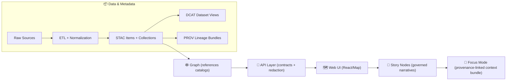

# 🧾 Core Contracts (Web)  
      

> [!IMPORTANT]
> **If it shows up in the UI (or Focus Mode), it must be schema-valid + provenance-linked.**  
> No “mystery layers.” No unsourced content. No bypassing the governed API boundary.

---

## 🧭 Why this folder exists

`web/src/core/contracts/` is the **single** place in the web app where we define **stable, runtime-checkable data shapes** that cross boundaries:

- 🌐 **API boundary** (REST/OpenAPI + GraphQL responses and requests)
- 🗺️ **Catalog boundary** (STAC/DCAT/PROV references that make evidence traceable)
- 🧠 **Story/Focus boundary** (machine-ingestible narrative + evidence context bundles)
- 🧩 **Graph boundary** (projections of the knowledge graph into UI-safe shapes)
- 📈 **Analysis boundary** (stats/ML/simulation outputs treated as *evidence artifacts*)
- 🔐 **Governance boundary** (classification/redaction and “no-leak” requirements)

This directory should be **boring** (in a good way): deterministic, testable, and safe to import anywhere in the UI.

---

## 🗺️ Mental model: the pipeline & contract boundaries



### 🔒 Non‑negotiable invariants (carry these in every contract)

- ✅ **Contract-first:** schemas/specs are first-class artifacts; changes trigger compatibility discipline.
- ✅ **Provenance-first:** anything visible must be traceable to cataloged evidence (STAC/DCAT/PROV).
- ✅ **API boundary rule:** UI never queries graph/storage directly; the server enforces redaction + consistency.
- ✅ **Classification propagation:** outputs can’t be less restricted than inputs; UI must honor redaction/generalization.
- ✅ **Evidence-first narrative:** Focus Mode must not introduce unsourced claims; citations/evidence links are required.

---

## 🧱 What belongs here (and what does not)

### ✅ Belongs here
- **DTOs**: request/response shapes, error envelopes, pagination cursors
- **Catalog references**: STAC/DCAT/PROV identifiers and minimal summaries
- **Map layer specs**: layer registry entries, tile/raster/vector source descriptors, legend metadata
- **Story/Focus contracts**: Story Node metadata, citation blocks, Focus context bundle
- **Telemetry event shapes**: UI audit + analytics hooks
- **Evidence artifact shapes**: regression/simulation/ML outputs with provenance + uncertainty

### ❌ Does *not* belong here
- React components, hooks, UI state machines
- Fetching logic (`fetch`, `axios`, GraphQL clients)
- Persistence models (DB rows, Neo4j internal shapes)
- Business logic (transformations, scoring, reducers)
- Anything that requires environment access (DOM, `window`, secrets)

---

## 🗂️ Suggested layout (adapt to what already exists)

```text
web/src/core/contracts/
├─ 📄 README.md
├─ 🧩 primitives/                # IDs, time, geo primitives, enums
├─ 🧾 provenance/                # STAC/DCAT/PROV references + evidence links
├─ 🕸️ graph/                     # UI-safe projections of graph nodes/edges
├─ 🗺️ map/                       # layer specs, tiles/raster/vector sources, legends
├─ 🧠 story_focus/               # Story Node + Focus context bundle contracts
├─ 📈 analysis/                  # stats/ML/simulation/optimization evidence artifacts
├─ 📡 telemetry/                 # audit + analytics events
└─ 🧪 __fixtures__/              # example JSON payloads used for contract tests
```

> [!TIP]
> Keep contracts **dependency-light**. Ideal dependencies: schema validator + tiny helpers.  
> Avoid importing from “feature” code to prevent circular dependencies.

---

## 🧩 Core primitives (recommended)

Contracts get exponentially easier when you standardize the “small stuff”:

### ✅ IDs & references
- Use **opaque, stable string IDs** (don’t encode meaning unless there’s a strong reason).
- If an ID is a URI/URN, still treat it as an opaque string.

```ts
// Example primitives (shape, not implementation requirement)
export type KfmId = string;     // opaque
export type Uri = string;       // absolute URL/URN preferred
export type IsoDate = string;   // YYYY-MM-DD
export type IsoDateTime = string; // ISO-8601 UTC recommended
```

### ✅ Time & ranges
- Prefer explicit ranges (`start`, `end`) over ambiguous single timestamps.
- Include timezone semantics (UTC “Z” recommended for cross-system consistency).

### ✅ Geo basics
- Prefer GeoJSON for geometry payloads.
- Use consistent coordinate order (lon, lat) and document it.

```ts
export type LngLat = [number, number];            // [lon, lat]
export type BBox = [number, number, number, number]; // [minLon, minLat, maxLon, maxLat]
export type TimeRange = { start?: IsoDateTime; end?: IsoDateTime };
```

---

## 🧾 Provenance linking (evidence-first by default)

Every “thing” shown to users should have a **minimal provenance link** that lets the UI:
- show attribution/credits ✅
- link to source records ✅
- enable Focus Mode citations ✅
- enforce classification propagation ✅

### Recommended building blocks
- `CatalogRef` (STAC/DCAT pointers)
- `ProvRef` (lineage pointer)
- `EvidenceLink` (the combined “traceability hook”)

```ts
// Example (shape, not mandated fields)
export type CatalogRef = {
  stacItemId?: string;
  stacCollectionId?: string;
  dcatDatasetId?: string;        // often JSON-LD @id
  distributions?: Array<{ uri: Uri; mediaType?: string }>;
};

export type ProvRef = {
  provBundleId?: string;         // file/run bundle id
  provActivityId?: string;       // activity node id
  runId?: string;                // pipeline run id / commit hash pointer
};

export type EvidenceLink = {
  catalog?: CatalogRef;
  prov?: ProvRef;
  sourceAttribution?: {
    sourceName?: string;
    sourceUri?: Uri;
    license?: string;
    rights?: string;
  };
};
```

> [!IMPORTANT]
> Evidence links are not “nice-to-have.” They are the mechanism that prevents unsourced UI content.

---

## 🔐 Classification & redaction (no-leak contracts)

Contracts should make it *possible* to do the right thing by default:

- Include a **classification label** on content objects (and carry it through derived products).
- Include **redaction hints** for the UI when relevant (blur/generalize location, hide attributes, etc.).

```ts
export type Classification =
  | "public"
  | "internal"
  | "restricted"
  | "sensitive";

export type RedactionHint =
  | { kind: "none" }
  | { kind: "blur_location"; radiusMeters: number }
  | { kind: "generalize_geometry"; toleranceMeters: number }
  | { kind: "hide_fields"; fields: string[] };

export type GovernanceEnvelope = {
  classification: Classification;
  redaction?: RedactionHint[];
  // Optional: reasons/justifications, review flags, etc.
};
```

---

## 🌐 API DTO patterns (pagination, idempotency, retries)

Design API-facing contracts for:
- predictable performance (pagination, limits)
- safe retries (idempotency keys)
- observability (correlation IDs)

```ts
export type RequestMeta = {
  requestId: string;       // per request
  correlationId?: string;  // across a user action / workflow
};

export type PageRequest = {
  cursor?: string;         // opaque
  limit?: number;          // bounded on server
};

export type PageResponse<T> = {
  items: T[];
  nextCursor?: string;
  totalApprox?: number;    // optional; avoid expensive exact counts
};
```

> [!TIP]
> Prefer **cursor-based** pagination over offset-based paging for large datasets.

---

## 🕸️ Graph projections (UI-safe shapes)

The graph is powerful—but the UI should consume **projections**:
- minimal, purpose-built shapes
- stable types (avoid leaking DB quirks)
- references back to catalogs/evidence

```ts
export type GraphNode = {
  id: string;
  type: string;           // e.g., "Treaty", "Person", "Place", "Dataset"
  label: string;          // display label
  evidence?: EvidenceLink;
  governance?: GovernanceEnvelope;
};

export type GraphEdge = {
  id: string;
  type: string;           // relationship type
  from: string;
  to: string;
  evidence?: EvidenceLink;
  governance?: GovernanceEnvelope;
};
```

### 📊 Graph analytics outputs (spectral/centrality/etc.)
If the UI displays graph analytics, treat metrics as **evidence artifacts**:
- include algorithm name + parameters
- include run provenance
- include stability notes (sampling, time window, etc.)

---

## 🗺️ Map & layer contracts (cartography-aware)

A map layer contract should be:
- evidence-linked ✅
- license/attribution-ready ✅
- render-ready ✅ (vector/raster/3D)
- responsive-friendly ✅ (multiple resolutions, thumbnails)

```ts
export type MapLayerSpec = {
  id: string;
  title: string;
  description?: string;

  kind: "vector" | "raster" | "tile" | "3d";
  source: {
    uri: Uri;              // tile endpoint, STAC asset URL, etc.
    mediaType?: string;    // e.g. application/vnd.mapbox-vector-tile
  };

  display?: {
    minZoom?: number;
    maxZoom?: number;
    legend?: Array<{ label: string; swatch?: string }>;
    thumbnail?: { uri: Uri; mediaType?: string };
  };

  evidence: EvidenceLink;
  governance: GovernanceEnvelope;
};
```

> [!NOTE]
> Cartographic correctness matters: projection assumptions, scale, and generalization can change interpretation.  
> Contracts should allow the UI to **signal uncertainty** and **avoid false precision**.

---

## 🎛️ Rendering & asset formats (WebGL + imagery realities)

When contracts reference imagery or GPU-consumed assets:
- include **mediaType**
- include optional hints needed for safe rendering (dimensions, alpha, color model)
- keep it conservative—asset parsing is an attack surface

```ts
export type ImageAsset = {
  uri: Uri;
  mediaType: string;         // "image/png", "image/jpeg", ...
  width?: number;
  height?: number;
  hasAlpha?: boolean;
};
```

---

## 📈 Evidence artifacts (stats / ML / simulation / optimization)

KFM treats analysis outputs as first-class datasets—so their contracts must look like evidence:

### 🔁 Base “Evidence Artifact” shape
```ts
export type EvidenceArtifact = {
  id: string;
  title: string;
  producedAt: IsoDateTime;

  method: {
    name: string;          // e.g. "linear_regression", "bayesian_model", "climate_sim"
    version?: string;      // model/solver version
    parameters?: Record<string, unknown>;
    randomSeed?: number;
  };

  inputs: EvidenceLink[];  // references to source datasets
  outputs: Array<{ uri: Uri; mediaType?: string }>;

  quality?: {
    uncertainty?: unknown; // flexible: intervals, ensembles, error bounds, etc.
    confidence?: number;   // optional scalar when meaningful
    notes?: string[];
  };

  evidence: EvidenceLink;
  governance: GovernanceEnvelope;

  // Crucial for reproducibility/debugging
  run?: { runId?: string; commit?: string };
};
```

### 📉 Regression results
Include:
- coefficients + standard errors / intervals
- goodness-of-fit metrics
- residual summaries
- dataset references

### 🎲 Bayesian results
Include:
- priors/posterior summaries
- credible intervals
- posterior predictive summaries
- sampling diagnostics when relevant

### 🧠 ML evaluation metrics
Include:
- confusion matrix (for classification)
- ROC AUC / precision-recall summaries
- calibration/threshold info when applicable

### 🛰️ Remote sensing & raster products
Include:
- band metadata
- resolution / CRS / nodata
- temporal extent and acquisition metadata

### 🧱 Topology optimization / simulation outputs
Include:
- objective + constraints
- mesh/solver metadata
- convergence diagnostics
- V&V/UQ fields where available

> [!IMPORTANT]
> Any AI-produced layer or analysis result exposed to users must be clearly labeled as **derived/computational**, carry **confidence/uncertainty** where applicable, and remain **fully traceable** to inputs.

---

## 🧪 Validation & contract tests

Every contract should have:
- ✅ **runtime validation** (schema validator)
- ✅ **fixtures** (known-good JSON + known-bad JSON)
- ✅ **golden tests** (encode → decode roundtrip)
- ✅ **compat tests** for version changes (older payloads still parse)

Security-minded extras (high value):
- 🧨 fuzz tests on parsers/decoders
- 🧯 “max size” guards for arrays/strings
- 🧷 strict URL parsing for `uri` fields when data is untrusted

---

## ✅ How to add / change a contract (checklist)

1. 🧩 **Define primitives first** (IDs/time/geo/governance) if needed.
2. 🧾 Add/extend the contract shape (and runtime schema).
3. 🧪 Add fixtures in `__fixtures__/`:
   - `valid.*.json`
   - `invalid.*.json`
4. 🧯 Add defensive bounds:
   - pagination maxes
   - array length caps
   - string length caps
5. 🔁 If the contract is public/stable: **version it** (SemVer discipline).
6. 🔗 If it’s displayed: **attach EvidenceLink + GovernanceEnvelope**.
7. 🧭 Update any index exports so imports stay clean.
8. 📝 Update this README if you introduce a new contract category.

---

## 🧾 Quick glossary (KFM terms used in contracts)

- **Contract artifact**: a machine-validated schema/spec defining an interface (DTO, schema, config).
- **Evidence artifact**: derived data product registered with catalogs (STAC/DCAT + PROV lineage) before use.
- **Story Node**: governed narrative artifact that is machine-ingestible and citation-linked.
- **Focus Mode**: interactive experience constrained to provenance-linked content; no unsourced additions.

---

## 📚 Project reference library (used to shape contract rules)

<details>
<summary>📖 Expand: what informed these conventions (by file)</summary>

### 🧭 KFM architecture & governance
- **Kansas Frontier Matrix (KFM) – Comprehensive Technical Documentation** — contract-first + provenance-first + “no mystery layers”
- **MARKDOWN_GUIDE_v13** — canonical pipeline ordering, subsystem invariants, STAC/DCAT/PROV alignment, API boundary + redaction rules

### 🗺️ Geo, cartography, remote sensing, 3D
- **making-maps-a-visual-guide-to-map-design-for-gis** — map communication, symbolization, scale/projection implications
- **Mobile Mapping: Space, Cartography and the Digital** — location context, privacy, representation in digital maps
- **python-geospatial-analysis-cookbook** — practical geospatial data shapes and processing considerations
- **Cloud-Based Remote Sensing with Google Earth Engine** — raster/catalog semantics, temporal/spatial metadata
- **Archaeological 3D GIS** — 3D/uncertainty/provenance in spatial interpretation

### 🎛️ Rendering & media formats
- **webgl-programming-guide-interactive-3d-graphics-programming-with-webgl** — GPU-friendly asset constraints and safe data flows
- **compressed-image-file-formats-jpeg-png-gif-xbm-bmp** — practical differences in image encodings relevant to UI assets

### 🧠 Analysis, statistics, and uncertainty
- **Scientific Modeling and Simulation (NASA-grade)** — verification/validation, reproducibility, uncertainty quantification
- **Understanding Statistics & Experimental Design** — rigorous reporting expectations for statistical claims
- **regression-analysis-with-python** + **slides-linear-regression** — regression result fields and diagnostics
- **think-bayes-bayesian-statistics-in-python** — posterior/credible intervals + predictive outputs as first-class artifacts
- **graphical-data-analysis-with-r** — EDA/quality flags: outliers, missingness, distribution summaries
- **Deep Learning for Coders with fastai and PyTorch** + **Data Mining Concepts & applications** — ML evaluation outputs + dataset/result documentation

### 🕸️ Graph analytics & optimization
- **Spectral Geometry of Graphs** — Laplacian/eigen/spectral metrics as reproducible outputs
- **Generalized Topology Optimization for Structural Design** — objective/constraints/mesh/convergence output patterns

### 🗃️ Data systems, performance, and interoperability
- **PostgreSQL Notes for Professionals** — data typing discipline + portability hints
- **Database Performance at Scale** — pagination, caching, idempotency, retry-friendly design
- **Scalable Data Management for Future Hardware** — streaming/windowing semantics and chunked results
- **Data Spaces** — interoperability problems solved via standards + contracts (not ad-hoc integration)

### 🔐 Security + governance + human impact
- **ethical-hacking-and-countermeasures-secure-network-infrastructures** + **Gray Hat Python** — treat parsers/decoders as attack surfaces; validate aggressively
- **Introduction to Digital Humanism** — human-centered transparency expectations
- **AI Law foundations** — accountability hooks for ML outputs
- **Principles of Biological Autonomy** — systems thinking: boundaries + regulation signals

### 📦 General programming references (multi-book PDFs)
- **A programming Books** / **B-C** / **D-E** / **F-H** / **I-L** / **M-N** / **O-R** / **S-T** / **U-X** — cross-language architecture patterns, data modeling, and implementation hygiene

</details>

---

## 🧩 TL;DR (sticky note)

- ✅ Define stable shapes here  
- ✅ Validate everything at runtime  
- ✅ Attach provenance + governance if it’s visible  
- ✅ Version contracts intentionally  
- ✅ Keep UI behind the API boundary  
- ✅ Treat analysis outputs as evidence artifacts  

📌 If you’re unsure where something belongs: if it’s *an interface*, it’s probably a contract. If it’s *behavior*, it’s not.

---

