# 🧠 Domain Core (`web/src/core/domain`)


**What this folder is:** the **language of the product** — domain types, invariants, and rules used by the KFM web app (React/Map UI) without coupling to UI frameworks, mapping libraries, or I/O.

> [!IMPORTANT]
> If it **imports React**, **MapLibre**, **DOM APIs**, **fetch/axios**, **localStorage**, or talks to the network/database… it’s **not** domain. Put it in an adapter/infrastructure layer.

---

## 🧭 Quick navigation

- [🎯 Purpose](#purpose)
- [🧱 What belongs here](#belongs)
- [🔒 Non‑negotiables (KFM invariants)](#invariants)
- [🏗️ Dependency rule](#dependency-rule)
- [🗂️ Suggested folder layout](#layout)
- [🧩 Modeling guidelines](#modeling)
  - [🧾 Provenance & evidence](#provenance)
  - [🪪 IDs & traceability](#ids)
  - [🗺️ Geo & CRS](#geo)
  - [⏱️ Time](#time)
  - [🧯 Sensitivity / sovereignty / redaction](#sensitivity)
  - [🎚️ Uncertainty & confidence](#uncertainty)
  - [🧠 AI-generated outputs (opt‑in + labeled)](#ai)
- [🧪 Patterns & examples](#examples)
- [✅ PR checklist](#checklist)
- [📚 References & project library](#refs)

---

<a id="purpose"></a>
## 🎯 Purpose

KFM’s web UI sits **after** governed data and metadata pipelines. The domain layer exists to:

- **Represent KFM concepts faithfully** (datasets, map layers, story nodes, evidence, provenance, graph nodes/edges, etc.).
- **Enforce invariants early** (especially evidence-first + redaction/classification rules).
- **Stay portable** (so the UI can evolve — MapLibre ⇄ Cesium ⇄ other renderers — without rewriting “what the system means”).
- **Keep business meaning testable** (domain tests run in Node with zero browser dependencies).

---

<a id="belongs"></a>
## 🧱 What belongs here

| ✅ Put it in `domain/` | ❌ Keep it out of `domain/` |
|---|---|
| Entities & Value Objects (pure models) | React components / hooks |
| Domain policies (e.g., classification propagation) | MapLibre/Cesium objects, styles, layers |
| Domain errors (typed + meaningful) | `fetch`, `axios`, WebSocket clients |
| Pure calculations (bbox, scoring, sorting) | `localStorage`, IndexedDB, analytics SDKs |
| “Portable” types for Story/Focus Mode | DOM manipulation, CSS, rendering code |
| Interfaces/ports (if used) | Neo4j/Cypher, SQL, filesystem |

> [!NOTE]
> Domain may define **interfaces** (ports) like `EvidenceRepository` or `StoryNodeLoader`, but implementations live elsewhere.

---

<a id="invariants"></a>
## 🔒 Non‑negotiables (KFM invariants this layer must support)

These come from the project’s governed architecture and documentation standards:

- **Evidence-first**: narrative content and UI claims must be traceable to versioned evidence.
- **Contract-first**: the web app consumes **contracted APIs**; no bypassing the API boundary.
- **Pipeline ordering** (conceptual): ETL → catalogs (STAC/DCAT/PROV) → graph → APIs → UI → Story Nodes → Focus Mode.
- **No data leakage**: sensitive layers must be withheld/generalized, and UI interactions can emit audit/telemetry events (e.g., when redaction occurs).
- **Classification can’t be downgraded**: outputs can’t be “less restricted” than inputs unless an approved transformation exists.
- **AI assistance is opt-in and labeled**: AI text must be flagged and accompanied by confidence/uncertainty metadata.

> [!WARNING]
> If you add a new domain model that can appear in Focus Mode, assume it may be subject to **sovereignty tags** and **redaction policy** even if the first dataset you test is “public”.

---

<a id="dependency-rule"></a>
## 🏗️ Dependency rule (Clean Architecture, web edition)

Domain is the inner ring. Everything else depends on it, not the other way around.

```mermaid
flowchart TB
  UI["🖼️ UI (React, MapLibre)"] --> APP["🧭 Application / Use-cases"]
  APP --> DOM["🧠 Domain (this folder)"]
  APP --> INF["🔌 Infrastructure / Adapters"]
  INF --> EXT["🌍 External systems (APIs, storage, analytics, map engines)"]

  DOM -. no imports .-> UI
  DOM -. no imports .-> INF
  DOM -. no imports .-> EXT
```



Practical implications:

- `domain/` should compile in isolation.
- `domain/` should be safe to reuse in tests, workers, or even another UI.
- “Smart” domain objects should be **immutable** (or at least treated as such) to avoid UI state bugs.

---

<a id="layout"></a>
## 🗂️ Suggested folder layout

This is a **recommended** shape for `web/src/core/domain/`. Adjust to match the codebase, but keep the same intent.

```text
web/src/core/domain/
├── 📄 README.md
├── 📄 index.ts                  # barrel exports (keep clean)
├── 📁 ids/                      # branded IDs, version refs, URNs
├── 📁 value-objects/            # small immutable types (BBox, TimeRange, Confidence)
├── 📁 entities/                 # domain entities (Dataset, MapLayer, StoryNode)
├── 📁 provenance/               # evidence + lineage types (STAC/DCAT/PROV refs)
├── 📁 sensitivity/              # classification, sovereignty, redaction policies
├── 📁 geo/                      # geo primitives (GeoJSON wrappers, CRS, units)
├── 📁 time/                     # time primitives (instants, ranges, calendars)
├── 📁 graph/                    # graph node/edge abstractions for UI
├── 📁 story/                    # story node + focus mode portable types
├── 📁 errors/                   # domain errors
└── 📁 __tests__/                # domain unit tests (if colocated)
```

> [!TIP]
> Keep files **small** and **single-purpose**. If an object needs I/O to exist, it’s not domain.

---

<a id="modeling"></a>
## 🧩 Modeling guidelines

<a id="provenance"></a>
### 🧾 Provenance & evidence (first-class)

In KFM, **provenance is not optional decoration** — it is part of the meaning of data and claims.

- Every “thing shown to the user” should be able to carry:
  - **Evidence refs** (source documents, datasets, STAC items/assets)
  - **Lineage refs** (PROV activities/entities/agents)
  - **Versioning** (dataset version, commit SHA, run ID)

**Rule of thumb:** if a UI card claims “X happened”, the domain model should be able to answer “according to what?”

<a id="ids"></a>
### 🪪 IDs & traceability

Prefer stable identifiers and explicit version references:

- Use branded string IDs (compile-time safety).
- Include optional “trace” fields when objects are derived from pipelines:
  - `runId`, `pipelineVersion`, `sourceDatasetId`, `commitSha`, etc.
- Mirror the **traceability matrix** mindset: link features/results back to code + data versions.

<a id="geo"></a>
### 🗺️ Geo & CRS

Geo is one of the easiest places to introduce silent bugs.

- **Never** rely on “just an array of numbers” without declaring order and CRS.
- Prefer explicit types:
  - `LonLat` (`[lon, lat]`)
  - `BBox` (`[minLon, minLat, maxLon, maxLat]`)
- Treat GeoJSON as **interchange**, not as your only internal representation.

> [!IMPORTANT]
> If you store coordinates, also store (or assume and document) the CRS. If you assume WGS84, say so.

<a id="time"></a>
### ⏱️ Time

- Store instants as ISO strings or epoch milliseconds **plus** a clear convention.
- Prefer UTC for instants in the domain (convert for display in UI).
- For historical/uncertain dates, allow “fuzzy” or ranged time values (`TimeRange`, `circa`, etc.).

<a id="sensitivity"></a>
### 🧯 Sensitivity / sovereignty / redaction

The domain layer should make it hard to accidentally leak sensitive information.

- Represent **classification** explicitly (e.g., `public`, `restricted`, `confidential`).
- Model **sovereignty / culturally sensitive tags** as first-class metadata.
- Provide utilities/policies that:
  - **propagate the strictest classification** across derived results
  - generalize/withhold precise locations when required (`geoprivacy`)

> [!NOTE]
> It’s okay if redaction is *applied* in an outer layer — but domain should define the **policy contract** and **types** that make “unsafe” states explicit.

<a id="uncertainty"></a>
### 🎚️ Uncertainty & confidence

KFM expects uncertainty to be expressible (especially for AI/analytical layers).

- Prefer `Confidence` as a bounded value (0..1).
- Prefer `Uncertainty` models that can represent:
  - error bars, intervals, distributions (when needed)
- Don’t flatten uncertainty into vague strings (“maybe”) when you can model it.

<a id="ai"></a>
### 🧠 AI-generated outputs (opt‑in + labeled)

If content is AI-generated or AI-assisted:

- It must be **explicitly labeled** (boolean flag is fine).
- It should carry **confidence/uncertainty metadata**.
- It should carry **evidence refs** for what it was generated from.

---

<a id="examples"></a>
## 🧪 Patterns & examples

### 1) Branded IDs (safer than raw strings)

```ts
// ids/brand.ts
export type Brand<T, B extends string> = T & { readonly __brand: B };

// ids/types.ts
export type DatasetId = Brand<string, "DatasetId">;
export type StacItemId = Brand<string, "StacItemId">;
export type ProvEntityId = Brand<string, "ProvEntityId">;
```

### 2) Confidence as a value object (0..1)

```ts
// value-objects/confidence.ts
import type { Brand } from "../ids/brand";

export type Confidence = Brand<number, "Confidence(0..1)">;

export function asConfidence(n: number): Confidence {
  if (!Number.isFinite(n) || n < 0 || n > 1) {
    throw new Error(`Confidence must be within [0,1]. Got: ${n}`);
  }
  return n as Confidence;
}
```

### 3) Evidence/provenance reference (portable)

```ts
// provenance/evidence-ref.ts
import type { StacItemId, ProvEntityId } from "../ids/types";
import type { Confidence } from "../value-objects/confidence";

export interface EvidenceRef {
  /** Stable identifier(s) for source artifacts */
  stacItemIds?: readonly StacItemId[];
  provEntities?: readonly ProvEntityId[];

  /** Human-facing citations (links, doc IDs, page refs, etc.) */
  citations?: readonly string[];

  /** If AI/ML involved, label + confidence */
  aiGenerated?: boolean;
  confidence?: Confidence;

  /** Optional pipeline trace fields */
  runId?: string;
  commitSha?: string;
}
```

### 4) Classification propagation policy (simple + explicit)

```ts
// sensitivity/classification.ts
export type Classification = "public" | "restricted" | "confidential";

const rank: Record<Classification, number> = {
  public: 0,
  restricted: 1,
  confidential: 2,
};

export function maxClassification(a: Classification, b: Classification): Classification {
  return rank[a] >= rank[b] ? a : b;
}
```

> [!TIP]
> When in doubt: **store more metadata** (provenance, classification, uncertainty). Storage is cheap; “trust” is not.

---

<a id="checklist"></a>
## ✅ PR checklist (domain changes)

- [ ] **No forbidden imports** (React/DOM/fetch/map libs/storage) inside `domain/`
- [ ] Added/updated **unit tests** for invariants and edge cases
- [ ] Domain types support **evidence refs** where the UI makes claims
- [ ] Added/updated **classification / sovereignty** handling if data can be sensitive
- [ ] If AI output: **`aiGenerated` + confidence/uncertainty** present
- [ ] Public exports are clean (`index.ts` doesn’t leak internal helpers)
- [ ] Names are consistent (entities/value objects/errors use predictable patterns)

---

<a id="refs"></a>
## 📚 References & project library

### 🔗 Project docs (expected in-repo paths)

These are the “north star” contracts that shape what domain types need to support:

- `docs/MASTER_GUIDE_v13.md` 📘 — canonical pipeline + structure
- `docs/standards/` 🧾 — profiles & work protocols  
  - `docs/standards/KFM_STAC_PROFILE.md`  
  - `docs/standards/KFM_DCAT_PROFILE.md`  
  - `docs/standards/KFM_PROV_PROFILE.md`
- `docs/governance/` 🛡️ — ethics, sovereignty, review gates
- `schemas/` 🧩 — JSON Schemas (STAC/DCAT/PROV/storynodes/ui/telemetry)

> [!NOTE]
> If you add a domain model that maps to a schema-backed artifact, treat the schema as the source of truth and keep types aligned.

### 📚 Local project bookshelf (PDFs & compendiums)

<details>
<summary><strong>🗺️ Geospatial / Mapping / Remote Sensing</strong></summary>

- Archaeological 3D GIS_26_01_12_17_53_09.pdf
- Cloud-Based Remote Sensing with Google Earth Engine-Fundamentals and Applications.pdf
- making-maps-a-visual-guide-to-map-design-for-gis.pdf
- Mobile Mapping_ Space, Cartography and the Digital - 9789048535217.pdf
- python-geospatial-analysis-cookbook.pdf
- compressed-image-file-formats-jpeg-png-gif-xbm-bmp.pdf
- webgl-programming-guide-interactive-3d-graphics-programming-with-webgl.pdf

</details>

<details>
<summary><strong>📊 Statistics / Data Analysis</strong></summary>

- Understanding Statistics & Experimental Design.pdf
- regression-analysis-with-python.pdf
- Regression analysis using Python - slides-linear-regression.pdf
- think-bayes-bayesian-statistics-in-python.pdf
- graphical-data-analysis-with-r.pdf

</details>

<details>
<summary><strong>🧠 Modeling / Simulation / Optimization / Graphs</strong></summary>

- Scientific Modeling and Simulation_ A Comprehensive NASA-Grade Guide.pdf
- Generalized Topology Optimization for Structural Design.pdf
- Spectral Geometry of Graphs.pdf
- Principles of Biological Autonomy - book_9780262381833.pdf

</details>

<details>
<summary><strong>🧱 Databases / Data Management / Performance</strong></summary>

- PostgreSQL Notes for Professionals - PostgreSQLNotesForProfessionals.pdf
- Database Performance at Scale.pdf
- Scalable Data Management for Future Hardware.pdf
- Data Spaces.pdf

</details>

<details>
<summary><strong>🔐 Security / Reliability / Concurrency</strong></summary>

- ethical-hacking-and-countermeasures-secure-network-infrastructures.pdf
- Gray Hat Python - Python Programming for Hackers and Reverse Engineers (2009).pdf
- concurrent-real-time-and-distributed-programming-in-java-threads-rtsj-and-rmi.pdf

</details>

<details>
<summary><strong>🤖 Ethics / Humanism / Law</strong></summary>

- Introduction to Digital Humanism.pdf
- On the path to AI Law’s prophecies and the conceptual foundations of the machine learning age.pdf

</details>

<details>
<summary><strong>📚 Programming Compendiums (A–X)</strong></summary>

- A programming Books.pdf
- B-C programming Books.pdf
- D-E programming Books.pdf
- F-H programming Books.pdf
- I-L programming Books.pdf
- M-N programming Books.pdf
- O-R programming Books.pdf
- S-T programming Books.pdf
- U-X programming Books.pdf

</details>

---

## 🧩 Glossary (quick)

- **Entity**: has identity over time (e.g., `Dataset`, `StoryNode`)
- **Value Object**: immutable, defined by value (e.g., `BBox`, `TimeRange`, `Confidence`)
- **Evidence**: what supports a claim (citations, STAC assets, datasets)
- **Provenance**: lineage of how something was produced (PROV references)
- **Redaction**: withholding/generalizing sensitive data so the UI can’t leak it
- **Story Node**: governed narrative unit that references evidence
- **Focus Mode**: guided, evidence-linked view that must never introduce unsourced material

---

### ✅ If you remember only one rule…

> [!IMPORTANT]
> **Domain is meaning.** Keep it pure, provenance-aware, and safe-by-construction.

