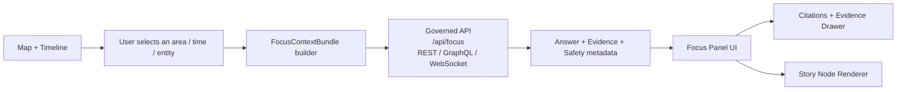
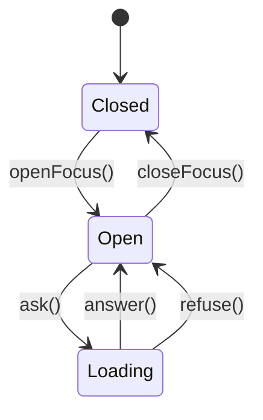

# 🧠 Focus Core (`web/src/core/focus`)


> The “Focus” subsystem is where KFM’s **storytelling + evidence** meets the **map + timeline** — with an optional, strictly‑governed AI assistant.

---

## 🧭 What this folder is for

`web/src/core/focus` is the **core client-side domain** for:

- 📖 Rendering *Story Nodes* inside the map/timeline experience  
- 🎛️ Building a **Focus Context Bundle** (what the user is looking at + what’s selected)  
- 🤖 Running **Focus Q&A** (opt‑in) and rendering answers **with citations**  
- 🧾 Enforcing UI‑level “hard gates” (no provenance → no render)

If you are adding anything that affects **what users see in Focus Mode**, start here.

> [!IMPORTANT]
> Focus is the last mile of trust. If something can’t be traced back to governed evidence, it should not appear here — even if it would “look helpful”.

---

## ✅ In scope vs 🚫 out of scope

### ✅ In scope
- Focus session state (enter/exit, selected story node, selected entities/features)
- Context bundling (viewport, time range, active layers, user intent)
- Rendering + UX patterns (citations drawer, evidence cards, AI labels)
- Frontend guardrails (redaction/sensitivity handling, citation completeness checks)
- API adapters for Focus endpoints (REST/GraphQL/WebSocket)

### 🚫 Out of scope
- Direct graph access (Neo4j queries from the browser)
- ETL, catalog generation, or graph building
- Authoring tooling for Story Nodes (belongs in docs/tools, not runtime UI)
- Any “autonomous agent” behavior (no background actions, no silent changes)

---

## 🧱 Trust invariants (hard gates)

These are non‑negotiable — treat them as **contract tests for the UI**.

- [ ] **Only provenance‑linked content can render**  
      If it doesn’t have a source ID / catalog reference, it doesn’t show.
- [ ] **AI is opt‑in + labeled**  
      AI text never appears “by default”. User triggers it, and it’s tagged as AI‑generated.
- [ ] **Uncertainty is visible**  
      Show confidence/uncertainty metadata (or explicitly say it’s unavailable).
- [ ] **No sensitive location leaks**  
      If something is classified sensitive, coordinates must be blurred/generalized/omitted.
- [ ] **No unsourced narrative**  
      Focus must never introduce “new facts” without citations.
- [ ] **API boundary is enforced**  
      The UI only talks to the governed API layer (which applies redaction + contracts).

> [!TIP]
> Mental model: **Focus is a renderer of governed artifacts**, not a creative writing surface.

---

## 🧩 Core concepts

### 📖 Story Node
A Story Node is a markdown narrative designed to be:
- human readable (storytelling)
- machine ingestible (citations + entity references)
- governable (pipeline + provenance rules)

**Focus renders Story Nodes** alongside map and timeline context.

### 🎛️ Focus Context Bundle
A normalized packet describing:
- what the user is looking at (viewport + time range)
- what is active (layers)
- what is selected (features/entities/story node)
- what question is being asked (intent)

This bundle is what the API uses to produce evidence‑backed answers.

### 🧾 Evidence Item
A typed reference to governed artifacts:
- dataset IDs (DCAT)
- assets/items (STAC)
- provenance lineage (PROV)
- graph entities (nodes/edges + stable IDs)
- documents/media nodes

### 🔗 Citation
A UI‑friendly pointer to evidence:
- label + short description
- “open” action (dataset panel, doc viewer, entity card)
- stable ID for auditing/telemetry

---

## 🔁 End-to-end flow



---

## 📦 Contract sketch (context bundle)

> This is a *shape*, not a strict implementation. Keep the real contract in the API schema (OpenAPI/GraphQL).

```ts
export type StableId = string;

export interface FocusViewport {
  bbox: [number, number, number, number]; // [minLon, minLat, maxLon, maxLat]
  zoom?: number;
}

export interface FocusTimeRange {
  start?: string; // ISO 8601
  end?: string;   // ISO 8601
}

export interface FocusLayerRef {
  layerId: StableId;
  datasetId?: StableId;          // DCAT dataset id
  stacCollectionId?: StableId;   // STAC collection id (if applicable)
}

export interface FocusSelection {
  entityIds?: StableId[];        // graph nodes
  featureIds?: StableId[];       // map feature ids
  storyNodeId?: StableId;        // narrative node id
}

export interface FocusSensitivity {
  classification: string;        // e.g., "public" | "restricted" | "sensitive"
  maskPreciseLocations: boolean; // blur/generalize/omit coordinates
}

export interface FocusContextBundle {
  viewport: FocusViewport;
  time: FocusTimeRange;
  layers: FocusLayerRef[];
  selection: FocusSelection;
  sensitivity: FocusSensitivity;

  userQuery: string;
  userIntent?: "explain" | "summarize" | "compare" | "analyze" | "find-evidence";
  locale?: string;
}
```

---

## 🤖 Focus Q&A lifecycle (UX contract)

1. **Enter Focus Mode**  
   - user opens Focus panel / story reading mode
2. **Pick context** (optional but recommended)  
   - selected story node, selected entity, active layers, time range
3. **Ask a question**  
   - natural language input + optional intent selector (“Explain”, “Compare”, “Analyze”)
4. **Receive an answer**  
   - answer text + citations + “AI-generated” label (if AI)
5. **Inspect evidence**  
   - citations open dataset cards, doc viewer, or graph entity panels
6. **Export / share** (optional)  
   - copy answer w/ citations, or export as a referenced note

### ✅ Required answer payload fields (from the UI’s perspective)
- `answerMarkdown` (sanitized)
- `citations[]` (non-empty when claims are made)
- `confidence` / `uncertainty` metadata (or explicit “not available”)
- `safetyFlags` (e.g., redaction applied, sensitive context)

### 🚫 When to refuse (and how)
Refuse with a friendly, actionable UI when:
- evidence set is empty
- request is outside current scope (“not in catalogs/graph”)
- request would expose restricted/sensitive information

**Refusal UI should include**:
- why it can’t answer
- what the user can do next (turn on a dataset layer, broaden time range, open catalog)

---

## 🖋️ Story Node rendering rules

### Markdown pipeline
- Sanitize HTML (treat story content as untrusted input)
- Support footnotes + inline citations
- Provide consistent typography for narrative vs. evidence blocks

### Entity linking
Story Nodes should reference stable graph IDs so that Focus can:
- highlight related places on the map
- open entity cards (people/events/places)
- show “related evidence” via graph traversal

### Fact vs interpretation styling
Use visual language to separate:
- **facts** (directly sourced)
- **interpretation / analysis** (still sourced, but clearly marked)
- **AI-generated summaries** (opt‑in, labeled, with uncertainty)

> [!NOTE]
> “Looks plausible” is not a requirement. “Is traceable” is.

---

## 🧪 Analytics & uncertainty in Focus answers

Focus answers may include computed summaries (trends, comparisons, correlations). When they do:

- Always show **method + inputs** (dataset IDs, time window, filters)
- Prefer **intervals** over point estimates when possible (CI, credible interval, min/max)
- Avoid causality language unless the evidence supports it
- Highlight data quality caveats (missingness, resolution, known biases)

Suggested UI pattern:
- 📌 **Answer**
- 🧾 **Citations**
- 🧠 **Method** (expandable)
- ⚠️ **Limitations** (expandable)

---

## ⚙️ Implementation patterns (recommended)

### 1) State machine over boolean soup 🧠
Model Focus as explicit states:



### 2) Streaming-first answers 🌊
If the backend streams tokens:
- render partial markdown safely (or render plaintext until “final”)
- keep citations separate until the end (avoid “shifting links” UX)
- allow cancel

### 3) Cache what’s safe ⚡
Cache:
- dataset metadata cards
- story node markdown
- last N Focus answers per context hash (if policy allows)

Don’t cache:
- restricted results
- sensitive coordinates
- user-entered PII

### 4) Keep rendering fast 🏎️
- lazy-load heavy panels (evidence drawer, doc viewer)
- avoid re-render storms when the map moves (debounce viewport updates)

---

## ♿ Accessibility & UX guardrails

- Keyboard navigation for Focus panel + evidence links
- Clear focus rings (don’t remove outline)
- ARIA labels for “AI-generated” badges and confidence indicators
- Respect reduced-motion preferences
- Ensure contrast for map overlays + panel typography

---

## ✅ Testing checklist (ship it with confidence)

### Unit tests
- context bundle builder (time/viewport/layers/selection)
- redaction/sensitivity rules (masking, generalization)
- citation renderer (no empty citations for factual claims)

### Integration tests
- Focus API adapter handles:
  - timeouts
  - streaming
  - retry policy (idempotent)
  - schema validation failures

### E2E tests
- “No provenance → no render” gate
- AI content appears only after explicit opt‑in
- Sensitive site: marker is generalized/blurred

---

## 🧯 Security, sovereignty & privacy

- Treat Story Node markdown as **untrusted input** (sanitize)
- Treat AI answers as **untrusted output** (sanitize + gate on citations)
- Never display restricted coordinates; never “leak via UI affordances”
- Log only what policy allows (avoid capturing raw user questions if sensitive)

---

## 🗂️ Suggested folder layout

> Actual structure may differ — but the intent is consistent boundaries.

```text
web/src/core/focus/
  📄 README.md
  🧾 types/                 # shared types (FocusContextBundle, EvidenceItem, Citation)
  🧠 domain/                # pure domain logic (state machine, gating rules)
  🔌 adapters/              # API clients (REST/GraphQL/WebSocket)
  🧰 services/              # orchestration (ask(), cancel(), cache)
  🪝 hooks/                 # UI hooks (useFocusSession, useFocusAnswer)
  🧪 __tests__/             # unit + integration tests
  🚪 index.ts               # public exports
```

---

## 📚 Project reference shelf (why these PDFs exist)

This folder’s behavior is informed by the project’s research library 📖.  
When you’re making changes, these docs are here to keep decisions grounded.

<details>
<summary><strong>🏛️ Architecture, governance & human-centered design</strong></summary>

- Kansas Frontier Matrix (KFM) – Comprehensive Technical Documentation  
- Master Guide / governance standards (pipeline ordering, contracts, provenance rules)  
- *Introduction to Digital Humanism*  
- *On the path to AI Law’s prophecies and the conceptual foundations of the machine learning age*  

</details>

<details>
<summary><strong>🗄️ Data systems, provenance & performance</strong></summary>

- *Data Spaces*  
- *Database Performance at Scale*  
- *Scalable Data Management for Future Hardware*  
- *PostgreSQL Notes for Professionals*  

</details>

<details>
<summary><strong>🗺️ GIS, cartography, mobile & remote sensing</strong></summary>

- *Making Maps: A Visual Guide to Map Design for GIS*  
- *Mobile Mapping: Space, Cartography and the Digital*  
- *Cloud-Based Remote Sensing with Google Earth Engine: Fundamentals and Applications*  
- *Archaeological 3D GIS*  
- *Python Geospatial Analysis Cookbook*  

</details>

<details>
<summary><strong>📈 Modeling, statistics & ML (for “analyze” answers)</strong></summary>

- *Scientific Modeling and Simulation: A Comprehensive NASA‑Grade Guide*  
- *Understanding Statistics & Experimental Design*  
- *Regression Analysis with Python* (+ linear regression slides)  
- *Think Bayes*  
- *Graphical Data Analysis with R*  
- *Deep Learning for Coders with fastai and PyTorch*  
- *Spectral Geometry of Graphs*  
- *Generalized Topology Optimization for Structural Design*  
- *Principles of Biological Autonomy* (useful framing for “autonomy vs advisory”)  

</details>

<details>
<summary><strong>🌐 Web, graphics & security</strong></summary>

- *Responsive Web Design with HTML5 and CSS3*  
- *WebGL Programming Guide: Interactive 3D Graphics Programming with WebGL*  
- *Compressed Image File Formats (JPEG/PNG/GIF/XBM/BMP)*  
- *Ethical Hacking and Countermeasures: Secure Network Infrastructures*  
- *Gray Hat Python: Python Programming for Hackers and Reverse Engineers (2009)*  
- *Concurrent Real‑Time and Distributed Programming in Java (Threads, RTSJ, RMI)*  
- Programming Books compendiums (A, B‑C, D‑E, F‑H, I‑L, M‑N, O‑R, S‑T, U‑X)  

</details>

---

## 🧾 PR checklist for Focus changes

- [ ] No provenance bypass introduced
- [ ] All new UI surfaces include source/citation affordances
- [ ] AI output remains opt‑in, labeled, and uncertainty-aware
- [ ] Sensitive location handling verified
- [ ] Tests updated/added (unit + integration + e2e where needed)
- [ ] Performance regression check (bundle size + render hotspots)

