# 🕸️ Graph Core — `web/src/core/graph`


> **Purpose:** This folder is the **frontend graph domain** for Kansas Frontier Matrix (KFM): a single, typed place to **fetch, normalize, cache, traverse, and present graph-shaped knowledge** (people ↔ places ↔ events ↔ documents ↔ datasets) in support of the map + timeline + Story Nodes + Focus Mode experience.  
> KFM is explicitly built so **every narrative claim can be traced to versioned evidence** and every derived product has explicit lineage. :contentReference[oaicite:0]{index=0}

---

## 🔭 Quick mental model

```mermaid
flowchart LR
  subgraph UI["Frontend UI (web/)"]
    Map["🗺️ Map UI (React · MapLibre · optional Cesium)"]
    Story["📚 Story Nodes"]
    Focus["🎯 Focus Mode"]
    GraphCore["🕸️ Graph Core (this folder)"]
  end

  subgraph API["Backend API Layer (src/server/)"]
    Contracts["📜 OpenAPI / GraphQL contracts"]
    Redaction["🧼 Redaction + Access Controls"]
  end

  subgraph Graph["Knowledge Graph (Neo4j)"]
    KG["🧠 Nodes + Relationships (ontology-aligned)"]
  end

  Map --> GraphCore
  Story --> GraphCore
  Focus --> GraphCore

  GraphCore --> Contracts
  Contracts --> Redaction
  Redaction --> KG
```



This structure matches the **non‑negotiable pipeline ordering** (ETL → catalogs → graph → API → UI → story → focus) and the **API boundary rule** (UI never queries Neo4j directly). :contentReference[oaicite:1]{index=1}:contentReference[oaicite:2]{index=2}

---

## ✅ Responsibilities (what belongs here)

### Core responsibilities
- **Typed graph primitives** (Node, Edge, Subgraph, Provenance, Security labels).
- **Graph query client** that talks only to the **governed API** (REST/OpenAPI or GraphQL). :contentReference[oaicite:3]{index=3}:contentReference[oaicite:4]{index=4}
- **Normalization + caching** of subgraphs for fast UI interactions.
- **Traversal helpers** for typical UI flows:
  - “Expand around node” (neighbors, related datasets, related events).
  - “Follow story hyperlink → show entity panel → highlight map/timeline.”
- **Provenance plumbing** so every visible graph fact can show “where did this come from?” (STAC/DCAT/PROV). :contentReference[oaicite:5]{index=5}:contentReference[oaicite:6]{index=6}

### Explicit non-goals 🚫
- **No direct Neo4j access from the browser** (no Cypher in the client). :contentReference[oaicite:7]{index=7}
- **No unsourced “fill in the blanks”**: Graph Core cannot invent facts; it only displays/traverses what the system has cataloged and governed. :contentReference[oaicite:8]{index=8}
- **No governance bypass**: Graph Core must not contain “hidden data files” or “secret backdoors” around the API. :contentReference[oaicite:9]{index=9}:contentReference[oaicite:10]{index=10}

---

## 🧱 Contracts & invariants (do not break)

> [!IMPORTANT]
> These are “hard gates” for this module. If we violate them, we break KFM’s trust guarantees.  
> (Put simply: **no provenance, no show**.)

### 1) Pipeline ordering is absolute
UI features can only consume outputs that have passed ETL → catalogs → graph → API. :contentReference[oaicite:11]{index=11}

### 2) API boundary is mandatory
The UI must never query the graph store directly; all access is through `src/server/` so redaction + access control + schema consistency are enforced centrally. :contentReference[oaicite:12]{index=12}

### 3) Provenance-first
Every dataset/model result must produce STAC/DCAT metadata and PROV lineage before it can be referenced in the graph or UI. :contentReference[oaicite:13]{index=13}

### 4) UI must prevent data leakage
The UI must respect **redaction rules**, including map behaviors (“no map zoom that bypasses them”), and maintain accessibility + audit logs for interactions. :contentReference[oaicite:14]{index=14}

### 5) Sovereignty & classification propagate end-to-end
No output artifact can be less restricted than its inputs; sensitive sources imply sensitive derivatives unless explicitly reviewed. UI safeguards may include blurring/generalizing sensitive locations. :contentReference[oaicite:15]{index=15}

---

## 🧠 Domain model (frontend view)

The backend graph is described as:
- A **semantic knowledge graph** (Neo4j) where nodes represent real-world entities (people, places, events, documents, datasets) and edges encode relationships. :contentReference[oaicite:16]{index=16}
- It aligns with ontologies (CIDOC‑CRM, GeoSPARQL, OWL‑Time) so semantics are consistent across sources and queries. :contentReference[oaicite:17]{index=17}:contentReference[oaicite:18]{index=18}

### Suggested TypeScript shapes (client contract)

```ts
// ⚠️ These are the *frontend* shapes. The API may have richer schema.
// Keep these stable; changes should be backwards compatible.

export type GraphNodeType =
  | "Person"
  | "Place"
  | "Event"
  | "Document"
  | "Dataset"
  | "Concept"
  | "StoryNode"
  | "Layer"; // map/timeline-facing entities

export type GraphRelType =
  | "MENTIONS"        // Document/StoryNode -> Entity
  | "REFERENCES"      // Document/StoryNode -> Dataset/Document
  | "OCCURRED_AT"     // Event -> Place
  | "INVOLVES"        // Event -> Person/Org
  | "DERIVED_FROM"    // Dataset -> Dataset/Source
  | "PART_OF"         // Entity -> Entity
  | "BELONGS_TO"      // Entity -> Entity (collection/region/organization)
  | "RELATED_TO";     // generic

export interface GraphProvenanceRef {
  stacItemId?: string;
  stacCollectionId?: string;
  dcatDatasetId?: string;
  provBundleId?: string;
  // Optional: external citation handles (DOI, archive ref, etc.)
}

export type DataClassification = "Public" | "Internal" | "Confidential" | "Restricted";

export interface GraphSecurity {
  classification: DataClassification;
  redactions?: string[]; // e.g. ["GENERALIZED_LOCATION", "HIDE_PROPERTIES:x,y"]
}

export interface GraphNode {
  id: string;                 // stable ID (canonical)
  type: GraphNodeType;
  label: string;              // display name
  summary?: string;           // short UI text, must remain provenance-backed
  temporal?: { start?: string; end?: string }; // ISO strings
  spatial?: { bbox?: [number, number, number, number]; centroid?: [number, number] };
  provenance: GraphProvenanceRef;
  security: GraphSecurity;
  props?: Record<string, unknown>; // only safe, redacted properties
}

export interface GraphEdge {
  id: string;
  type: GraphRelType;
  from: string;
  to: string;
  provenance: GraphProvenanceRef;
  security: GraphSecurity;
  props?: Record<string, unknown>;
}

export interface GraphSubgraph {
  nodes: GraphNode[];
  edges: GraphEdge[];
  rootIds?: string[];
}
```

> Why this shape? Because Focus Mode and stories should be able to **trace entities to stable identifiers** and pull related data dynamically. Story Nodes specifically should reference graph entities by stable IDs. :contentReference[oaicite:19]{index=19}

---

## 🔗 Relationship patterns KFM expects

KFM describes relationship categories such as:
- **Mentions/References**: documents/metadata referencing entities
- **Belongs_To / Part_Of**: administrative or compositional hierarchy
- **Temporal relationships**: “happened before/after,” etc. :contentReference[oaicite:20]{index=20}

The graph is also explicitly used to **disambiguate** entities (e.g., “Paris, Kansas” vs “Paris, France”) by surrounding context. :contentReference[oaicite:21]{index=21}

---

## 🧭 How Graph Core powers UI features

### 🎯 Focus Mode AI support
Focus Mode relies heavily on graph traversal to answer questions: for a place, it can find related events, datasets, and linked people. :contentReference[oaicite:22]{index=22}

Graph Core’s job in the UI is to make that traversal **fast, safe, and provenance-aware** (even when the “AI” layer is involved).

### 📚 Story Narrative linking
Story nodes can turn entity mentions into hyperlinks/interactive elements (e.g., click a person name → show graph-based panel, map highlights). :contentReference[oaicite:23]{index=23}:contentReference[oaicite:24]{index=24}

Design intent also calls out **knowledge graph reference linking**: clicking on a location/time can surface linked documents and extracted facts through graph connections. :contentReference[oaicite:25]{index=25}

### 🗺️ Map + Timeline integration
KFM’s UI stack is described as React + MapLibre (optional Cesium). :contentReference[oaicite:26]{index=26}  
Graph Core should enable:
- “Show related places on map” for an event
- “Show event time window” on timeline
- “Show datasets covering this region/time” from graph links

---

## 🧾 Query patterns (frontend-friendly, governance-safe)

Because graph databases and graph queries can get expensive quickly, Graph Core should prefer **bounded, explicit traversals** and cache results.

### Bounded traversal vocabulary (recommended)
Borrowing terminology from graph query processing patterns:
- `NodeScan` / `IndexScan` → locate starting nodes efficiently
- `Expand` / `ForeachRelationship` → traverse relationships
- “Pipeline breakers” → where results get materialized/cached :contentReference[oaicite:27]{index=27}

### Recommended query surface (pseudo-API)

```ts
export interface GraphClient {
  getNode(id: string): Promise<GraphNode>;
  getNeighbors(input: {
    id: string;
    depth?: 1 | 2 | 3;
    relTypes?: GraphRelType[];
    direction?: "out" | "in" | "both";
    timeRange?: { start?: string; end?: string };
    bbox?: [number, number, number, number];
    limit?: number;
  }): Promise<GraphSubgraph>;

  search(input: {
    q: string;
    types?: GraphNodeType[];
    limit?: number;
  }): Promise<GraphNode[]>;
}
```

### Caching strategy (client)
Graph workloads benefit from caching “a window of queries” and evicting when full; reuse precomputed results when possible. :contentReference[oaicite:28]{index=28}

> [!TIP]
> Cache **subgraphs**, not just nodes. UI actions usually need context (neighbors + edges + provenance), not isolated records.

---

## 🛡️ Security, redaction, and sovereignty

### Redaction is not optional
The UI must respect redaction rules and should not allow interactions (like map zoom) that bypass them. :contentReference[oaicite:29]{index=29}

### Classification must propagate
KFM enforces classification end-to-end; the UI is expected to implement safeguards (blurring/generalization) to honor data sovereignty. :contentReference[oaicite:30]{index=30}

### Access control patterns (reference model)
In knowledge-graph dataspaces, access policies commonly combine **user context + security role + data classification** to grant/deny access; classifications include Public/Internal/Confidential/Restricted. :contentReference[oaicite:31]{index=31}

> [!NOTE]
> We treat access control as a backend concern (API boundary), but Graph Core must:
> - display classification state
> - avoid rendering redacted props
> - prevent UI affordances that reconstitute restricted data from aggregates

### Frontend security checklist (graph UI surfaces)
Graph visualizations and story linking often inject labels, descriptions, and URLs into the DOM. Review for DOM-based attacks and XSS sinks (e.g., `document.write`, `innerHTML`, `eval`, URL-driven redirects). :contentReference[oaicite:32]{index=32}

---

## ⚡ Performance notes (graph UX that stays snappy)

### Rendering
- Prefer **progressive rendering**: show the root node first, then neighbors as they arrive.
- Use **level-of-detail**: compact clusters or collapse edges for larger subgraphs.
- Consider WebGL rendering for large graphs (see WebGL references in project library).

### Data movement
- Batch neighbor expansions and de-duplicate requests.
- Cache recent expansions (depth 1–2) keyed by `(rootId, relTypes, filters)`.

### “One fact, one place” mindset
A systems design principle is to centralize optimization-relevant information (“one fact, one place”). Apply this in the client by having **one normalization/caching layer** rather than multiple ad-hoc caches across components. :contentReference[oaicite:33]{index=33}

---

## 🧪 Testing expectations

### Unit tests
- Normalization (node/edge de-dupe)
- Cache eviction correctness
- Redaction application (props removed/blurred)
- Traversal helper correctness (depth limits, filter behavior)

### Integration tests
- Contract tests against mocked API responses (GraphQL/OpenAPI)
- Story Node link → entity panel → map highlight flow
- Focus Mode context bundle build (must contain citations/provenance)

### Governance checks
- Story Nodes and Focus Mode must never introduce unsourced material; everything displayed is traceable. :contentReference[oaicite:34]{index=34}

---

## 🗂️ Suggested folder layout (keep boundaries clean)

> This is a **recommended** layout for `web/src/core/graph/` to match the “core domain logic” philosophy.

```text
web/src/core/graph/
├─ 📄 README.md                # you are here 🙂
├─ 📄 index.ts                 # public exports (stable)
├─ 📄 types.ts                 # GraphNode/Edge/Subgraph + enums
├─ 📄 client/
│  ├─ 📄 GraphClient.ts        # interface
│  ├─ 📄 ApiGraphClient.ts     # adapter → calls governed API (NO Neo4j)
│  └─ 📄 mappers.ts            # API → core types
├─ 📄 store/
│  ├─ 📄 graphStore.ts         # normalized state (nodesById, edgesById, adj)
│  ├─ 📄 selectors.ts          # query helpers for UI
│  └─ 📄 cache.ts              # LRU/subgraph cache
├─ 📄 traversal/
│  ├─ 📄 expand.ts             # bounded traversal helpers
│  └─ 📄 filters.ts            # time/bbox/type filters
├─ 📄 provenance/
│  ├─ 📄 resolveProvenance.ts  # map IDs → STAC/DCAT/PROV refs
│  └─ 📄 formatCitations.ts    # UI-safe citation formatting
├─ 📄 security/
│  ├─ 📄 redaction.ts          # apply redactions to node/edge props
│  └─ 📄 classification.ts     # classification propagation helpers
└─ 🧪 __tests__/
   ├─ 📄 normalize.test.ts
   ├─ 📄 expand.test.ts
   └─ 📄 redaction.test.ts
```

---

## 📚 References & project files (internal)

### Core project governance docs
- **KFM Comprehensive Technical Documentation** :contentReference[oaicite:35]{index=35}  
- **Master / Markdown Guide v13 (contracts, invariants, pipeline)** :contentReference[oaicite:36]{index=36}

### Programming book bundles (GoalKicker collections)
- **A programming Books** :contentReference[oaicite:37]{index=37}  
- **B–C programming Books** :contentReference[oaicite:38]{index=38}  
- **D–E programming Books** :contentReference[oaicite:39]{index=39}  
- **F–H programming Books** :contentReference[oaicite:40]{index=40}  
- **I–L programming Books** :contentReference[oaicite:41]{index=41}  
- **M–N programming Books** :contentReference[oaicite:42]{index=42}  
- **O–R programming Books** :contentReference[oaicite:43]{index=43}  
- **S–T programming Books** :contentReference[oaicite:44]{index=44}  
- **U–X programming Books** :contentReference[oaicite:45]{index=45}  

> [!NOTE]
> The bundle list above is included because this repo’s design emphasizes *using the whole project library* as an engineering reference shelf (performance, security, visualization, data governance).

<details>
<summary>📦 Optional research shelf (high-impact for Graph Core)</summary>

- 🧠 **Scalable Data Management for Future Hardware** (graph operators, caching patterns) :contentReference[oaicite:46]{index=46}  
- 🔐 **Data Spaces** (knowledge graphs + access control models) :contentReference[oaicite:47]{index=47}  
- 🗺️ **Map + narrative design doc** (knowledge graph reference linking) :contentReference[oaicite:48]{index=48}

</details>

---

## 🧾 Glossary

- **STAC**: SpatioTemporal Asset Catalog (spatial asset metadata)
- **DCAT**: Dataset Catalog vocabulary (dataset discovery)
- **PROV**: Provenance lineage (inputs → activities → outputs)
- **CIDOC‑CRM / GeoSPARQL / OWL‑Time**: Ontology building blocks for consistent semantics in the graph :contentReference[oaicite:49]{index=49}
- **Story Node**: governed narrative document with citations + graph entity references :contentReference[oaicite:50]{index=50}
- **Focus Mode**: interactive reading alongside map/timeline with strict sourcing rules :contentReference[oaicite:51]{index=51}

---

### ✅ If you only remember one thing…
**Graph Core is where UI gets graph-shaped knowledge — but it must always stay bounded, provenance-linked, and API-governed.** :contentReference[oaicite:52]{index=52}:contentReference[oaicite:53]{index=53}

