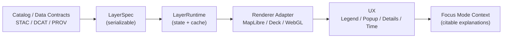

# 🗺️ `web/src/core/layers` — Layer System (UI Core)


> [!IMPORTANT]
> In KFM, **every layer is a claim**.  
> If it shows up on the map, it must be **catalog-backed**, **versioned**, and **citable** — no “mystery layers” 🚫🕵️‍♂️.

---

## ✨ What lives here?

This folder defines the **frontend “Layer” abstraction** used by KFM’s web map UI:

- 🧾 **Layer Specs** — serializable configs describing *what* a layer is (data contract refs, style, behavior).
- 🔌 **Layer Registry** — the canonical list of layers the UI can present (and how they’re grouped/ordered).
- 🧠 **Runtime Layer State** — what’s currently loaded, filtered, cached, and interactive.
- 🎨 **Rendering Adapters** — how a layer becomes pixels (MapLibre/Deck/WebGL/Cesium, etc.).
- 🧭 **Interaction Contracts** — click/hover selection, popups, legends, time sliders, and feature details.

If you’re looking for **ETL** or **backend services**, this folder should *reference* those via contracts and APIs — not re-implement them.

---

## 🧱 Design goals

### ✅ Goals
- **Provenance-first**: every layer points to its data lineage + attribution 🧾
- **Contract-first**: every layer is backed by a machine-validated schema 📑
- **Composable**: layers can be stacked, toggled, filtered, and themed 🧩
- **Fast**: lazy-load by viewport, tile-first patterns, GPU rendering where it matters ⚡
- **Understandable**: multiple active layers must remain readable via ordering/rules/legends 🧠🗺️
- **Accessible**: keyboard, ARIA, contrast, and non-pointer interactions ♿

### ❌ Non-goals
- Doing heavy analytics in the browser (that belongs in services/pipelines) 🚫🧮  
- Ad-hoc “temporary” layers with no metadata (use a sandbox namespace if needed) 🚫🫥  
- UI-only transformations that can’t be reproduced (breaks replayability) 🚫🔁  

---

## 🧭 Conceptual model

A layer is **not** “just a MapLibre layer.”  
Think of it as:

**Layer = Spec (what/why) + Source (where) + Renderer (how) + Interaction (how users learn from it)**



---

## 📁 Recommended folder layout

> [!NOTE]
> This is the *intended* shape of the module. If the code differs today, treat this README as the target architecture 🎯.

```text
📁 web/src/core/layers/
├─ 📄 README.md                       👈 you are here
├─ 📄 index.ts                        🔁 public exports
├─ 📄 types.ts                        🧾 core interfaces & types
├─ 📁 registry/                       🗂️ layer registry + groups
│  ├─ 📄 registry.ts                  📜 canonical list + ordering rules
│  └─ 📄 validateRegistry.ts          ✅ CI-safe validation helpers
├─ 📁 sources/                        🌍 data source adapters
│  ├─ 📄 tileSource.ts                🧩 XYZ/WMTS/PMTiles-ish
│  ├─ 📄 geojsonSource.ts             🧾 GeoJSON fetch/stream
│  └─ 📄 querySource.ts               🔎 bbox + attribute queries
├─ 📁 renderers/                      🎨 render adapters
│  ├─ 📄 maplibreRenderer.ts          🗺️ vector/raster on MapLibre
│  ├─ 📄 webglRenderer.ts             🧪 custom GPU paths
│  └─ 📄 cesiumRenderer.ts            🌐 3D / terrain
├─ 📁 style/                          🎛️ symbology + legends
│  ├─ 📄 legend.ts                    🧷 legend models
│  └─ 📄 ramps.ts                     🌈 color ramps (a11y aware)
└─ 📁 __tests__/                      🧪 layer contract + snapshot tests
```

---

## 🧾 Core types (contract-first)

### `LayerSpec` (serializable, stable)
A `LayerSpec` should be:
- serializable (JSON-friendly),
- stable across versions,
- traceable to catalog IDs,
- safe to log/export/share.

```ts
export type LayerKind =
  | "basemap"
  | "vector"
  | "raster"
  | "terrain3d"
  | "timeseries"
  | "graph"
  | "model-output"
  | "story";

export type LayerVisibility = "hidden" | "visible" | "solo";

export interface LayerSpec {
  /** Stable ID (do NOT change once published). Prefer "namespace:slug@major". */
  id: string;

  kind: LayerKind;

  title: string;
  description?: string;

  /** Ordering hints (higher = on top), plus group buckets for UI. */
  ui: {
    group: string;          // e.g. "📜 Historical", "🌦️ Climate", "🧠 Analysis"
    order?: number;         // e.g. 100
    icon?: string;          // emoji or icon key
    defaultVisibility?: LayerVisibility;
  };

  /** Data access definition (tile URL, API endpoint, query contract, etc.) */
  source: LayerSource;

  /** Default styling + legend model (must be deterministic). */
  style?: LayerStyle;

  /** UX + interaction hooks (popups, selection, time slider). */
  interaction?: LayerInteraction;

  /** Contract refs: these are what make Focus Mode + story citations work. */
  contracts: {
    stacId?: string;
    dcatId?: string;
    provId?: string;

    license?: string;
    attribution?: string[]; // human-readable sources
    uncertainty?: string;   // or structured object if you have one
  };

  /** Optional policy gates (redaction, auth scopes, safe zoom floors, etc.) */
  policy?: {
    minZoom?: number;
    maxZoom?: number;
    requiresAuth?: boolean;
    redactionProfile?: string; // e.g. "public", "partners", "sensitive"
  };
}
```

---

## 🗂️ Layer registry (the “catalog shelf”)

The **registry** is the UI’s source of truth for:

- what layers exist 🧾
- how they are grouped & ordered 🧱
- what the UI is allowed to show ✅
- how to build **Focus Mode context bundles** 🤖

### Registry rules (keep it boring on purpose 😌)
✅ **Stable IDs** (changing an ID breaks saved maps, stories, citations)  
✅ **No missing contracts** (STAC/DCAT/PROV refs required for “official” layers)  
✅ **No leakage** (respect redaction and access policies)  
✅ **Deterministic** defaults (same inputs → same outputs)  

```ts
// registry/registry.ts
import type { LayerSpec } from "../types";

export const LAYERS: LayerSpec[] = [
  {
    id: "kfm:historical_counties@1",
    kind: "vector",
    title: "Historical Counties",
    ui: { group: "📜 Historical", order: 120, defaultVisibility: "hidden" },
    source: { type: "vector-tiles", url: "/tiles/hist-counties/{z}/{x}/{y}.mvt" },
    contracts: {
      stacId: "stac:collection:hist-counties",
      dcatId: "dcat:dataset:hist-counties",
      provId: "prov:activity:hist-counties-pipeline",
      license: "CC-BY / Public Domain (varies by source)",
      attribution: ["Kansas State Archives", "KFM digitization pipeline"],
    },
  },
];
```

> [!TIP]
> Treat the registry like an **API**: version it, validate it in CI, and document breaking changes 🧪🔒

---

## 🌍 Data sources & formats (practical guidance)

### Vector layers 🧷
Best for:
- boundaries, points, lines, parcels, events

Prefer:
- **vector tiles** (MVT) for scale
- GeoJSON only for small datasets or tight bboxes

### Raster layers 🧊
Best for:
- scanned historical maps, hillshade, NDVI, classification rasters

Prefer:
- tile services (XYZ/WMTS), **COGs**, or server-side raster tiling  
- choose formats intentionally (e.g., **PNG** for alpha overlays; **JPEG** when you don’t need transparency)

### Time-series layers ⏳
Best for:
- weather stations, NDVI over time, temporal overlays

Patterns:
- slider filters → either client-side style filters or server-side time-window endpoints
- always expose **temporal extent** and **sampling rules** in metadata

### Graph / network layers 🧠🕸️
Best for:
- trails/roads connectivity, routes, interaction graphs

Patterns:
- store graph analytics results as datasets (tiles/features)
- keep “live” graph queries bounded (bbox + limit) to avoid UI lockups

---

## 🎨 Styling, legends, and “map readability”

> [!IMPORTANT]
> When multiple layers are enabled, the UI must remain **understandable** (ordering rules, dynamic styling, scale limits, and clear legends) 🧠🗺️

Recommended conventions:
- 🧩 **Scale-dependent styling**: thicker lines / more labels at higher zooms
- 🌈 **Color ramps with meaning**: do not encode two variables with one ramp
- 🧷 **Legend is part of the layer contract**: if you can’t explain it, you can’t ship it
- ♿ **Contrast & patterns**: don’t rely on color alone

---

## 📱 Responsive + accessible layers UI

Layers are experienced through:
- layer toggles ✅
- legends 🧷
- popups / feature details 🖱️
- panels that collapse on mobile 📱

**Do:**
- ensure layer controls are keyboard reachable
- add ARIA labels for toggles and legends
- avoid hover-only affordances

---

## ⚡ Performance playbook (frontend)

**Layer loading should be lazy and bounded**:
- load only when the layer is enabled ✅
- load only what’s in view (bbox / tiles) 🧩
- cache smartly (but avoid stale “mystery results”) 🧠

**Rendering should be GPU-friendly**:
- avoid huge GeoJSON in one shot
- prefer tiling & LOD
- use WebGL paths for big point clouds or dense overlays

---

## 🔐 Security & policy (don’t ship foot-guns)

> [!CAUTION]
> The UI must cause **no data leakage**: redaction rules must be enforced even when users zoom, filter, or export views 🛡️

Rules of thumb:
- never trust feature properties (sanitize popup HTML)
- never embed secrets in tile URLs
- treat layer registry as untrusted input unless validated
- log layer activation + dataset IDs for auditing (but avoid logging PII)

---

## 🧪 Testing & QA

Minimum:
- ✅ registry validation tests (IDs unique, required contracts present)
- ✅ contract tests for API responses (schema checks)
- ✅ snapshot tests for legends/styles (deterministic output)

Recommended:
- ⚡ perf checks (tile request counts, FPS under load)
- ♿ accessibility checks (focus order, ARIA, contrast)

---

## ➕ Adding a new layer (checklist)

### 1) Data & contracts 🧾
- [ ] STAC item/collection exists
- [ ] DCAT dataset entry exists
- [ ] PROV lineage bundle exists
- [ ] license + attribution filled in
- [ ] uncertainty or caveats documented (if applicable)

### 2) UI spec 🎛️
- [ ] stable `id` chosen (namespace + version)
- [ ] group + order set
- [ ] style + legend defined
- [ ] interaction behavior set (popup fields, selection)

### 3) Source wiring 🔌
- [ ] tiles/API endpoint confirmed
- [ ] bbox/time filters behave correctly
- [ ] reasonable defaults (min/max zoom)

### 4) Safety + performance 🛡️⚡
- [ ] redaction profile set (if needed)
- [ ] popups sanitized
- [ ] tile/feature payload sizes sane

### 5) Tests + docs 🧪📚
- [ ] registry validation passes
- [ ] layer has at least one test
- [ ] layer described in docs/story usage (if narrative-facing)

---

## 🧩 Glossary

- **LayerSpec**: stable, serializable definition of a layer 🧾  
- **Registry**: canonical list of available layers + UI ordering 🗂️  
- **STAC/DCAT/PROV**: metadata + discovery + provenance standards 📚  
- **Renderer Adapter**: technology-specific drawing implementation 🎨  
- **Focus Mode Context Bundle**: a citable packet of layer metadata + sources 🤖  

---

## 📚 Project knowledge shelf (used to shape this module)

<details>
<summary><strong>🏗️ KFM architecture & governance</strong></summary>

- Kansas Frontier Matrix (KFM) – Comprehensive Technical Documentation.pdf  
- MARKDOWN_GUIDE_v13.md.gdoc  
- Data Spaces.pdf  
- Database Performance at Scale.pdf  
- Scalable Data Management for Future Hardware.pdf  

</details>

<details>
<summary><strong>🗺️ GIS, cartography, mobile mapping, remote sensing</strong></summary>

- making-maps-a-visual-guide-to-map-design-for-gis.pdf  
- Mobile Mapping_ Space, Cartography and the Digital - 9789048535217.pdf  
- python-geospatial-analysis-cookbook.pdf  
- Cloud-Based Remote Sensing with Google Earth Engine-Fundamentals and Applications.pdf  
- Archaeological 3D GIS_26_01_12_17_53_09.pdf  
- PostgreSQL Notes for Professionals - PostgreSQLNotesForProfessionals.pdf  
- compressed-image-file-formats-jpeg-png-gif-xbm-bmp.pdf  

</details>

<details>
<summary><strong>🌐 Web UI & rendering</strong></summary>

- responsive-web-design-with-html5-and-css3.pdf  
- webgl-programming-guide-interactive-3d-graphics-programming-with-webgl.pdf  

</details>

<details>
<summary><strong>📈 Modeling, statistics, ML, and analysis layers</strong></summary>

- Scientific Modeling and Simulation_ A Comprehensive NASA-Grade Guide.pdf  
- Understanding Statistics & Experimental Design.pdf  
- regression-analysis-with-python.pdf  
- Regression analysis using Python - slides-linear-regression.pdf  
- think-bayes-bayesian-statistics-in-python.pdf  
- graphical-data-analysis-with-r.pdf  
- Understanding Machine Learning_ From Theory to Algorithms.pdf  
- SciPy_Lecture_Notes.pdf  
- MATLAB Notes for Professionals - MATLABNotesForProfessionals.pdf  
- Spectral Geometry of Graphs.pdf  
- Generalized Topology Optimization for Structural Design.pdf  
- D-E programming Books.pdf (Data Mining: Concepts and Applications)  
- Principles of Biological Autonomy - book_9780262381833.pdf  

</details>

<details>
<summary><strong>🔐 Security & hardening</strong></summary>

- ethical-hacking-and-countermeasures-secure-network-infrastructures.pdf  
- Gray Hat Python - Python Programming for Hackers and Reverse Engineers (2009).pdf  

</details>

<details>
<summary><strong>🧰 Programming references (project library)</strong></summary>

- A programming Books.pdf  
- B-C programming Books.pdf  
- F-H programming Books.pdf  
- I-L programming Books.pdf  
- M-N programming Books.pdf  
- O-R programming Books.pdf  
- S-T programming Books.pdf  
- U-X programming Books.pdf  
- Implementing Programming Languages.pdf  
- Objective-C Notes for Professionals - ObjectiveCNotesForProfessionals.pdf  
- concurrent-real-time-and-distributed-programming-in-java-threads-rtsj-and-rmi.pdf  
- On the path to AI Law’s prophecies and the conceptual foundations of the machine learning age.pdf  
- Introduction to Digital Humanism.pdf  

</details>

---

### ✅ TL;DR
If you add a layer:
1) **contract it**, 2) **catalog it**, 3) **register it**, 4) **render it**, 5) **explain it** (with citations) 🤝🧾🗺️


