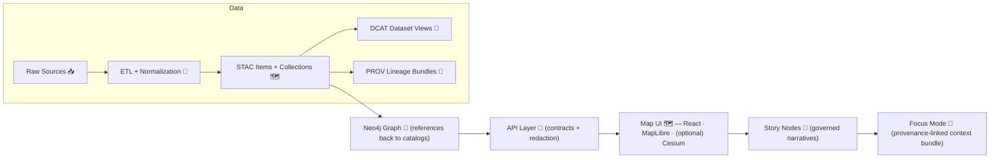

# Provenance Core 🧾🧬  
`web/src/core/provenance/`


> **Rule of the road:** if it appears in the UI (or Focus Mode), it must be **traceable** to a cataloged source and **provable** processing. 🚦  
> Missing provenance isn’t “nice to have later” — it’s a **bug**.

---

## What this folder is 🧩

This folder defines the **front-end provenance foundation**: types + resolvers + validators + formatters that let every user-visible thing (map layers, story claims, charts, AI hints) point back to:

- 🗺️ **STAC** (Collections / Items) for geospatial assets  
- 🧾 **DCAT** (Dataset entries) for discoverability + licensing + distributions  
- 🧬 **PROV-O** (activity bundles) for lineage: inputs → processing → outputs  
- 🧠 **Graph IDs** (Neo4j entity IDs) that *reference* catalogs instead of duplicating them

**Core outputs** of this module are meant to be **UI-ready** (citations, attributions, license banners, sensitivity flags), while still keeping the module **framework-agnostic** enough to reuse in hooks/components.

---

## Table of contents 🧭

- [Core principles](#core-principles-)
- [Standards alignment](#standards-alignment-)
- [Data flow](#data-flow-)
- [Core concepts & terminology](#core-concepts--terminology-)
- [Public API shape](#public-api-shape-)
- [UI integration patterns](#ui-integration-patterns-)
- [Governance: license + sensitivity + AI](#governance-license--sensitivity--ai-)
- [Performance](#performance-)
- [Testing](#testing-)
- [Contributor checklist](#contributor-checklist-)
- [Glossary](#glossary-)

---

## Core principles 🧠

### ✅ Provenance-first (hard requirement)
- Anything user-facing must be backed by **catalog IDs** or **external sources that are themselves cataloged**.
- The UI must be able to answer: **“Where did this come from?”** in one click.

### 🔗 Cross-layer linkage (no silos)
We treat catalogs + lineage + graph as a single traceability system:

- STAC Items → the *actual data* (files or endpoints)
- DCAT → STAC and/or direct distributions
- PROV → end-to-end lineage (raw → work → processed), including run IDs / commit hashes
- Graph → stores **references** to catalog identifiers (not bulky payloads)

### 🧯 Guardrails > vibes
If provenance is missing:
- **Map layer / story / chart**: show a blocked/disabled state with a clear reason
- **Focus Mode**: **hard gate** (do not display)

---

## Standards alignment 🌐

KFM-style alignment policy (required) expects **all new datasets/evidence artifacts** to ship with:

- 🗺️ **STAC Collection + Item(s)** (even non-spatial datasets often still get a Collection for consistency)
- 🧾 **DCAT Dataset** entry (title, description, license, keywords, distributions)
- 🧬 **PROV activity bundle** (inputs, steps, responsible agents, timestamps, parameters/config)

These are extended by project profiles (e.g., `KFM_STAC_PROFILE.md`, `KFM_DCAT_PROFILE.md`, `KFM_PROV_PROFILE.md`) to include project-specific fields like **provenance references** and **uncertainty indicators**.

> This module is the **front-end interpreter** of those standards: it normalizes + validates + formats them for UI use.

---

## Data flow 🔁



**Where provenance typically lives (repo conventions):**
- `data/stac/collections/` + `data/stac/items/`
- `data/catalog/dcat/` (JSON-LD DCAT)
- `data/prov/` (PROV bundles)
- `data/processed/**` (final assets referenced by STAC)

---

## Core concepts & terminology 🧱

### 🧾 Provenance Pointer
A **pointer** is what UI features should carry around (lightweight, stable IDs):

- STAC: `collectionId`, `itemId` (or `href`)
- DCAT: `datasetId` (or canonical URI)
- PROV: `bundleId` (or `href`)
- Graph: `entityId`
- Optional: external DOI/ARK/URL (only if also cataloged)

### 🧬 Resolved Provenance
A **resolved** object is what the UI consumes:

- Human-readable attribution (source, author, publisher)
- License + restrictions + “effective license” across multiple layers
- Lineage summary (inputs → processing → outputs)
- Confidence/uncertainty indicators (if present)
- Sensitivity + redaction policy flags (CARE/sovereignty rules)

### 🧠 Evidence artifact
Any derived product (AI output, regression model result, simulation output, map tiles, summary tables) is treated as an **evidence artifact**:
- It must have STAC/DCAT/PROV like any other dataset.
- It must identify pipeline run/config (commit hash, run id, parameters).

---

## Public API shape 🧰

> Names below are *intended* exports for this folder. If implementations differ, keep the **conceptual contract** the same.

### Types (recommended)
```ts
export type ProvenancePointer = {
  stac?: { collectionId?: string; itemId?: string; href?: string };
  dcat?: { datasetId?: string; uri?: string };
  prov?: { bundleId?: string; href?: string };
  graph?: { entityId?: string };
  external?: { doi?: string; ark?: string; url?: string }; // must be cataloged
};

export type LicenseInfo = {
  id?: string;         // SPDX if known
  name: string;
  url?: string;
  restrictions?: string[];   // e.g., "NonCommercial", "EducationOnly"
  attributionRequired?: boolean;
};

export type Sensitivity = {
  level: "public" | "restricted" | "sensitive";
  reason?: string;
  handling: {
    redactCoordinates?: boolean;
    generalizeGeometry?: boolean;
    hideDownloads?: boolean;
  };
};

export type Uncertainty = {
  confidence?: number;     // 0..1 (when available)
  method?: string;         // e.g., "Bayesian", "cross-validation", "expert review"
  completeness?: number;   // 0..1
  notes?: string;
};

export type ResolvedProvenance = {
  pointer: ProvenancePointer;
  title?: string;
  description?: string;

  attribution: {
    sources: Array<{ name: string; url?: string; note?: string }>;
    processedBy?: Array<{ name: string; role?: string }>;
    run?: { runId?: string; commitHash?: string; timestamp?: string };
  };

  license: {
    declared?: LicenseInfo[];
    effective?: LicenseInfo; // computed (see license stacking rules)
  };

  provSummary?: {
    inputs: string[];
    activities: string[];
    outputs: string[];
  };

  sensitivity?: Sensitivity;
  uncertainty?: Uncertainty;

  links: {
    stac?: string;
    dcat?: string;
    prov?: string;
    download?: string[];
  };
};
```

### Resolution (recommended)
```ts
export async function resolveProvenance(ptr: ProvenancePointer): Promise<ResolvedProvenance>;
```

**Resolver responsibilities:**
- 🔍 Fetch STAC/DCAT/PROV via the **API layer** (not direct DB access)
- ✅ Validate payloads against profiles (or a client-side subset)
- 🧠 Compute UI-friendly fields:
  - `effectiveLicense`
  - `attributionStatement`
  - `redactionPolicy`
  - `citationList`
- 🚫 Fail closed for Focus Mode contexts

### Formatting helpers (recommended)
```ts
export function formatAttribution(p: ResolvedProvenance): string;
export function formatCitations(p: ResolvedProvenance): Array<{ label: string; href?: string }>;
export function computeEffectiveLicense(licenses: LicenseInfo[]): LicenseInfo;
```

---

## UI integration patterns 🗺️📝🎯

### 🗺️ Map layers (layer registry)
Every layer must “know” its provenance pointer.

Minimum UI affordances:
- ℹ️ Popup/legend shows:
  - Source(s) + attribution
  - License badge + link
  - “View provenance” button (opens evidence panel)
- ⬇️ Download is allowed only if:
  - license permits
  - sensitivity policy permits
  - user role permits (if applicable)

> Tip (WebGL UI): keep provenance UI as DOM overlay (or HUD overlay) so it stays **accessible** and doesn’t fight the render loop.

### 📝 Story Nodes
Stories are “machine-ingestible storytelling”:
- Every claim should have a **citation** (footnote or inline)
- Entities mentioned should link to **graph IDs**
- Fact vs interpretation must be distinguishable

Provenance module should provide:
- `resolveClaimCitations(claimId)` (or similar)
- `renderFootnotes()` helpers
- `missingCitationDiagnostics()` for authoring workflows

### 🎯 Focus Mode (hard gate)
Focus Mode rules enforced by this module (directly or indirectly):

- ✅ Only provenance-linked content  
- ✅ AI contributions are opt-in + labeled + include confidence/uncertainty  
- ✅ No sensitive location leaks (generalize/omit)  

If provenance is incomplete, Focus Mode must show:
- **Blocked content** state with actionable hint: “Missing STAC/DCAT/PROV link.”

---

## Governance: license + sensitivity + AI 🛡️

### 📜 License stacking
When combining layers, compute an **effective license**:
- If one layer is more restrictive, the composite experience should adopt the **more restrictive** obligations.
- UI should surface:
  - attribution requirements
  - non-commercial restrictions
  - special terms links

**Implementation note:** keep this deterministic + testable (`computeEffectiveLicense()` should be pure).

### 🧭 Sensitivity & sovereignty (CARE-aligned)
If an entity/dataset is flagged sensitive:
- 🫥 Hide or generalize coordinates
- 🧊 Blur markers / show region polygons
- 🔒 Hide downloads where required
- 🧾 Show “why” (reason + policy) without leaking protected details

### 🤖 AI evidence handling
Treat AI outputs as evidence artifacts:
- Must link to lineage bundle (inputs + model + params + run id)
- Must show “AI-generated” label
- Must include confidence/uncertainty when available
- Must respect all redaction/sensitivity policies

**Design lens:** if evidence is “bad/tainted” or policy-disallowed, UI should support:
- 🧹 **Data pruning** (don’t show it)
- 🧠 **Inferential restraint** (don’t overclaim)
- 🧱 **Executional restraint** (don’t enable unsafe actions like downloads/sharing)

---

## Performance ⚡

Provenance resolution can get heavy (graphs + catalogs + bundles). Keep it fast:

- 🧠 Cache by stable key (pointer → resolved provenance)
- 🔁 Coalesce in-flight requests (avoid duplicate fetch storms)
- 🧩 Progressive resolution:
  1) show attribution + license fast  
  2) fetch full PROV graph lazily for “View details”  
- 🧯 Set sane limits on depth/size for lineage visualization (paginate long chains)

---

## Testing 🧪

### Unit tests
- `computeEffectiveLicense()` (stacking rules)
- Citation formatting + ordering
- Sensitivity redaction behaviors (geometry + coords)
- Deterministic sorting of sources

### Contract-ish tests (frontend)
- Resolver handles expected API shapes (STAC/DCAT/PROV)
- Missing provenance produces correct blocked state
- “AI-generated” labeling rules always fire when needed

### UX tests
- Keyboard navigation for provenance popovers/panels
- Responsive layout (small screens + map overlays)
- Error states: missing link, partial metadata, network failure

---

## Contributor checklist ✅

When adding **any new user-facing layer/feature**:

- [ ] I have a `ProvenancePointer` for the thing (STAC/DCAT/PROV/Graph IDs)
- [ ] The UI shows source + license in a popup/legend/evidence panel
- [ ] Focus Mode hard-gates if provenance is missing
- [ ] Sensitivity policies are respected (no coordinate leaks)
- [ ] AI outputs (if any) are opt-in + labeled + uncertainty surfaced
- [ ] Tests cover license + missing provenance + redaction behavior

---

## Glossary 📚

- **STAC**: SpatioTemporal Asset Catalog — describes geospatial assets + where to get them  
- **DCAT**: Data Catalog Vocabulary — dataset discovery layer + licensing + distributions  
- **PROV-O**: Provenance ontology — lineage: entities, activities, agents  
- **Evidence artifact**: any output used to support claims (data, charts, AI results, analyses)  
- **Pointer**: lightweight ID bundle linking UI → catalogs/lineage  
- **Resolved provenance**: pointer + fetched metadata + UI-ready formatting  
- **Hard gate**: missing provenance blocks display (especially in Focus Mode)

---

## 🧭 Suggested folder layout (recommended)

```text
📁 web/src/core/provenance/
  ├─ README.md
  ├─ index.ts
  ├─ types.ts
  ├─ resolve.ts
  ├─ format.ts
  ├─ license.ts
  ├─ sensitivity.ts
  ├─ ai.ts
  └─ __tests__/
     ├─ license.test.ts
     ├─ resolve.test.ts
     └─ sensitivity.test.ts
```

---

### 🚀 Next milestones (nice-to-have)
- Evidence panels that highlight provenance-linked assets + data quality flags
- Telemetry hooks for sensitive-access events + redaction events (governance dashboards)
- Story Node draft → review → publish workflow checks for citation completeness

💡 If you’re implementing a new UI layer: start by wiring `ProvenancePointer` → `resolveProvenance()` → `EvidencePanel`.

