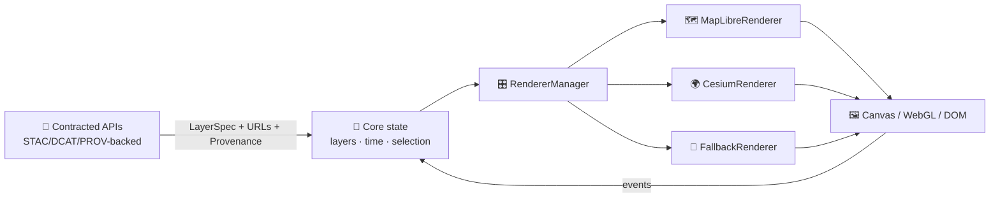

# 🎨 Renderers (`web/src/core/renderers`)


> Engine adapters that turn **KFM evidence → pixels** (2D + 3D), while keeping **provenance attached** 🔗

> [!IMPORTANT]
> **Renderers do not ingest, “clean”, or interpret data.**  
> They only render what the system contracts provide (URLs + metadata + provenance), and they emit interaction events back to the app.

---

## 🧭 Why this folder exists

KFM’s UI layer is designed around a **map-first experience** (2D + optional 3D), timeline-driven storytelling, and *“show your sources”* transparency. Renderers provide the boundary that:

- 🧩 **Isolates engine dependencies** (MapLibre / Cesium / future engines) behind a stable interface
- 🔁 **Keeps map state deterministic** (Story Nodes can replay scenes reliably)
- 🧠 **Unifies interactions** (hover/click/select) across engines
- 📎 **Preserves provenance** on every feature/pixel the user can inspect
- 🧯 Enables **fallbacks** when WebGL isn’t available (or context is lost)

> [!NOTE]
> Treat this folder as an **Anti‑Corruption Layer**: third‑party map/globe APIs are powerful, but they shouldn’t leak everywhere.

---

## 🗺️ Quick mental model



---

## 📦 What lives here

Renderers typically own:

- 🧱 **Renderer contract** (mount/destroy, set view, apply layers, set time)
- 🧰 **Engine adapters** (MapLibre, Cesium, fallback)
- 🧾 **Layer adapters** (engine‑neutral `LayerSpec` → engine‑specific sources/layers)
- 🔍 **Picking / hit‑testing** (screen point → features + provenance)
- 🔄 **2D ↔ 3D view conversion** (consistent view state when toggling)
- 📸 **Export hooks** (screenshots, “scene capture” for Story Nodes)

Renderers should **not** own:

- ❌ ETL, parsing raw files, geoprocessing, CRS repair
- ❌ dataset governance decisions (that belongs in the metadata/provenance pipeline)
- ❌ business logic (filters/rules should arrive as contract fields)

---

## 🗂️ Folder map (recommended)

> If the exact filenames differ, keep the **conceptual split** the same: contracts/types → manager → engines → layer translators.

```text
📁 web/src/core/renderers/
├─ 📄 README.md
├─ 🧾 types.ts                 # Engine-neutral contracts (Renderer, LayerSpec, events)
├─ 🎛️ RendererManager.ts       # Picks active renderer + keeps it in sync with app state
├─ 🧠 viewState.ts             # Canonical view state + 2D/3D conversion helpers
├─ 🔍 picking.ts               # Normalized pick result helpers
├─ 📁 maplibre/
│  ├─ 🗺️ MapLibreRenderer.ts
│  └─ 🧩 maplibreLayerAdapter.ts
├─ 📁 cesium/
│  ├─ 🌍 CesiumRenderer.ts
│  └─ 🧩 cesiumLayerAdapter.ts
└─ 📁 fallback/
   ├─ 🧻 CanvasRenderer.ts      # Optional: minimal draw / static preview
   └─ 📴 NoopRenderer.ts        # Optional: “not supported” / headless mode
```

---

## 🧾 Core contracts

### 🎛️ Renderer (engine-neutral interface)

```ts
export type RendererKind = "maplibre" | "cesium" | "fallback" | (string & {});

export interface Renderer {
  readonly kind: RendererKind;

  mount(container: HTMLElement, opts: RendererInitOptions): void | Promise<void>;
  destroy(): void;

  setView(view: ViewState): void;
  getView(): ViewState;

  setTime(time: TimeState): void;

  upsertLayer(layer: LayerSpec): void;
  removeLayer(layerId: string): void;
  setLayerOrder(layerIdsInOrder: string[]): void;

  pick(screen: ScreenPoint, opts?: PickOptions): Promise<PickResult[]> | PickResult[];

  on<T extends RendererEvent["type"]>(
    type: T,
    handler: (payload: Extract<RendererEvent, { type: T }>) => void
  ): () => void;
}
```

### 🧱 LayerSpec (what the rest of the app hands to renderers)

The core app should describe layers in a **portable** way, so we can swap engines without rewriting business logic.

```ts
export type LayerKind =
  | "basemap"
  | "raster"
  | "vector"
  | "points"
  | "lines"
  | "polygons"
  | "heatmap"
  | "labels"
  | "terrain"
  | "tiles3d"
  | "model"
  | "custom";

export type SourceKind =
  | "geojson"
  | "vector-tiles"
  | "raster-tiles"
  | "pmtiles"
  | "wms"
  | "wmts"
  | "tiles3d";

export interface ProvenanceRef {
  datasetId: string;           // stable ID in our catalog/graph
  title?: string;              // human-readable title for tooltips
  attribution?: string;        // map corner attribution + exports
  license?: string;            // display + export metadata
  citations?: Array<{
    label: string;
    url?: string;
    doi?: string;
    note?: string;
  }>;
  prov?: {
    bundleId?: string;
    uri?: string;
  };
}

export interface LayerSource {
  kind: SourceKind;
  url: string;                 // signed URL / endpoint / tiles template
  sublayers?: string[];        // optional (e.g., vt layer names)
  headers?: Record<string, string>; // optional, if your fetch stack supports it
}

export interface LayerTemporal {
  start?: string;              // ISO8601
  end?: string;                // ISO8601
  // optional: step, resolution, or “time field name” for feature filtering
  field?: string;
}

export interface LayerSpec {
  id: string;
  title: string;
  kind: LayerKind;

  visible: boolean;
  opacity?: number;
  zIndex?: number;

  source: LayerSource;
  temporal?: LayerTemporal;

  // Engine-neutral styling tokens (translated by adapters)
  style?: Record<string, unknown>;

  provenance: ProvenanceRef;
}
```

> [!TIP]
> Keep `LayerSpec` **serializable** (plain JSON).  
> That makes it easy to store in Story Nodes, reproduce bugs, and export scene snapshots.

---

## 📎 Provenance is a first-class rendering requirement

A renderer is **not “done”** unless provenance survives all the way to the user.

### ✅ Rules of thumb

- Every `LayerSpec` **must include** a `provenance.datasetId` (and ideally title + attribution).
- Every `pick()` result must include:
  - layer id + layer title
  - dataset id (and any citation bundle identifiers)
  - a *human-friendly attribution string* suitable for UI + exports
- If a layer is visible, its attribution **must appear** somewhere (map corner, legend, export metadata, etc.).
- If the user exports a screenshot, the export should include provenance metadata (even if the UI hides it).

> [!WARNING]
> “It’s on the map but you can’t trace it” = **bug** 🐛

---

## ⏱️ Time & timeline integration

KFM is timeline-heavy (historic maps, settlement expansion, railroads, etc.). Renderers must be able to:

- Accept a `TimeState` (current time, range, playback mode)
- Filter or swap data based on time (feature property filter, time-sliced tiles, etc.)
- Emit “loaded/ready” state so the timeline can scrub smoothly

### Suggested TimeState

```ts
export interface TimeState {
  mode: "instant" | "range";
  t?: string;                  // ISO8601, when mode=instant
  start?: string;              // ISO8601, when mode=range
  end?: string;                // ISO8601, when mode=range
  playing?: boolean;
  speed?: number;              // playback multiplier
}
```

---

## 🔁 2D ↔ 3D parity (capability matrix)

| Capability | 🗺️ MapLibre (2D) | 🌍 Cesium (3D) | 🧻 Fallback |
|---|:---:|:---:|:---:|
| Basemap + overlays | ✅ | ✅ | ⚠️ limited |
| Vector tiles | ✅ | ⚠️ (adapter-specific) | ❌ |
| Raster tiles / imagery | ✅ | ✅ | ✅ (static) |
| 3D Tiles / point clouds | ❌ | ✅ | ❌ |
| Terrain | ⚠️ (limited) | ✅ | ❌ |
| Feature picking | ✅ | ✅ | ⚠️ limited |
| Timeline filtering | ✅ | ✅ | ⚠️ limited |
| Screenshot/export | ✅ | ✅ | ✅ |

> [!NOTE]
> “Parity” does **not** mean “identical.”  
> It means the app can describe intent once, and engines can do their best within constraints.

---

## 🧠 Engine-specific notes (without leaking engine APIs)

### 🗺️ MapLibre adapter rules

- Prefer engine-native tiling & styling (vector tiles where possible).
- Keep style updates incremental: avoid rebuilding the entire style graph on every toggle.
- Use stable layer/source IDs derived from `LayerSpec.id`.

### 🌍 Cesium adapter rules

- Treat 3D tiles / terrain / imagery as the “native superpower” path.
- Normalize camera state to/from `ViewState` so a user can toggle 2D ↔ 3D without getting “lost in space”.
- When streaming heavy assets (point clouds), emit progress events so UI can show a loader.

### 🧻 Fallback strategy

When WebGL is unavailable (or context is lost repeatedly):

- Render a minimal static placeholder (thumbnail, last-known screenshot, or a basic raster basemap)
- Provide actionable UI messaging (“Enable hardware acceleration”, “Try a different browser”, etc.)
- Keep the rest of the app usable (Story text, dataset catalog, provenance browsing)

---

## 🎛️ View state: pick a canonical format (and stick to it)

A renderer toggle becomes painless if we keep one canonical view representation.

### Suggested ViewState (portable)

```ts
export interface ViewState {
  // World anchor (always WGS84 lon/lat for portability)
  lon: number;
  lat: number;

  // 2D-ish
  zoom?: number;
  bearing?: number;

  // 3D-ish
  pitch?: number;
  heightMeters?: number;       // camera height above ellipsoid / terrain as appropriate

  // Optional: bounds for “fit to data”
  bounds?: [number, number, number, number]; // [west, south, east, north]
}
```

> [!TIP]
> Store `ViewState` in Story Nodes so scenes are reproducible 📖✨

---

## 🎨 Styling & cartography guardrails

Renderers shouldn’t decide *what* a layer means — but they can enforce *how* we present it:

- 🎯 **Legibility first**: don’t let basemap overwhelm overlays (opacity + contrast).
- ♿ **Accessibility**:
  - avoid “red vs green only” encodings
  - combine color + shape + line pattern for categories
  - keep minimum stroke widths for thin lines on HiDPI screens
- 🧭 **Consistent symbology**:
  - points/lines/polygons should feel like one system
  - keep category palettes consistent across stories & dashboards

---

## 🖼️ Raster & tile format sanity checks

When working with imagery/tiles, remember:

- 🟦 PNG: crisp labels/linework, transparency (bigger files)
- 🟨 JPEG: aerial imagery (smaller files), no transparency (lossy)
- 🧪 Modern formats (WebP/AVIF): great, but validate browser support and caching behavior

> [!NOTE]
> Rendering performance is often a **network + decode** problem, not just GPU.

---

## ⚡ Performance checklist (renderer PRs)

- [ ] No full re-mount of the engine on normal state changes
- [ ] Layer updates are incremental (diff/apply) where possible
- [ ] Expensive transforms run off the main thread (Web Workers) when feasible
- [ ] Picking is throttled/debounced on mousemove
- [ ] Large GeoJSON is avoided in favor of tiles when possible
- [ ] Context loss is handled (WebGL restore path or fallback)

---

## 🧪 Testing strategy

Because WebGL is hard to unit-test directly, split tests:

### ✅ Unit tests (fast)
- `LayerSpec → engine-layer` translation
- view state conversions
- picking normalization (adapter output → `PickResult[]`)

### 🖥️ Integration / E2E (slower)
- Load a known scene and snapshot (visual regression)
- Toggle 2D ↔ 3D and verify the camera stays anchored
- Timeline scrub tests: no crashes, consistent “ready” state

---

## ➕ Adding a new renderer (step-by-step)

1. 🧾 Implement `Renderer` interface
2. 🧩 Build a layer adapter (`LayerSpec` → engine primitives)
3. 🔄 Implement `ViewState` conversion
4. 🔍 Implement `pick()` normalization
5. 📎 Ensure provenance survives pick + export
6. 🧪 Add at least:
   - unit tests for adapter conversion
   - one integration scene test

> [!IMPORTANT]
> A renderer that can’t report provenance is not production-ready.

---

## 🛠️ Debugging & common gotchas

- 🧯 **WebGL context lost**: handle gracefully; retry with backoff; fall back if repeated
- 🧭 **CRS confusion**: keep app-facing view state WGS84 lon/lat; convert internally
- 🧊 **Z-fighting in 3D**: tweak depth settings / polygon offset / height references
- 🐢 **Slow hover**: throttle pick; reduce query radius; prefer engine-native hit tests
- 🧠 **Memory leaks**: confirm `destroy()` releases event handlers, workers, and engine objects

---

## 📚 References (project + library)

### 🧩 Project architecture context
- `../../../../docs/MASTER_GUIDE_v13.md`
- `../../../../docs/architecture/KFM_REDESIGN_BLUEPRINT_v13.md`
- `../../../../docs/architecture/KFM_VISION_FULL_ARCHITECTURE.md`
- `../../../../docs/architecture/KFM_PROJECT_OVERVIEW.md`

### 📖 Suggested reading for this subsystem

<details>
  <summary>📚 Renderer “study shelf” (click to expand)</summary>

#### 🎮 WebGL & rendering fundamentals
- `webgl-programming-guide-interactive-3d-graphics-programming-with-webgl.pdf` — shader pipeline mental model, buffers, textures, lighting
- `B-C programming Books.pdf` — 2D canvas vs 3D pipelines, scene graphs (useful for adapter thinking)

#### 🗺️ Cartography & geospatial visualization
- `making-maps-a-visual-guide-to-map-design-for-gis.pdf` — map design, legend/label clarity, accessibility considerations
- `Mobile Mapping_ Space, Cartography and the Digital - 9789048535217.pdf` — mobile map UX, context + interaction patterns
- `Archaeological 3D GIS_26_01_12_17_53_09.pdf` — 3D GIS storytelling/visualization patterns

#### 🧱 Web UI, responsiveness, accessibility
- `responsive-web-design-with-html5-and-css3.pdf` — responsive layout patterns, media queries, accessibility notes

#### 🖼️ Imaging & performance
- `compressed-image-file-formats-jpeg-png-gif-xbm-bmp.pdf` — raster encoding tradeoffs relevant to tile pipelines
- `Database Performance at Scale.pdf` + `Scalable Data Management for Future Hardware.pdf` — performance intuition that often shows up as “why is the map slow?”

#### 🧠 Ethics, transparency, provenance
- `Introduction to Digital Humanism.pdf` — human-centered framing
- `On the path to AI Law’s prophecies and the conceptual foundations of the machine learning age.pdf` — governance mindset for traceability

</details>

---

### ✅ Definition of Done (for changes in this folder)

- [ ] Maintains engine isolation (no leaking MapLibre/Cesium APIs into unrelated modules)
- [ ] Provenance remains visible and queryable
- [ ] Time/timeline behavior is consistent
- [ ] Performance doesn’t regress (no re-mount storms, no runaway picks)
- [ ] Tests added/updated

✨ If it’s rendered, it’s traceable.

