<div align="center">

# 👥 **Kansas Frontier Matrix — Entities Architecture & Semantic View-Model Layer**  
`web/src/entities/README.md`

**Purpose:**  
Define the **full deep-architecture specification** of the KFM v10.3.2 **Entities Layer** — the semantic model that unifies graph data, geospatial metadata, temporal ranges, AI reasoning signals, provenance lineage, and FAIR+CARE governance into coherent UI-ready representations for the entire web platform.

[]()
[]()
[]()
[]()

</div>

---

# 📘 Overview

The **Entities Layer** is the semantic foundation of the Kansas Frontier Matrix.  
It transforms heterogeneous backend sources into predictable, typed, FAIR+CARE-certified **Entity View Models (EVMs)**.

These EVMs are consumed by:

- **MapView** (2D + 3D highlights, layer filtering)  
- **TimelineView** (temporal ranges, predictive projections)  
- **DetailDrawer** (contextual narratives)  
- **Focus Mode v2.5** (explainability + provenance overlays)  
- **Story Nodes** (graph-linked event chains)  
- **DataCards** (domain summaries)  
- **Governance UI** (CARE labels, sovereignty, provenance)  

The Entities Layer ensures:

- semantic consistency  
- governance correctness  
- provenance completeness  
- accessibility readiness  
- sustainability + telemetry integration  
- deterministic behavior across the UI  

---

# 🗂️ Directory Layout (Authoritative v10.3.2)

```text
web/src/entities/
├── README.md
│
├── people/
│   ├── personViewModel.ts
│   ├── personMapper.ts
│   └── metadata.json
│
├── places/
│   ├── placeViewModel.ts
│   ├── placeMapper.ts
│   └── metadata.json
│
├── events/
│   ├── eventViewModel.ts
│   ├── eventMapper.ts
│   └── metadata.json
│
└── datasets/
    ├── datasetViewModel.ts
    ├── datasetMapper.ts
    └── metadata.json
```

Each subdirectory implements **mapper → view-model → metadata** patterns.

---

# 🧩 High-Level Semantic Architecture

```mermaid
flowchart TD
    RAW[Raw Metadata<br/>Neo4j · GraphQL · STAC · DCAT · Focus AI] --> MAP[Entity Mappers]
    MAP --> VM[Entity View Models<br/>canonical, FAIR+CARE-certified]
    VM --> UI[UI Systems<br/>Map · Timeline · Drawer · Focus · StoryNodes · DataCards]
    VM --> GOV[Governance Engine<br/>provenance · sovereignty · CARE]
    VM --> TEL[Telemetry Layer<br/>energy · ethics · a11y]
```



---

# 🧬 Entity View-Model (EVM) Specification

All EVMs **must** provide:

### Core Identity  
- `id` — global, stable, unique  
- `label` — human-readable name  
- `type` — person | place | event | dataset  

### Provenance  
- STAC/DCAT references  
- checksum lineage  
- PROV-O relationships  
- graph node references  
- ledger references  

### FAIR+CARE  
- CARE label: public | sensitive | restricted  
- sovereignty tags (tribal, protected)  
- redaction integrity rules  
- dataset licensing  

### Spatiotemporal  
- temporal extents (`start`, `end`)  
- spatial extents (bbox, centroid, geometry treatment)  
- predictive windows (if model output linked)  

### Explainability  
- relevance_score  
- evidence_set  
- linked Story Nodes  

### Accessibility  
- longDescription  
- alt-text friendly summaries  
- structured fields for consistent reading order  

### Example Normalized Shape

```ts
type EntityVM = {
  id: string;
  label: string;
  type: "person" | "place" | "event" | "dataset";
  description?: string;
  temporal?: { start?: number; end?: number };
  spatial?: { bbox?: number[]; centroid?: number[] };
  provenance: {
    stac?: string[];
    lineage?: string[];
    ledgerRefs?: string[];
    checksumVerified?: boolean;
  };
  care: {
    label: "public" | "sensitive" | "restricted";
    sovereignty?: string;
  };
  explainability?: {
    relevance?: number;
    evidence?: string[];
  };
};
```

---

# 👤 People Entities — Semantic Model

People entities unify:

- biographical metadata  
- culturally sensitive classifications  
- linkages to events, places, datasets  
- sovereignty & CARE indicators  
- documented provenance  

```mermaid
flowchart LR
    P1[Person Node] --> P2[personMapper]
    P2 --> P3[personViewModel]
    P3 --> UI[Focus · Drawer · StoryNodes · DataCards]
```



---

# 📍 Places Entities — Geospatial Model

Places must encode:

- spatial extents (bbox, centroid)  
- masked geometry (CARE r7/r8 rules)  
- sovereignty domains  
- linked STAC assets for map layers  
- predictive ecological overlays (optional)  


---

# 📅 Events Entities — Temporal & Narrative Model

Events model:

- time ranges  
- participants  
- spatial footprint  
- predictive event-band context (if future scenario)  
- timeline synchronization metadata  
- Story Node links  

```mermaid
flowchart LR
    E1[Event Node] --> E2[eventMapper]
    E2 --> E3[eventViewModel]
    E3 --> TL[TimelineView · StoryNodes · Focus Mode]
```



---

# 📦 Dataset Entities — Metadata & Provenance Model

Datasets surface:

- full STAC/DCAT metadata  
- license & rights  
- checksum + lineage  
- temporal + spatial coverage  
- CARE visibility and sensitivity  
- layer compatibility for MapView  

```mermaid
flowchart LR
    D1[STAC/DCAT Dataset] --> D2[datasetMapper]
    D2 --> D3[datasetViewModel]
    D3 --> PC[ProvenanceCard · DataCards]
```



---

# 🔐 Governance Pipeline (FAIR+CARE + Sovereignty)

Governance is enforced **at the entity level**:


Governance logs stored at:

```
../../../docs/reports/audit/web-entities-governance-ledger.json
```

---

# ♿ Accessibility Architecture (WCAG 2.1 AA)

Entities supply structured metadata for:

- screenreader summaries  
- consistent date formatting  
- keyboard-navigable listings  
- alt-text substitution  
- domain-specific descriptive fields  


---

# 📡 Telemetry & Sustainability Integration

Entity accesses produce telemetry:

- `entity_select`  
- `entity_sensitive_view`  
- `entity_public_view`  
- explainability usage  
- energy estimates (Wh)  
- carbon footprint (gCO₂e)  

Telemetry target:

```
../../../releases/v10.3.2/focus-telemetry.json
```


---

# ⚙️ CI / Validation Requirements

| Area | Validation |
|------|------------|
| Schema | `schemaGuards.ts` (VM shape) |
| Governance | `faircare-validate.yml` |
| Accessibility | `accessibility_scan.yml` |
| Provenance | lineage + checksum checks |
| Telemetry | `telemetry-export.yml` |
| Docs | `docs-lint.yml` |

---

# 🧾 Example Entities Metadata Record

```json
{
  "id": "entities_layer_v10.3.2",
  "entity_types": ["people", "places", "events", "datasets"],
  "provenance_complete": true,
  "care_coverage": "100%",
  "a11y_ready": true,
  "telemetry_linked": true,
  "timestamp": "2025-11-14T22:10:00Z"
}
```

---

# 🕰️ Version History

| Version | Date | Summary |
|--------|--------|---------|
| v10.3.2 | 2025-11-14 | Full deep-architecture rebuild — CARE, provenance, STAC/DCAT linkage, Focus v2.5 integration, and telemetry pipelines. |

---

<div align="center">

**Kansas Frontier Matrix — Entities Architecture**  
👥 Semantic Integrity · 🌐 FAIR+CARE Governance · 🔗 Provenance Fidelity · 🧠 AI-Aligned UI  
© 2025 Kansas Frontier Matrix — MIT License  

[Back to Web Source](../README.md)

</div>

