<div align="center">

# 📦 **Kansas Frontier Matrix — Datasets Entities Architecture**  
`web/src/entities/datasets/README.md`

**Purpose:**  
Define the **FAIR+CARE-certified, Diamond⁹ Ω–grade semantic View-Model architecture** for **Datasets** in the Kansas Frontier Matrix (KFM) v10.3.2.  
Dataset entities unify **STAC**, **DCAT**, **Neo4j**, **PROV-O**, and **Story Node** lineage into a reproducible, governed, provenance-rich model used across the entire KFM web platform.

[]()  
[]()  
[]()  
[]()

</div>

---

## 📘 Overview

The **Datasets Entities Layer** defines how KFM represents all datasets:

- STAC collections and STAC items  
- DCAT dataset + distribution metadata  
- Neo4j dataset nodes  
- provenance lineage chains (PROV-O)  
- dataset-level CARE governance (rights, consent, sovereignty flags)  
- dataset quality, checksum, version, and diff history  
- dataset context for Focus Mode v2.5 explainability  
- dataset integration for MapView, TimelineView, Story Nodes, and DataCards  

In KFM, a **Dataset** is not just a file — it is a full semantic record with governed meaning.

---

## 🗂️ Directory Layout

```text
web/src/entities/datasets/
├── README.md
├── datasetViewModel.ts
├── datasetMapper.ts
└── metadata.json
````

* `datasetViewModel.ts` → strict typed contract
* `datasetMapper.ts` → STAC/DCAT/graph → canonical DatasetVM
* `metadata.json` → provenance, governance, and telemetry lineage

---

## 🧩 High-Level Dataset Entity Flow

```mermaid
flowchart TD
    RAW[STAC/DCAT Records<br/>+ Neo4j Dataset Node + Story Nodes] --> MAP[datasetMapper]
    MAP --> VM[datasetViewModel<br/>canonical DatasetVM]
    VM --> UI[UI Systems<br/>DataCards · MapView · TimelineView · ProvenanceCard · FocusMode]
    VM --> GOV[Governance Layer<br/>CARE · rights · sovereignty]
    VM --> TEL[Telemetry Layer]
```



---

## 🧬 Dataset View-Model Specification

### `DatasetVM` (conceptual)

```ts
export type DatasetVM = {
  id: string;
  type: "dataset";
  label: string;                     // dataset name/title
  description?: string;              // accessible summary
  stac?: {
    collection?: string;
    itemId?: string;
    assets?: string[];
    version?: string;
    datetime?: string;
    bbox?: number[];
    geometryExists?: boolean;
  };
  dcat?: {
    theme?: string[];
    keywords?: string[];
    distributions?: string[];
    license?: string;
  };
  temporal?: {
    start?: string;
    end?: string;
    predictive?: boolean;
  };
  spatial?: {
    bbox?: number[];
    centroid?: number[];
    masked?: boolean;
  };
  provenance: {
    sourceIds: string[];
    lineage?: string[];
    stacRefs?: string[];
    checksumVerified?: boolean;
    ledgerRefs?: string[];
  };
  care: {
    label: "public" | "sensitive" | "restricted";
    sovereignty?: string;
    consentRequired?: boolean;
  };
  explainability?: {
    relevanceScore?: number;
    evidenceSources?: string[];
  };
};
```

---

## 🧱 Dataset Mapper — `datasetMapper.ts`

### Responsibilities

* Validate and normalize STAC/DCAT metadata
* Extract provenance & lineage
* Apply CARE governance rules to sensitive datasets
* Identify predictive datasets and scenario time windows
* Validate checksum & integrity metadata
* Convert geometry to accessible spatial summaries
* Produce accessible dataset descriptions

### Mapping Flow


---

## 🔐 FAIR+CARE Governance Integration

Datasets may require special treatment:

* restricted datasets (sacred, tribal, protected ecological data)
* archival sources containing personally sensitive content
* sovereignty rules for Indigenous data governance
* license restrictions (CC-BY, restricted-use maps, tribal knowledge rules)

Governance rules must be embedded directly in the DatasetVM.


Governance logs stored at:

```text
../../../docs/reports/audit/web-entities-datasets-governance.json
```

---

## 🧠 Explainability Integration (Focus Mode v2.5)

Datasets contribute to Focus Mode by:

* supplying evidence nodes
* providing contextual lineage
* modifying relevance scores based on dataset trust, completeness, recency

Explainability deltas appear when evidence sources change across releases.

---

## 🗺️ Spatial Semantics

DatasetVM spatial block must include:

* bbox for map zooming
* centroid for Focus Mode map alignment
* dataset geometry existence indicator (for coverage overlays)
* CARE masking for sensitive spatial layers (tribal or archaeological boundaries)

---

## ⏳ Temporal Semantics

DatasetVM must support:

* exact start/end timestamps
* fuzzy temporal ranges
* predictive windows (2030–2050, 2050–2100, etc.)
* alignment with TimelineView

---

## ♿ Accessibility Requirements

DatasetVM must include:

* screenreader-friendly dataset summaries
* standardized vocabulary for dataset types
* descriptive fallback when dataset attributes cannot be shown due to governance rules


---

## 📡 Telemetry Integration

Dataset interactions emit telemetry:

* dataset_selected
* dataset_masking_applied
* predictive_dataset_view
* dataset_focus_used
* dataset_lineage_loaded

Telemetry appended to:

```text
../../../releases/v10.3.2/focus-telemetry.json
```

---

## ⚙️ CI / Validation Requirements

| Layer         | Validator                |
| ------------- | ------------------------ |
| Type safety   | TS strict mode           |
| Schema        | `schemaGuards.ts`        |
| Governance    | `faircare-validate.yml`  |
| Telemetry     | `telemetry-export.yml`   |
| Accessibility | `accessibility_scan.yml` |
| Security      | CodeQL + Trivy           |
| Documentation | `docs-lint.yml`          |

All dataset entities must pass governance & provenance checks before merge.

---

## 🧾 Example Dataset Metadata Record

```json
{
  "id": "datasets_entities_v10.3.2",
  "datasets_indexed": 1784,
  "care_public": 1520,
  "care_sensitive": 231,
  "care_restricted": 33,
  "provenance_complete": true,
  "spatial_masked": 117,
  "telemetry_linked": true,
  "timestamp": "2025-11-14T23:59:00Z"
}
```

---

## 🕰️ Version History

| Version | Date       | Summary                                                                                                                                                          |
| ------- | ---------- | ---------------------------------------------------------------------------------------------------------------------------------------------------------------- |
| v10.3.2 | 2025-11-14 | Deep-architecture creation: STAC/DCAT harmonization, spatial masking, predictive-period metadata, explainability integration, provenance + governance expansion. |

---

<div align="center">

**Kansas Frontier Matrix — Datasets Entities Architecture**
📦 Semantic Dataset Modeling · 🔐 FAIR+CARE Governance · 🔗 Provenance Fidelity · 🧠 Explainable Data Integration
© 2025 Kansas Frontier Matrix — MIT License

[Back to Entities Index](../README.md)

</div>
