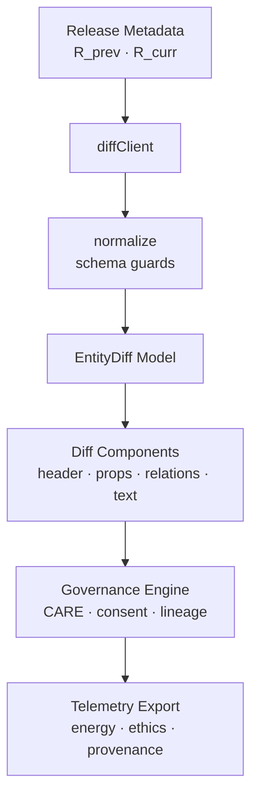
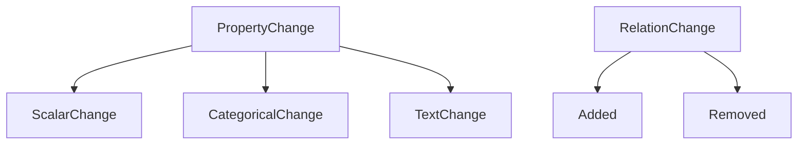
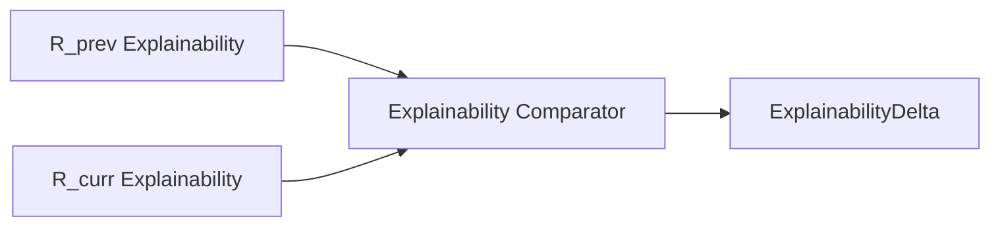
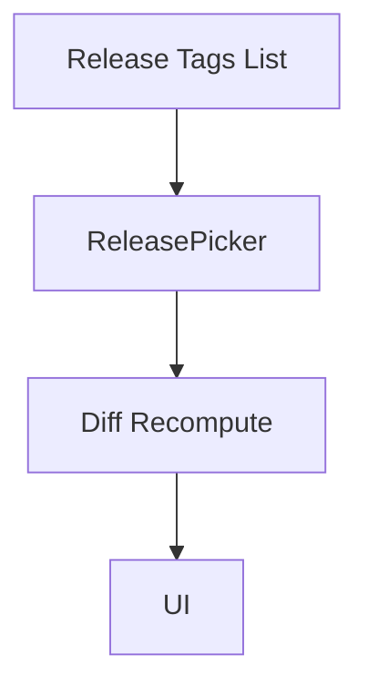
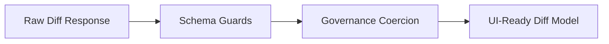
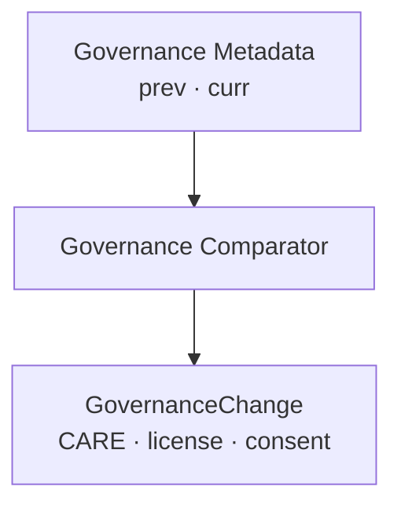
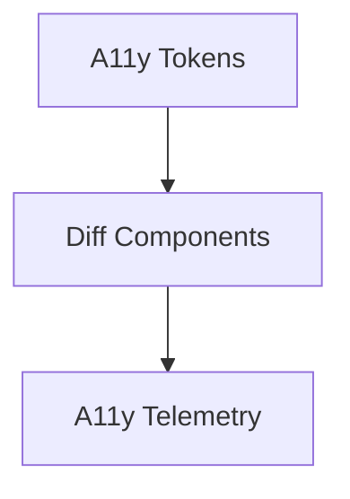

<div align="center">

# 🧾 **Kansas Frontier Matrix — Diff-First Entity Detail Architecture**  
`web/src/features/entities/diff-first/README.md`

**Purpose:**  
Define the **full deep-architecture specification** of the Diff-First Entity Detail Module — the KFM v10.3.2 subsystem that compares **release-to-release entity states**, surfaces **governance changes**, exposes **lineage evidence**, and synchronizes with **Map**, **Timeline**, **Focus Mode v2.5**, and **Story Node** systems.  
This module enforces **FAIR+CARE**, **provenance integrity**, **WCAG 2.1 AA**, and **MCP-DL v6.3** reproducibility.

[]()  
[]()  
[]()  
[]()

</div>

---

# 📘 Deep Overview

Most systems show entity details as **static snapshots**.  
**KFM Diff-First** shows **history before state**, answering:

- *What changed?*  
- *Why did it change?*  
- *What is the evidence?*  
- *What is the governance/CARE impact?*  
- *What is the lineage from previous releases?*

The Diff-First module surfaces:

### 🔍 Structural Differences
- Added / removed relationships  
- New or removed datasets  
- Geometry changes  
- Temporal refinements  
- CARE label shifts  

### 🧩 Property Differences
- Numeric deltas  
- Text diffs (unified & split)  
- Enum changes  
- Severity classification  

### 🔐 Governance & Provenance Changes
- Consent modifications  
- License changes  
- Provenance lineage updates  
- STAC/DCAT metadata updates  
- CARE label changes + sovereignty warnings  

### 🧠 Explainability & Focus Mode v2.5 Integration
- Evidence deltas  
- relevance_score changes  
- degraded or improved explainability reliability  

---

# 🗂️ Directory Layout

```text
web/src/features/entities/diff-first/
├── README.md
│
├── components/
│   ├── DiffHeader.tsx
│   ├── PropertyDelta.tsx
│   ├── RelationDelta.tsx
│   ├── TextDelta.tsx
│   ├── ReleasePicker.tsx
│   └── Legend.tsx
│
├── hooks/
│   ├── useEntityDiff.ts
│   └── useReleaseTags.ts
│
├── model/
│   ├── diffTypes.ts
│   └── normalize.ts
│
├── services/
│   └── diffClient.ts
│
├── styles/
│   └── tokens.css
│
└── tests/
    └── diff-first.spec.tsx
```

---

# 🧭 High-Level Architecture



---

# 🧬 Canonical Diff Model (Deep Specification)

## Base Model
Represents the full diff for a single entity:

```ts
type EntityDiff = {
  entityId: string;
  releasePrev: string;
  releaseCurr: string;
  summary: DiffSummary;
  properties: PropertyChange[];
  relations: RelationChange[];
  text: TextChange[];
  governance: GovernanceChange;
  explainability?: ExplainabilityDelta[];
};
```

### Summary
```ts
type DiffSummary = {
  added: number;
  removed: number;
  changed: number;
  severity: "low" | "med" | "high";
};
```

---

# 🧩 Diff Types Architecture



### Scalar Change
Numeric deltas w/ unit, pct, severity.

### Categorical Change
Enum or label changes.

### TextChange
Unified/split diff; change tokens counted.

### RelationChange
Graph edges added or removed, including:

- provenance  
- confidence  
- relationship type  
- sovereignty dependence  

---

# 🧠 Explainability Deltas (Focus Mode v2.5)

Focus Mode returns:

- relevance score  
- evidence nodes  
- dataset lineage references  
- CARE relevance warnings  

### Diff compares:

- explanation loss  
- new evidence sources  
- removed evidence  
- reasoning drift  



---

# 🧭 Release Picker Architecture



The picker must support:

- full history navigation  
- keyboard-first release cycling  
- ledger-linked release metadata  

---

# 🧱 Normalization Pipeline

Ensures all release-to-release comparisons follow:

- strict schema guards  
- FAIR+CARE coercion  
- provenance retention  
- stability across versions  



---

# 📡 Telemetry & Sustainability

Events include:

- `entity_diff_view`  
- `entity_diff_expand_property`  
- `entity_diff_expand_relation`  
- `entity_diff_copy`  
- `entity_diff_governance_change`  

Telemetry contributes to:

```
../../../../../releases/v10.3.2/focus-telemetry.json
```

Telemetry must include:

- energy (Wh)  
- carbon estimate  
- latency  
- a11y path coverage  
- governance delta count  

---

# 🔐 Governance & CARE Enforcement

Governance diffs highlight:

- CARE label changes  
- consent flag changes  
- sovereignty domain changes  
- license transitions  
- dataset lineage updates  



Governance impact must appear at the top of the diff.

---

# ♿ Accessibility Architecture (WCAG 2.1 AA)

Diff-First must:

- label all deltas with both icon + text (never color only)  
- maintain valid heading hierarchy  
- offer skip-to-changes link  
- provide keyboard shortcuts:
  - `[` previous release  
  - `]` next release  
  - `/` search  
  - `g` governance view  



---

# 🧪 CI & Validation Requirements

| Category | Validator |
|----------|-----------|
| Schema | TypeScript strict + runtime JSON guards |
| A11y | axe-core + Lighthouse |
| Governance | faircare-validate.yml |
| Provenance | lineage continuity checks |
| Telemetry | telemetry-export.yml |
| Security | CodeQL + Trivy |
| Docs | docs-lint.yml |

---

# 🧾 Example Metadata Record

```json
{
  "id": "entity_diff_first_v10.3.2",
  "total_entities_diffed": 14832,
  "governance_changes": 812,
  "care_label_changes": 42,
  "avg_diff_compute_ms": 23.7,
  "energy_use_wh": 0.91,
  "telemetry_synced": true,
  "checksum_verified": true,
  "timestamp": "2025-11-14T22:42:00Z"
}
```

---

# 🕰️ Version History

| Version | Date | Summary |
|--------|--------|---------|
| v10.3.2 | 2025-11-14 | Full deep-architecture rewrite: governance diff engine, explainability deltas, provenance lineage continuity, predictive support, A11y shortcuts. |
| v10.2.2 | 2025-11-11 | Prior version. |

---

<div align="center">

**Kansas Frontier Matrix — Diff-First Entity Architecture**  
🧾 Change Transparency · 🔐 FAIR+CARE Integrity · 🔗 Provenance Fidelity · 🧠 Explainable AI  
© 2025 Kansas Frontier Matrix — MIT License  

[Back to Web Features](../../README.md)

</div>
