<div align="center">

# 🧾 **Entity Detail — Diff-First View**  
`web/src/features/entities/diff-first/README.md`

**Purpose:**  
Start every entity detail screen with a **release-to-release diff** so users see **history, not just state**: added/removed relations, changed properties, confidence/lineage, and governance at a glance — aligned with **WCAG 2.1 AA** and **FAIR+CARE**.

[](../../../../README.md)  
[](../../../../../LICENSE)  
[](../../../../../docs/standards/faircare.md)  
[](../../../../../releases/)
</div>

---

## 📘 Overview

Traditional detail views bury change history. The **Diff-First** module renders a compact changelog pane at the top of an entity page, comparing the **current release (Rᶜ)** to the **previous release (Rᵖ)** and highlighting:

- **Adds / Removals**: relations, members, features, files  
- **Key Property Changes**: numeric deltas, categorical swaps, text diffs  
- **Impact & Confidence**: severity tags, confidence badges, provenance links  
- **Ethics & Governance**: consent flags, usage restrictions, lineage references  

---

## 🗂️ Directory Layout

```bash
web/src/features/entities/diff-first/
├── README.md
├── components/
│   ├── DiffHeader.tsx           # Sticky summary bar (counts, severity)
│   ├── PropertyDelta.tsx        # Scalar / categorical changes
│   ├── RelationDelta.tsx        # Added / removed edges
│   ├── TextDelta.tsx            # Unified / split text diff
│   ├── ReleasePicker.tsx        # Rᵖ / Rᶜ toggle, tag jump
│   └── Legend.tsx               # Iconography & tokens (WCAG AA)
├── hooks/
│   ├── useEntityDiff.ts         # Builds canonical diff model
│   └── useReleaseTags.ts        # Fetches available releases
├── model/
│   ├── diffTypes.ts             # TypeScript types for diffs
│   └── normalize.ts             # Map API → UI model + guards
├── services/
│   └── diffClient.ts            # REST/GraphQL calls w/ caching
├── styles/
│   └── tokens.css               # Accessible design tokens
└── tests/
    └── diff-first.spec.tsx      # E2E + a11y checks
```

---

## 🧩 Component Contract

| Component | Input | Output UI |
|---|---|---|
| `DiffHeader` | `EntityDiffSummary` | Added/Removed counts, overall severity |
| `PropertyDelta` | `PropertyChange[]` | +/– badges, numeric deltas, chips |
| `RelationDelta` | `RelationChange[]` | Added/removed lists with affordances |
| `TextDelta` | `TextChange` | Unified or split view, wrap-safe |
| `ReleasePicker` | `tags[]`, `selected` | Dropdown + prev/next shortcuts |
| `Legend` | `DesignTokens` | Icons, hints, keyboard help |

### Canonical Diff Types (TypeScript)

```ts
export type ScalarChange = {
  key: string; from: number | null; to: number | null; unit?: string;
  pct?: number | null; severity: "low" | "med" | "high"
};
export type CategoricalChange = {
  key: string; from: string | null; to: string | null; severity: "low" | "med" | "high"
};
export type TextChange = {
  key: string; from?: string; to?: string; mode: "unified" | "split";
  changed: boolean; tokens?: number
};
export type RelationChange = {
  kind: "added" | "removed"; relType: string; targetId: string; label: string;
  confidence?: number; provenance?: string[]
};
export type EntityDiff = {
  entityId: string;
  releasePrev: string; // Rᵖ
  releaseCurr: string; // Rᶜ
  summary: { added: number; removed: number; changed: number; severity: "low"|"med"|"high" };
  properties: (ScalarChange | CategoricalChange | TextChange)[];
  relations: RelationChange[];
  governance: { consentChanged?: boolean; usageRestriction?: string | null; lineageRefs?: string[] };
};
```

---

## ⚙️ Data Flow

```mermaid
flowchart LR
  A["Release API (Rᵖ, Rᶜ)"] --> B["diffClient.ts"]
  B --> C["normalize.ts (guards)"]
  C --> D["useEntityDiff()"]
  D --> E["DiffHeader / PropertyDelta / RelationDelta / TextDelta"]
  E --> F["Telemetry (view · expand · copy)"]
  F --> G["Governance Ledger (provenance · consent)"]
```



**REST example (server-side diff for stability & performance):**

```http
GET /api/entities/{id}/diff?from=2025.10.0&to=2025.11.0
# → EntityDiff (see types above)
```

---

## ♿ Accessibility (WCAG 2.1 AA)

- All deltas convey meaning via **icons + text** (never color-only)  
- Focus order: **ReleasePicker → Summary → Sections**  
- Keyboard: `[` previous tag, `]` next tag, `/` search property, `g` governance  
- Announce counts via `aria-live="polite"` on updates; provide skip-links to major sections

---

## 🧪 Quality Gates & Tests

| Gate | Target | Tooling |
|---|---|---|
| Rendering with 1k+ relation changes | ≥ 60 fps on median hardware | React Profiler |
| A11y violations | 0 | axe-core, jest-axe |
| Snapshot coverage | Empty diff & governance-change cases | Jest |
| Type safety | 0 any/ts-ignore in public API | TypeScript strict |

---

## 🧾 Telemetry & Governance

| Event | Payload |
|---|---|
| `entity_diff_view` | `entityId`, `from`, `to`, `counts` |
| `entity_diff_toggle_panel` | `mode` (`diff` \| `details`) |
| `entity_diff_copy_change` | `keys[]`, `severity`, `provenanceIncluded` |

All events roll into `focus-telemetry.json` and append lineage to the **Governance Ledger** (provenance and consent checks).

---

## 🗺️ Design Tokens (extract)

| Token | Example Value | Notes |
|---|---|---|
| `--delta-add-bg` | var(--green-50) | Non-color cue `+` icon |
| `--delta-remove-bg` | var(--red-50) | Paired with `–` icon |
| `--delta-change-bg` | var(--amber-50) | Pencil icon |
| `--text-diff-insert-outline` | 2px solid currentColor | Color-blind friendly outline |

---

## 🕰️ Version History

| Version | Date | Author | Summary |
|---|---|---|---|
| **v10.2.2** | 2025-11-11 | Web Platform Team | Upgraded & aligned to v10.2 standards; corrected badge order, paths, and telemetry schema v2. |
| **v10.0.0** | 2025-11-11 | Core | Initial Diff-First module spec. |

---

<div align="center">

© 2025 Kansas Frontier Matrix Project  
Master Coder Protocol v6.3 · FAIR+CARE Certified · Diamond⁹ Ω / Crown∞Ω Ultimate Certified  

[Back to Web](../../../../README.md) · [Governance Charter](../../../../../docs/standards/governance/ROOT-GOVERNANCE.md)

</div>
