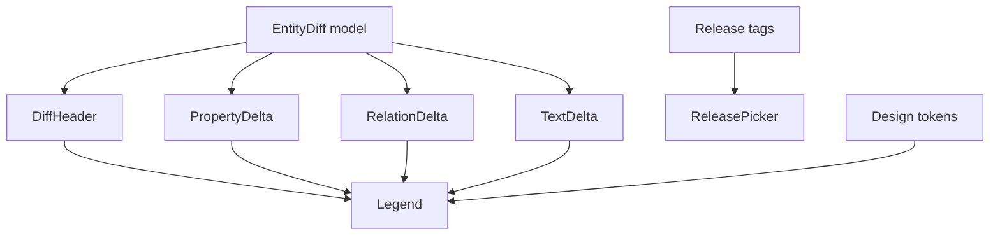
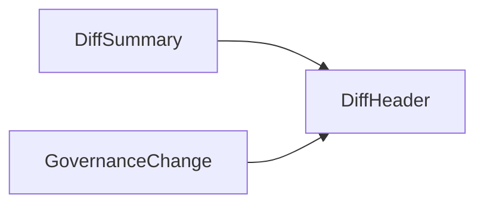
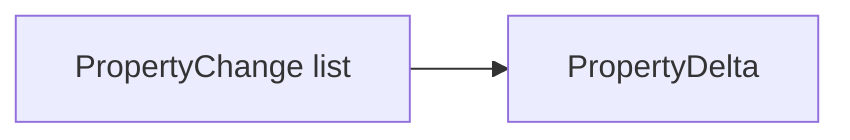
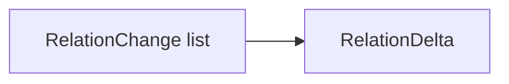
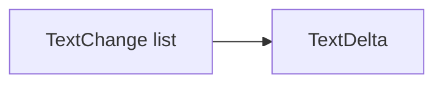
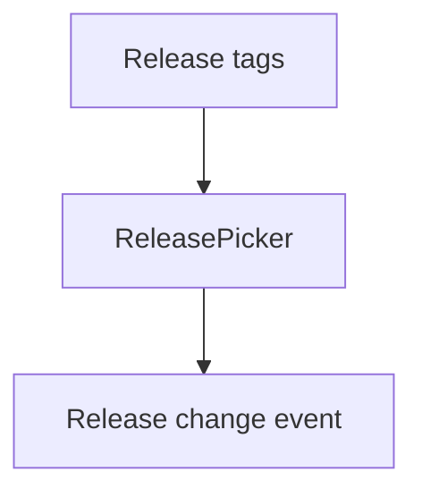
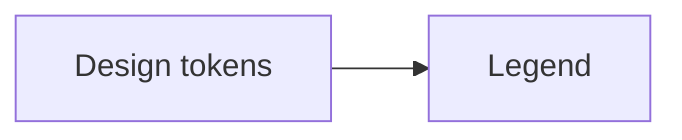
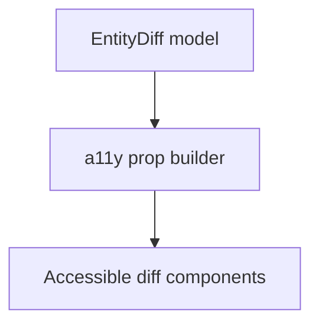

<div align="center">

# 🧩 **Kansas Frontier Matrix — Diff-First Entity Components Architecture**  
`web/src/entities/diff-first/components/README.md`

**Purpose:**  
Define the **Diamond⁹ Ω–grade UI component architecture** for the Diff-First Entity subsystem in KFM v10.3.2.  
These components present **release-to-release diffs** (properties, relations, text, governance, explainability) in a **FAIR+CARE-certified**, **accessible**, and **sustainability-aware** interface, tightly integrated with **Focus Mode v2.5**, **MapView**, **TimelineView**, and **Governance UIs**.

[]()  
[]()  
[]()  
[]()

</div>

---

## 📘 Overview

The **Diff-First Entity Components** are responsible for:

- Rendering **diff summaries** across releases (R_prev → R_curr)  
- Displaying **property, relation, and text changes** with clear severity encodings  
- Surfacing **governance & CARE deltas** (consent, license, sovereignty, restrictions)  
- Exposing **explainability deltas** from Focus Mode v2.5  
- Maintaining **WCAG 2.1 AA** visual and interaction standards  
- Emitting **telemetry events** for performance, energy, and ethical usage  
- Integrating with **ReleasePicker**, **Legend**, and other feature slices  

They consume **EntityDiff models** and **Diff-First Hooks/Services** and present them as **interpretable, ethical, and accessible UX**.

---

## 🗂️ Directory Layout

```text
web/src/entities/diff-first/components/
├── README.md
├── DiffHeader.tsx
├── PropertyDelta.tsx
├── RelationDelta.tsx
├── TextDelta.tsx
├── ReleasePicker.tsx
└── Legend.tsx
```

---

## 🧩 High-Level Component Architecture



---

## 🧱 DiffHeader.tsx — Summary Bar & Severity Overview

**Responsibilities**

- Display total counts (added, removed, changed)  
- Summarize overall severity (low/med/high)  
- Highlight governance-impacting changes (CARE, consent, license)  
- Provide quick-glance understanding of entity evolution  

**Props**

```ts
type DiffHeaderProps = {
  summary: DiffSummary;
  governance: GovernanceChange;
};
```



---

## 🔡 PropertyDelta.tsx — Scalar & Categorical Changes

Renders:

- numeric deltas (with units, pct changes)  
- categorical changes (enum swaps, label transitions)  
- severity badges (shape + color, never color-only)  

**Props**

```ts
type PropertyDeltaProps = {
  properties: PropertyChange[];
};
```



---

## 🔗 RelationDelta.tsx — Graph Relation Changes

Shows:

- added relations (new links)  
- removed relations (dropped links)  
- relation types  
- confidence scores  
- provenance references  

**Props**

```ts
type RelationDeltaProps = {
  relations: RelationChange[];
};
```



Governance rules (CARE, sovereignty) may mask or hide certain relation entries.

---

## 📝 TextDelta.tsx — Textual Change Visualization

Provides:

- unified or split text diffs  
- change highlighting (outlines, not color-only)  
- support for long text fields (scroll-safe, wrap-safe)  

**Props**

```ts
type TextDeltaProps = {
  textChanges: TextChange[];
};
```



---

## 🧭 ReleasePicker.tsx — Release Navigation UI

Allows users to:

- switch between releases  
- view diffs across arbitrary tag pairs  
- support keyboard-first navigation  

**Props**

```ts
type ReleasePickerProps = {
  tags: string[];
  selected: string;
  onChange(next: string): void;
};
```



---

## 🎨 Legend.tsx — Symbology & Semantic Tokens

Legend ensures users understand:

- severity encodings  
- CARE icons and governance markers  
- explainability indicators  
- predictive vs historical diff markers  

**Props**

```ts
type LegendProps = {
  tokens: DiffLegendTokens;
};
```



---

## ♿ Accessibility & Interaction

All components must:

- provide **ARIA labels** and roles  
- support keyboard navigation and focus states  
- describe severity and CARE flags with **text** and **shapes**, not just color  
- maintain **heading order** and semantic structure  



---

## 📡 Telemetry Integration

Components emit events, propagated via hooks/services, into:

```text
../../../../../releases/v10.3.2/focus-telemetry.json
```

Tracked events:

- `diff_header_view`  
- `property_delta_expand`  
- `relation_delta_expand`  
- `text_delta_expand`  
- `release_picker_change`  
- `legend_hover`  

Each event includes:

- entityId  
- releasePrev / releaseCurr  
- careImpact  
- latency  
- estimated energy (Wh)  

---

## 🔐 Governance & FAIR+CARE Responsibilities

At the component layer, governance requires:

- clear labeling of CARE-impacted changes  
- UI layout that foregrounds governance changes (summary badges)  
- no display of restricted details without gating  
- visual alerts for license/consent/sovereignty changes  

Governance logs:

```text
../../../../../docs/reports/audit/web-entity-diff-components-governance.json
```

---

## ⚙️ CI / Validation Requirements

| Layer | Check |
|-------|-------|
| A11y | `accessibility_scan.yml` (axe + Lighthouse) |
| Governance | `faircare-validate.yml` |
| Telemetry | `telemetry-export.yml` |
| Docs | `docs-lint.yml` |
| Types | TS strict mode |
| Security | CodeQL + Trivy |

---

## 🧾 Example Component Metadata Record

```json
{
  "id": "entity_diff_components_v10.3.2",
  "components": [
    "DiffHeader",
    "PropertyDelta",
    "RelationDelta",
    "TextDelta",
    "ReleasePicker",
    "Legend"
  ],
  "a11y_score": 99.2,
  "fairstatus": "certified",
  "care_flags_visible": true,
  "telemetry_synced": true,
  "checksum_verified": true,
  "timestamp": "2025-11-14T23:15:00Z"
}
```

---

## 🕰️ Version History

| Version | Date | Summary |
|--------|--------|---------|
| v10.3.2 | 2025-11-14 | Deep-architecture rewrite: integrated governance badges, explainability visuals, WCAG-compliant diff renderings, and telemetry-aware interactions. |

---

<div align="center">

**Kansas Frontier Matrix — Diff-First Entity Components Architecture**  
🧩 Change Transparency · 🔐 FAIR+CARE UI · 🔗 Provenance Surfacing · 🧠 Explainable UX  
© 2025 Kansas Frontier Matrix — MIT License  

[Back to Diff-First Module](../README.md)

</div>
