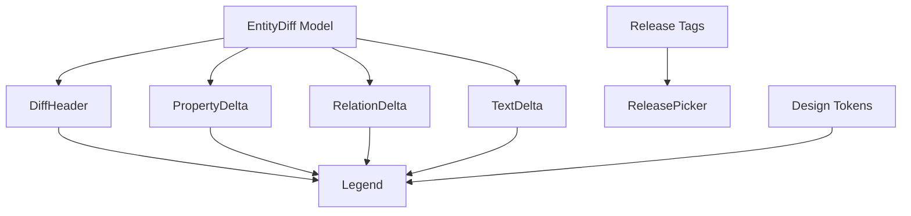
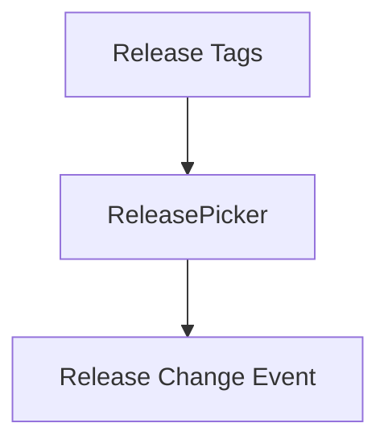
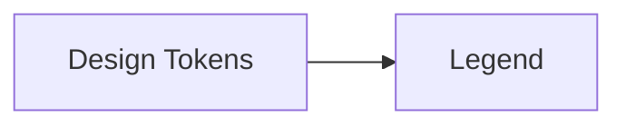
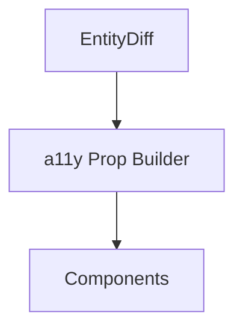

<div align="center">

# 🧩 **Kansas Frontier Matrix — Diff-First Entity Components Architecture**  
`web/src/entities/diff-first/components/README.md`

**Purpose:**  
Define the **Diamond⁹ Ω–grade UI component architecture** for the Diff-First Entity subsystem in KFM v10.3.2.  
These components present **release-to-release diffs** (properties, relations, text, governance, explainability) in a **FAIR+CARE-certified**, **accessible**, and **sustainability-aware** interface, tightly integrated with **Focus Mode v2.5**, **MapView**, **TimelineView**, and **Governance UIs**.

[]()  
[]()  
[]()  
[]()

</div>

---

## 📘 Overview

The **Diff-First Entity Components** are responsible for:

- Rendering **diff summaries** across releases (R_prev → R_curr)  
- Displaying **property, relation, and text changes** with clear severity encodings  
- Surfacing **governance & CARE deltas** (consent, license, sovereignty, restrictions)  
- Exposing **explainability deltas** from Focus Mode v2.5  
- Maintaining **WCAG 2.1 AA** visual and interaction standards  
- Emitting **telemetry events** for performance, energy, and ethical usage  
- Integrating with **ReleasePicker**, **Legend**, and other feature slices  

They consume **EntityDiff models** and **Diff-First Hooks/Services** and present them as **interpretable, ethical, and accessible UX**.

---

## 🗂️ Directory Layout

```text
web/src/entities/diff-first/components/
├── README.md
├── DiffHeader.tsx
├── PropertyDelta.tsx
├── RelationDelta.tsx
├── TextDelta.tsx
├── ReleasePicker.tsx
└── Legend.tsx
````

---

## 🧩 High-Level Component Architecture



---

## 🧱 DiffHeader.tsx — Summary Bar & Severity Overview

**Responsibilities**

* Display total counts (added, removed, changed)
* Summarize overall severity (low/med/high)
* Highlight governance-impacting changes (CARE, consent, license)
* Provide quick-glance understanding of entity evolution

**Key Props**

```ts
type DiffHeaderProps = {
  summary: DiffSummary;
  governance: GovernanceChange;
};
```


---

## 🔡 PropertyDelta.tsx — Scalar & Categorical Changes

Renders:

* numeric deltas (with units, pct changes)
* categorical changes (enum swaps, label transitions)
* severity-indicating badges (with shape + color, never color-only)

**Key Props**

```ts
type PropertyDeltaProps = {
  properties: PropertyChange[];
};
```

```mermaid
flowchart LR
    PC[PropertyChange[]] --> PUI[PropertyDelta]
```

---

## 🔗 RelationDelta.tsx — Graph Relation Changes

Shows:

* added relations (new links)
* removed relations (dropped links)
* relation types
* confidence scores
* provenance references

**Key Props**

```ts
type RelationDeltaProps = {
  relations: RelationChange[];
};
```

```mermaid
flowchart LR
    RC[RelationChange[]] --> RUI[RelationDelta]
```

Governance rules (CARE, sovereignty) may mask or hide certain relation entries.

---

## 📝 TextDelta.tsx — Textual Change Visualization

Provides:

* unified or split text diffs
* change highlighting (outline, not color-only)
* support for long text fields (scroll-safe, wrap-safe)

**Key Props**

```ts
type TextDeltaProps = {
  textChanges: TextChange[];
};
```

```mermaid
flowchart LR
    TC[TextChange[]] --> TUI[TextDelta]
```

---

## 🧭 ReleasePicker.tsx — Release Navigation UI

Allows users to:

* switch between releases
* view diffs across arbitrary tag pairs
* support keyboard-first navigation

**Key Props**

```ts
type ReleasePickerProps = {
  tags: string[];
  selected: string;
  onChange(next: string): void;
};
```



---

## 🎨 Legend.tsx — Symbology & Semantic Tokens

Legend ensures users understand:

* severity encodings
* CARE icons and governance markers
* explainability indicators
* predictive vs historical diff markers

**Key Props**

```ts
type LegendProps = {
  tokens: DiffLegendTokens;
};
```



---

## ♿ Accessibility & Interaction

All components must:

* provide **ARIA labels** and roles
* support keyboard navigation and focus states
* describe severity and CARE flags with **text** and **shapes**, not just color
* maintain **heading order** and semantic structure



---

## 📡 Telemetry Integration

Components emit events, propagated via hooks/services, into:

```
../../../../../releases/v10.3.2/focus-telemetry.json
```

Tracked events:

* `diff_header_view`
* `property_delta_expand`
* `relation_delta_expand`
* `text_delta_expand`
* `release_picker_change`
* `legend_hover`

Each event carries:

* entityId
* releasePrev / releaseCurr
* careImpact
* energy estimate
* latency measures

---

## 🔐 Governance & FAIR+CARE Responsibilities

At the component layer, governance requires:

* clear labeling of CARE-impacted changes
* layout that foregrounds governance changes (e.g., summary badges)
* no direct display of restricted details without gating
* visual alerts for license changes, consent changes, sovereignty tags

Governance logs:

```
../../../../../docs/reports/audit/web-entity-diff-components-governance.json
```

---

## ⚙️ CI / Validation Requirements

| Layer      | Check                                       |
| ---------- | ------------------------------------------- |
| A11y       | `accessibility_scan.yml` (axe + Lighthouse) |
| Governance | `faircare-validate.yml`                     |
| Telemetry  | `telemetry-export.yml`                      |
| Docs       | `docs-lint.yml`                             |
| Types      | TS strict mode                              |
| Security   | CodeQL + Trivy                              |

---

## 🧾 Example Component Metadata Record

```json
{
  "id": "entity_diff_components_v10.3.2",
  "components": [
    "DiffHeader",
    "PropertyDelta",
    "RelationDelta",
    "TextDelta",
    "ReleasePicker",
    "Legend"
  ],
  "a11y_score": 99.2,
  "fairstatus": "certified",
  "care_flags_visible": true,
  "telemetry_synced": true,
  "checksum_verified": true,
  "timestamp": "2025-11-14T23:15:00Z"
}
```

---

## 🕰️ Version History

| Version | Date       | Summary                                                                                                                                            |
| ------- | ---------- | -------------------------------------------------------------------------------------------------------------------------------------------------- |
| v10.3.2 | 2025-11-14 | Deep-architecture rewrite: integrated governance badges, explainability visuals, WCAG-compliant diff renderings, and telemetry-aware interactions. |

---

<div align="center">

**Kansas Frontier Matrix — Diff-First Entity Components Architecture**
🗂️ Change Transparency · 🔐 FAIR+CARE UI · 🔗 Provenance Surfacing · 🧠 Explainable UX
© 2025 Kansas Frontier Matrix — MIT License

[Back to Diff-First Module](../README.md)

</div>

