```mermaid
flowchart TD
    HOOK["useReleaseTags"] --> FETCH["GET /api/releases/tags"]
    FETCH --> LIST["Tag List"]
    LIST --> NAV["prev · next · jump"]
```

<div align="center">

# 🪝 **Kansas Frontier Matrix — Diff-First Entity Hooks Architecture**  
`web/src/entities/diff-first/hooks/README.md`

**Purpose:**  
Define the deeply standardized, FAIR+CARE-certified **React Hooks Architecture** powering the Diff-First Entity subsystem.  
These hooks coordinate **diff fetching**, **release navigation**, **CARE governance enforcement**, **explainability delta detection**, **temporal & spatial sync**, and **telemetry integration** under MCP-DL v6.3.

[]()  
[]()  
[]()  
[]()

</div>

---

## 📘 Overview

The **Diff-First Hooks Layer** provides:

- Release-aware entity diff orchestration  
- Raw → normalized → CARE-governed diff transformation  
- Explainability drift comparison for Focus Mode v2.5  
- Provenance & lineage continuity validation  
- Accessibility metadata for diff UI components  
- Energy & performance telemetry emission  
- Deterministic, reproducible behavior across releases  

These hooks are the **logical engine** behind Diff-First rendering.

---

## 🗂️ Directory Layout

```text
web/src/entities/diff-first/hooks/
├── README.md
├── useEntityDiff.ts
└── useReleaseTags.ts
````

---

## 🧩 High-Level Architecture

```mermaid
flowchart TD
    UI[Diff Components] --> DIFF[useEntityDiff]
    DIFF --> FETCH[diffClient]
    FETCH --> RAW[Raw Diff Response]
    RAW --> GUARD[Schema Guards]
    GUARD --> CARE[CARE Enforcement]
    CARE --> NORM[normalize]
    NORM --> DIFFSTATE[Diff State]
    DIFFSTATE --> TEL[Telemetry Emit]
    UI --> TAGS[useReleaseTags]
    TAGS --> NAV[Release Navigation<br/>prev · next · jump]
```



---

## 🧬 `useEntityDiff` — Canonical Diff Hook

### Responsibilities

* Fetch diff (R_prev → R_curr)
* Validate schemas (runtime + TypeScript)
* Enforce CARE + sovereignty + consent
* Normalize structural, governance, explainability diffs
* Expose React state for rendering
* Emit telemetry entries

### Flow


### Return Contract

```ts
type UseEntityDiff = {
  loading: boolean;
  error?: string;
  diff?: EntityDiff;
  refresh(): void;
};
```

---

## 🧠 Explainability Delta Processing


Deltas detect:

* relevance drift
* evidence addition/removal
* degraded reasoning chains

---

## 🧭 Temporal & Spatial Extraction


Used for:

* timeline centering
* predictive-band highlighting
* map preview & Story Node alignment

---

## 🧩 `useReleaseTags` — Release Navigation Hook

### Responsibilities

* Retrieve available tags
* Provide prev / next navigation
* Support direct tag jumps
* Validate release provenance

### Flow



### Return Contract

```ts
type UseReleaseTags = {
  tags: string[];
  loading: boolean;
  error?: string;
  nextTag(): string | null;
  prevTag(): string | null;
  jump(tag: string): void;
};
```

---

## ♿ Accessibility Rules

Hooks must expose metadata enabling:

* ARIA-safe descriptions
* keyboard-first navigation paths
* structured grouping of diff results
* severity vocabulary safe for screenreaders


---

## 📡 Telemetry & Sustainability Integration

Hooks must emit:

* `diff_fetch_ms`
* `diff_normalize_ms`
* `governance_deltas`
* `explainability_drift`
* `release_navigation`
* `energy_estimate_wh`

Telemetry stored in:

```
../../../../../releases/v10.3.2/focus-telemetry.json
```

---

## 🔐 Governance Integration (FAIR+CARE)

Hook outputs must ensure:

* correct CARE label propagation
* redaction of restricted content
* sovereignty warnings
* consent-change alerts
* provenance continuity

Governance logs written to:

```
../../../../../docs/reports/audit/web-entity-diff-hooks-governance.json
```

---

## ⚙️ CI / Validation Requirements

| Layer         | Validator                |
| ------------- | ------------------------ |
| Type safety   | TS strict mode           |
| Schema        | `schemaGuards.ts`        |
| Governance    | `faircare-validate.yml`  |
| Accessibility | `accessibility_scan.yml` |
| Telemetry     | `telemetry-export.yml`   |
| Documentation | `docs-lint.yml`          |
| Security      | CodeQL + Trivy           |

---

## 🧾 Example Hook Metadata Record

```json
{
  "id": "entity_diff_hooks_v10.3.2",
  "diff_requests": 12014,
  "governance_deltas_detected": 417,
  "explainability_drift_cases": 36,
  "release_navigation_events": 8972,
  "energy_use_wh": 0.38,
  "telemetry_synced": true,
  "checksum_verified": true,
  "timestamp": "2025-11-14T23:59:00Z"
}
```

---

## 🕰️ Version History

| Version | Date       | Summary                                                                                                                                 |
| ------- | ---------- | --------------------------------------------------------------------------------------------------------------------------------------- |
| v10.3.2 | 2025-11-14 | Deep-architecture hooks specification including governance, explainability deltas, temporal-spatial sync, and sustainability telemetry. |

---

<div align="center">

**Kansas Frontier Matrix — Diff-First Hooks Architecture**
🪝 Deterministic React Logic · 🔐 FAIR+CARE Compliance · 🧠 Explainability-Aware State · 🔗 Provenance Fidelity
© 2025 Kansas Frontier Matrix — MIT License

[Back to Diff-First](../README.md)

</div>
