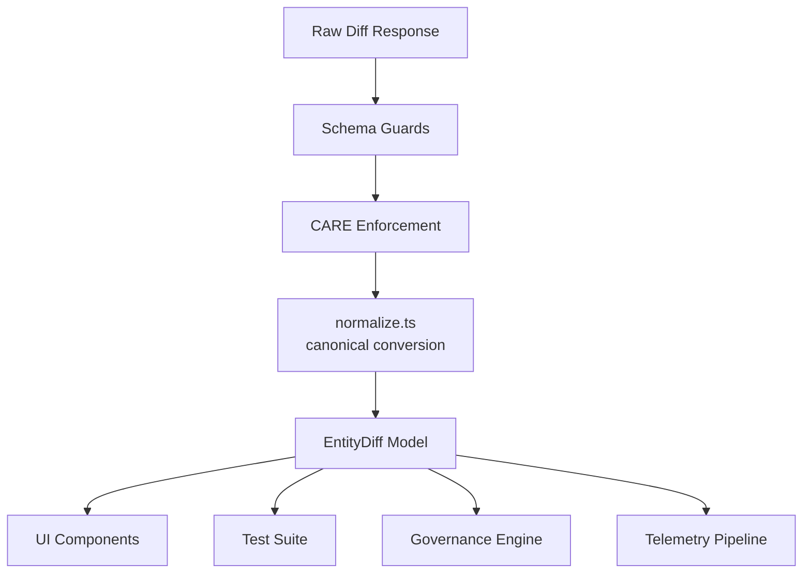
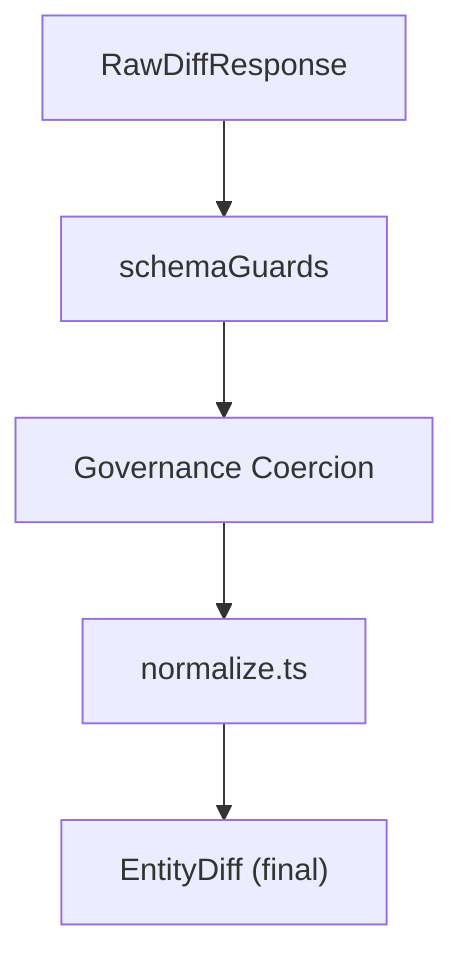
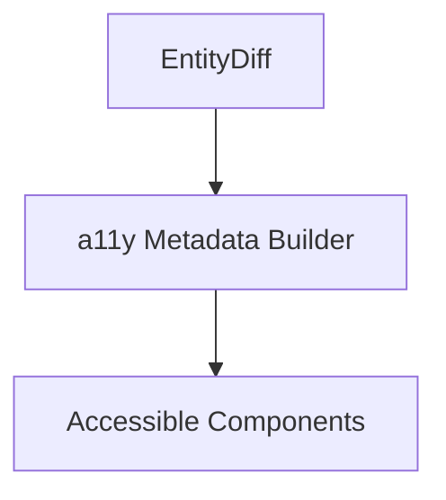

<div align="center">

# 🧬 **Kansas Frontier Matrix — Diff-First Entity Model Architecture**  
`web/src/entities/diff-first/model/README.md`

**Purpose:**  
Define the **canonical, deeply-governed diff model architecture** for release-to-release entity comparison in the Kansas Frontier Matrix (KFM).  
This subsystem produces deterministic, FAIR+CARE-certified diffs used by UI components, telemetry, governance ledgers, explainability engines, and sustainability workflows under **MCP-DL v6.3**.

[]()  
[]()  
[]()  
[]()

</div>

---

## 📘 Overview

The **Diff-First Entity Model Layer** is the semantic core of KFM’s entity-evolution workflow.  
It transforms raw diff responses into **normalized, CARE-aware, provenance-complete, accessibility-ready, telemetry-annotated** `EntityDiff` objects.

It guarantees:

- ✔ Stable & deterministic schema  
- ✔ Provenance continuity (STAC · DCAT · PROV-O · Story Nodes)  
- ✔ CARE-governed masking & sovereignty flags  
- ✔ Explainability deltas for Focus Mode v2.5  
- ✔ WCAG 2.1 AA accessibility metadata  
- ✔ Temporal + spatial change representation  
- ✔ Sustainability metrics for energy + latency  
- ✔ Strict MCP-DL v6.3 compliance  

This document is the **authoritative specification** for the diff model.

---

## 🗂️ Directory Layout

```text
web/src/entities/diff-first/model/
├── README.md
├── diffTypes.ts
└── normalize.ts
```

---

## 🧩 High-Level Architecture



---

## 🧬 Canonical Diff Model

### `EntityDiff`
```ts
export type EntityDiff = {
  entityId: string;
  releasePrev: string;
  releaseCurr: string;
  summary: DiffSummary;
  properties: PropertyChange[];
  relations: RelationChange[];
  text: TextChange[];
  governance: GovernanceChange;
  explainability?: ExplainabilityDelta[];
};
```

### `DiffSummary`
```ts
export type DiffSummary = {
  added: number;
  removed: number;
  changed: number;
  severity: "low" | "med" | "high";
};
```

---

## 🔡 Property-Level Diff Types

```ts
export type ScalarChange = {
  key: string;
  from: number | null;
  to: number | null;
  pct?: number | null;
  unit?: string;
  severity: "low" | "med" | "high";
};

export type CategoricalChange = {
  key: string;
  from: string | null;
  to: string | null;
  severity: "low" | "med" | "high";
};
```

---

## 📝 Text Diff Model

```ts
export type TextChange = {
  key: string;
  from?: string;
  to?: string;
  mode: "unified" | "split";
  changed: boolean;
  tokens?: number;
};
```

Text diffs must support:

- unified & split modes  
- screenreader-safe line segmentation  
- no color-only semantics  

---

## 🔗 Relation Diff Model

```ts
export type RelationChange = {
  kind: "added" | "removed";
  relType: string;
  targetId: string;
  label: string;
  confidence?: number;
  provenance?: string[];
};
```

Relation diffs must reflect:

- provenance lineage  
- restricted/sensitive targets  
- Story Node and Focus Mode linkages  

---

## 🔐 Governance Diff Model

```ts
export type GovernanceChange = {
  careLabelPrev?: string;
  careLabelCurr?: string;
  consentChanged?: boolean;
  sovereigntyDomainChanged?: boolean;
  licenseChanged?: boolean;
  lineageRefs?: string[];
};
```

Governance diffs must override structural diffs when classifying severity.

---

## 🧠 Explainability Delta Model

```ts
export type ExplainabilityDelta = {
  evidenceAdded?: string[];
  evidenceRemoved?: string[];
  relevancePrev?: number;
  relevanceCurr?: number;
  driftDetected?: boolean;
};
```

Tracks reasoning drift between releases.

---

## 🧪 Normalization Pipeline



Normalization ensures:

- strict type coercion  
- deterministic ordering  
- removal of extraneous fields  
- consistent handling of null/undefined  
- CARE protection at all branches  

---

## ♿ Accessibility Metadata

Entities must provide:

- ARIA-friendly description fields  
- consistent ordering for screenreader traversal  
- label-safe keys for diff categories  
- numeric units & descriptive diff text  



---

## 📡 Telemetry Integration

`normalize.ts` attaches telemetry annotations:

- `diff_compute_ms`  
- `governance_deltas`  
- `explainability_drift`  
- `a11y_diff_complexity`  
- `energy_estimate_wh`  

Telemetry appended to:

```
../../../../../releases/v10.3.2/focus-telemetry.json
```

---

## 🔐 FAIR+CARE Governance Integration

The model layer enforces:

- CARE label propagation  
- sovereignty boundary protection  
- consent flag change detection  
- lineage continuity validation  

Governance diffs recorded in:

```
../../../../../docs/reports/audit/web-entity-diff-model-governance.json
```

---

## ⚙️ CI / Validation Requirements

| Layer | Validator |
|-------|-----------|
| Type safety | TypeScript strict mode |
| Runtime schema | `schemaGuards.ts` |
| Governance | `faircare-validate.yml` |
| Accessibility | `accessibility_scan.yml` |
| Telemetry | `telemetry-export.yml` |
| Security | CodeQL + Trivy |
| Docs | `docs-lint.yml` |

---

## 🧾 Metadata Record (Example)

```json
{
  "id": "entity_diff_model_v10.3.2",
  "normalized_models_generated": 24112,
  "governance_deltas_detected": 1943,
  "explainability_drift_cases": 52,
  "checksum_verified": true,
  "telemetry_synced": true,
  "timestamp": "2025-11-14T22:50:00Z"
}
```

---

## 🕰️ Version History

| Version | Date | Summary |
|--------|--------|---------|
| v10.3.2 | 2025-11-14 | Deep-architecture rebuild: governance diff system, explainability deltas, provenance continuity, a11y metadata, and sustainability telemetry. |

---

<div align="center">

**Kansas Frontier Matrix — Diff-First Entity Model Architecture**  
🧬 Deterministic Semantics · 🔐 FAIR+CARE Governance · 🔗 Provenance Fidelity · 🧠 Explainable AI  
© 2025 Kansas Frontier Matrix — MIT License  

[Back to Diff-First](../README.md)

</div>
