<div align="center">

# 🛰️ **Kansas Frontier Matrix — Diff-First Entity Services Architecture**  
`web/src/entities/diff-first/services/README.md`

**Purpose:**  
Define the **deep-architecture, FAIR+CARE-certified service layer** for the Diff-First Entity subsystem.  
These services retrieve release-to-release diff payloads, guarantee schema and governance correctness, enforce CARE protections, and feed normalized, telemetry-validated models into the **Diff-First Components**, **Tests**, **Styles**, **Drawer**, **Focus Mode v2.5**, and **Governance UI**.

[]()  
[]()  
[]()  
[]()

</div>

---

# 📘 Overview

The **Diff-First Services Layer** is responsible for:

- Retrieving **canonical entity diffs** between releases (`R_prev`, `R_curr`)  
- Normalizing raw API responses into **FAIR+CARE-certified diff models**  
- Providing **stable, versioned contracts** for UI and test layers  
- Enforcing **CARE masking** on diff nodes and relations  
- Marshaling provenance (STAC · DCAT · PROV-O · Neo4j lineage)  
- Emitting **telemetry** for diff compute time, ethics flags, and A11y coverage  
- Guaranteeing **MCP-DL v6.3 reproducibility**  
- Caching results ethically (no sensitive payload persistence)  

It forms the backend-facing backbone of the **Diff-First Entity Architecture**.

---

# 🗂️ Directory Layout (Authoritative v10.3.2)

```text
web/src/entities/diff-first/services/
├── README.md
└── diffClient.ts
````

`diffClient.ts` is the **sole entrypoint** for all Diff-First data retrieval.

---

# 🧩 High-Level Service Architecture

```mermaid
flowchart TD
    REQ[UI Request<br/>entityId · R_prev · R_curr] --> CLIENT[diffClient]
    CLIENT --> NET[Network Layer<br/>REST · GraphQL]
    NET --> RAW[RawDiffResponse]
    RAW --> GUARD[Schema Guards<br/>type safety · FAIRCARE fields]
    GUARD --> CARE[CARE Enforcement<br/>masking · sovereignty]
    CARE --> NORM[Normalizer<br/>canonical diff model]
    NORM --> CACHE[Ephemeral Cache<br/>ethical memory cache]
    NORM --> OUT[Diff Model<br/>structural · governance · explainability]
    OUT --> TEL[Telemetry Hooks]
```



---

# 🧬 Canonical Data Contract

The service **must** return the normalized structure used across UI + tests.

### EntityDiff (Normalized)

```ts
type EntityDiff = {
  entityId: string;
  releasePrev: string;
  releaseCurr: string;
  summary: {
    added: number;
    removed: number;
    changed: number;
    severity: "low" | "med" | "high";
  };
  properties: PropertyChange[];
  relations: RelationChange[];
  text: TextChange[];
  governance: GovernanceChange;
  explainability?: ExplainabilityDelta[];
};
```

The service enforces:

* **strict typing**
* **governance validation**
* **schema guards applied before returning**

---

# 🛰️ diffClient.ts — Deep Architecture Specification

`diffClient.ts` must:

### 1️⃣ Perform Release-Aware Fetching

* Pull `R_prev` and `R_curr`
* Support release navigation from ReleasePicker
* Resolve release aliases (latest, pinned, tag refs)

### 2️⃣ Use Stable API Endpoints

```http
GET /api/entities/{entityId}/diff?from={R_prev}&to={R_curr}
```

### 3️⃣ Apply Triple-Layer Validation

* **Network-level**: HTTP errors, timeouts, stale cache
* **Schema-level**: JSON shape, field types, governance fields
* **Domain-level**: relation types, severity rules, redaction logic

### 4️⃣ Enforce FAIR+CARE Masking

* Remove or mask restricted relation targets
* Redact sensitive text content
* Obfuscate sovereign entity identifiers
* Apply CARE token adjustments (restricted → block)

### CARE Masking Pipeline

```mermaid
flowchart TD
    META[Raw Diff Metadata] --> CAREPROC[CARE Processor]
    CAREPROC --> MASK[Mask · Redact · Obfuscate]
    MASK --> SAFE[CARE-Safe Diff Model]
```



### 5️⃣ Build Provenance-Rich Responses

Must retain:

* provenance lineage
* dataset references
* checksum metadata
* source-release indicators
* Story Node links (if present)

### 6️⃣ Attach Telemetry Fields

Examples:

* `diff_fetch_ms`
* `diff_parse_ms`
* `governance_deltas`
* `explainability_drift_detected`
* `energy_estimate_wh`
* `a11y_path_validated`

Telemetry appended to:

```
../../../../../releases/v10.3.2/focus-telemetry.json
```

---

# 🔐 FAIR+CARE Governance Enforcement

The diff service must implement:

* CARE tag propagation
* restricted-content suppression
* sovereignty protection
* consent-flag tracking
* license-change detection
* lineage continuity alerts


Governance output is always merged into the final diff model.

Ledger entries written to:

```
../../../../../docs/reports/audit/web-entity-diff-services-governance.json
```

---

# ♿ Accessibility Integration (WCAG 2.1 AA)

The service is responsible for returning:

* meaningful text diffs for screenreaders
* accessible descriptions for numeric or categorical changes
* structure tokens to ensure consistent reading order
* no color-dependent metadata


---

# 🌱 Sustainability Considerations

Services must:

* minimize payload sizes
* avoid unnecessary recomputation
* cache ethically (no sensitive retention)
* reduce parsing overhead
* include energy estimation metadata

These metrics feed sustainability dashboards.

---

# ⚙️ CI / Validation Requirements

| Validation Layer       | Workflow                 |
| ---------------------- | ------------------------ |
| Schema integrity       | `schema-validate.yml`    |
| CARE enforcement       | `faircare-validate.yml`  |
| Provenance continuity  | lineage validator        |
| A11y metadata presence | `accessibility_scan.yml` |
| Telemetry correctness  | `telemetry-export.yml`   |
| Security               | CodeQL + Trivy           |
| Documentation          | `docs-lint.yml`          |

CI requires **100% clean** governance and schema validation before merge.

---

# 🧾 Example Service Metadata Record

```json
{
  "id": "entity_diff_services_v10.3.2",
  "requests_handled": 51024,
  "cache_hit_rate": 0.42,
  "governance_deltas_detected": 1884,
  "care_warnings_triggered": 92,
  "explainability_drift_events": 31,
  "avg_fetch_ms": 78.4,
  "energy_use_wh": 0.51,
  "telemetry_synced": true,
  "checksum_verified": true,
  "timestamp": "2025-11-14T23:58:00Z"
}
```

---

# 🕰️ Version History

| Version | Date       | Summary                                                                                                                                                           |
| ------- | ---------- | ----------------------------------------------------------------------------------------------------------------------------------------------------------------- |
| v10.3.2 | 2025-11-14 | Deep architecture version added — CARE masking pipeline, provenance continuity, explainability delta support, sustainability metrics, and MCP-DL v6.3 validation. |

---

<div align="center">

**Kansas Frontier Matrix — Diff-First Services Architecture**
🛰️ X-Release Diff Intelligence · 🔐 FAIR+CARE Compliance · 🔗 Provenance Fidelity · 🌱 Sustainable Fetching
© 2025 Kansas Frontier Matrix — MIT License

[Back to Diff-First Module](../README.md)

</div>
