<div align="center">

# 🎨 **Kansas Frontier Matrix — Diff-First Entity Styles Architecture**  
`web/src/entities/diff-first/styles/README.md`

**Purpose:**  
Define the **Diamond⁹ Ω–grade styling system** for the Diff-First Entity module — including **accessible design tokens**, **WCAG 2.1 AA-compliant color ramps**, **CARE-aware visual encodings**, and **sustainability-optimized animations**.  
All styles follow **MCP-DL v6.3**, KFM’s **token-driven UI architecture**, and the **FAIR+CARE visualization doctrine**.

[]()  
[]()  
[]()  
[]()

</div>

---

# 📘 Overview

The Diff-First styles layer provides:

- WCAG-validated color tokens for **added**, **removed**, **changed**, and **governance-critical** diffs  
- CARE-aware masking tokens for sensitive/redacted content  
- Accessible iconography + shape encoding (no color-only indicators)  
- High-contrast visual modes  
- Reduced motion variants  
- Sustainable GPU-efficient animations  
- Reusable CSS variables for all diff components  
- Design token integration across Focus Mode, Timeline, Drawer, Governance UI  

This ensures **ethical, inclusive, and interpretable change visualization** across KFM.

---

# 🗂️ Directory Layout

```text
web/src/entities/diff-first/styles/
├── README.md
└── tokens.css
````

`tokens.css` is the canonical style authority for all diff components.

---

# 🎨 Design Token Architecture

```mermaid
flowchart TD
    TOK["tokens.css<br/>design variables"] --> DIFF["Diff Components<br/>header · props · relations · text"]
    TOK --> GOV["Governance UI<br/>consent · CARE · license"]
    TOK --> A11Y["Accessibility Layer<br/>contrast · reduced motion"]
    TOK --> TEL["Telemetry Style Hooks"]
```



Tokens are globally namespaced to avoid collisions.

---

# 🧬 Core Token Groups (Deep Specification)

## 1️⃣ Diff Severity Tokens

Used by `DiffHeader`, `PropertyDelta`, `RelationDelta`, and `TextDelta`.

### Add / Remove / Change

* `--kfm-diff-add-bg`
* `--kfm-diff-add-border`
* `--kfm-diff-remove-bg`
* `--kfm-diff-remove-border`
* `--kfm-diff-change-bg`
* `--kfm-diff-change-border`

### Icon Tokens

Represented with **shape cues**, not just color:

* `--kfm-diff-add-icon: "+"`
* `--kfm-diff-remove-icon: "−"`
* `--kfm-diff-change-icon: "•"`

WCAG Color Contrast: **≥ 4.5:1**

---

## 2️⃣ CARE + Governance Tokens

Used to visually flag ethical or lineage-sensitive changes.

* `--kfm-care-public-color`
* `--kfm-care-sensitive-color`
* `--kfm-care-restricted-color`
* `--kfm-care-restricted-pattern`
* `--kfm-governance-consent-change-color`
* `--kfm-governance-license-change-color`
* `--kfm-governance-sovereignty-outline`

Governance patterns use **texture encoding** for accessibility.

---

## 3️⃣ Explainability Tokens (Focus Mode v2.5)

* `--kfm-xai-added-evidence`
* `--kfm-xai-removed-evidence`
* `--kfm-xai-relevance-up`
* `--kfm-xai-relevance-down`

These support:

* Explainability deltas
* Relevance drift warnings
* Evidence chain expansion

---

## 4️⃣ Text Diff Tokens

For unified/split views:

* `--kfm-text-insert-bg`
* `--kfm-text-delete-bg`
* `--kfm-text-change-outline`
* `--kfm-text-token-highlight`

All generate **outlines**, not color fills, to support color-blind readability.

---

## 5️⃣ Reduced Motion Tokens

Required for sustainability + a11y:

* `--kfm-motion-scale: 1`
* `--kfm-motion-disabled: 0`
* `--kfm-motion-transition: 140ms ease`
* `--kfm-motion-transition-reduced: 0ms`

Applied automatically when:

* OS prefers-reduced-motion
* KFM A11y setting enabled

---

## 6️⃣ High-Contrast Mode Tokens

Overrides critical colors for:

* extreme contrast
* grayscale environments
* sunlight-readability mode
* CARE-warning enhancements

Tokens:

* `--kfm-contrast-bg`
* `--kfm-contrast-text`
* `--kfm-contrast-border`
* `--kfm-contrast-pattern`

---

# 📦 Example: `tokens.css` Extract (Rule-Safe)

```css
:root {
  /* Diff Severity Tokens */
  --kfm-diff-add-bg: #e6f7ea;
  --kfm-diff-add-border: #2e8b57;
  --kfm-diff-remove-bg: #fde8e8;
  --kfm-diff-remove-border: #b22222;
  --kfm-diff-change-bg: #fff7e0;
  --kfm-diff-change-border: #d18f00;

  /* CARE & Governance Tokens */
  --kfm-care-public-color: #4a90e2;
  --kfm-care-sensitive-color: #d47f00;
  --kfm-care-restricted-color: #b22222;
  --kfm-governance-consent-change-color: #8b008b;
  --kfm-governance-license-change-color: #006400;

  /* Explainability Tokens */
  --kfm-xai-added-evidence: #0b7b3e;
  --kfm-xai-removed-evidence: #a83232;
  --kfm-xai-relevance-up: #1a8f1a;
  --kfm-xai-relevance-down: #d17a00;

  /* Text Diff Tokens */
  --kfm-text-insert-bg: #e0ffe8;
  --kfm-text-delete-bg: #ffe6e6;
  --kfm-text-change-outline: 2px solid #444;

  /* Motion & Contrast Tokens */
  --kfm-motion-scale: 1;
  --kfm-motion-disabled: 0;
  --kfm-motion-transition: 140ms ease;
  --kfm-motion-transition-reduced: 0ms;

  --kfm-contrast-bg: #000;
  --kfm-contrast-text: #fff;
  --kfm-contrast-border: #fff;
}
```

---

# ♿ Accessibility Architecture (WCAG 2.1 AA)

### Requirements

* Every diff badge must include **shape + text**, never color-only
* Tokens ensure:

  * ≥ 4.5:1 contrast
  * visible outlines
  * motion-reduced paths
  * screenreader-friendly semantic equivalents


---

# 🌱 Sustainability & Telemetry Integration

All style-driven transitions emit telemetry into:

```
../../../../../releases/v10.3.2/focus-telemetry.json
```

Telemetry fields:

* `style_render_cost_ms`
* `contrast_mode_enabled`
* `reduced_motion_applied`
* `pattern_encoding_used`
* `energy_estimate_wh`

Telemetry is validated by:

```
telemetry-export.yml
```

---

# 🔐 Governance Integration (CARE-Aware Styling)

CARE flags must visually override severity tokens:

* `restricted` content → pattern + border priority
* `sensitive` content → warm-tone + outline emphasis
* sovereignty impacts (tribal) → purple-tone outline token

Content masking surfaces as **non-semantic neutral placeholders**, per CARE guidelines.


Governance logs recorded at:

```
../../../../../docs/reports/audit/web-entity-diff-style-governance.json
```

---

# ⚙️ CI / Validation Requirements

| Area                      | Validator                |
| ------------------------- | ------------------------ |
| A11y compliance           | `accessibility_scan.yml` |
| Token contrast rules      | WCAG validator           |
| Governance overlay rules  | `faircare-validate.yml`  |
| Telemetry schema          | `telemetry-export.yml`   |
| Documentation correctness | `docs-lint.yml`          |

---

# 🧾 Example Style Metadata Record

```json
{
  "id": "entity_diff_styles_v10.3.2",
  "contrast_valid": true,
  "patterns_a11y_safe": true,
  "care_overrides_applied": true,
  "energy_use_wh": 0.14,
  "telemetry_synced": true,
  "checksum_verified": true,
  "timestamp": "2025-11-14T23:55:00Z"
}
```

---

# 🕰️ Version History

| Version | Date       | Summary                                                                                                                                 |
| ------- | ---------- | --------------------------------------------------------------------------------------------------------------------------------------- |
| v10.3.2 | 2025-11-14 | Full deep-architecture rewrite with design tokens, governance overrides, explainability styles, and sustainability telemetry alignment. |

---

<div align="center">

**Kansas Frontier Matrix — Diff-First Style Architecture**
🎨 Accessible Visualization · 🔐 CARE-Aware Design · 🌱 Sustainable UI
© 2025 Kansas Frontier Matrix — MIT License

[Back to Diff-First Entity Module](../README.md)

</div>
```

