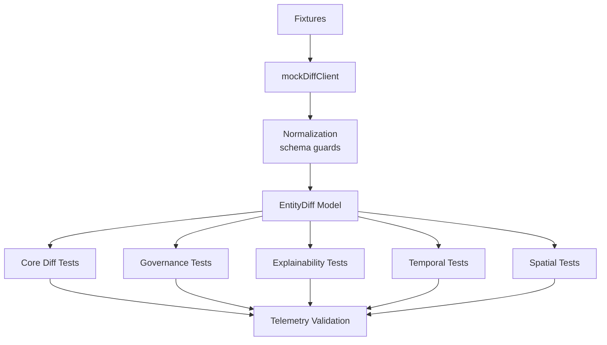
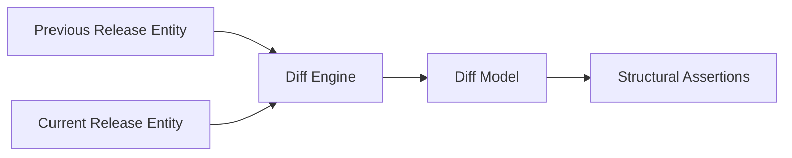
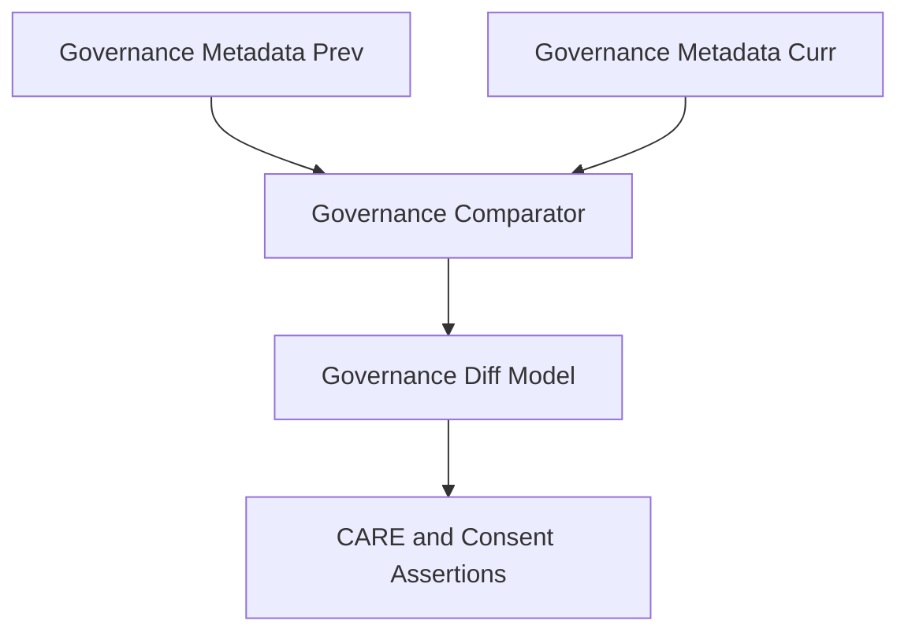
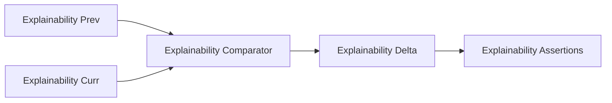
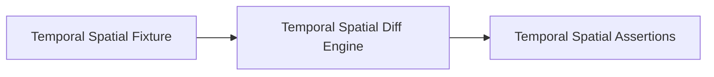
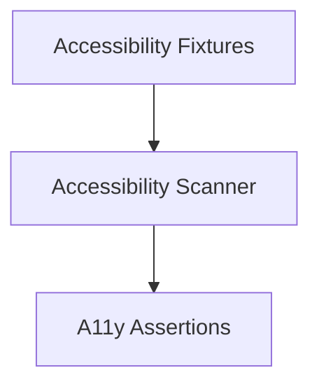
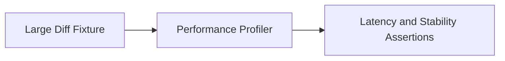
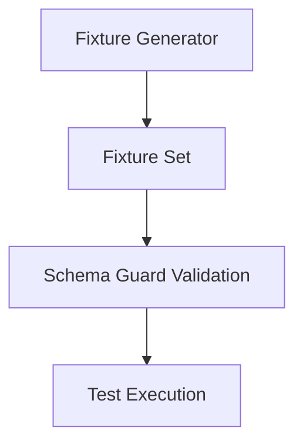

<div align="center">

# 🧪 **Kansas Frontier Matrix — Diff-First Entity Tests Architecture**  
`web/src/entities/diff-first/tests/README.md`

**Purpose:**  
Specify the **Diamond⁹ Ω–grade QA and validation architecture** for the Diff-First Entity subsystem.  
This suite guarantees correct **release-to-release diffs**, **governance and CARE behavior**, **explainability deltas**, **temporal and spatial accuracy**, **accessibility safety**, and **MCP-DL v6.3 reproducibility**.

[]()
[]()
[]()
[]()

</div>

---

## 📘 Overview

The **Diff-First Entity Tests** validate:

- Structural diffs: added, removed, changed relations and properties  
- Governance diffs: CARE labels, consent flags, sovereignty tags, licensing  
- Explainability diffs: evidence sets and relevance shifts for Focus Mode v2.5  
- Temporal and spatial diffs: event dates, predictive bands, geometry changes  
- Accessibility paths: no color-only encodings, keyboard access, ARIA correctness  
- Sustainability and telemetry correctness: runtime, energy estimates, carbon models  

The goal is to ensure that **entity evolution across releases** is always represented **truthfully, ethically, and accessibly**.

---

## 🗂️ Directory Layout

```text
web/src/entities/diff-first/tests/
├── README.md
├── diff-first.spec.ts
├── fixtures/
│   ├── diff_small.json
│   ├── diff_large.json
│   ├── diff_governance.json
│   ├── diff_explainability.json
│   ├── diff_temporal_spatial.json
│   └── metadata.json
└── utils/
    ├── mockDiffClient.ts
    └── mockReleaseTags.ts
````

---

## 🧩 High-Level Test Architecture



---

## 🧬 Test Domains

### 1️⃣ Structural Diff Tests

Validate correctness of:

* scalar, categorical, and text changes
* relation additions and removals
* summary counts and overall severity



Tests cover:

* empty diff scenarios
* single-field change
* multi-field, multi-type changes
* resilience to unknown fields (must be ignored or flagged)

---

### 2️⃣ Governance / CARE Tests

Ensure that governance diffs are correctly represented:

* CARE label changes (public → sensitive → restricted)
* consent flag changes
* sovereignty domain updates
* license transitions



All governance conditions must be tested for:

* safe defaults
* no downgrade in protection
* explicit redaction when required

---

### 3️⃣ Explainability Delta Tests

Focus Mode v2.5 explainability outputs are compared across releases.

Tests assert:

* changes in evidence sets
* relevance score shifts
* explainability reliability flags (improved or regressed)



---

### 4️⃣ Temporal and Spatial Diff Tests

Tests ensure:

* event date shift detection
* correct predictive band representation
* geometry changes summarized correctly
* temporal intervals properly classified



---

### 5️⃣ Accessibility Tests (WCAG 2.1 AA)

Checks include:

* no color-only indicators for diff severity
* keyboard access and focus order
* ARIA labeling for all diff sections
* screenreader-friendly text segmentations



CI uses axe-core and Lighthouse thresholds.

---

### 6️⃣ Performance and Stability Tests

Stress tests ensure:

* large diffs (thousands of changes) do not cause UI instability
* render time remains within budget
* no infinite loops or re-render storms



---

## 📦 Fixtures Architecture

Fixtures are:

* synthetic and deterministic
* schema-validated against diffTypes
* CARE-labeled
* provenance-tagged



`metadata.json` describes:

* fixture IDs
* coverage (governance, explainability, temporal, spatial)
* CARE compliance
* checksum verification

---

## 📡 Telemetry Integration

All tests contribute telemetry to:

```text
../../../../../releases/v10.3.2/focus-telemetry.json
```

Telemetry fields include:

* `test_suite`: "entity_diff_first"
* `test_runtime_ms`
* `governance_failures_count`
* `explainability_delta_issues`
* `temporal_diff_issues`
* `spatial_diff_issues`
* `a11y_violations`
* `energy_estimate_wh`

Telemetry schema validated by `telemetry-export.yml`.

---

## 🔐 Governance Ledger Integration

Test results influence:

* governance risk classification
* CARE rule tuning
* provenance continuity checks

Ledger entries logged to:

```text
../../../../../docs/reports/audit/web-entity-diff-tests-ledger.json
```

Any governance failure must be visible in the dashboard and block release until resolved.

---

## ⚙️ CI / Validation Requirements

| Area               | Validator / Workflow                             |
| ------------------ | ------------------------------------------------ |
| Schema correctness | TypeScript strict + runtime schema guards        |
| Governance         | `faircare-validate.yml`                          |
| A11y               | `accessibility_scan.yml` (axe-core + Lighthouse) |
| Telemetry          | `telemetry-export.yml`                           |
| Docs               | `docs-lint.yml`                                  |
| Security           | CodeQL + Trivy                                   |

All must pass for changes in this directory.

---

## 🧾 Example Test Suite Metadata Record

```json
{
  "id": "entity_diff_first_tests_v10.3.2",
  "tests_run": 172,
  "tests_failed": 0,
  "governance_changes_detected": 44,
  "care_label_shift_cases": 6,
  "explainability_drift_cases": 3,
  "temporal_diff_cases": 27,
  "spatial_diff_cases": 19,
  "a11y_violations": 0,
  "energy_use_wh": 1.34,
  "telemetry_synced": true,
  "timestamp": "2025-11-14T23:30:00Z"
}
```

---

## 🕰️ Version History

| Version | Date       | Summary                                                                                                                                         |
| ------- | ---------- | ----------------------------------------------------------------------------------------------------------------------------------------------- |
| v10.3.2 | 2025-11-14 | Deep-architecture test suite defined; added governance, explainability, temporal, spatial, accessibility, and sustainability validation layers. |

---

<div align="center">

**Kansas Frontier Matrix — Diff-First Entity Tests Architecture**
🧪 Deterministic QA · 🔐 Governance Integrity · 🧠 Explainability Verification · 🌱 Sustainable Testing
© 2025 Kansas Frontier Matrix — MIT License

[Back to Diff-First Entities](../README.md)

</div>
````
