<div align="center">

# 📅 **Kansas Frontier Matrix — Events Entities Architecture**  
`web/src/entities/events/README.md`

**Purpose:**  
Define the **deep, FAIR+CARE-certified semantic View-Model architecture** for **Events** in the Kansas Frontier Matrix (KFM) v10.3.2 web platform.  
Events represent **time-bounded happenings** (historical, cultural, environmental, administrative), linking people, places, datasets, Story Nodes, and predictive timelines into a unified, governed semantic structure.

[]()  
[]()  
[]()  
[]()

</div>

---

## 📘 Overview

The **Events Entities Layer** harmonizes all event-based knowledge across Kansas Frontier Matrix:

- Historical events (treaties, settlements, conflicts, migrations)  
- Cultural and tribal events (ceremonies, displacements, boundary changes)  
- Environmental events (floods, droughts, wildfires, storms)  
- Administrative & institutional events (county formation, land patents, resource extraction)  
- Predictive scenario events (future drought windows, hazard projections 2030–2100)  

Events serve as **temporal anchors** for Focus Mode v2.5, TimelineView, MapView overlays, Story Nodes, and diff-first change logs.

---

## 🗂️ Directory Layout

```text
web/src/entities/events/
├── README.md
├── eventViewModel.ts
├── eventMapper.ts
└── metadata.json
````

* `eventViewModel.ts` — typed View-Model contract
* `eventMapper.ts` — graph/data → EventVM normalization
* `metadata.json` — CARE + provenance validations + telemetry metadata

---

## 🧩 High-Level Events Flow


---

## 🧬 Event View-Model Specification

### `EventVM` (conceptual)

```ts
export type EventVM = {
  id: string;
  type: "event";
  label: string;                       // event name/title
  description?: string;                // accessible narrative summary
  temporal: {
    start?: string;                    // ISO datetime
    end?: string;                      // ISO datetime
    durationDays?: number;             // computed if applicable
    periodLabel?: string;              // e.g. "Bleeding Kansas", "Dust Bowl"
    predictive?: boolean;              // future scenario indicator
  };
  spatial?: {
    centroid?: number[];               // [lon, lat]
    bbox?: number[];
    geometryMasked?: boolean;          // CARE protection
  };
  participants?: string[];             // Person IDs
  placesInvolved?: string[];           // Place IDs
  datasets?: string[];                 // dataset IDs (STAC/DCAT)
  storyNodes?: string[];               // Story Node IDs
  provenance: {
    sourceIds: string[];
    stacRefs?: string[];
    lineage?: string[];
    ledgerRefs?: string[];
    checksumVerified?: boolean;
  };
  care: {
    label: "public" | "sensitive" | "restricted";
    sovereignty?: string;
  };
  explainability?: {
    relevanceScore?: number;
    evidenceSources?: string[];
  };
};
```

---

## ⏳ Temporal Semantics

Event temporal information must support:

* Rigid time spans (start/end)
* Fuzzy dates (decade, season, estimated ranges)
* Multi-era alignment for historical/archival events
* Predictive future periods (2030–2050, 2050–2100)
* Timeline “density bins” for large-scale visualizations

### Temporal Mapping Pipeline

```mermaid
flowchart TD
    TRaw[Raw Temporal Fields] --> TNorm[Temporal Normalizer]
    TNorm --> TInfer[Inference Layer<br/>duration · fuzzy ranges]
    TInfer --> TEVM[Event Temporal Block]
```



---

## 🗺️ Spatial Semantics

Spatial data must include:

* centroid for geographic anchoring
* bbox for map auto-zoom
* optional geometry linking (place polygons, hydrologic basins)
* masking rules for CARE-sensitive locations
* sovereignty overlays for tribal territories


---

## 🔗 Relationship Semantics

Events unify multiple entity classes:

| Relationship    | Direction        | Notes                           |
| --------------- | ---------------- | ------------------------------- |
| Participants    | event → people   | may include relevance weighting |
| Places Involved | event → places   | supports governance masking     |
| Linked Datasets | event ↔ datasets | provenance + evidence           |
| Story Nodes     | event ↔ story    | narrative context               |
| Event Clusters  | event ↔ event    | historical phases               |

---

## 🧱 Event Mapper — `eventMapper.ts`

Responsibilities:

* Coerce raw graph nodes into strict EventVM
* Normalize temporal formats
* Extract and govern spatial metadata
* Apply CARE and sovereignty rules
* Connect event to Story Node lineage
* Validate provenance integrity
* Produce accessible summaries

### Mapping Architecture


---

## 🔐 FAIR+CARE Governance

Governance concerns for events include:

* politically sensitive periods
* tribal or Indigenous sovereignty
* private or restricted archival material
* sensitive environmental hazard data
* events related to trauma or violence

Governance output stored in:

```text
../../../docs/reports/audit/web-entities-events-governance.json
```

---

## 🧠 Explainability Integration (Focus Mode v2.5)

EventVM supports:

* relevance scoring
* evidence linking to datasets or story chains
* reasoning context for historical sequences
* alignment of subgraph traversal results

---

## ♿ Accessibility & Narrative Integrity

EventVM must include:

* screenreader-ready labels
* alt-text-safe summaries
* clearly structured date descriptions
* unambiguous relationship descriptions


---

## 📡 Telemetry Integration

Event usage emits:

* `event_selected`
* `event_focus_used`
* `event_mask_applied`
* `timeline_jump_triggered`
* energy + latency estimates

Telemetry target:

```text
../../../releases/v10.3.2/focus-telemetry.json
```

---

## ⚙️ CI / Validation Requirements

| Layer         | Validator                |
| ------------- | ------------------------ |
| Type safety   | TS strict mode           |
| Schema        | `schemaGuards.ts`        |
| Governance    | `faircare-validate.yml`  |
| Telemetry     | `telemetry-export.yml`   |
| Accessibility | `accessibility_scan.yml` |
| Security      | CodeQL + Trivy           |
| Documentation | `docs-lint.yml`          |

---

## 🧾 Example Events Metadata Record

```json
{
  "id": "events_entities_v10.3.2",
  "entities_indexed": 18840,
  "care_public": 17011,
  "care_sensitive": 1560,
  "care_restricted": 269,
  "provenance_complete": true,
  "timeline_visible": true,
  "telemetry_linked": true,
  "timestamp": "2025-11-14T23:59:00Z"
}
```

---

## 🕰️ Version History

| Version | Date       | Summary                                                                                                                                                             |
| ------- | ---------- | ------------------------------------------------------------------------------------------------------------------------------------------------------------------- |
| v10.3.2 | 2025-11-14 | Deep-architecture build: canonical EventVM, sovereignty masking, predictive-period handling, explainability linking, provenance expansions, a11y + telemetry hooks. |

---

<div align="center">

**Kansas Frontier Matrix — Events Entities Architecture**
📅 Temporal Semantics · 🌐 FAIR+CARE Governance · 🔗 Provenance Integrity · 🧠 Explainable Event Modeling
© 2025 Kansas Frontier Matrix — MIT License

[Back to Entities Index](../README.md)

</div>
