<div align="center">

# 👤 **Kansas Frontier Matrix — People Entities Architecture**  
`web/src/entities/people/README.md`

**Purpose:**  
Define the **deep-architecture, FAIR+CARE-certified view-model layer** for **People** entities in the KFM v10.3.2 web platform.  
This module translates Neo4j graph nodes, STAC/DCAT metadata, Story Nodes, and Focus Mode v2.5 outputs into **canonical People view models** that are governance-safe, explainable, accessible, and telemetry-aware.

[]()  
[]()  
[]()  
[]()

</div>

---

## 📘 Overview

The **People Entities Layer** models individuals (historic, contemporary, and synthetic personas) in KFM:

- Biographical & role metadata  
- Relationships to places, events, datasets, Story Nodes  
- Sovereignty and CARE-sensitive status (where appropriate)  
- Temporal presence (lifespans, active periods)  
- Provenance & lineage paths (archives, censuses, treaties, oral histories)  
- Explainability & Focus Mode v2.5 relevance  
- Accessibility-ready descriptions  
- Telemetry annotations for entity-centric interactions  

This layer ensures People entities are **semantically consistent, ethically represented, and technically reproducible** across the UI.

---

## 🗂️ Directory Layout

```text
web/src/entities/people/
├── README.md
├── personViewModel.ts
├── personMapper.ts
└── metadata.json
````

* `personMapper.ts` — converts raw graph/API responses to normalized view models
* `personViewModel.ts` — exports typed People view-model contracts
* `metadata.json` — governance + telemetry metadata for People entities

---

## 🧩 High-Level People Entity Flow

```mermaid
flowchart TD
    RAW[Neo4j Person Node<br/>+ STAC/DCAT + StoryNodes] --> MAP[personMapper]
    MAP --> VM[personViewModel<br/>canonical People VM]
    VM --> UI[UI Systems<br/>DetailDrawer · FocusMode · MapView · TimelineView · DataCards]
    VM --> GOV[Governance Layer<br/>CARE · sovereignty · provenance]
    VM --> TEL[Telemetry Layer]
```



---

## 🧬 People View-Model Specification

### `PersonVM` (conceptual)

```ts
export type PersonVM = {
  id: string;
  type: "person";
  label: string;                    // primary display name
  alternateNames?: string[];        // aliases / historic names
  description?: string;             // short bio, screenreader-friendly
  temporal?: {
    birthYear?: number;
    deathYear?: number;
    activeStartYear?: number;
    activeEndYear?: number;
  };
  affiliations?: string[];          // organizations, groups, tribes
  roles?: string[];                 // historian, soldier, trader, etc.
  spatial?: {
    homeRegions?: string[];         // region/place labels
    keyPlaces?: string[];           // place IDs for major events
  };
  provenance: {
    sourceIds: string[];            // archive IDs, document IDs, dataset IDs
    stacRefs?: string[];            // STAC collections/items referencing this person
    ledgerRefs?: string[];          // governance ledger entries
    checksumVerified?: boolean;
  };
  care: {
    label: "public" | "sensitive" | "restricted";
    sovereignty?: string;           // tribal or other sovereignty domain when applicable
  };
  explainability?: {
    relevanceScore?: number;        // Focus Mode v2.5
    evidenceSources?: string[];     // dataset or node IDs used as evidence
  };
};
```

---

## 🔁 Mapping Pipeline — `personMapper.ts`

```mermaid
flowchart TD
    PRAW[Raw Person Node<br/>graph/API payloads] --> CLEAN[Normalizer<br/>strip unknowns]
    CLEAN --> CAREPROC[CARE Processor<br/>sovereignty · consent]
    CAREPROC --> PROV[Provenance Enricher]
    PROV --> VM[PersonVM Builder]
```



`personMapper.ts` must:

* Coerce raw fields into strict `PersonVM`
* Apply CARE governance (masking or redacting non-public data)
* Annotate provenance and ledger references
* Produce consistent temporal & spatial information
* Provide a11y-ready textual fields

---

## 🔐 FAIR+CARE Governance Integration

People entities may require **special handling** for:

* Indigenous individuals
* minors
* sensitive/living persons (when relevant)

The mapping layer must:

* propagate CARE labels from graph/metadata
* mask restricted individuals for public-facing UIs
* attach sovereignty flags where relevant
* route all governance decisions to `metadata.json` + ledger


Governance log path:

```text
../../../docs/reports/audit/web-entities-people-governance.json
```

---

## 📡 Telemetry Integration

People entity usage feeds into:

* entity selection counts
* Focus Mode usage per person
* CARE gating metrics
* energy + latency estimation for person details

Telemetry target:

```text
../../../releases/v10.3.2/focus-telemetry.json
```

All telemetry must conform to `telemetry_schema` in root metadata.

---

## ♿ Accessibility & Inclusive Representation

People entity models must support:

* screenreader-friendly naming & descriptions
* clear indication of tribal affiliations & sovereignty (if present)
* inclusive, non-stigmatizing language
* explicit labeling for sensitive cases (“summary removed” vs silent removal)


---

## ⚙️ CI / Validation Requirements

| Contract           | Validator / Workflow     |
| ------------------ | ------------------------ |
| Type safety        | TS strict mode           |
| Schema correctness | `schemaGuards.ts`        |
| Governance fields  | `faircare-validate.yml`  |
| Accessibility meta | `accessibility_scan.yml` |
| Telemetry logs     | `telemetry-export.yml`   |
| Docs compliance    | `docs-lint.yml`          |
| Security           | CodeQL + Trivy           |

No People VM can be merged if governance or schema checks fail.

---

## 🧾 Example People Metadata Record

```json
{
  "id": "people_entities_v10.3.2",
  "entities_indexed": 34521,
  "care_public": 31200,
  "care_sensitive": 3200,
  "care_restricted": 121,
  "a11y_ready": true,
  "provenance_complete": true,
  "telemetry_linked": true,
  "timestamp": "2025-11-14T23:59:00Z"
}
```

---

## 🕰️ Version History

| Version | Date       | Summary                                                                                                                      |
| ------- | ---------- | ---------------------------------------------------------------------------------------------------------------------------- |
| v10.3.2 | 2025-11-14 | Deep-architecture creation: canonical PeopleVM, CARE + sovereignty integration, provenance linkages, a11y + telemetry hooks. |

---

<div align="center">

**Kansas Frontier Matrix — People Entities Architecture**
👤 Semantic People Models · 🌐 FAIR+CARE Governance · 🔗 Provenance Integrity · 🧠 AI-Aligned Context
© 2025 Kansas Frontier Matrix — MIT License

[Back to Entities Index](../README.md)

</div>
