<div align="center">

# 📍 **Kansas Frontier Matrix — Places Entities Architecture**  
`web/src/entities/places/README.md`

**Purpose:**  
Define the **deep-architecture, FAIR+CARE-certified semantic model** for **Places** entities in the Kansas Frontier Matrix (KFM) v10.3.2 web platform.  
This module converts Neo4j spatial nodes, STAC/DCAT metadata, lineage references, governance constraints, and Focus Mode v2.5 insights into a **canonical Places view-model** suitable for map rendering, story navigation, timeline alignment, and provenance auditing.

[]()  
[]()  
[]()  
[]()

</div>

---

## 📘 Overview

The **Places Entities Layer** models every place represented in KFM:

- Historical, cultural, administrative, ecological, or geospatial sites  
- GNIS features, archival map references, tribal lands, settlements, hydrologic units  
- Spatial geometries (points, polygons, multipolygons)  
- Temporal changes (boundary shifts, settlement phases, renaming)  
- Provenance: STAC → DCAT → dataset → document lineage  
- CARE governance rules for sensitive & sovereignty-limited locations  
- Explainability integration for Focus Mode v2.5 summaries  
- Accessibility & sustainability metadata  

This results in a **trusted, explainable, governed spatial model** for all KFM interface layers.

---

## 🗂️ Directory Layout

```text
web/src/entities/places/
├── README.md
├── placeViewModel.ts
├── placeMapper.ts
└── metadata.json
````

* `placeViewModel.ts` → TypeScript contract for Places entities
* `placeMapper.ts` → Graph/STAC/DCAT → Places VM transformation logic
* `metadata.json` → provenance, governance, and telemetry metadata

---

## 🧩 High-Level Places Entity Flow

```mermaid
flowchart TD
    RAW[Neo4j Place Node<br/>+ STAC/DCAT Assets + Story Nodes] --> MAP[placeMapper]
    MAP --> VM[placeViewModel<br/>canonical Places VM]
    VM --> UI[MapView · DetailDrawer · TimelineView · StoryNodes]
    VM --> GOV[Governance Layer<br/>CARE · sovereignty · masking]
    VM --> TEL[Telemetry Layer]
```



---

## 🧬 Places View-Model Specification

### `PlaceVM` (conceptual)

```ts
export type PlaceVM = {
  id: string;
  type: "place";
  label: string;                    // display name
  alternateNames?: string[];        // historic or variant names
  description?: string;             // accessible narrative description
  geometry?: {
    type: string;                   // Point · Polygon · MultiPolygon
    centroid?: number[];            // [lon, lat]
    bbox?: number[];                // [minX,minY,maxX,maxY]
    masked?: boolean;               // CARE-enforced masking toggle
  };
  temporal?: {
    validFrom?: string;             // ISO date
    validTo?: string;               // ISO date
    historicalPeriod?: string;      // label (e.g., "Territorial Kansas")
  };
  categories?: string[];            // settlement, hydrology, tribal land, hazard zone, etc.
  provenance: {
    sourceIds: string[];
    stacRefs?: string[];
    lineage?: string[];
    ledgerRefs?: string[];
    checksumVerified?: boolean;
  };
  care: {
    label: "public" | "sensitive" | "restricted";
    sovereignty?: string;           // tribal governance domain
  };
  explainability?: {
    relevanceScore?: number;
    evidenceSources?: string[];
  };
};
```

---

## 🗺️ Spatial Handling & Governance

### Geometry Treatment

* Accurate centroid computation
* Bounding-box extraction for 2D/3D zoom
* Geometry masking via:

  * H3 r7/r8 generalization
  * polygon dilation for sovereignty
  * coordinate fuzzing for sensitive sites

### Spatial Governance Flow


Sensitive locations (burial sites, archaeological areas, protected tribal lands) must be masked or replaced with generalized geometry.

---

## 📑 Provenance Integration

Places require **full provenance visibility**, including:

* STAC items & collections
* DCAT dataset records
* document lineage
* archival map references
* dataset & checksum verification


---

## 🧠 Explainability Integration

Focus Mode v2.5 provides:

* relevance scores
* supporting datasets
* historic events referencing the place
* environmental correlations

Deltas appear when comparing releases.

---

## ♿ Accessibility Requirements

Place VMs must provide:

* ARIA-friendly description values
* accessible place-type labels
* structured hierarchy for reading order
* descriptions safe for screenreaders


---

## 📡 Telemetry Integration

People-entity interactions emit telemetry:

* `place_selected`
* `place_sensitive_mask_applied`
* `place_focus_used`
* energy and latency estimates

Telemetry appended to:

```text
../../../releases/v10.3.2/focus-telemetry.json
```

---

## 🔐 FAIR+CARE Governance Integration

Places may require:

* sovereignty markers
* restricted-view redactions
* consent-dependent visibility
* preservation of Indigenous knowledge protocols

Governance decisions are logged at:

```text
../../../docs/reports/audit/web-entities-places-governance.json
```

---

## ⚙️ CI / Validation Requirements

| Contract      | Validator                |
| ------------- | ------------------------ |
| Schema        | `schemaGuards.ts`        |
| Governance    | `faircare-validate.yml`  |
| Telemetry     | `telemetry-export.yml`   |
| Accessibility | `accessibility_scan.yml` |
| Security      | CodeQL + Trivy           |
| Documentation | `docs-lint.yml`          |

---

## 🧾 Example Places Metadata Record

```json
{
  "id": "places_entities_v10.3.2",
  "entities_indexed": 9120,
  "care_public": 8600,
  "care_sensitive": 480,
  "care_restricted": 40,
  "sovereignty_flags": 214,
  "provenance_complete": true,
  "telemetry_linked": true,
  "a11y_ready": true,
  "timestamp": "2025-11-14T23:59:00Z"
}
```

---

## 🕰️ Version History

| Version | Date       | Summary                                                                                                                                |
| ------- | ---------- | -------------------------------------------------------------------------------------------------------------------------------------- |
| v10.3.2 | 2025-11-14 | Deep-architecture creation: geometry governance, provenance lineage, explainability integration, accessibility + sustainability hooks. |

---

<div align="center">

**Kansas Frontier Matrix — Places Entities Architecture**
📍 Ethical Spatial Modeling · 🔗 Provenance Fidelity · 🔐 Sovereignty-Aware Governance
© 2025 Kansas Frontier Matrix — MIT License

[Back to Entities Index](../README.md)

</div>

