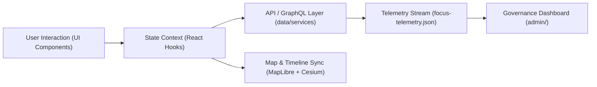

<div align="center">

# 🧩 Kansas Frontier Matrix — **Web Feature Modules**
`web/src/features/README.md`

**Purpose:**  
Documents the **modular React + MapLibre feature system** powering the Kansas Frontier Matrix (KFM) web interface — from **timeline** to **Focus Mode**, **narrative panels**, and **AI-assisted interaction layers**.  
Ensures compliance with **MCP-DL v6.3**, **FAIR+CARE**, and **WCAG 2.1 AA** design standards.

[](../../../docs/)
[](../../../LICENSE)
[](../../../docs/standards/)
[](#)

</div>

---

## 📘 Overview

Each **feature module** in `web/src/features/` encapsulates a self-contained capability — including **UI logic, state, data bindings, and styling** — following **React component isolation** and **MCP documentation-first principles**.  
The feature system promotes **parallel development**, **thematic separation**, and **easy integration** with KFM’s **FastAPI/GraphQL** backend.

**Core design principles**
- 📦 *Modularized architecture*: each domain (timeline, focus, search, map) lives in its own folder.  
- 🧱 *Composable React structure*: functional, typed, accessible components.  
- ⚙️ *Governed integration*: components connect via context providers and telemetry channels.  
- ♿ *Inclusive design*: all components follow WCAG 2.1 AA accessibility and FAIR+CARE ethics.

---

## 🗂️ Directory Layout

```plaintext
web/
└─ src/
   └─ features/
      README.md                   # This file — overview of web features
      timeline/                   # Interactive time slider + layer control (MapLibre)
      focus/                      # AI narrative focus panel + subgraph summaries
      search/                     # Search bar, filters, and GraphQL query handlers
      map/                        # MapLibre initialization, controls, layer toggles
      story/                      # Story nodes viewer + linked narrative cards
      telemetry/                  # Frontend performance, metrics, FAIR+CARE scoring
      admin/                      # Governance dashboards, audit overlays, review tools
      accessibility/              # UI accessibility utilities, keyboard navigation
```

---

## 🧩 Major Feature Modules

| Module | Purpose | Core Files |
|--------|----------|------------|
| **timeline/** | MapLibre + timeline slider integration — binds `currentYear` variable to style layers for interactive eras. | `timeline.ts`, `slider.tsx`, `timeline-style.json` |
| **focus/** | AI Focus Mode — displays contextual summaries, linked people/places/events. Integrates with graph APIs. | `focus-panel.tsx`, `useFocus.ts`, `focus-context.ts` |
| **search/** | Semantic + keyword search powered by `/api/search?q=` and autocomplete. | `search-bar.tsx`, `useSearch.ts`, `filters.tsx` |
| **map/** | MapLibre initialization, layer registry, and 3D Cesium toggle. | `map-init.ts`, `controls.tsx`, `layers.json` |
| **story/** | Displays story-node narratives; connects graph entities to timeline/map. | `story-card.tsx`, `story-context.ts` |
| **telemetry/** | Tracks client-side performance, user interactions, and accessibility telemetry. | `telemetry.ts`, `reporters.ts` |
| **admin/** | Tools for curators to validate data, FAIR+CARE audits, and governance approvals. | `audit-panel.tsx`, `review-table.tsx` |
| **accessibility/** | Keyboard shortcuts, ARIA roles, focus rings, and high-contrast mode. | `useA11y.ts`, `skip-links.tsx` |

---

## ⚙️ Feature Integration Pipeline



**Notes**
- Shared contexts (TimelineContext, FocusContext, TelemetryContext) handle cross-feature communication.  
- Each component emits telemetry events (e.g., `kfm:timeline:year`, `kfm:focus:change`) to unify logs.  
- Focus Mode and Timeline share synchronized state: when a user focuses on an entity with a known date, the slider aligns automatically.

---

## 🎨 UI & Accessibility Standards

| Guideline | Requirement | Implementation |
|-----------|--------------|----------------|
| **WCAG 2.1 AA** | Keyboard, color contrast, alt text, ARIA regions | global `useA11y()` hook |
| **Responsive Design** | Works on ≥ 320 px to ≥ 1440 px | CSS grid + container queries |
| **FAIR+CARE Ethics** | Sensitive datasets hidden for non-authorized roles | role-based rendering in `FocusPanel` |
| **Performance** | ≤ 50 ms interaction latency | memoized hooks + debounced slider updates |

> 🧭 *Accessibility audit reports* stored under `reports/audit/ui_a11y_summary.json` and verified in CI.

---

## 🧠 State & Data Flow (React Contexts)

| Context | Purpose | Connected Modules |
|----------|----------|--------------------|
| `TimelineContext` | Manages current year, range, playback. | timeline, map, story |
| `FocusContext` | Stores selected entity, AI summary, and linked nodes. | focus, story, search |
| `SearchContext` | Holds user query, filters, and results cache. | search, focus |
| `TelemetryContext` | Logs UI performance and usage metrics. | all |
| `AuthContext` | Handles JWT, permissions, FAIR+CARE role enforcement. | admin, map |

Each context emits **events** to the telemetry system (e.g., interaction timestamps, errors, latency). These feed into `focus-telemetry.json` for reproducibility and governance validation.

---

## ♻️ Governance & Telemetry Integration

- Frontend telemetry conforms to schema `web-features-v1.json`.  
- Interaction metrics (slider movements, focus changes, zoom levels) recorded for audit and energy profiling.  
- Governance workflows enforce ethical visibility and consent compliance (via CARE policy hooks).  
- All feature merges must pass `faircare-validate.yml` and `a11y-lint.yml` in CI.

```ts
window.addEventListener('kfm:focus:change', e => {
  // Send to backend telemetry or governance logger
  // post('/api/telemetry', { event: 'focus-change', ...e.detail });
});
```

---

## 🧾 Internal Citation

```text
Kansas Frontier Matrix (2025). Web Feature Modules (v9.9.0).
Defines the React/MapLibre modular design pattern enabling KFM’s timeline, focus, and narrative exploration interface.
FAIR+CARE and MCP-DL v6.3 compliant; ensures accessibility, provenance, and ethical interactivity.
```

---

## 🕰️ Version History

| Version | Date       | Author | Summary |
|---------:|------------|--------|----------|
| v9.9.0 | 2025-11-08 | `@kfm-web` | Added predictive Focus Mode integration and telemetry hooks. |
| v9.8.0 | 2025-11-05 | `@kfm-web` | Upgraded MapLibre 3D timeline synchronization. |
| v9.7.0 | 2025-11-02 | `@kfm-ui` | Established modular feature directory and governance telemetry. |

---

<div align="center">

**Kansas Frontier Matrix**  
*Interactive Exploration × FAIR+CARE Design × Sustainable Web Architecture*  
© 2025 Kansas Frontier Matrix · Master Coder Protocol v6.3 · FAIR+CARE Certified · Diamond⁹ Ω / Crown∞ Ω Ultimate Certified  

[Back to Web Docs](../../README.md) · [Governance Charter](../../../docs/standards/governance/DATA-GOVERNANCE.md)

</div>

