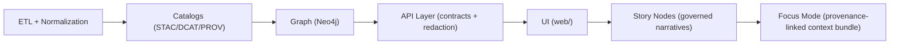

# 🧩 `web/src/features/` — Feature Modules (KFM Web UI)


> 🎯 **Purpose:** `features/` is where KFM’s **vertical UI slices** live (map, timeline, layers, analysis, story nodes, focus mode, etc.).  
> Each feature owns its **UI + state + API integration + tests**, while honoring KFM’s **contract-first + evidence-first** pipeline rules.

> [!IMPORTANT]
> The KFM Web UI is a **trust surface** — not “just a frontend.”  
> Every interaction must remain **traceable**, **governed**, and **redaction-safe**.

---

## 🗺️ Quick navigation

- [🧭 Quick mental model](#-quick-mental-model)
- [🏛️ v13 invariants that shape `features/`](#️-v13-invariants-that-shape-features)
- [🧱 What belongs in `features/`](#-what-belongs-in-features)
- [📦 Folder layout](#-folder-layout)
- [📐 Feature structure conventions](#-feature-structure-conventions)
- [🔗 Contracts + API boundary](#-contracts--api-boundary)
- [🧾 Provenance-first UI patterns](#-provenance-first-ui-patterns)
- [📖 Story Nodes + 🎯 Focus Mode integration](#-story-nodes--focus-mode-integration)
- [🕰️ Time-driven UX](#️-time-driven-ux)
- [⚡ Performance + deployment modes](#-performance--deployment-modes)
- [♿ Accessibility + responsive design](#-accessibility--responsive-design-non-negotiable)
- [➕ Adding a new feature checklist](#-adding-a-new-feature-checklist)
- [🧱 Adding a new map layer runbook](#-adding-a-new-map-layer-mini-runbook)
- [🔍 Where to look next](#-where-to-look-next)
- [🧠 Notes for maintainers](#-notes-for-maintainers)

---

## 🧭 Quick mental model

KFM’s UI is one **governed stage** in a strict, ordered pipeline:



✅ **Implication for `features/`:**
- Features **must not bypass the API boundary**.
- Anything rendered as “truth” must be traceable to **cataloged sources** (and obey redaction + CARE).

---

## 🏛️ v13 invariants that shape `features/`

Think of these as “physics” for UI work. If a feature fights these, it will be rejected in review.

### ✅ Pipeline ordering is absolute
UI is downstream of **Catalog → Graph → API**.  
If you need data the API doesn’t provide, the fix is **upstream** (contract + server + redaction), not a UI workaround.

### 🔒 No leakage (redaction is stronger than UX)
- Never render restricted precision (even by accident via hover tooltips, downloads, screenshots, or “copy coordinates”).
- Never allow “zoom/detail UI” to become a side-channel around redaction rules.
- Prefer **generalization/blur/omit** behavior when sensitivity applies.

### 🧾 Evidence-first
- Every claim, number, highlight, or layer must be “explainable” via an evidence surface:
  - dataset source (STAC/DCAT IDs)
  - lineage (PROV)
  - stable identifiers for graph entities

### 🤖 AI is opt-in + transparent
If AI generates content in the UI:
- label it clearly
- include confidence + provenance
- never present AI text as historical fact without sources

> [!TIP]
> When in doubt: “**No new narrative without sources**; no data without provenance.”

---

## 🧱 What belongs in `features/`

A **feature** is a vertical slice of user capability:

- 🧩 **UI components** (pages, panels, dialogs)
- 🧠 **State** (Redux slice and/or local hooks)
- 🔌 **API integration** (typed clients, request throttling, caching)
- 🧾 **Contracts/types** (import from contract layer; avoid “shape drift”)
- 🧪 **Tests** (unit + integration; contract expectations where relevant)
- 📘 **Feature docs** (README, ADR notes, usage examples)
- 🛰️ **Layer registration** (when the feature introduces a new truth surface)
- 🪪 **Audit/telemetry hooks** (structured events; no sensitive payloads)

> 🧠 Rule of thumb: If a PR can be reviewed as “one user capability,” it should mostly live in **one feature folder**.

---

## 📦 Folder layout

### ✅ Primary layout (feature-sliced)

```text
web/src/features/
  🧭 navigation/            # Header, nav, global layout regions
  🗺️ map/                   # MapView + adapters/wrappers (MapLibre/Leaflet/Cesium)
  🧱 layers/                # Layer panel, legend, layer registry/config
  🕰️ timeline/              # TimelineSlider + time controls (scrub, play, bookmarks)
  🔎 search/                # Search, filters, geocoder, entity lookup
  📊 analysis/               # Charts, tables, drill-down views (evidence-backed)
  📖 story-nodes/            # Story rendering components + evidence panels
  🎯 focus-mode/             # Focus Mode layout + hard-gate rules enforcement
  🔐 auth/                   # Login state, role gating (if used)
  🧪 telemetry/              # UI audit events + metrics hooks (no sensitive content)
  🧰 shared/                 # Small, stable cross-feature utilities
  📄 README.md               # 👈 you are here
```

### 🧩 Mapping to existing KFM `web/` patterns (if present)

Some KFM layouts also use these folders:

- `components/` → reusable UI primitives (buttons, modals, etc.)
- `views/` → route/page composition
- `viewers/` → map engine integrations (MapLibre/Cesium glue)
- `story_nodes/` → story artifacts (sometimes build-time copies)

If your repo already has them, the rule is:

> **Prefer feature slices for ownership** → and treat `components/` + `viewers/` as “foundations” that features consume.

---

## 📐 Feature structure conventions

Inside each feature, keep a predictable “mini-app” shape:

```text
<feature>/
  components/              # React components specific to this feature
  hooks/                   # feature-scoped hooks
  state/                   # Redux slice(s), selectors, actions
  api/                     # API boundary helpers / client wrappers
  contracts/               # (optional) re-exported contract types used by this feature
  types/                   # feature-only types (avoid duplicating contract shapes)
  utils/                   # pure helpers (no React)
  __tests__/               # tests close to feature
  index.ts                 # ✅ public surface (barrel export)
  README.md                # optional per-feature docs
```

### ✅ Public API rule (import hygiene)

Only import across features via the feature’s public entrypoint:

- ✅ `import { TimelineSlider } from "@/features/timeline";`
- ❌ `import TimelineSlider from "@/features/timeline/components/TimelineSlider";`

This makes refactors safer and boundaries real.

---

## 🔗 Contracts + API boundary

### 🚫 Hard rule: no direct database / graph access
The UI must never query Neo4j directly. All reads flow through the governed API boundary that enforces:

- schema consistency (contract-first)
- access control + redaction
- sensitivity filtering

### ✅ Contract-first workflow (UI-facing)
When a feature needs new data:

1. **Define/extend the contract** (OpenAPI/GraphQL) 📜  
2. Implement in the API layer 🔧  
3. Add tests (contract + redaction behavior) 🧪  
4. Generate/refresh typed client types 🧬  
5. Only then wire into the feature UI 🧩

> [!NOTE]
> If a feature needs “just one extra field,” treat that as a **contract change**, not an ad-hoc JSON hack.

---

## 🧾 Provenance-first UI patterns

When a feature renders anything that looks like a fact or a “truth surface,” include provenance UX by default:

### 🧷 Pattern: Source pill + dataset link-out
- A small “Source” badge with dataset ID(s)
- “View lineage” action (PROV / processing chain)

### 🧭 Pattern: Inspect panel with stable identifiers
- “Inspect” side panel shows:
  - stable graph IDs
  - dataset IDs
  - timestamps / version
  - redaction flags (if any)

### 🗺️ Pattern: Layer legend that is evidence-backed
- Legends must cite:
  - dataset source
  - time range
  - scale rules / limitations
  - classification/sensitivity label where relevant

### 📊 Pattern: Charts that show uncertainty (when applicable)
If a chart is derived (aggregation, model output):
- label it as derived
- show confidence/uncertainty when available
- link to provenance + method notes

---

## 📖 Story Nodes + 🎯 Focus Mode integration

### 📖 Story Nodes (governed narratives)
Story Nodes are **Markdown-based narrative documents** with:

- citations (every claim backed by evidence)
- semantic annotations (machine-parsable links)
- stable graph entity references (so UI can “light up” the map/timeline)

### 🎯 Focus Mode (hard gate)
Focus Mode is the trust-critical reading experience:

- **only** provenance-linked content
- no unsourced narrative
- AI content is **opt-in + transparent**
- must not leak sensitive locations/precision

> [!IMPORTANT]
> Focus Mode is where reviewers will be strictest.  
> Treat it like a “security boundary,” not a theme/layout.

---

## 🕰️ Time-driven UX

The timeline is not decorative — it’s a **first-class controller**:

- moving the slider updates a global `currentDate` / `currentTimeRange`
- map layers, charts, and tables react to time
- deep-links should share a full view:
  - time
  - map position
  - selected layers
  - selected entity/story

### 🧯 Performance note: throttle timeline scrubbing
Timeline movement can trigger lots of work (tiles, JSON, chart refresh). Prefer:

- debouncing/throttling slider events
- “fetch on settle” patterns
- caching by time bucket (year/decade/month depending on granularity)

---

## ⚡ Performance + deployment modes

### 🧊 Keep “map + timeline” first paint fast
- lazy-load heavy panels (analysis dashboards, story media)
- dynamic import heavyweight engines (Cesium/3D, large chart libs)
- virtualize large tables
- memoize expensive map render work

### 🌐 Static-first deployment (when hosted on GitHub Pages)
KFM supports static-hosted patterns:

- static web app (HTML/JS/CSS) + client-side rendering
- map tiles / GeoJSON served as static files
- COGs can be accessed via HTTP range requests (when allowed)
- client-side search uses pre-built JSON indexes (when no server exists)

> [!TIP]
> Prefer **offline pipeline computation** → store outputs as cataloged artifacts → UI only displays them.

---

## ♿ Accessibility + responsive design (non-negotiable)

Target: major browsers + mobile + keyboard-only users.

- semantic HTML (`<button>`, `<label>`, `<table>`)
- ARIA where needed (dialogs, sliders, menus)
- keyboard navigation (timeline + layer toggles are priority)
- colorblind-friendly palettes + non-color cues
- responsive layout (Grid/Flex, collapsible panels, sensible breakpoints)

### 🧩 Polyfills (keep them minimal)
Polyfills are sometimes required — but they add weight. Prefer:

- progressive enhancement
- conditional loading
- only polyfill what we truly need

---

## ➕ Adding a new feature (checklist)

- [ ] Define the **user capability**
- [ ] Confirm **data source is cataloged** (STAC/DCAT/PROV) and accessible through **API contracts**
- [ ] If new data is required: update **contracts → API → tests → client types**
- [ ] Create feature folder + `index.ts` exports
- [ ] Add route/view integration (if applicable)
- [ ] Add state slice/selectors (if global state is needed)
- [ ] Add provenance UX (source pill / legend / evidence panel)
- [ ] Validate accessibility (keyboard + screen reader basics)
- [ ] Ensure no sensitive leakage (precision, downloads, screenshots)
- [ ] Add tests (critical flows + reducers/selectors + API mocking)
- [ ] Emit audit/telemetry events (no sensitive payloads)

---

## 🧱 Adding a new map layer (mini-runbook)

Layers are “public truth surfaces,” so the standard is higher:

1. **Confirm provenance exists** (catalog IDs; PROV lineage recorded)
2. Add to **layer registry/config** (single source of truth)
3. Implement:
   - layer toggle UI
   - legend/info panel with citations
   - popup/inspect behavior with stable identifiers
4. Ensure:
   - timeline behavior is correct (time filtering / snapshots)
   - scale rules are enforced (LOD/generalization)
   - redaction rules are honored (no precision leaks)
5. Add tests and a short doc note (what it is, source, limitations)

---

## 🔍 Where to look next

- 🏗️ Architecture + invariants: `../../../docs/MASTER_GUIDE_v13.md`
- 🧾 Standards profiles: `../../../docs/standards/`
- 🧠 Contracts: `../../../src/server/contracts/`
- 🧱 API implementation: `../../../src/server/`
- 🗺️ Map engine adapters (if present): `../../viewers/`
- 📖 Story Node templates: `../../../docs/templates/`
- 🎛️ UI schemas/config: `../../../schemas/ui/`
- 🧪 UI testing patterns: `../../__tests__/` (or feature-local `__tests__/`)

---

## 🧠 Notes for maintainers

<details>
<summary>✨ Feature template (copy/paste skeleton)</summary>

```text
web/src/features/<feature-name>/
  components/
    <FeatureRoot>.tsx
  hooks/
    use<FeatureName>.ts
  state/
    <featureName>Slice.ts
    selectors.ts
  api/
    <featureName>Api.ts
  contracts/
    index.ts
  types/
    index.ts
  utils/
    index.ts
  __tests__/
    <featureName>.test.ts
  index.ts
  README.md
```

</details>

---

### ✅ Definition of “done” for a feature PR

- Works on desktop + mobile
- Accessible (keyboard, semantics, no dead-ends)
- Uses the API boundary correctly (no direct graph/hidden data)
- Provenance visible where it matters (layers, narratives, outputs)
- No sensitive leakage / respects classification + CARE
- AI content (if any) is opt-in + labeled + confidence + provenance
- Tests added/updated
- Docs updated (this README or per-feature README)

🛠️ If anything here feels heavy: that’s intentional — KFM’s UI is a **trust surface**, not just a screen.
