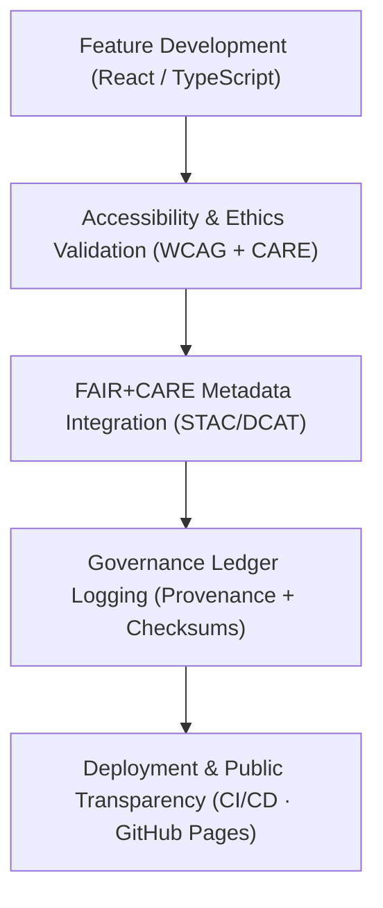

<div align="center">

# 🌐 **Kansas Frontier Matrix — Web Application Features Overview (v2.1.1 · Tier-Ω+∞ Certified)**  
`web/src/features/README.md`

**Mission:** Describe and govern the **React + MapLibre web application feature modules** of the  
**Kansas Frontier Matrix (KFM)** — enabling FAIR+CARE-compliant data exploration, accessibility-first interfaces,  
and transparent, reproducible user experiences.

[](../../../docs/)
[](../../../docs/standards/faircare-validation.md)
[](../../../docs/standards/accessibility.md)
[](../../../LICENSE)

</div>

---

## 📚 Overview

The **Kansas Frontier Matrix Web App** provides an interactive, FAIR+CARE-aligned interface for:
- 🌍 Viewing historical and geospatial datasets (via MapLibre GL).  
- 🧭 Exploring time-based narratives through the timeline engine.  
- 🤖 Using AI-powered **Focus Mode** to contextualize entities, people, and events.  
- 🧩 Managing STAC/DCAT metadata visualization and FAIR+CARE compliance indicators.  
- ♿ Ensuring accessibility and inclusivity through WCAG 2.1 AA compliance.  

Each **feature module** is self-contained under `web/src/features/`, built with **TypeScript + React**,  
and documented using MCP-DL v6.4.3-compliant frontmatter for reproducibility.

---

## 🗂️ Directory Layout

```bash
web/src/features/
├── README.md                        # This file — web feature documentation overview
│
├── map/                             # MapLibre GL-based interactive map layers
│   ├── layers/                      # Individual geospatial data layers (hazards, treaties, etc.)
│   └── controls/                    # Zoom, legend, and overlay UI components
│
├── timeline/                        # Temporal navigation and dataset playback
│   ├── slider/                      # Custom D3/React-based timeline slider
│   └── events/                      # Temporal markers, tooltips, and visual events
│
├── focus-mode/                      # AI-driven contextual exploration system
│   ├── context-panel/               # Entity summaries, provenance, and related data
│   └── ai-explainability/           # Model explainability visualization tools
│
├── metadata/                        # STAC/DCAT metadata viewing and editing modules
│   ├── records/                     # Metadata table viewer and inline editor
│   └── validator/                   # FAIR+CARE metadata validation UI
│
└── accessibility/                   # Accessibility overlays, audits, and a11y utility hooks
    ├── checker/                     # Real-time WCAG compliance scanning
    └── preferences/                 # User accessibility settings and themes
```

---

## 🧩 Feature Governance Model


<!-- END OF MERMAID -->

---

## ⚙️ Core Feature Modules

| Feature | Description | Dependencies | Validation Workflow |
|:--|:--|:--|:--|
| **Map** | Interactive MapLibre GL map with spatial overlays and layer toggles. | MapLibre GL, Deck.GL, Turf.js | `ui-validate.yml` |
| **Timeline** | Scrollable D3-based timeline slider for temporal navigation. | D3.js, React Motion | `ui-validate.yml` |
| **Focus Mode** | AI-assisted exploration of entities, events, and provenance data. | OpenAI / Neo4j | `faircare-validate.yml` |
| **Metadata Viewer** | STAC/DCAT record viewer and schema editor. | JSON-LD Parser, React Table | `stac-validate.yml` |
| **Accessibility Tools** | Dynamic contrast checker and a11y preferences manager. | axe-core, react-aria | `design-validate.yml` |

---

## 🧱 Accessibility & FAIR+CARE Integration

| Requirement | Implementation | Validation Workflow |
|:--|:--|:--|
| **WCAG 2.1 AA** | All UI components use aria labels, color contrast ≥ 4.5:1. | `design-validate.yml` |
| **FAIR Metadata Linkage** | Features reference STAC/DCAT metadata endpoints. | `stac-validate.yml` |
| **CARE Principle Compliance** | Focus Mode provides contextual transparency. | `faircare-validate.yml` |
| **Localization Support** | Osage + English + Spanish interface text support. | `docs-validate.yml` |
| **Keyboard Navigation** | Full tab order coverage for all UI components. | `design-validate.yml` |

---

## 🧮 Observability Metrics (UI Quality Index)

| Metric | Description | Target | Source |
|:--|:--|:--|:--|
| **Accessibility Score (WCAG)** | Overall a11y compliance rate. | ≥ 95 | `design-validate.yml` |
| **UI Test Coverage** | % of components with Jest/Playwright tests. | ≥ 90 | CI Metrics |
| **FAIR Metadata Sync** | Rate of STAC/DCAT field compliance. | 100% | `stac-validate.yml` |
| **Focus Mode Explainability** | AI response transparency and traceability. | 100% | `faircare-validate.yml` |
| **Performance (Lighthouse)** | Lighthouse performance score. | ≥ 90 | CI/CD Reports |

---

## 🧾 Governance Validation Workflows

| Workflow | Purpose | Output |
|:--|:--|:--|
| `ui-validate.yml` | Validates component structure and rendering. | `reports/validation/ui_validation.json` |
| `design-validate.yml` | Runs accessibility and WCAG audits. | `reports/fair/a11y_report.json` |
| `faircare-validate.yml` | Confirms ethical and cultural compliance. | `reports/fair/data_care_assessment.json` |
| `stac-validate.yml` | Ensures metadata alignment with STAC schema. | `reports/validation/stac_validation_report.json` |
| `governance-ledger.yml` | Records checksums and governance metadata. | `data/reports/audit/data_provenance_ledger.json` |

---

## 🧾 Example Governance Metadata

```yaml
---
feature_id: "web_feature_focus-mode_v2.1.1"
authors: ["@kfm-web","@kfm-ai"]
accessibility_compliance: "WCAG 2.1 AA"
faircare_status: "Tier-Ω+∞ Verified"
checksum: "sha256:9fa3c1f38beaf41..."
governance_ledger_entry: "data/reports/audit/data_provenance_ledger.json"
license: "MIT"
---
```

---

## 🕰 Version History

| Version | Date | Author | Summary |
|:--|:--|:--|:--|
| **v2.1.1** | 2025-11-16 | @kfm-web | Added FAIR+CARE metrics, accessibility audit mapping, and governance integration. |
| v2.0.0 | 2025-10-25 | @kfm-architecture | Introduced modularized feature directories and validation workflows. |
| v1.0.0 | 2025-10-04 | @kfm-docs | Initial React feature documentation structure. |

---

<div align="center">

**Kansas Frontier Matrix © 2025**  
*“Accessibility is Ethics — Transparency is Trust.”*  
📍 `web/src/features/README.md` — Overview of FAIR+CARE-aligned web features and accessibility governance in the Kansas Frontier Matrix.

</div>

