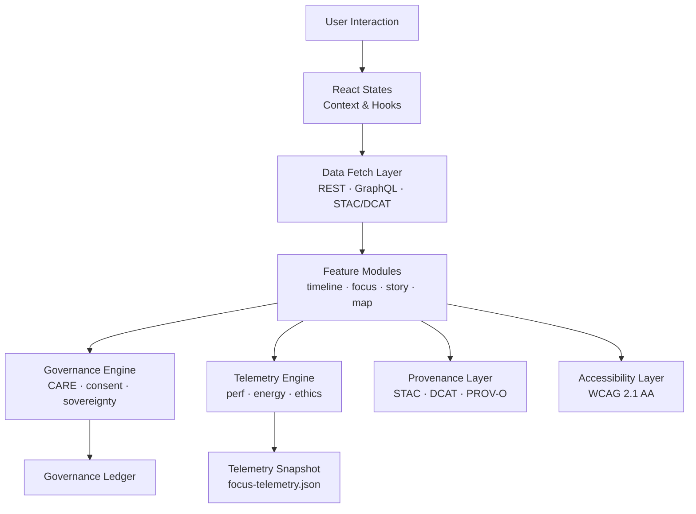
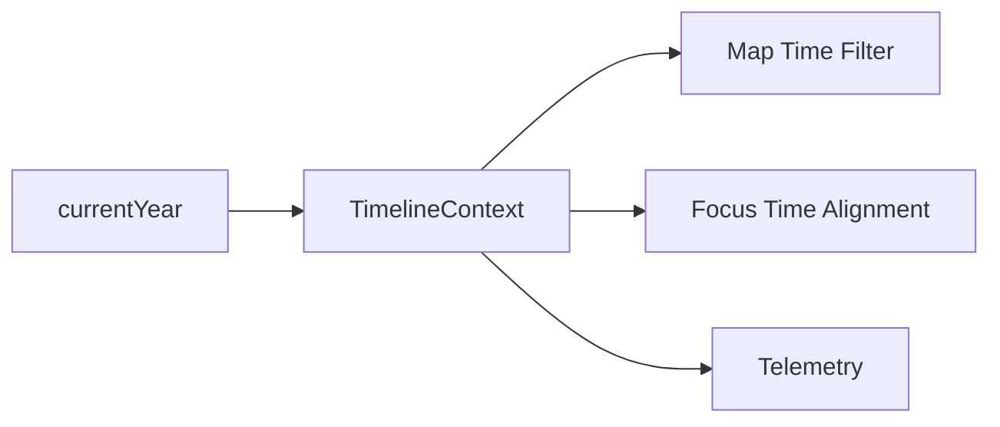
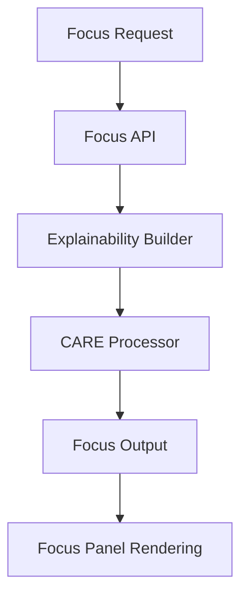
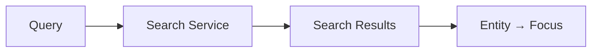
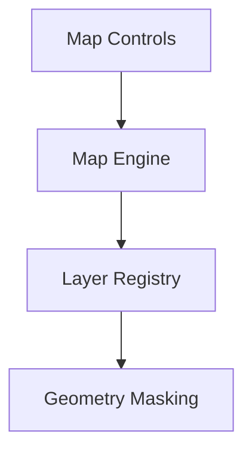
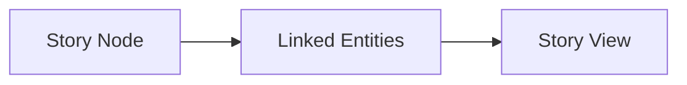
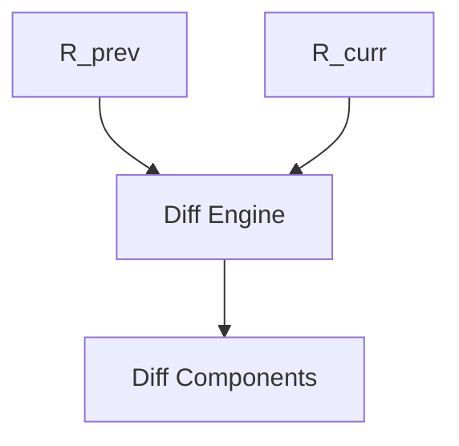
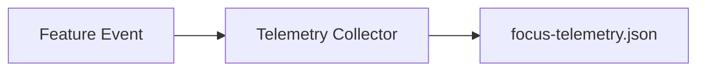
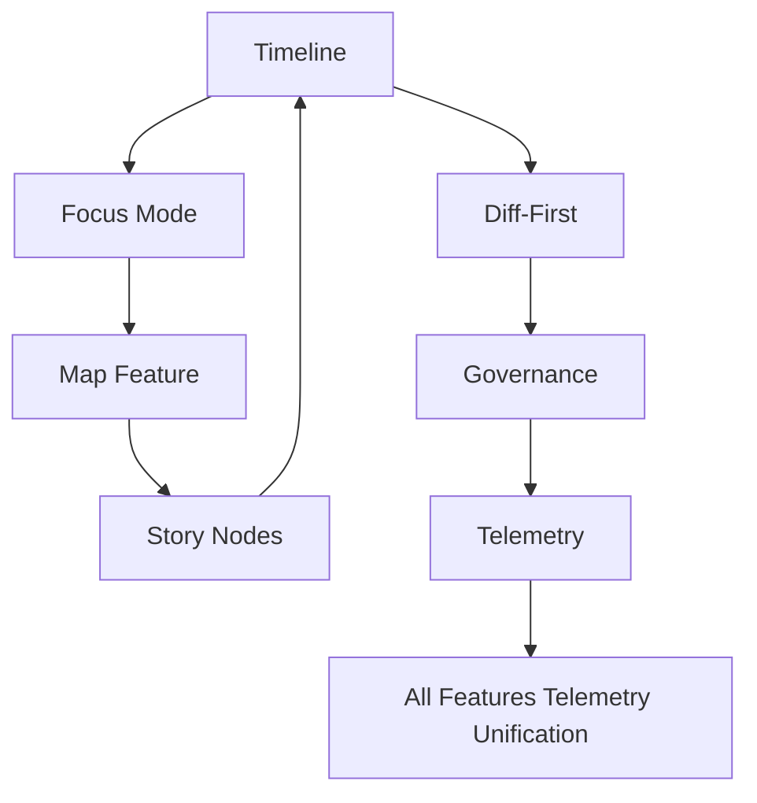
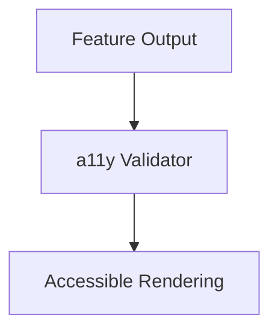

<div align="center">

# 🧩 **Kansas Frontier Matrix — Web Feature Architecture**  
`web/src/features/README.md`

**Purpose:**  
Define the **Diamond⁹ Ω / Crown∞Ω Ultimate Certified deep architecture** governing all **web features** in the Kansas Frontier Matrix (KFM) v10.3.2.  
This document formalizes the interaction model between **map**, **timeline**, **focus**, **story**, **search**, **telemetry**, **accessibility**, and **governance** modules.  
All modules follow **FAIR+CARE**, **WCAG 2.1 AA**, and **MCP-DL v6.3** standards, and are fully traceable through telemetry, governance ledgers, and provenance metadata.

[]()  
[]()  
[]()  
[]()

</div>

---

## 📘 Executive Overview

The **Web Feature Architecture** organizes all interactive subsystems into coherent, governed feature slices unified under:

- React 18 + Context + Hooks  
- MapLibre GL + CesiumJS  
- Focus Mode v2.5 (AI-assisted reasoning engine)  
- TimelineView (temporal navigation)  
- Story Nodes (narrative graph)  
- FAIR+CARE governance enforcement  
- Accessibility & inclusive design pipelines  
- Telemetry-driven sustainability monitoring  
- Provenance and lineage propagation  

Each feature is isolated, typed, reproducible, and coordinated via global contexts and event buses.

---

## 🗂️ Directory Layout (Authoritative v10.3.2)

```text
web/src/features/
├── README.md
│
├── timeline/           # Temporal navigation & time-centric reasoning
├── focus/              # Focus Mode v2.5 (narratives, explainability, governance)
├── search/             # Semantic + keyword search, filters, relevance engine
├── map/                # MapLibre + Cesium visualization stack
├── story/              # Story Nodes (narrative graph + timeline sync)
├── diff-first/         # Entity diff viewer (release-to-release evolution)
├── telemetry/          # Performance, energy, ethics, and A11y telemetry
├── admin/              # Governance dashboards, audit review tools
└── accessibility/      # A11y utilities, ARIA normalizers, keyboard pathways
````

---

## 🧩 High-Level Web Feature Architecture



---

## 🧠 Feature Domains (Deep Architecture)

### 1️⃣ Timeline Feature — Temporal Intelligence

Handles:

* temporal brushing & zoom
* predictive period overlays (2030–2100)
* bi-directional sync with Focus Mode & MapView
* generates timeline events for telemetry



---

### 2️⃣ Focus Feature — AI Reasoning & Explainability (v2.5)

Provides:

* narrative reasoning
* explainability deltas
* CARE-sensitive narrative filtration
* provenance citation surfaces



---

### 3️⃣ Search Feature — Semantic & Filtered Discovery

Search must support:

* keyword vector search
* entity-type filters
* timeline-aware ranking
* accessibility-mode search tokens



---

### 4️⃣ Map Feature — Spatial Visualization Layer

Handles:

* MapLibre GL rendering
* Cesium 3D globe mode
* layer registry + STAC asset loaders
* CARE geometry masking



---

### 5️⃣ Story Feature — Narrative Graph Engine

Implements:

* narrative Story Nodes
* place/people/event connections
* map + timeline syncing
* governance-aware narrative filtering



---

### 6️⃣ Diff-First Feature — Release-to-Release Change Detection

Provides:

* entity diffs across releases
* governance & explainability deltas
* semantic property, relation, and text diffs
* integration with Focus Mode & Timeline



---

### 7️⃣ Telemetry Feature — Sustainability & Ethics Engine

Logs:

* page load times
* energy estimates (Wh)
* accessibility violations
* governance rule triggers
* user interactions



---

### 8️⃣ Admin Feature — Governance Review & Audit Tools

Provides:

* CARE label review
* provenance chain inspection
* dataset-level governance dashboards
* entity audit trails
* release data verification

---

### 9️⃣ Accessibility Feature — WCAG-Driven Enforcement

Implements:

* `prefers-reduced-motion` compliance
* ARIA normalization
* skip links & keyboard navigation
* accessible announcements
* color contrast validation

---

## 🧱 Cross-Feature Integration Architecture



Events create **cascading UI updates** through React Context, using:

* TimelineContext
* FocusContext
* ReleaseContext
* MapContext
* TelemetryContext
* GovernanceContext

---

## ♿ Accessibility Architecture (WCAG 2.1 AA)

All features must:

* include ARIA roles & regions
* provide alternative text and labels
* avoid color-only semantics
* maintain a consistent `<h1>–<h4>` hierarchy
* support reduced-motion rendering
* emit A11y telemetry events



---

## 📡 Telemetry & Sustainability Integration

All features log:

* energy cost per interaction
* CPU/GPU-time estimation
* network latency
* a11y score contribution
* governance rule invocations

Telemetry stored in:

```text
../../../releases/v10.3.2/focus-telemetry.json
```

---

## 🔐 Governance Integration (FAIR+CARE)

Governance rules ensure:

* respect for sovereignty
* consent-aware rendering
* redaction of sensitive entities
* lineage & licensing visibility
* ethical explainability boundaries

Governance logs recorded at:

```text
../../../docs/reports/audit/web-features-governance.json
```

---

## ⚙️ CI / Validation Requirements

| Layer         | Validator                |
| ------------- | ------------------------ |
| Documentation | `docs-lint.yml`          |
| Accessibility | `accessibility_scan.yml` |
| Governance    | `faircare-validate.yml`  |
| Telemetry     | `telemetry-export.yml`   |
| Types         | TypeScript strict mode   |
| Security      | CodeQL + Trivy           |
| Performance   | Web vitals thresholds    |

All feature modules must pass **all validation steps before merge**.

---

## 🧾 Example Feature Metadata Record

```json
{
  "id": "web_features_v10.3.2",
  "feature_count": 9,
  "a11y_score": 98.7,
  "care_compliance": "certified",
  "telemetry_synced": true,
  "governance_events_logged": 425,
  "energy_score": 97.1,
  "timestamp": "2025-11-14T23:42:00Z"
}
```

---

## 🕰️ Version History

| Version | Date       | Summary                                                                                                                                                      |
| ------- | ---------- | ------------------------------------------------------------------------------------------------------------------------------------------------------------ |
| v10.3.2 | 2025-11-14 | Full deep-architecture rewrite (Diamond⁹ Ω). Unified all feature subsystems, updated governance/telemetry pipelines, added timeline→map→focus sync diagrams. |
| v9.9.0  | 2025-11-08 | Previous architecture.                                                                                                                                       |

---

<div align="center">

**Kansas Frontier Matrix — Web Features Architecture**
🧩 Modular Intelligence · 🔐 FAIR+CARE Compliance · 🔗 Provenance Fidelity · 🧠 Explainability-Ready
© 2025 Kansas Frontier Matrix — MIT License

[Back to Web Source](../README.md)

</div>
