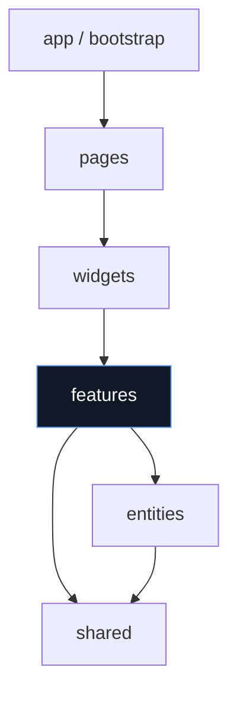

<!-- According to a document from 2025-12-17, KFM’s UI must preserve the canonical “truth path” (ETL → Catalogs → Graph → APIs → UI → Story Nodes → Focus Mode). -->

# 🧩 `web/src/features`


%20Cesium-2ea44f)


Welcome to the **Features layer** of the KFM web client. This directory is where we implement **user-facing capabilities** that combine UI + state + API calls into a cohesive “thing a user can do”.

> 🎯 **Definition (practical):** A **feature** is a *bounded slice of product behavior* (e.g., “toggle map layers”, “run a Focus Mode query”, “open provenance panel”) that can be **tested**, **versioned**, and **reasoned about** independently.

---

## 🧭 Quick links (repo-relative)

- 🗺️ **Master pipeline + invariants:** `../../../docs/MASTER_GUIDE_v13.md`
- 🧱 **Architecture rationale:** `../../../docs/architecture/KFM_REDESIGN_BLUEPRINT_v13.md`
- 📜 **Long-term vision:** `../../../docs/architecture/KFM_VISION_FULL_ARCHITECTURE.md`
- 🧾 **API contract extension template:** `../../../docs/templates/TEMPLATE__API_CONTRACT_EXTENSION.md`
- 🧬 **UI schemas/contracts (if present):** `../../../schemas/ui/`
- 🧠 **Story Nodes & Focus templates:** `../../../docs/reports/story_nodes/templates/`
- 🔐 **Governance + sovereignty:** `../../../docs/governance/`

---

## ✅ Non‑negotiables (KFM invariants for *every* feature)

### 1) The “truth path” is sacred 🧭
UI features **must** consume data through the **API layer** and must not leapfrog pipeline stages.

> ETL → STAC/DCAT/PROV → Graph → API → UI → Story Nodes → Focus Mode

### 2) The UI never bypasses governance 🛡️
- No direct DB calls (Neo4j/PostGIS) from the web client.
- No “hidden datasets” shipped in the bundle.
- No UI behavior that *functionally bypasses redaction* (example: “zoom deeper than allowed” to infer sensitive locations).

### 3) Evidence-first UX by default 🔎
If a feature shows a fact, it must be possible for the user to inspect:
- where it came from (dataset / document / node),
- how it was derived (lineage / provenance),
- what rules applied (policy / redaction), when relevant.

---

## 🧱 Where `features/` sits in the front-end architecture

We follow a **feature-sliced-ish** mental model (names may vary, but the boundaries matter):



**In plain language:**
- **Shared** = generic UI, utilities, API client primitives, types (no business meaning)
- **Entities** = domain objects (Dataset, StoryNode, Layer, Place, Event…)
- **Features** = actions & flows combining entities + UI + API (this folder)
- **Widgets/Pages** = composition, layout, routing, page-level wiring

---

## 🧠 What belongs in `features/`

✅ **Yes**
- A “layer toggle” + state + API read to fetch available layers
- A “timeline brush” + state + query params + map updates
- A “Focus Mode chat” UI + request/response handling + citations panel behavior
- A “provenance drawer” that composes dataset metadata, lineage, and citations

🚫 **No**
- A single reusable Button → put in `shared/ui`
- A pure domain type + validator → put in `entities/*` or `shared/*`
- A full page route with layout → put in `pages/*`
- A multi-feature “mega panel” → that’s usually a `widget`

---

## 📁 Folder conventions (per feature)

Each feature should be a self-contained module with a predictable shape:

```text
📁 features/
  📁 <feature-name>/                  # kebab-case (e.g., focus-mode, layer-registry)
    📁 ui/                            # React components (feature-scoped)
    📁 model/                         # local state, reducers, selectors, hooks
    📁 api/                           # feature-level API wrappers (call shared api client)
    📁 lib/                           # feature-only helpers
    📁 assets/                        # icons/images used only by this feature
    📄 index.ts                        # public exports (the "feature contract")
    📄 README.md                       # optional: deep notes for complex features
```

### 🔒 Public surface rule: export only from `index.ts`
Consumers should import from:

```ts
import { FocusModePanel } from "@/features/focus-mode";
```

Not from:

```ts
// ❌ avoid deep imports (harder to refactor safely)
import { FocusModePanel } from "@/features/focus-mode/ui/FocusModePanel";
```

---

## 🧭 Import boundaries (keep the graph clean)

**Allowed imports from a feature:**
- `shared/*`
- `entities/*`
- other `features/*` (sparingly, prefer composition via widgets)
- feature-local files

**Avoid / disallow:**
- importing from `pages/*` or `app/*` (creates cycles & brittle coupling)
- reaching into server-only contracts or filesystem paths

---

## 🗺️ KFM-specific “feature types” you’ll see here

Below are common feature families aligned to the KFM architecture:

### 🧱 1) Map interaction features
Examples:
- layer registry + toggles
- basemap style switcher
- hover/identify inspector
- selection tools (polygon/box select)
- time slider synchronization

**KFM note:** Map features must respect governance constraints like redaction and sensitivity (e.g., if a dataset is restricted, the feature must not allow “workarounds” via client-side filtering or zoom).

---

### 🕰️ 2) Time + narrative features
Examples:
- timeline brush/filter
- story node navigation (“guided atlas”)
- narrative overlays

**KFM note:** Story content is governed. Features that render story text must preserve source traceability and show supporting evidence links when available.

---

### 🧠 3) Focus Mode (AI assistant) features
Focus Mode is an AI-assisted interface, but the **UI never talks to the model directly**.

**UI responsibilities:**
- Gather user query + optional context (selected map extent, time range, selected datasets)
- POST to the backend Focus endpoint
- Render:
  - answer text
  - citations/footnotes as clickable references
  - refusal / policy-block states gracefully

**Hard rules:**
- No direct Ollama/model calls from the browser
- Treat “missing citations” as a failure mode (show an error state + retry path)
- Never render untrusted rich HTML from model output; keep it text-first + safe Markdown if supported

---

### 🧬 4) Provenance, citations, and “map behind the map”
A core KFM experience is that every visible fact can be traced.

Pattern components/features often include:
- Provenance drawer
- Dataset details panel (STAC/DCAT/PROV references)
- Citation renderer used by story nodes & Focus Mode
- “Why am I seeing this?” policy explanation panel (when applicable)

---

## 🔗 The “Evidence Card” UX pattern (recommended)

When a feature presents data, expose an **Evidence Card** affordance nearby:

**Evidence Card should include:**
- Dataset ID / node ID
- Source name(s) + license (if available)
- “View metadata” link
- “View provenance” link (lineage)
- “Open citations” link (for narrative/AI outputs)

> 🧩 Tip: standardize this as a shared UI primitive, but keep feature-specific wiring here.

---

## 🧪 Testing expectations (feature-level)

Minimum expectations per feature:

- ✅ **Unit tests** for model logic (reducers, selectors, parsing, formatting)
- ✅ **Component tests** for core UI states:
  - loading
  - empty
  - error
  - success
  - unauthorized / restricted
- ✅ **Contract alignment**:
  - mock API responses using stable fixtures
  - if API contracts change, update via the API contract template instead of “just making it work”

<details>
<summary>🧰 Suggested test matrix (expand)</summary>

- **Happy path**
  - loads minimal data and renders
- **Latency**
  - skeleton UI visible; interactions disabled when needed
- **Permission gating**
  - 401/403 shows a meaningful state and does not leak restricted content
- **Redaction**
  - redacted payloads are displayed *as intended* (no accidental reconstitution)
- **Accessibility**
  - keyboard navigation works; focus rings visible; ARIA labels for map controls

</details>

---

## 🚀 Performance + resilience notes

Map-heavy UIs can degrade quickly. Feature authors should:

- Prefer tiles / bounded queries over “download everything”
- Avoid keeping huge GeoJSON blobs in React state
- Use memoization for derived computations
- Defer expensive work (geometry ops, clustering) off the main thread when possible

**UX resilience:**
- Always include a failure UI (network down, policy denied, invalid response)
- Provide “retry” and “report issue” paths for critical features

---

## 🔐 Governance, sovereignty, and sensitive data in features

Feature authors must assume:
- not all datasets are public
- not all users can see all fields
- “precision” (e.g., coordinates) can itself be sensitive

**UI behaviors to implement when appropriate:**
- Hide or aggregate restricted layers
- Blur/generalize sensitive points (or enforce min zoom)
- Show content warnings for sensitive narratives
- Handle takedowns gracefully (dataset disappears; feature should not crash)

---

## 🧱 Creating a new feature (checklist)

1) 📁 Create folder `features/<feature-name>/`
2) 🧾 Define the public contract in `index.ts`
3) 🔌 Add feature API wrapper(s) in `api/` using shared API client
4) 🧠 Add model state in `model/` (hooks, reducers, selectors)
5) 🖼️ Build UI in `ui/` with:
   - loading, empty, error states
   - a11y labels for controls
6) 🔗 Add provenance/citations affordances if the feature displays evidence-backed data
7) 🧪 Add tests (unit + UI state coverage)
8) 🧷 Update any registries (layer registry / route config / telemetry hooks) if applicable

---

## 🧯 Common pitfalls (please don’t)

- ❌ Deep-importing other features’ internal files (breaks refactors)
- ❌ Shipping data files inside the web bundle “temporarily”
- ❌ Rendering AI output as HTML
- ❌ Assuming permissions are static (they’re not)
- ❌ Treating missing citations as “fine” in narrative/AI outputs

---

## 📌 Feature template (copy/paste)

```text
📁 features/<feature-name>/
  📁 ui/
  📁 model/
  📁 api/
  📁 lib/
  📄 index.ts
```

```ts
// features/<feature-name>/index.ts
export { FeatureRoot } from "./ui/FeatureRoot";
export type { FeatureConfig } from "./model/types";
```

---

## 🗂️ If you’re unsure where something belongs…

Use this quick rule:

- “Is it reusable without KFM context?” → `shared/`
- “Is it a domain noun (Dataset/StoryNode/Layer)?” → `entities/`
- “Is it a user action/flow?” → `features/`
- “Is it composition/layout across multiple features?” → `widgets/` or `pages/`

---

## 📚 Design foundations (internal docs)
This folder’s conventions are anchored in KFM’s **contract-first + evidence-first** system design. Start here:

- `../../../docs/MASTER_GUIDE_v13.md`
- `../../../docs/architecture/KFM_REDESIGN_BLUEPRINT_v13.md`
- `../../../docs/architecture/KFM_VISION_FULL_ARCHITECTURE.md`
- `../../../docs/governance/`

🧠 When in doubt: **don’t hack around contracts** — extend them.
