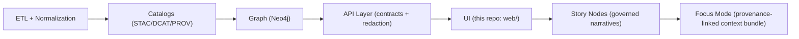

# 🧩 `web/src/features/` — Feature Modules (KFM Web UI)


> 🎯 **Purpose:** This folder holds **feature-based slices** of the KFM client UI (map, timeline, layers, analysis, focus mode, etc.).  
> Each feature owns its **UI**, **state**, and **integration points** while honoring KFM’s **contract-first + evidence-first** pipeline rules.

---

## 🧭 Quick mental model

KFM’s UI is not “just a frontend.” It’s one **governed stage** in a strict pipeline:



✅ **Implication for `features/`:**
- Features **must not** bypass the API.
- Anything shown in the UI must be traceable back to **cataloged sources** (and obey redaction/sensitivity rules).

---

## 🧱 What belongs in `features/`

A “feature” is a **vertical slice** of behavior:

- 🧩 **UI components** (pages, panels, dialogs)
- 🧠 **State** (Redux slice and/or local hooks)
- 🔌 **API integration** (typed clients, fetch logic, request throttling)
- 🧾 **Types + contracts** (data shapes *from* the contract layer)
- 🧪 **Tests** (unit + integration)
- 📘 **Feature docs** (README, ADR notes, usage examples)

> 🧠 Rule of thumb: If a change can be reviewed as “one user capability,” it should live in **one feature folder**.

---

## 🗺️ Canonical UI building blocks (expected to show up as features)

The KFM UI is typically composed from these core modules:

- 🗺️ **MapView** — interactive 2D map (MapLibre/Leaflet)  
- 🧭 **Sidebar** — menus, layer toggles, legend, context info  
- 🕰️ **TimelineSlider** — temporal navigation driving the current time state  
- 📊 **ChartPanel** — graphs/charts (Plotly/D3/Chart.js)  
- 🧾 **DataTable** — tabular display + download/export  
- 🧢 **Header** — global navigation (modes, settings, account)

These components usually map naturally to feature folders (see below).

---

## 📦 Suggested folder layout

> You can tweak names to match the codebase — what matters is the **pattern**.

```text
web/src/features/
  🧭 navigation/            # Header, nav, global layout regions
  🗺️ map/                   # MapView + map adapters (MapLibre/Leaflet)
  🧱 layers/                # Layer toggles, legend, layer registry/config
  🕰️ timeline/              # TimelineSlider + time controls (scrub, play)
  📊 analysis/               # ChartPanel + DataTable + “drill-down” views
  🔎 search/                # Search, filters, geocoder, entity lookup
  📖 story-nodes/            # Story rendering components + evidence panels
  🎯 focus-mode/             # Focus Mode layout + rules enforcement
  🔐 auth/                   # Login state, JWT storage, role gating (if used)
  🧰 shared/                 # Feature-shared utilities (keep small + stable)
  📄 README.md               # 👈 you are here
```

---

## 📐 Feature structure conventions

Inside a feature folder, keep a consistent shape:

```text
<feature>/
  components/              # React components specific to this feature
  hooks/                   # feature-scoped hooks
  state/                   # Redux slice(s), selectors, actions
  api/                     # request helpers / client wrappers (API boundary)
  types/                   # feature types (prefer importing from contracts)
  utils/                   # pure helpers (no React)
  __tests__/               # tests close to feature
  index.ts                 # ✅ public surface (barrel export)
  README.md                # optional per-feature docs
```

### ✅ Public API rule (import hygiene)

**Only import across features through the feature’s public entrypoint**:

- ✅ `import { TimelineSlider } from "@/features/timeline";`
- ❌ `import TimelineSlider from "@/features/timeline/components/TimelineSlider";`

This keeps refactors safe and keeps feature boundaries real.

---

## 🔗 Contracts, provenance, and “no leakage” rules

### 🚫 API boundary (hard rule)
The UI **must never query Neo4j directly**. All reads flow through the governed API layer (e.g., `src/server/`) which enforces:

- schema consistency (contract-first)
- access control
- redaction / sensitivity filtering

### 🧾 Provenance-first UI expectations
If you render something that looks like a fact, a layer, or a claim, it must tie back to evidence:

- 🗺️ **Map overlays** must include an **info popup or legend** that cites the source dataset (STAC/DCAT references).
- 📖 **Story Nodes** must contain citations and stable graph IDs for entities (people/places/events/docs).
- 🎯 **Focus Mode** must never introduce unsourced material — it’s a trust-critical “hard gate.”

### 🪶 Sensitivity + CARE safeguards (don’t regress)
If a dataset is restricted/sensitive, the UI must respect that:

- blur/generalize sensitive locations when required
- never allow zoom/detail UI to leak restricted precision
- label AI-generated content clearly and show provenance / confidence metadata

---

## 🕰️ Time-driven UX: timeline is a first-class controller

The timeline is not decorative — it’s a **state driver**:

- moving the slider updates a global `currentDate`
- map layers, charts, and tables react to `currentDate`
- deep-linking should allow sharing “a view” (time + map position + selected layers)

### 🧯 Performance note: throttle timeline scrubbing
Timeline movement can trigger lots of fetches (tiles / JSON / chart refresh). Prefer:

- debouncing/throttling slider events
- “fetch on settle” patterns
- caching per time bucket where possible

---

## ⚡ Performance: code splitting + heavy modules

Some modules are heavy (e.g., 3D globe libs). Keep the initial bundle lean:

- lazy-load 3D/Cesium experience behind a route or toggle
- use dynamic imports for heavyweight panels (analysis dashboards, story media)
- memoize expensive components (map renderers, large tables)

> ✨ Goal: fast “map + timeline” first paint; everything else loads on demand.

---

## ♿ Accessibility + responsive design (non-negotiable)

This UI must work across major browsers and mobile devices. Target:

- semantic HTML (`<button>`, `<label>`, etc.)
- ARIA where needed (menus, dialogs, sliders)
- keyboard navigation (especially for timeline + layer toggles)
- colorblind-friendly palettes + text alternatives for map insights
- responsive layout (CSS Grid/Flexbox, breakpoints, collapsible panels)

---

## ➕ Adding a new feature (checklist)

> Use this when creating a new folder under `features/`.

- [ ] Define the **user capability** (what problem does it solve?)
- [ ] Confirm **data source is cataloged** (STAC/DCAT/PROV) and accessible through **API contracts**
- [ ] Create feature folder + `index.ts` exports
- [ ] Add route/view integration (if applicable)
- [ ] Add state slice/selectors (if global state is needed)
- [ ] Add tests (critical paths + reducers/selectors)
- [ ] Add provenance UI elements (legend/info panel/citations)
- [ ] Validate accessibility (keyboard + screen reader basics)
- [ ] Ensure no sensitive data leakage (precision, downloads, screenshots)

---

## 🧱 Adding a new map layer (mini-runbook)

Layers are “public truth surfaces,” so the standard is higher:

1. **Confirm provenance exists** (catalog IDs; PROV lineage recorded)
2. Add to **layer registry/config** (single source of truth)
3. Implement:
   - layer toggle UI
   - legend/info panel with citations
   - popup/inspect behavior with stable identifiers
4. Ensure:
   - timeline behavior is correct (time filtering / snapshots)
   - redaction rules are honored (no precision leaks)
5. Add tests and a short doc note (what it is, source, limitations)

---

## 🔍 Where to look next

- 📘 Project architecture + invariants: `../../../docs/MASTER_GUIDE_v13.md`
- 🧾 Standards profiles: `../../../docs/standards/`
- 🧠 Story Node templates: `../../../docs/templates/`
- 🎛️ UI schemas/config (if present): `../../../schemas/ui/`

---

## 🧠 Notes for maintainers

<details>
<summary>✨ Feature template (copy/paste skeleton)</summary>

```text
web/src/features/<feature-name>/
  components/
    <FeatureRoot>.tsx
  hooks/
    use<FeatureName>.ts
  state/
    <featureName>Slice.ts
    selectors.ts
  api/
    <featureName>Api.ts
  types/
    index.ts
  __tests__/
    <featureName>.test.ts
  index.ts
  README.md
```

</details>

---

### ✅ Definition of “done” for a feature PR

- Works on desktop + mobile
- Accessible (keyboard, semantics, no dead-ends)
- Uses the API boundary correctly (no direct graph/hidden data)
- Provenance visible where it matters (layers, narratives, outputs)
- No sensitive leakage / respects classification
- Tests added/updated
- Docs updated (this README or per-feature README)

🛠️ If anything here feels heavy: that’s intentional — KFM’s UI is a **trust surface**, not just a screen.