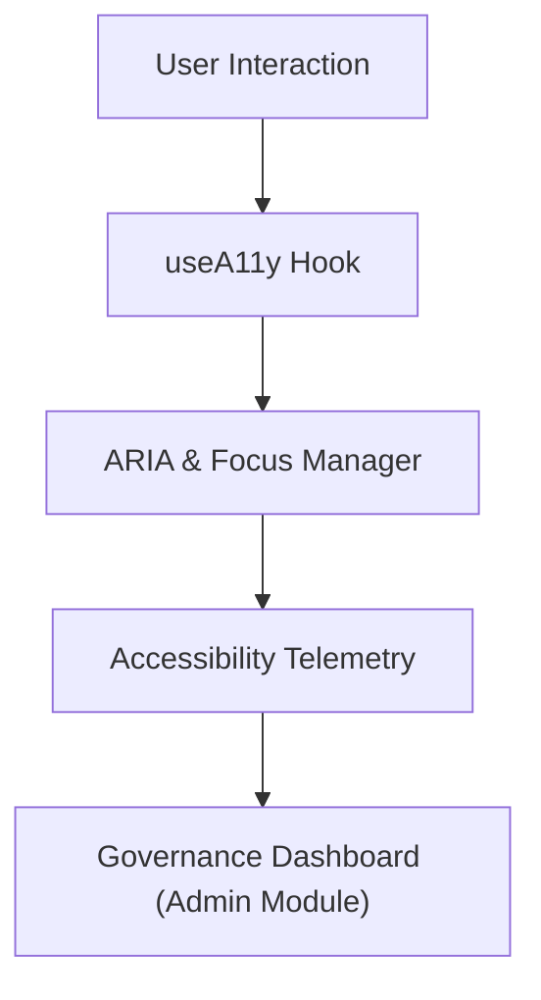

<div align="center">

# ♿ **Accessibility Framework — Inclusive UI & FAIR+CARE Compliance**  
`web/src/features/accessibility/README.md`

**Purpose:**  
Guarantee that every element of the Kansas Frontier Matrix (KFM) web application meets **WCAG 2.1 AA**, **FAIR+CARE**, and **ISO 30071-1** accessibility standards.  
This module centralizes accessibility hooks, keyboard navigation tools, ARIA labeling, and automated audits to ensure equitable participation and ethical data visualization.

[](../../../docs/)
[](../../../LICENSE)
[](../../../docs/standards/)
[](#)

</div>

---

## 📘 Overview

The **Accessibility Framework** ensures that KFM’s **Map**, **Timeline**, **Story**, **Search**, and **Focus Mode** features remain inclusive, legible, and navigable for all users.  
It bridges **technical accessibility (A11y)** with **ethical accessibility (FAIR+CARE)** — acknowledging cultural, linguistic, and physical dimensions of equitable access.

### Objectives
- ♿ Comply with **WCAG 2.1 AA** and **ISO 30071-1**.  
- 🧭 Provide **keyboard-first navigation** and **ARIA labeling** for all UI elements.  
- 🔊 Support **screen readers**, **high contrast**, and **reduced motion** modes.  
- 🌎 Extend **FAIR+CARE principles** into digital accessibility governance.  
- 📊 Emit telemetry on accessibility usage, compliance, and violations.

---

## 🗂️ Directory Layout

```plaintext
web/
└─ src/
   └─ features/
      └─ accessibility/
         README.md              # This file — Accessibility framework overview
         useA11y.ts             # Hook providing focus management & ARIA utilities
         skip-links.tsx         # Skip navigation component
         high-contrast.tsx      # Theme toggle for high contrast mode
         keyboard-shortcuts.ts  # Global keyboard accessibility handler
         a11y-audit.ts          # Runtime audit for ARIA and contrast issues
         announce.ts            # Live region announcer for screen readers
```

---

## ⚙️ Core Architecture



**Subsystems**
- **useA11y.ts:** React hook managing global focus and aria-live feedback.  
- **skip-links.tsx:** Provides “Skip to main content” and “Skip to map” anchors.  
- **high-contrast.tsx:** Toggles CSS theme tokens for color-blind accessibility.  
- **keyboard-shortcuts.ts:** Enables global keyboard command handling.  
- **announce.ts:** Handles dynamic updates for screen readers.  
- **a11y-audit.ts:** Runs runtime accessibility validation checks.

---

## 🧩 Example: `useA11y.ts`

```ts
import { useEffect } from "react";

export function useA11y() {
  useEffect(() => {
    const handleFocus = (e: FocusEvent) => {
      if (e.target instanceof HTMLElement) {
        e.target.classList.add("keyboard-focus");
      }
    };
    document.addEventListener("focusin", handleFocus);
    return () => document.removeEventListener("focusin", handleFocus);
  }, []);

  function announce(message: string) {
    const liveRegion = document.getElementById("aria-live-region");
    if (liveRegion) {
      liveRegion.textContent = message;
      liveRegion.setAttribute("aria-live", "polite");
    }
  }

  return { announce };
}
```

**Usage**
```tsx
const { announce } = useA11y();
announce("Year 1856 selected on timeline.");
```

---

## 🧠 Keyboard Shortcuts

| Action | Shortcut | Context |
|--------|-----------|----------|
| Move Timeline Slider | `← / →` | Timeline |
| Open Focus Panel | `Enter` | Focus Mode |
| Close Panel | `Esc` | Focus / Story |
| Next / Prev Story | `Shift + → / ←` | Story Explorer |
| Zoom Map | `+ / -` | MapLibre |
| Skip Navigation | `Ctrl + Alt + S` | Global |

> Keyboard navigation complies with WAI-ARIA `roving tabindex` design pattern.

---

## 🎨 High Contrast & Reduced Motion

The `high-contrast.tsx` component toggles accessibility themes using design tokens.

```tsx
export function HighContrastToggle() {
  return (
    <button aria-label="Toggle high contrast mode"
      onClick={() => document.body.classList.toggle('contrast-high')}>
      ♿ Contrast
    </button>
  );
}
```

### CSS Tokens
```css
:root {
  --text-color: #1a1a1a;
  --background-color: #ffffff;
}
.contrast-high {
  --text-color: #ffffff;
  --background-color: #000000;
}
```

**Reduced Motion**
```css
@media (prefers-reduced-motion: reduce) {
  * { animation-duration: 0.001ms !important; transition-duration: 0.001ms !important; }
}
```

---

## 🧾 Accessibility Audit (`a11y-audit.ts`)

Runtime audit utility validating ARIA roles and color contrast.

```ts
export function runA11yAudit() {
  const unlabeled = document.querySelectorAll('img:not([alt])').length;
  const missingRoles = document.querySelectorAll('[role]:not([aria-label])').length;
  const summary = { unlabeled, missingRoles, timestamp: new Date().toISOString() };
  console.log("[KFM A11y Audit]", summary);
  fetch('/api/telemetry', { method: 'POST', body: JSON.stringify({ event: 'a11y-audit', ...summary }) });
  return summary;
}
```

Audit results are stored in `reports/audit/ui_a11y_summary.json` for governance validation.

---

## 📊 Accessibility Telemetry

Every accessibility event logs into `focus-telemetry.json` under schema `web-accessibility-v1.json`.

```json
{
  "event": "a11y-toggle",
  "mode": "high-contrast",
  "timestamp": "2025-11-08T14:30:00Z",
  "user_role": "public",
  "faircare": { "a11y_compliant": true }
}
```

**Monitored Metrics**
- High-contrast activations  
- Screen reader announcements  
- Keyboard navigation usage  
- Reduced motion preference  
- A11y audit results (ARIA + color contrast)  

---

## ⚖️ FAIR+CARE Integration

Accessibility is part of KFM’s **CARE Governance** commitment.  

| FAIR/CARE Principle | Accessibility Mapping |
|---------------------|------------------------|
| **Findable** | Consistent ARIA region labeling for all data cards |
| **Accessible** | Inclusive keyboard and screen reader navigation |
| **Reusable** | Open-access design tokens and components |
| **Collective Benefit** | Multilingual support, cultural representation |
| **Authority to Control** | Role-based content visibility |
| **Responsibility** | Accessibility telemetry auditing |
| **Ethics** | Respect for diverse user capabilities and devices |

---

## ♻️ Governance & Reporting

- All A11y metrics feed into **Admin FAIR+CARE dashboard**.  
- CI workflows run automated audits using **axe-core** and **pa11y**.  
- Results published in:  
  - `reports/audit/ui_a11y_summary.json`  
  - `releases/v9.9.0/faircare_summary.json`  

> Governance council reviews accessibility compliance each quarter.

---

## 🧾 Internal Citation

```text
Kansas Frontier Matrix (2025). Accessibility Framework — Inclusive UI & FAIR+CARE Compliance (v9.9.0).
Ensures equitable participation, WCAG 2.1 AA compliance, and ethical accessibility governance for the Kansas Frontier Matrix web interface.
```

---

## 🕰️ Version History

| Version | Date       | Author | Summary |
|--------:|------------|--------|----------|
| v9.9.0 | 2025-11-08 | `@kfm-web` | Introduced unified accessibility framework with telemetry and FAIR+CARE integration. |
| v9.8.0 | 2025-11-05 | `@kfm-ui` | Added high contrast and reduced motion utilities. |
| v9.7.0 | 2025-11-01 | `@kfm-core` | Established ARIA and keyboard navigation baseline. |

---

<div align="center">

**Kansas Frontier Matrix**  
*Inclusive Design × FAIR+CARE Governance × Sustainable Accessibility*  
© 2025 Kansas Frontier Matrix · Master Coder Protocol v6.3 · FAIR+CARE Certified · Diamond⁹ Ω / Crown∞Ω Ultimate Certified  

[Back to Web Features](../README.md) · [Governance Charter](../../../docs/standards/governance/DATA-GOVERNANCE.md)

</div>

