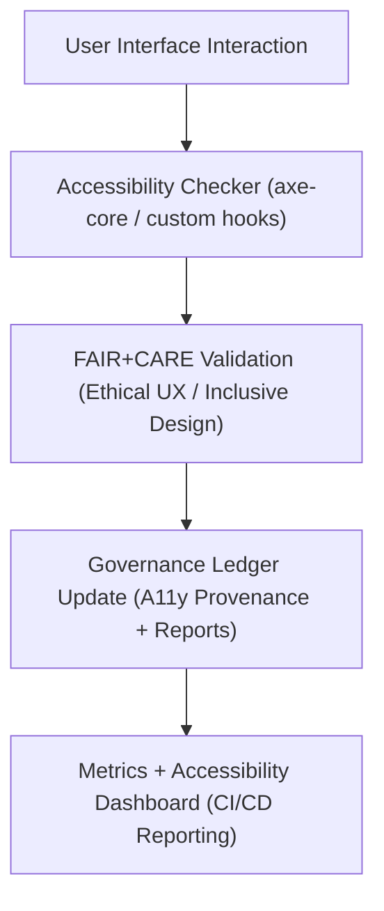

<div align="center">

# ♿ **Kansas Frontier Matrix — Accessibility Feature Module (v2.1.1 · Tier-Ω+∞ Certified)**  
`web/src/features/accessibility/README.md`

**Mission:** Ensure all **Kansas Frontier Matrix (KFM)** web interfaces meet the highest  
standards of **accessibility, inclusivity, and ethical usability** — aligning FAIR+CARE principles  
with WCAG 2.1 AA and governance-led UX verification.

[](../../../../docs/)
[](../../../../docs/standards/faircare-validation.md)
[](../../../../docs/standards/accessibility.md)
[](../../../../LICENSE)

</div>

---

## 📚 Overview

The **Accessibility Feature Module** ensures the KFM web application is **usable by all audiences**,  
including users with visual, motor, cognitive, and auditory disabilities.  
It provides real-time WCAG validation, user preference management, and integrated FAIR+CARE alignment.

Core objectives:
- ✅ Guarantee full compliance with **WCAG 2.1 AA / 3.0 readiness**.  
- 🧭 Provide customizable accessibility preferences (contrast, font size, color modes).  
- 📊 Run automated and manual FAIR+CARE accessibility audits.  
- 🧩 Integrate accessibility feedback directly into governance reports.  

---

## 🗂️ Directory Layout

```bash
web/src/features/accessibility/
├── README.md                      # This file — Accessibility module documentation
│
├── checker/                       # Real-time accessibility audit and WCAG validation
│   ├── a11y-checker.tsx            # Runs accessibility scans using axe-core
│   ├── color-contrast.tsx          # Validates and adjusts color contrast ratios
│   └── aria-validator.ts           # Checks ARIA label and landmark consistency
│
└── preferences/                   # User accessibility preferences and configurations
    ├── accessibility-panel.tsx     # UI panel for user a11y settings (contrast, text size, etc.)
    ├── theme-switcher.tsx          # Enables light/dark/high-contrast mode
    └── save-preferences.ts         # Persists settings to local storage
```

---

## ⚙️ Accessibility Governance Model


<!-- END OF MERMAID -->

---

## 🧱 Core Components

| Component | Description | FAIR+CARE Function | Validation Workflow |
|:--|:--|:--|:--|
| **A11y Checker** | Runs automated WCAG audits with axe-core integration. | Responsibility + Accessibility | `design-validate.yml` |
| **Color Contrast Validator** | Checks and corrects low-contrast color combinations. | Inclusivity + Ethics | `design-validate.yml` |
| **ARIA Validator** | Ensures semantic and navigable ARIA landmarks. | Transparency + Usability | `docs-validate.yml` |
| **Accessibility Panel** | User-facing settings for text size, contrast, and animation control. | Collective Benefit (CARE) | `faircare-validate.yml` |
| **Theme Switcher** | Provides light/dark/high-contrast color modes. | Accessibility + Autonomy | `ui-validate.yml` |

---

## 🧠 FAIR + CARE Integration

| Principle | Implementation | Validation |
|:--|:--|:--|
| **Findable** | Accessibility metrics indexed in governance reports. | `governance-ledger.yml` |
| **Accessible** | WCAG 2.1 AA compliance enforced throughout UI. | `design-validate.yml` |
| **Interoperable** | axe-core and Lighthouse integrated with CI/CD. | `policy-check.yml` |
| **Reusable** | Reports stored for reproducibility and audits. | `faircare-validate.yml` |
| **Collective Benefit (CARE)** | Accessibility fosters equitable, inclusive design. | `faircare-validate.yml` |

---

## ♿ Accessibility Standards (WCAG 2.1 AA)

| Standard | Description | Implementation |
|:--|:--|:--|
| **1.1.1 – Text Alternatives** | Provide alt text for all images. | Enforced by axe-core validator. |
| **1.4.3 – Contrast (Minimum)** | Ensure ≥ 4.5:1 color ratio for all UI text. | Implemented in `color-contrast.tsx`. |
| **2.1.1 – Keyboard Accessibility** | Full keyboard navigation for UI. | Managed via focus hooks and ARIA states. |
| **2.4.6 – Headings and Labels** | Clear headings for all sections. | Audited via `aria-validator.ts`. |
| **3.1.5 – Reading Level** | Simplified text with FAIR+CARE context. | Verified in `faircare-validate.yml`. |

---

## 🔍 Provenance & Governance Integration

| Artifact | Purpose | Path |
|:--|:--|:--|
| **Accessibility Reports** | Logs WCAG validation results. | `reports/validation/a11y_validation.json` |
| **FAIR+CARE Ethics Log** | Records inclusive and ethical design checks. | `reports/fair/data_care_assessment.json` |
| **Governance Ledger** | Stores checksum and compliance audit entries. | `data/reports/audit/data_provenance_ledger.json` |

---

## 🧩 Example Component Metadata

```yaml
---
component_id: "accessibility_module_v2.1.1"
authors: ["@kfm-web","@kfm-accessibility"]
faircare_status: "Tier-Ω+∞ Verified"
checksum: "sha256:a91c9dbe8d4a27bf..."
governance_ledger_entry: "data/reports/audit/data_provenance_ledger.json"
accessibility_compliance: "WCAG 2.1 AA"
license: "MIT"
---
```

---

## 🧮 Observability Metrics

| Metric | Description | Target | Workflow |
|:--|:--|:--|:--|
| **WCAG Compliance Score** | Overall score from accessibility scans. | ≥ 95 | `design-validate.yml` |
| **FAIR+CARE Compliance Rate** | Ethics-aligned accessibility validation. | ≥ 95 | `faircare-validate.yml` |
| **User Preference Persistence Rate** | Successful retention of saved a11y preferences. | 100% | `ui-validate.yml` |
| **Governance Sync Rate** | Provenance successfully logged to ledger. | 100% | `governance-ledger.yml` |

---

## 🧾 Validation Workflows

| Workflow | Function | Output |
|:--|:--|:--|
| `design-validate.yml` | Validates accessibility standards (WCAG / ARIA). | `reports/validation/a11y_validation.json` |
| `ui-validate.yml` | Tests preference toggles, modes, and focus behavior. | `reports/validation/ui_validation.json` |
| `faircare-validate.yml` | Verifies inclusive and ethical UX design. | `reports/fair/data_care_assessment.json` |
| `governance-ledger.yml` | Logs audit and checksum records. | `data/reports/audit/data_provenance_ledger.json` |

---

## 🕰 Version History

| Version | Date | Author | Summary |
|:--|:--|:--|:--|
| **v2.1.1** | 2025-11-16 | @kfm-web | Added real-time WCAG validation dashboard and user preferences management. |
| v2.0.0 | 2025-10-25 | @kfm-accessibility | Integrated axe-core validator and FAIR+CARE ethics checks. |
| v1.0.0 | 2025-10-04 | @kfm-docs | Initial accessibility feature documentation and standards mapping. |

---

<div align="center">

**Kansas Frontier Matrix © 2025**  
*“Accessibility Is Ethics — Ethics Is Governance.”*  
📍 `web/src/features/accessibility/README.md` — FAIR+CARE-aligned accessibility module documentation for the Kansas Frontier Matrix.

</div>

