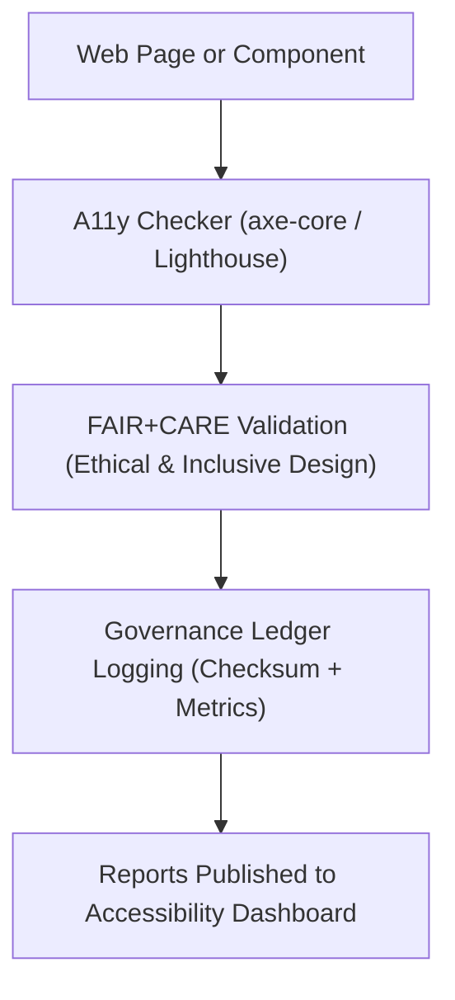

<div align="center">

# 🧩 **Kansas Frontier Matrix — Accessibility Checker Module (v2.1.1 · Tier-Ω+∞ Certified)**  
`web/src/features/accessibility/checker/README.md`

**Mission:** Automate and standardize **accessibility validation** across the  
**Kansas Frontier Matrix (KFM)** web application — ensuring every interface meets WCAG 2.1 AA  
and FAIR+CARE-aligned inclusivity standards through real-time auditing and governance integration.

[](../../../../../docs/)
[](../../../../../docs/standards/faircare-validation.md)
[](../../../../../docs/standards/accessibility.md)
[](../../../../../LICENSE)

</div>

---

## 📚 Overview

The **Accessibility Checker Module** provides **automated accessibility auditing**,  
real-time **WCAG compliance reporting**, and integration with FAIR+CARE governance metrics.  
It uses **axe-core** and **Lighthouse APIs** for automated scanning, and feeds results  
into KFM’s governance ledger and accessibility dashboard for transparency and accountability.

Core objectives:
- 🔍 Validate all web components for WCAG 2.1 AA and ARIA compliance.  
- ⚙️ Integrate FAIR+CARE accessibility metrics into CI/CD workflows.  
- 📊 Generate auditable accessibility reports for governance review.  
- ♿ Support real-time feedback in developer and user environments.  

---

## 🗂️ Directory Layout

```bash
web/src/features/accessibility/checker/
├── README.md                     # This file — Accessibility checker documentation
│
├── a11y-checker.tsx              # Core module for automated accessibility scanning
├── color-contrast.tsx            # Validates and adjusts color contrast per WCAG
└── aria-validator.ts             # Checks ARIA landmarks and semantic structure
```

---

## ⚙️ Accessibility Governance Model


<!-- END OF MERMAID -->

---

## 🧱 Core Components

| Component | Description | FAIR+CARE Function | Validation Workflow |
|:--|:--|:--|:--|
| **A11y Checker** | Runs real-time accessibility scans and reports results. | Responsibility + Transparency | `design-validate.yml` |
| **Color Contrast** | Evaluates all color combinations for WCAG compliance. | Inclusivity + Ethics | `design-validate.yml` |
| **ARIA Validator** | Ensures correct ARIA roles, regions, and landmarks. | Accessibility + Reusability | `docs-validate.yml` |

---

## 🧠 FAIR + CARE Integration

| Principle | Implementation | Validation |
|:--|:--|:--|
| **Findable** | Accessibility reports stored in governance dashboard. | `governance-ledger.yml` |
| **Accessible** | Web interface follows WCAG 2.1 AA standards. | `design-validate.yml` |
| **Interoperable** | Exports results as JSON and CSV for reporting tools. | `policy-check.yml` |
| **Reusable** | Archived audits for reproducibility. | `faircare-validate.yml` |
| **Collective Benefit (CARE)** | Ensures equitable usability for all users. | `faircare-validate.yml` |

---

## ♿ Accessibility Standards (WCAG 2.1 AA)

| Guideline | Description | Enforcement |
|:--|:--|:--|
| **1.1.1 – Text Alternatives** | All images and visuals require alt text. | `a11y-checker.tsx` |
| **1.4.3 – Contrast (Minimum)** | Maintain ≥ 4.5:1 contrast ratio. | `color-contrast.tsx` |
| **2.1.1 – Keyboard Accessibility** | All interactive elements accessible via keyboard. | `aria-validator.ts` |
| **2.4.6 – Headings and Labels** | Use clear, descriptive headings. | `a11y-checker.tsx` |
| **3.1.5 – Reading Level** | Simplify and structure complex text. | `faircare-validate.yml` |

---

## 🔍 Provenance & Governance Integration

| Artifact | Description | Path |
|:--|:--|:--|
| **Accessibility Reports** | Validation results and WCAG metrics. | `reports/validation/a11y_validation.json` |
| **FAIR+CARE Audit Logs** | Ethics and inclusivity report outputs. | `reports/fair/data_care_assessment.json` |
| **Governance Ledger** | Provenance and checksum for validation records. | `data/reports/audit/data_provenance_ledger.json` |

> Every accessibility report is cryptographically verified and logged for audit compliance.

---

## 🧾 Example Component Metadata

```yaml
---
component_id: "accessibility_checker_v2.1.1"
authors: ["@kfm-web","@kfm-accessibility"]
faircare_status: "Tier-Ω+∞ Verified"
checksum: "sha256:19c5f3b74da95ee0..."
governance_ledger_entry: "data/reports/audit/data_provenance_ledger.json"
accessibility_compliance: "WCAG 2.1 AA"
license: "MIT"
---
```

---

## 🧮 Observability Metrics

| Metric | Description | Target | Workflow |
|:--|:--|:--|:--|
| **WCAG Pass Rate** | % of components passing accessibility scan. | 100% | `design-validate.yml` |
| **Contrast Compliance** | % of valid color contrast pairs. | 100% | `design-validate.yml` |
| **FAIR+CARE Audit Score** | Inclusivity and ethics compliance rating. | ≥ 95 | `faircare-validate.yml` |
| **Governance Sync Rate** | Ledger logging success for validation results. | 100% | `governance-ledger.yml` |

---

## 🧾 Validation Workflows

| Workflow | Function | Output |
|:--|:--|:--|
| `design-validate.yml` | Runs accessibility (WCAG / ARIA) checks and logs. | `reports/validation/a11y_validation.json` |
| `faircare-validate.yml` | Assesses ethical inclusivity and FAIR+CARE compliance. | `reports/fair/data_care_assessment.json` |
| `policy-check.yml` | Verifies metadata, governance linkage, and version tags. | `reports/audit/policy_check.json` |
| `governance-ledger.yml` | Records checksum and audit provenance entries. | `data/reports/audit/data_provenance_ledger.json` |

---

## 🕰 Version History

| Version | Date | Author | Summary |
|:--|:--|:--|:--|
| **v2.1.1** | 2025-11-16 | @kfm-web | Added integrated axe-core auditing, provenance logging, and FAIR+CARE metrics. |
| v2.0.0 | 2025-10-25 | @kfm-accessibility | Introduced real-time WCAG validation and color contrast tools. |
| v1.0.0 | 2025-10-04 | @kfm-docs | Initial accessibility checker documentation. |

---

<div align="center">

**Kansas Frontier Matrix © 2025**  
*“Accessibility Audited. Ethics Verified. Provenance Recorded.”*  
📍 `web/src/features/accessibility/checker/README.md` — FAIR+CARE-aligned accessibility checker documentation for the Kansas Frontier Matrix.

</div>

