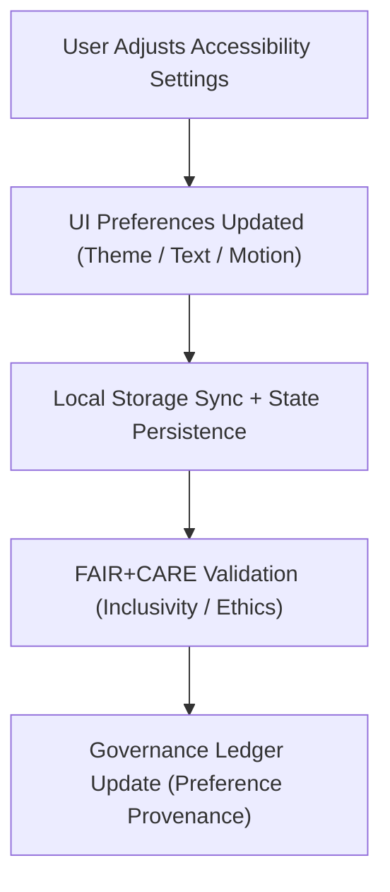

<div align="center">

# ⚙️ **Kansas Frontier Matrix — Accessibility Preferences Module (v2.1.1 · Tier-Ω+∞ Certified)**  
`web/src/features/accessibility/preferences/README.md`

**Mission:** Provide an intuitive and FAIR+CARE-aligned **user preferences system**  
for accessibility and usability in the **Kansas Frontier Matrix (KFM)** web platform —  
ensuring equitable digital access and personal control over UI experience.

[](../../../../../docs/)
[](../../../../../docs/standards/faircare-validation.md)
[](../../../../../docs/standards/accessibility.md)
[](../../../../../LICENSE)

</div>

---

## 📚 Overview

The **Accessibility Preferences Module** empowers users to customize their KFM web experience  
according to their accessibility needs — supporting visual, auditory, and cognitive accommodations  
while maintaining **FAIR+CARE ethical design principles** and **WCAG 2.1 AA** compliance.

Core objectives:
- 🧩 Provide configurable accessibility options (contrast, text size, motion).  
- ♿ Enable WCAG-compliant interface personalization.  
- 🔄 Persist preferences securely in local storage.  
- 🔗 Integrate FAIR+CARE governance for inclusivity and transparency.

---

## 🗂️ Directory Layout

```bash
web/src/features/accessibility/preferences/
├── README.md                       # This file — Accessibility preferences documentation
│
├── accessibility-panel.tsx          # Main UI component for user accessibility settings
├── theme-switcher.tsx               # Controls light/dark/high-contrast modes
└── save-preferences.ts              # Persists user settings to local storage or API
```

---

## ⚙️ Accessibility Preferences Governance Model


<!-- END OF MERMAID -->

---

## 🧱 Core Components

| Component | Description | FAIR+CARE Function | Validation Workflow |
|:--|:--|:--|:--|
| **Accessibility Panel** | Central control interface for accessibility settings. | Collective Benefit (CARE) | `faircare-validate.yml` |
| **Theme Switcher** | Enables light, dark, or high-contrast color modes. | Responsibility + Autonomy | `design-validate.yml` |
| **Save Preferences** | Stores user accessibility preferences persistently. | Transparency + Reusability | `ui-validate.yml` |

---

## 🧠 FAIR + CARE Integration

| Principle | Implementation | Validation |
|:--|:--|:--|
| **Findable** | Preferences schema indexed in governance ledger. | `governance-ledger.yml` |
| **Accessible** | User-controlled settings align with WCAG 2.1 AA. | `design-validate.yml` |
| **Interoperable** | JSON-based schema for preference persistence. | `policy-check.yml` |
| **Reusable** | Settings reusable across devices and sessions. | `ui-validate.yml` |
| **Collective Benefit (CARE)** | Empowers inclusive participation via personalization. | `faircare-validate.yml` |

---

## ♿ Accessibility Standards (WCAG 2.1 AA)

| Standard | Description | Implementation |
|:--|:--|:--|
| **1.4.3 – Contrast (Minimum)** | Users can toggle high-contrast mode. | Implemented in `theme-switcher.tsx`. |
| **2.2.2 – Pause, Stop, Hide** | Motion effects can be disabled. | Managed in `accessibility-panel.tsx`. |
| **3.1.5 – Reading Level** | Adjustable font scaling for readability. | Implemented in `accessibility-panel.tsx`. |
| **2.1.1 – Keyboard Accessibility** | All controls navigable via keyboard. | Verified in `ui-validate.yml`. |

---

## 🔍 Provenance & Governance Integration

| Artifact | Purpose | Path |
|:--|:--|:--|
| **Accessibility Preferences Schema** | Stores user settings as JSON for reproducibility. | `web/src/features/accessibility/preferences/schema.json` |
| **Governance Ledger** | Tracks updates and preference-related provenance. | `data/reports/audit/data_provenance_ledger.json` |
| **FAIR+CARE Validation Report** | Logs ethics and inclusivity audits. | `data/reports/fair/data_care_assessment.json` |

---

## 🧾 Example Component Metadata

```yaml
---
component_id: "accessibility_preferences_v2.1.1"
authors: ["@kfm-web","@kfm-accessibility"]
faircare_status: "Tier-Ω+∞ Verified"
checksum: "sha256:7cb8a12e9a79c0df..."
governance_ledger_entry: "data/reports/audit/data_provenance_ledger.json"
accessibility_compliance: "WCAG 2.1 AA"
license: "MIT"
---
```

---

## 🧮 Observability Metrics

| Metric | Description | Target | Workflow |
|:--|:--|:--|:--|
| **Preference Persistence Rate** | % of preferences successfully saved. | 100% | `ui-validate.yml` |
| **Accessibility Compliance (WCAG)** | UI meets all accessibility requirements. | ≥ 95 | `design-validate.yml` |
| **FAIR+CARE Inclusivity Score** | Audit score for ethical customization. | ≥ 95 | `faircare-validate.yml` |
| **Governance Sync Rate** | Preferences logged in governance ledger. | 100% | `governance-ledger.yml` |

---

## 🧾 Validation Workflows

| Workflow | Function | Output |
|:--|:--|:--|
| `ui-validate.yml` | Tests interaction and persistence logic. | `reports/validation/ui_validation.json` |
| `design-validate.yml` | Validates accessibility and contrast compliance. | `reports/validation/a11y_validation.json` |
| `faircare-validate.yml` | Reviews inclusivity and ethical impact. | `reports/fair/data_care_assessment.json` |
| `governance-ledger.yml` | Logs changes and provenance metadata. | `data/reports/audit/data_provenance_ledger.json` |

---

## 🕰 Version History

| Version | Date | Author | Summary |
|:--|:--|:--|:--|
| **v2.1.1** | 2025-11-16 | @kfm-web | Added governance-linked preference schema and accessibility control documentation. |
| v2.0.0 | 2025-10-25 | @kfm-accessibility | Introduced FAIR+CARE personalization audit integration. |
| v1.0.0 | 2025-10-04 | @kfm-docs | Initial accessibility preferences module documentation. |

---

<div align="center">

**Kansas Frontier Matrix © 2025**  
*“Personal Choice Is Universal Access — Accessibility Is a Human Right.”*  
📍 `web/src/features/accessibility/preferences/README.md` — FAIR+CARE-aligned accessibility preferences module documentation for the Kansas Frontier Matrix.

</div>

