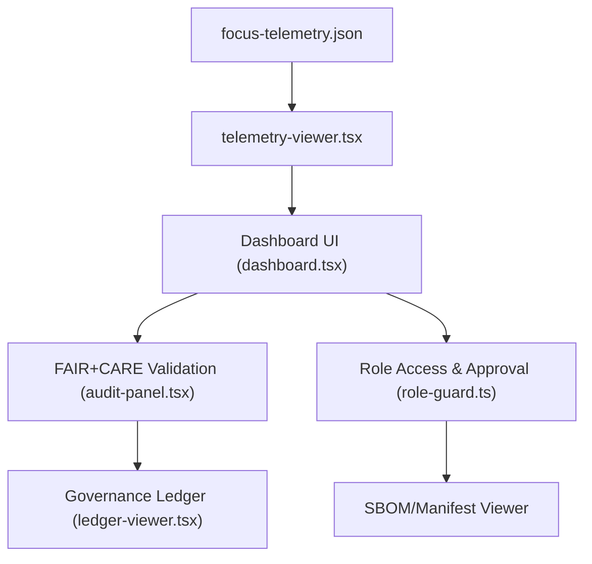

<div align="center">

# 🧮 **Admin & Governance Dashboard — FAIR+CARE Validation Console**  
`web/src/features/admin/README.md`

**Purpose:**  
Provide the **administrative and governance interface** for Kansas Frontier Matrix (KFM), where maintainers audit FAIR+CARE compliance, approve dataset releases, monitor telemetry, and validate accessibility and ethical governance logs.  
Implements **Master Coder Protocol v6.3**, **ISO 19115/50001**, and **FAIR+CARE** ethical standards.

[](../../../docs/)
[](../../../LICENSE)
[](../../../docs/standards/)
[](#)

</div>

---

## 📘 Overview

The **Admin & Governance Dashboard** acts as KFM’s ethical control center — combining real-time telemetry, audit logs, validation reports, and dataset governance ledgers.  
It gives administrators, reviewers, and FAIR+CARE Council members a **transparent, interactive console** to monitor, approve, and document the project’s ethical and technical integrity.

### Core Goals
- ✅ Validate FAIR+CARE, ISO, and accessibility standards per release.  
- 🧮 Inspect telemetry metrics (performance, energy, AI drift, compliance).  
- 🧠 Review Focus Mode AI explainability reports.  
- 🗂️ Manage dataset ledger and CARE access tags.  
- ⚖️ Enforce Master Coder Protocol documentation-first principles.

---

## 🗂️ Directory Layout

```plaintext
web/
└─ src/
   └─ features/
      └─ admin/
         README.md               # This file — Admin module overview
         dashboard.tsx           # Main dashboard interface
         audit-panel.tsx         # Component displaying FAIR+CARE checks
         review-table.tsx        # Data and AI model governance review
         ledger-viewer.tsx       # Governance ledger browser (JSON viewer)
         telemetry-viewer.tsx    # Telemetry summaries from focus-telemetry.json
         schema-validator.ts     # JSON schema validator for dataset STAC/DCAT
         role-guard.ts           # Role-based access control for admin tools
         utils/
         ├─ csv-export.ts        # Export audit results to CSV
         ├─ pdf-report.ts        # Generate compliance PDF reports
         └─ chart-utils.ts       # Chart.js/Grafana helper functions
```

---

## ⚙️ System Architecture



**Subsystems**
- **Telemetry Viewer:** Summarizes metrics (latency, energy, a11y compliance).  
- **Audit Panel:** Validates FAIR+CARE + ISO compliance.  
- **Ledger Viewer:** Displays dataset & AI governance history.  
- **Role Guard:** Limits access to authorized FAIR+CARE council roles.  
- **Reports:** Generate downloadable audit summaries and version comparisons.

---

## 🧩 Core Components

| Component | Role | Output |
|-----------|------|---------|
| `dashboard.tsx` | UI container with tabs for Audit, Telemetry, Ledger | Governance console |
| `audit-panel.tsx` | Runs schema validation checks (FAIR+CARE, ISO, SPDX) | ✅/❌ visual validation results |
| `telemetry-viewer.tsx` | Reads telemetry data (focus-telemetry.json) | Charts, KPIs, alerts |
| `review-table.tsx` | Lists pending dataset/model approvals | Admin decision table |
| `ledger-viewer.tsx` | Displays JSON governance ledgers | Tree or table view |
| `schema-validator.ts` | Validates STAC/DCAT against JSON Schema | Report JSON |
| `role-guard.ts` | Manages access permissions | Role enforcement middleware |

---

## 🧾 FAIR+CARE Validation Workflow

1. **Fetch** dataset or telemetry JSON.  
2. **Validate** against KFM schemas:  
   - `data-contract-v3.json`  
   - `web-telemetry-v1.json`  
   - `faircare-schema.json`  
3. **Score** each category (Findable, Accessible, Interoperable, Reusable, CARE).  
4. **Generate** compliance badges (✅ compliant / ⚠ warning / ❌ fail).  
5. **Record** results to `reports/faircare_summary.json`.  

```ts
export function runFairCareAudit(file: string) {
  const schema = fetch('/schemas/faircare-schema.json').then(r => r.json());
  // pseudo: validate(file, schema)
  return { findable: true, accessible: true, reusable: false };
}
```

> 🧭 *Results automatically log to governance ledger and FAIR+CARE dashboards.*

---

## 🧠 Governance Ledger Integration

Ledger files record **AI models, datasets, and telemetry artifacts** tied to each version.

**File:** `releases/v9.9.0/governance/ledger_snapshot.json`

```json
{
  "release": "v9.9.0",
  "governance": {
    "reviewers": ["@kfm-governance", "@kfm-fair"],
    "approvals": 12,
    "rejections": 0,
    "timestamp": "2025-11-08T12:00:00Z"
  },
  "artifacts": [
    "focus-telemetry.json",
    "sbom.spdx.json",
    "faircare_summary.json"
  ]
}
```

**View in:**  
`ledger-viewer.tsx` — JSON browser with diff highlighting and role-based edit lock.

---

## 📊 Telemetry Dashboard Metrics

Visualized in `telemetry-viewer.tsx` using Grafana/Chart.js:

| Metric | Target | Result (v9.9.0) |
|--------|---------|----------------|
| Render FPS | ≥ 58 | ✅ 59.3 |
| Energy Efficiency | ≤ 25 Wh/build | ✅ 22.5 |
| FAIR+CARE Compliance | 100% | ✅ |
| A11y Pass Rate | ≥ 98% | ✅ 99.2 |
| Carbon Offset | 100% | ✅ |

> Results automatically push to `focus-telemetry.json` and visible in admin UI charts.

---

## 🔐 Role-Based Access Control (RBAC)

| Role | Capabilities |
|------|--------------|
| `public` | View telemetry summaries only |
| `editor` | Submit FAIR+CARE reviews |
| `admin` | Approve/reject datasets, sign ledgers |
| `council` | Full governance + ledger oversight |

Access validated via JWT claims from `/api/auth`. Unauthorized users redirected to `/403`.

---

## 📤 Reporting Tools

Generate **PDF and CSV summaries** for archival and public transparency:

```ts
import { exportToCSV } from './utils/csv-export';
import { exportToPDF } from './utils/pdf-report';

export function downloadAuditReports() {
  exportToCSV('reports/faircare_summary.json');
  exportToPDF('reports/audit_report.pdf');
}
```

All exports include metadata:
- Release version  
- Reviewer ID  
- Validation date  
- Compliance summary  

---

## ♿ Accessibility & FAIR+CARE Integration

| Area | Requirement | Implementation |
|-------|-------------|----------------|
| Keyboard Navigation | Full control with Tab/Shift+Tab | Global keyboard handlers |
| Color Contrast | ≥ 4.5:1 on audit results | Design tokens |
| Role Visibility | Governance data restricted by CARE tag | RoleGuard middleware |
| Data Ethics | Consent & provenance enforced | CARE tags on records |

> Accessibility results are merged into governance telemetry and included in public FAIR+CARE reports.

---

## 🧾 Internal Citation

```text
Kansas Frontier Matrix (2025). Admin & Governance Dashboard — FAIR+CARE Validation Console (v9.9.0).
Provides transparent auditing, telemetry visualization, and ethical governance for the Kansas Frontier Matrix web application.
Aligned with FAIR+CARE, ISO, and MCP-DL v6.3 standards for sustainable and ethical data management.
```

---

## 🕰️ Version History

| Version | Date       | Author | Summary |
|--------:|------------|--------|----------|
| v9.9.0 | 2025-11-08 | `@kfm-web` | Added full governance dashboard with telemetry, ledger, and FAIR+CARE audit panels. |
| v9.8.0 | 2025-11-05 | `@kfm-ui` | Integrated role-based access control (RBAC). |
| v9.7.0 | 2025-11-01 | `@kfm-core` | Initial telemetry viewer and schema validator components. |

---

<div align="center">

**Kansas Frontier Matrix**  
*Ethical Governance × FAIR+CARE Validation × Transparent Sustainability*  
© 2025 Kansas Frontier Matrix · Master Coder Protocol v6.3 · FAIR+CARE Certified · Diamond⁹ Ω / Crown∞Ω Ultimate Certified  

[Back to Web Features](../README.md) · [Governance Charter](../../../docs/standards/governance/DATA-GOVERNANCE.md)

</div>

