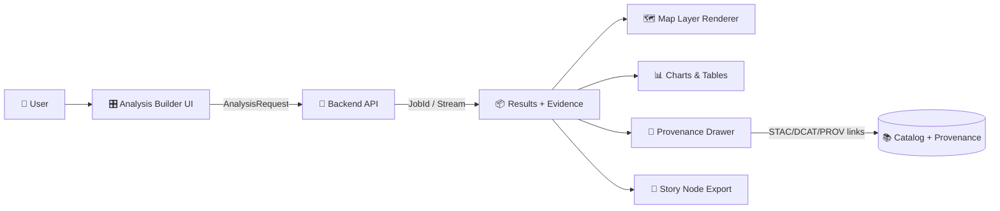

# 📈 Analysis Feature


> 🧠✨ **KFM Analysis = “Ask a question → run a reproducible computation → get a map layer + stats + a story-ready explanation with citations.”**

---

## 🔗 Quick Nav

- [🎯 Purpose](#-purpose)
- [✅ Non‑Negotiables](#-nonnegotiables)
- [🧱 Architecture](#-architecture)
- [🎛️ UI Surfaces](#️-ui-surfaces)
- [🧾 Contracts](#-contracts)
- [🧠 Analysis Operations](#-analysis-operations)
- [🗺️ Rendering & Visualization](#️-rendering--visualization)
- [➕ Add a New Analysis Operation](#-add-a-new-analysis-operation)
- [🧪 Testing Strategy](#-testing-strategy)
- [♻️ Performance](#️-performance)
- [🔐 Security & Governance](#-security--governance)
- [📚 References](#-references)
- [🏷️ Glossary](#️-glossary)

---

## 🎯 Purpose

This feature powers **interactive analysis workflows** in the Kansas Frontier Matrix (KFM) web app:

- 🧮 **Compute**: stats, trends, correlations, regressions, comparisons, change detection  
- 🗺️ **Spatially reason**: buffer, intersect, within, spatial joins, zonal summaries  
- 🧾 **Explain**: produce narrative results that are **evidence-first** and **citation-backed**  
- 🧩 **Integrate**: turn analysis outputs into **derived layers**, **Focus Mode answers**, and **Story Nodes**

### ✅ What this feature owns
- **Analysis UX** (builder → execution → results + provenance)
- **Client-side orchestration** (requests, polling/streaming, caching)
- **Visualization of results** (map overlays, charts, tables)
- **Provenance UI** (dataset lineage, STAC/DCAT/PROV links, processing notes)
- **Export workflows** (story-ready markdown, shareable result artifacts)

### 🚫 What this feature does *not* own
- Heavy compute / ETL / raster processing (belongs to the pipeline & backend)
- Raw dataset ingestion, georeferencing, OCR, remote sensing pipelines
- Direct DB / graph access from the browser (API boundary rule)

---

## ✅ Non‑Negotiables

> These are “ship-stoppers” 🛑 — if a change violates any of these, it **does not merge**.

1) **Pipeline ordering is inviolable** 🧬  
   `ETL → Catalogs (STAC/DCAT/PROV) → Graph → API → UI → Story Nodes → Focus Mode`  
   - This feature sits in **UI** and may *only* surface data that has already passed catalog + provenance gates.

2) **API boundary** 🔌  
   - UI **never queries the graph (Neo4j) directly**.  
   - UI consumes **stable contracts** from the backend.

3) **Provenance-first UI** 🧾  
   - Every result must show *what it’s based on* (datasets, time ranges, transformations).  
   - Derived layers must link back to lineage (STAC items / DCAT datasets / PROV bundles).

4) **Evidence-first narrative** 🧠➡️📌  
   - No “vibes-based” summaries.  
   - If we can’t cite it, we present it as a hypothesis (or we don’t present it).

5) **Classification & redaction propagate** 🔒  
   - Outputs can never be less restricted than inputs.  
   - If inputs require spatial generalization (blur/fuzz), the result must inherit that behavior.

6) **Contracts are first-class** 📜  
   - Request/Response shapes must be versioned and validated (runtime + compile-time).
   - “Add endpoint first, wire UI second.”

---

## 🧱 Architecture

### 🧠 Mental model



### 🧩 Suggested folder layout

> This is the *target* layout for long-term sanity 🧘 (adapt to repo conventions as needed).

```text
web/src/features/analysis/
├─ 📄 README.md
│
├─ 🧠 registry/
│  ├─ 🧠🧾 analysisOps.ts            # list of operations + UI metadata
│  └─ 🎛️🧾 renderers.ts              # per-op result renderers (map/chart/table)
│
├─ 🔌 api/
│  ├─ 🔌🧾 analysisClient.ts         # typed client calls
│  ├─ 🔎🧾 analysisQueries.ts        # query keys, caching helpers
│  └─ 📐🛡️ contracts.ts              # runtime validators (zod/io-ts) mapped to schemas
│
├─ 🧩 components/
│  ├─ 🧩 AnalysisPanel/
│  ├─ 🧩 AnalysisBuilder/
│  ├─ 🧩 AnalysisRunButton/
│  ├─ 🧩 AnalysisResults/
│  ├─ 🧬 ProvenanceDrawer/
│  ├─ 🧾 EvidenceList/
│  └─ 📤 ExportStoryNodeButton/
│
├─ 🪝 hooks/
│  ├─ 🪝 useRunAnalysis.ts
│  ├─ 📡🪝 useAnalysisJob.ts         # poll/stream status updates
│  └─ 💾🪝 useAnalysisCache.ts       # local cache for results + artifacts
│
├─ 🧰 utils/
│  ├─ 📐 geometry.ts                 # sanitize, simplify, bbox helpers
│  ├─ 📏 units.ts                    # km²/mi², °F/°C, etc.
│  └─ 📊 stats.ts                    # tiny client-side helpers (only for small data)
│
└─ 🧪 __tests__/
   ├─ 🧪 contracts.test.ts
   ├─ 🧪 registry.test.ts
   └─ 🧪 renderers.test.ts
```

---

## 🎛️ UI Surfaces

### 1) 🧭 Analysis Builder
- Choose **operation** (e.g., *Summarize land use*, *Trend since 1950*, *Buffer + count features*)
- Provide **scope**:
  - 📍 geometry (draw polygon / select county / pick a point)
  - 🕰️ time range (timeline brush)
  - 🧱 input layers (datasets / derived layers)
- Configure parameters (bin size, aggregation, smoothing, distance, etc.)

### 2) 🧾 Results Viewer
- 🗺️ Derived layer (overlay on map)
- 📊 Metrics (cards)
- 📈 Charts (trend / histogram / scatter)
- 📋 Table (drilldown + export)

### 3) 🧷 Provenance Drawer (must-have)
- 📚 Input datasets (IDs, versions, coverage)
- 🧪 Processing notes (what transform happened)
- 🔗 Links to provenance objects (STAC/DCAT/PROV)
- 🏷️ Classification badge & redaction notice

### 4) 🧱 Story Node Export
- One-click export of:
  - a short markdown summary ✅
  - citations ✅
  - “how computed” ✅
  - optional static map thumbnail 🖼️ (if supported by backend)

---

## 🧾 Contracts

> **Contract-first rule**: treat contracts like public APIs.  
> Add schema ➜ validate ➜ then render.

### 📨 AnalysisRequest (example)

```ts
export type AnalysisOperationId =
  | "zonal_summary"
  | "buffer_count"
  | "time_trend"
  | "compare_layers"
  | "simple_regression"
  | "hotspot_clustering";

export interface AnalysisRequest {
  operation: AnalysisOperationId;

  // 🔎 Scope
  geometry?: GeoJSON.Geometry;   // polygon/point/line OR derived selection
  bbox?: [number, number, number, number];
  timeRange?: { start: string; end: string }; // ISO8601

  // 🧱 Inputs
  inputs: Array<{
    datasetId: string;   // stable ID
    assetId?: string;    // STAC asset or logical asset
    layerId?: string;    // map layer reference
  }>;

  // ⚙️ Params
  params?: Record<string, unknown>;

  // 🧾 Governance
  intent?: "interactive" | "batch" | "story";
  clientContext?: {
    mapCRS?: string;
    units?: "metric" | "imperial";
  };
}
```

### 📦 AnalysisResponse (example)

```ts
export interface AnalysisResponse {
  jobId: string;
  status: "queued" | "running" | "succeeded" | "failed" | "canceled";

  // ✅ On success
  result?: {
    summaryMarkdown: string;   // story-ready + citation-ready
    metrics?: Array<{ key: string; label: string; value: number | string; unit?: string }>;
    charts?: Array<{ type: "line" | "bar" | "scatter"; spec: unknown }>;
    table?: { columns: string[]; rows: unknown[][]; totalRows?: number };

    // 🗺️ Optional derived outputs
    derivedLayers?: Array<{
      id: string;
      title: string;
      format: "geojson" | "mvt" | "cog" | "png";
      url: string;             // signed URL or API proxy
      styleHint?: unknown;     // optional renderer hints
    }>;
  };

  // 🧾 Provenance (non-optional for succeeded)
  provenance?: {
    stacItems?: string[];
    dcatDatasets?: string[];
    provBundleId?: string;
    processingNotes?: string[];
  };

  // 🔒 Classification / redaction
  classification?: {
    level: "public" | "restricted" | "confidential";
    redactions?: Array<{ type: "spatial_fuzz" | "attribute_removed"; reason: string }>;
  };

  error?: { code: string; message: string; details?: unknown };
}
```

---

## 🧠 Analysis Operations

KFM analysis spans several “lanes” 🛣️. The UI should treat each as a **plug-in operation** with:
- an input form,
- an execution adapter (request builder),
- a renderer (map/chart/table),
- and a provenance template.

### 🗺️ Geospatial
- Buffer + count (e.g., “schools within 100m”) 🧷
- Zonal stats (summarize raster by polygon) 🧮
- Spatial join / intersect / within / nearest feature 📍
- Change overlays (difference maps, before/after) 🔁

### 📊 Statistics & Time Series
- Quick stats (min/max/mean/median, distributions) 📦
- Trends (slope over time, moving averages) 📈
- Correlation (with cautions) 🔗

### 📉 Regression & Modeling
- Simple linear regression for “relationship snapshots” 🧪
- Multivariate regression where backed by validated backend models 🧠
- “What-if” scenario interface (backend must define guardrails) 🧯

### 🧭 Clustering / Hotspots
- Cluster county-level indicators (k-means / similar) 🧩
- Hotspot summaries (backend-defined; UI renders confidence + limits) 🔥

### 🕸️ Graph Analytics (when surfaced via API)
- “What connects these entities?” (paths, neighborhoods) 🧠
- Centrality / community insights (strictly evidence-linked) 🕸️

---

## 🗺️ Rendering & Visualization

### 🧱 Layer rendering rules
- Derived layers must be **toggleable** like any other layer 🧩
- Always show:
  - a **legend** 🎨
  - a **source / evidence** link 🧾
  - the **time range** 🕰️ (if applicable)

### 📊 Chart rules
- Charts must include:
  - axis labels + units 📏
  - time range filters 🕰️
  - “computed from” hint 🧾
- Never imply causality unless the model explicitly supports it ⚠️

### 🧾 Evidence UI pattern (recommended)
Each result card should include:
- ✅ Claim (plain language)
- 📌 Evidence list (datasets, time ranges, processing notes)
- 🧪 Method (what was computed)
- 🔒 Classification badge

---

## ➕ Add a New Analysis Operation

### ✅ Checklist (do these in order)

1) **Define/extend the backend contract** 🔌  
   - Add schema + versioning
   - Add runtime validation
   - Add provenance output rules (what must be returned)

2) **Register the operation in the UI registry** 🧠  
   - Add `analysisOps.ts` entry:
     - id, label, category, icon, default params
     - input requirements (geometry? timeRange? layers?)
     - renderer mapping

3) **Build the builder form** 🎛️  
   - Minimal inputs first (ship small)
   - Add presets for “common questions”

4) **Implement rendering** 🗺️📊  
   - Map layer renderer (if any)
   - Chart/table renderer
   - Summary markdown renderer (safe markdown only)

5) **Add provenance template** 🧾  
   - Ensure evidence list is never empty on success
   - Ensure classification badges are displayed

6) **Tests + story export** 🧪🧱  
   - Contract tests (request/response shape)
   - Snapshot tests for renderers
   - Story Node export includes citations

### 🧠 PR “Definition of Done”
- [ ] Operation appears in builder and can run end-to-end ✅  
- [ ] Results include provenance drawer ✅  
- [ ] Derived layers toggle + legend ✅  
- [ ] Classification propagates ✅  
- [ ] Error states are humane and actionable ✅  
- [ ] Tests cover contracts + renderers ✅  

---

## 🧪 Testing Strategy

### 🧩 Unit tests
- Registry definitions are valid (no missing renderers)
- Contract validators accept known-good fixtures and reject known-bad ones
- Geometry sanitization (simplify/validate) works

### 🔌 Integration tests
- Mock API responses:
  - queued → running → succeeded
  - failed with error codes
- Verify:
  - map layer appears
  - provenance drawer shows evidence
  - export produces correct markdown

### 🧨 Edge cases to lock down
- Huge geometries (simplification + warnings)
- Missing time range (should not crash)
- Mixed CRS inputs (must normalize or block)
- Restricted dataset usage (redaction + gating)

---

## ♻️ Performance

### 🧠 The rule of thumb
> The browser orchestrates. The backend computes. The UI stays *snappy*.

- 🧊 Cache by `(operation + inputs + timeRange + geometryHash)`  
- 🧵 Prefer streaming / polling for long jobs  
- 🧰 Use virtualization for large tables  
- 🗺️ Prefer tiles (MVT) over raw GeoJSON for big vectors  
- 🛰️ Prefer COGs / cloud-optimized rasters for large imagery  
- 🧼 Simplify drawn geometries before shipping (with user-visible note)

---

## 🔐 Security & Governance

- 🚫 Never build SQL/graph queries in the client (no string concatenation)
- ✅ All params must be validated on backend + client (defense-in-depth)
- 🔒 Classification badges must be **unmissable**
- 🫥 Redaction UX:
  - tell the user *what was redacted* and *why*
  - don’t “silently degrade” outputs
- 🧯 Be cautious with exports:
  - avoid exporting raw restricted geometry unless allowed
  - include provenance in exported artifacts by default

---

## 📚 References

### 📌 Core project docs
- `../../../../docs/` (architecture, API contracts, story node templates, provenance rules)

### 📚 Project Library (books & research PDFs)

<details>
<summary>📚 Click to expand the full library map (what each file contributes) 🧠</summary>

| 📄 File (suggested location) | 🧩 How it informs this feature |
|---|---|
| `../../../../docs/library/Kansas Frontier Matrix (KFM) – Comprehensive Technical Documentation.pdf` | Product goals, built-in analytics, Focus Mode analytical Q&A, geospatial infra + performance 🧭 |
| `../../../../docs/library/Kansas-Frontier-Matrix_ Open-Source Geospatial Historical Mapping Hub Design.pdf` | Architecture layering, STAC-like catalogs, UI + timeline patterns, AI reasoning layer integration 🗺️ |
| `../../../../docs/library/MARKDOWN_GUIDE_v13.md.gdoc` | Provenance-first & evidence artifact patterns, extension rules, pipeline ordering ✅ |
| `../../../../docs/library/Comprehensive Markdown Guide_ Syntax, Extensions, and Best Practices.docx` | Story Node + export formatting, safe markdown conventions 🧱 |
| `../../../../docs/library/python-geospatial-analysis-cookbook.pdf` | PostGIS operations patterns (buffer/within/split/validity), GeoJSON export basics 🧷 |
| `../../../../docs/library/PostgreSQL Notes for Professionals - PostgreSQLNotesForProfessionals.pdf` | SQL hygiene (avoid `SELECT *`), query shaping, performance best practices 🧠 |
| `../../../../docs/library/Database Performance at Scale.pdf` | Indexing mindset, performance tradeoffs, workload patterns ♻️ |
| `../../../../docs/library/Scalable Data Management for Future Hardware.pdf` | Interactive spatiotemporal pipelines, multi-query optimization ideas, “fast feedback” UI mindset ⚡ |
| `../../../../docs/library/Cloud-Based Remote Sensing with Google Earth Engine-Fundamentals and Applications.pdf` | Remote sensing analysis patterns (indices/time series), raster-first thinking 🛰️ |
| `../../../../docs/library/making-maps-a-visual-guide-to-map-design-for-gis.pdf` | Cartographic clarity, legends, layer styling, map UX polish 🎨 |
| `../../../../docs/library/webgl-programming-guide-interactive-3d-graphics-programming-with-webgl.pdf` | GPU rendering concepts for heavy visual layers (future-proofing) 🧊 |
| `../../../../docs/library/responsive-web-design-with-html5-and-css3.pdf` | Responsive layout patterns for analysis panels + drawers 📱 |
| `../../../../docs/library/compressed-image-file-formats-jpeg-png-gif-xbm-bmp.pdf` | Imagery export tradeoffs, thumbnails, artifact packaging 🖼️ |
| `../../../../docs/library/Mobile Mapping_ Space, Cartography and the Digital - 9789048535217.pdf` | Field/mobile constraints; map UX decisions for touch devices 📍 |
| `../../../../docs/library/Archaeological 3D GIS_26_01_12_17_53_09.pdf` | 3D GIS framing (useful for Cesium/terrain analysis storytelling) 🏔️ |
| `../../../../docs/library/Understanding Statistics & Experimental Design.pdf` | Avoiding statistical misuse; experimental framing; uncertainty communication 🧪 |
| `../../../../docs/library/think-bayes-bayesian-statistics-in-python.pdf` | Bayesian framing; confidence/uncertainty UI patterns 🎲 |
| `../../../../docs/library/regression-analysis-with-python.pdf` | Regression workflows; diagnostics mindset for “model cards” in UI 📉 |
| `../../../../docs/library/Regression analysis using Python - slides-linear-regression.pdf` | Fast explainers for regression UI copy + educational tooltips 🧠 |
| `../../../../docs/library/graphical-data-analysis-with-r.pdf` | EDA visualization ideas; distributions/outliers UI patterns 📊 |
| `../../../../docs/library/Spectral Geometry of Graphs.pdf` | Graph analytics concepts (paths/community) when surfaced via API 🕸️ |
| `../../../../docs/library/Data Spaces.pdf` | Interop mindset; metadata/semantic alignment; cross-system linking 🔗 |
| `../../../../docs/library/Scientific Modeling and Simulation_ A Comprehensive NASA-Grade Guide.pdf` | Simulation discipline: assumptions, reproducibility, validation notes 🧬 |
| `../../../../docs/library/Generalized Topology Optimization for Structural Design.pdf` | Optimization framing; “objective + constraints” mental model (useful for scenario UI) 🧱 |
| `../../../../docs/library/Principles of Biological Autonomy - book_9780262381833.pdf` | Systems thinking; autonomy & feedback loops (interpretation guardrails) 🧠 |
| `../../../../docs/library/Introduction to Digital Humanism.pdf` | Human-centered governance; explainability; social impact framing 🤝 |
| `../../../../docs/library/On the path to AI Law’s prophecies and the conceptual foundations of the machine learning age.pdf` | AI accountability framing; transparency defaults; “auditability” mindset ⚖️ |
| `../../../../docs/library/ethical-hacking-and-countermeasures-secure-network-infrastructures.pdf` | Threat modeling mindset for UI/API interactions 🛡️ |
| `../../../../docs/library/Gray Hat Python - Python Programming for Hackers and Reverse Engineers (2009).pdf` | Defensive awareness: parsing untrusted inputs, safe handling of artifacts 🧯 |
| `../../../../docs/library/concurrent-real-time-and-distributed-programming-in-java-threads-rtsj-and-rmi.pdf` | Concurrency mental models; job status/polling robustness 🧵 |
| `../../../../docs/library/A programming Books.pdf` | General engineering reference 📘 |
| `../../../../docs/library/B-C programming Books.pdf` | CI/CD, GitOps mindset: reproducibility + traceability 🧪 |
| `../../../../docs/library/D-E programming Books.pdf` | General engineering reference 📗 |
| `../../../../docs/library/F-H programming Books.pdf` | ML/math foundations; classification + modeling references 📙 |
| `../../../../docs/library/I-L programming Books.pdf` | General engineering reference 📕 |
| `../../../../docs/library/M-N programming Books.pdf` | General engineering reference 📔 |
| `../../../../docs/library/O-R programming Books.pdf` | General engineering reference 📓 |
| `../../../../docs/library/S-T programming Books.pdf` | SQL/security hygiene; injection awareness; query safety 🔐 |
| `../../../../docs/library/U-X programming Books.pdf` | General engineering reference 📒 |
| `../../../../docs/library/Data Mining Concepts & applictions.pdf` | Outliers/clustering/regression vocabulary & UI-friendly definitions 🧩 |
| `../../../../docs/library/Deep Learning for Coders with fastai and PyTorch - Deep.Learning.for.Coders.with.fastai.and.PyTorchpdf` | ML prototyping mindset (optional; ensure model cards + provenance) 🤖 |

</details>

---

## 🏷️ Glossary

- **STAC**: SpatioTemporal Asset Catalog (metadata for geospatial assets) 🛰️  
- **DCAT**: Data Catalog Vocabulary (dataset metadata) 📚  
- **PROV**: Provenance model (how something was produced) 🧾  
- **Derived layer**: An output layer created by an analysis run 🧩  
- **Evidence artifact**: A result packaged with citations + method + lineage 📌  
- **Focus Mode**: AI assistant mode that must remain evidence-backed 🧠  
- **Story Node**: Markdown-first narrative building block for publishing 🧱  

---

<div align="right">

⬆️ [Back to top](#-analysis-feature)

</div>
