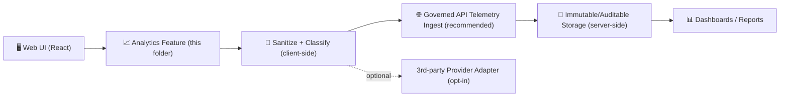

# 📈 Analytics (UI Telemetry) — `web/src/features/analytics`


> [!IMPORTANT]
> **Analytics in KFM is governance-first — not “marketing tracking.”**  
> This feature exists to improve UX, accessibility, performance, and compliance **without** leaking sensitive data (especially map/location data) and while keeping a trustworthy audit trail 🧾.

---

## 🧭 Table of Contents

- [What this is](#-what-this-is)
- [Design constraints (non-negotiables)](#-design-constraints-non-negotiables)
- [Where it fits in KFM’s architecture](#-where-it-fits-in-kfms-architecture)
- [Folder layout](#-folder-layout)
- [Event model](#-event-model)
- [Event taxonomy](#-event-taxonomy)
- [PII & sensitive data playbook](#-pii--sensitive-data-playbook)
- [How to use (React)](#-how-to-use-react)
- [How to add a new event](#-how-to-add-a-new-event)
- [Testing & CI expectations](#-testing--ci-expectations)
- [Operational notes](#-operational-notes)
- [Troubleshooting](#-troubleshooting)
- [Roadmap ideas](#-roadmap-ideas)

---

## 🎯 What this is

This folder provides **a single, canonical** analytics/telemetry layer for the web UI.

It standardizes:

- ✅ **Typed event names** + consistent payload shapes
- ✅ **Sanitization** (no accidental PII, no sensitive coordinates)
- ✅ **Batching / non-blocking delivery** (fast UI)
- ✅ **Provider adapters** (console/dev, backend ingestion, optional third-party)
- ✅ **Audit-friendly signals** (redactions, policy blocks, sensitive access attempts)

---

## 🧱 Design constraints (non-negotiables)

These are the rules that keep KFM trustworthy and compliant 🛡️:

### 1) “No data leakage” at the UI layer 🔒  
Analytics must not become a backdoor that exfiltrates data the UI is otherwise prohibited from showing.

- Never log raw content that the user might not be authorized to access.
- Never log sensitive map coordinates at precision that violates redaction rules.
- Prefer *aggregates*, *buckets*, or *coarsened geography* (county/tile id), not lat/lng.

### 2) Classification & sovereignty propagate 🪶  
If something is sensitive/restricted, the telemetry about it must **not** downgrade it.

- Event payloads must be safe for the **lowest-trust** consumer of telemetry.
- If you’re unsure → mark as `redacted: true` and omit the field.

### 3) Use governed boundaries 🌐  
Just like data access, telemetry should flow through governed channels.

- The UI should *not* talk directly to private datastores.
- Prefer routing telemetry to a governed API endpoint (policy checks, rate limits, storage rules), and only then to dashboards.

### 4) Analytics must be “non-blocking UX” ⚡  
Tracking can’t slow the map, story playback, or Focus Mode interactions.

- Use batching, debouncing, and background send.
- Never await analytics in UI-critical paths.

---

## 🗺 Where it fits in KFM’s architecture

KFM is built around a layered architecture where UI is decoupled from sensitive internals and policy gates exist at boundaries. Analytics should follow the same principle.



**Key idea:** telemetry is treated like a “product artifact” — it should be **auditable**, **policy-friendly**, and **minimally revealing**.

---

## 🧰 Folder layout

> [!NOTE]
> Names below reflect the intended structure. If any files differ in your branch, keep the same responsibilities and update this README accordingly.

```text
web/src/features/analytics/
├─ 📄 README.md
├─ 📄 index.ts                 # public exports
├─ 📄 types.ts                 # core TS types (EventName, EventPayload, Context)
├─ 📄 events.ts                # canonical event name registry (string literals / enums)
├─ 📄 track.ts                 # track(), identify() (if allowed), flush()
├─ 📄 sanitize.ts              # PII stripping + sensitive-field redaction
├─ 📄 queue.ts                 # batching, retry, backoff, sendBeacon/fetch strategy
├─ 📄 session.ts               # anonymous session id, correlation ids
├─ 📁 providers/
│  ├─ 📄 consoleProvider.ts    # dev-only provider
│  ├─ 📄 apiProvider.ts        # send events to backend ingest
│  └─ 📄 posthogProvider.ts    # example optional provider (only if approved)
├─ 📁 hooks/
│  ├─ 📄 useAnalytics.ts       # React hook wrapper
│  └─ 📄 usePageView.ts        # route/page view helper
└─ 📁 __tests__/
   ├─ 📄 sanitize.test.ts
   ├─ 📄 events.test.ts
   └─ 📄 queue.test.ts
```

---

## 🧾 Event model

### Event naming convention

Use a **dot-separated taxonomy**:

- `ui.*` for general UI
- `map.*` for map interactions
- `story.*` for story/narrative
- `focus.*` for Focus Mode (AI assistant UX signals only)
- `governance.*` for policy/redaction/audit signals
- `perf.*` for performance timings

Examples:

- `ui.page_view`
- `map.layer_toggle`
- `map.timeline_change`
- `story.open`
- `focus.query_submitted`
- `governance.redaction_applied`
- `governance.policy_blocked`
- `perf.tile_request_ms`

### Required fields

Every event should include:

- `name`: string literal (from `events.ts`)
- `ts`: ISO timestamp or epoch ms (consistent)
- `route`: current route (no query params if those can contain sensitive info)
- `context`:
  - `appVersion` (semver)
  - `buildSha` (if available)
  - `env` (`local|dev|staging|prod`)
  - `client` (`web`)
- `session`:
  - `sessionId` (anonymous, rotating)
  - `correlationId` (per user action / flow)
- `props`: event-specific payload (must be sanitized)

### Example TypeScript shapes

```ts
// types.ts
export type EventName =
  | "ui.page_view"
  | "map.layer_toggle"
  | "map.timeline_change"
  | "focus.query_submitted"
  | "governance.redaction_applied"
  | "governance.policy_blocked"
  | "perf.tile_request_ms";

export type AnalyticsEvent<TName extends EventName = EventName> = {
  name: TName;
  ts: number; // epoch ms (recommended)
  route: string;
  context: {
    appVersion: string;
    buildSha?: string;
    env: "local" | "dev" | "staging" | "prod";
    client: "web";
  };
  session: {
    sessionId: string;       // anonymous
    correlationId?: string;  // per-flow
  };
  props?: Record<string, unknown>; // sanitized
};
```

---

## 🧩 Event taxonomy

### 🖥️ UI / Navigation
- `ui.page_view` — route change (strip querystring)
- `ui.search_submit` — *metadata only* (query length, filters count), not raw query text
- `ui.error_toast_shown` — error code/category, not server stack traces

### 🗺 Map (MapLibre / Cesium)
- `map.layer_toggle` — layer id + on/off
- `map.timeline_change` — year range / timestep bucket (not raw slider pixel coords)
- `map.viewport_change` — **coarsened** viewport (e.g., tile set, county ids, bbox bucket)
- `map.redaction_boundary_hit` — indicates user attempted zoom/pan beyond redaction rules

### 📚 Story / Narrative
- `story.open` — story id
- `story.section_view` — section id
- `story.citation_click` — citation id (stable id), not full citation text

### 🤖 Focus Mode UX telemetry (NOT content)
- `focus.query_submitted` — token count / length bucket, tool usage flag (no raw text)
- `focus.answer_rendered` — citations count, latency, policy outcome
- `focus.policy_blocked` — policy code (safe), not the blocked text

### 🧾 Governance signals
- `governance.redaction_applied` — what rule triggered + which field family was redacted
- `governance.policy_blocked` — policy id + reason code bucket
- `governance.sensitive_access_attempt` — layer classification + action type

### ⚡ Performance signals
- `perf.tile_request_ms`
- `perf.api_request_ms`
- `perf.focus_roundtrip_ms`

---

## 🧼 PII & sensitive data playbook

> [!WARNING]
> **Assume anything you put into telemetry will be copied, exported, and reviewed later.**  
> Telemetry is powerful — and dangerous — if it captures the wrong thing.

### Never collect
- Names, emails, phone numbers
- Freeform text typed by users (unless explicitly approved and redacted)
- Raw coordinates / precise geometry for sensitive layers
- Full API URLs with query params (those often contain identifiers)

### Prefer these patterns ✅

#### Coarsen locations 🧭
Instead of `lat/lng`, send:
- `county_id`
- `tile_ids[]` (z/x/y)
- `bbox_bucket` (predefined bins)
- `zoom_bucket` (`0-4`, `5-8`, `9-12`, `13+`)

#### Redact by default 🟥
If an event references a sensitive dataset/layer:
- Include only:
  - `classification: "sensitive"` (or `restricted`)
  - `redacted: true`
  - `layer_id` (if layer id itself is non-sensitive; otherwise hash it)

#### Privacy-preserving analytics 🧪
When generating aggregate analytics:
- Apply thresholds (don’t report tiny groups)
- Consider adding noise to some statistics (differential privacy pattern) when warranted
- Avoid “over-filtering” combinations that can identify a person via inference

---

## ⚛️ How to use (React)

```tsx
import { useAnalytics } from "./hooks/useAnalytics";

export function LayerToggle({ layerId, enabled }: { layerId: string; enabled: boolean }) {
  const { track } = useAnalytics();

  return (
    <button
      onClick={() => {
        track("map.layer_toggle", { layerId, enabled });
      }}
    >
      Toggle layer
    </button>
  );
}
```

### Page views (router integration)
Use `usePageView()` in the root route component so every route change is tracked consistently.

---

## ➕ How to add a new event

1) **Add the event name** to `events.ts` (and `EventName` union if you’re using unions).
2) **Define its props contract** (even if it’s just a type alias).
3) **Update sanitization rules** in `sanitize.ts`:
   - Which fields must be dropped?
   - Which must be hashed/coarsened?
4) **Add tests**:
   - `events.test.ts` ensures the event name is registered
   - `sanitize.test.ts` ensures unsafe fields are removed
5) **Use the event** via `track(name, props)` from UI code.

✅ PRs should include a short screenshot or note of the dashboard metric impacted (if any).

---

## ✅ Testing & CI expectations

Telemetry is part of governance — treat it like an API contract.

Minimum expectations:

- **Unit tests** for sanitization (PII removal, coordinate coarsening)
- **Schema/contract tests** (event registry & payload invariants)
- **No secrets** in config (tokens/keys must be env-driven)
- **No sensitive content** introduced through telemetry fields

> [!TIP]
> A good default is “block or redact” rather than “ship and hope.” 🧯

---

## 🧠 Operational notes

### Sampling
Use sampling for high-volume events:
- `map.viewport_change` (sample or debounce)
- `perf.*` (sample)

### Delivery strategy
Prefer:
- `navigator.sendBeacon()` for unload-safe delivery
- fallback to `fetch()` with `keepalive: true` if supported

### Backpressure
If offline or failing:
- keep a small bounded queue
- drop oldest low-priority events first (`perf.*` before `governance.*`)

---

## 🧯 Troubleshooting

- **“No events in dashboard”**
  - confirm analytics is enabled in env
  - check provider selection (console vs api)
  - verify ingest endpoint is reachable
- **“Events missing props”**
  - sanitization may be stripping fields (check `sanitize.ts`)
  - confirm you’re not passing unserializable objects
- **“Map feels slow”**
  - ensure `map.*` events are debounced/sampled
  - confirm nothing awaits `track()`

---

## 🧪 Roadmap ideas

- 🧾 “Audit & Logs” view for maintainers (who accessed what, redaction hits, policy blocks)
- 🧭 Governance dashboards (sensitive access attempts, redaction rates)
- 🧬 Event schemas as JSON Schema for cross-service validation
- 🔁 Replayable UI sessions (strictly internal, strictly redacted)

---

## 🧷 Glossary

- **OPA**: Open Policy Agent — policy checks that gate outputs and enforce rules.
- **Redaction**: removing/coarsening data to prevent exposure of sensitive info.
- **Classification**: labeling data/artifacts by sensitivity (public/internal/sensitive/etc.).
- **Provenance**: evidence trail and lineage for “how we got here.”
