# 🔐 Auth (web/src/features/auth)

> 🧭 **What lives here:** the KFM web app’s authentication UX + session/auth state (typically via React Context/hooks).[^kfm-frontend-structure]

**Stack assumptions (per KFM docs):** React ⚛️ (SPA) + TypeScript 🟦 where possible.[^kfm-react-choice][^kfm-frontend-structure]  
**Auth model (per KFM docs):** JWT access tokens + refresh-token flow; token is sent via `Authorization: Bearer <token>` on API calls.[^kfm-auth-jwt][^kfm-backend-bearer]  
**RBAC (per KFM docs):** roles/levels live in token claims; backend enforces access and returns `403 Forbidden` when unauthorized.[^kfm-backend-rbac]

---

## 📌 Table of contents
- [📘 Overview](#-overview)
  - [Purpose](#purpose)
  - [Scope](#scope)
  - [Audience](#audience)
  - [Definitions](#definitions)
  - [Key artifacts](#key-artifacts)
- [🗂️ Directory layout](#️-directory-layout)
- [🔁 Auth flow](#-auth-flow)
- [🧩 Integration points](#-integration-points)
  - [1) App-level provider](#1-app-level-provider)
  - [2) Login route + form](#2-login-route--form)
  - [3) Protecting routes & features](#3-protecting-routes--features)
  - [4) API client token injection](#4-api-client-token-injection)
  - [5) Real-time after login](#5-real-time-after-login)
- [🧪 Testing notes](#-testing-notes)
- [🛡️ Security notes](#️-security-notes)
- [🧯 Troubleshooting](#-troubleshooting)
- [📎 References](#-references)

---

## 📘 Overview

### Purpose
This feature owns the **user authentication experience** (login/logout) and the **in-browser auth session state** used by the web UI to access secured APIs and gate UI by role/permission.[^kfm-backend-rbac]

### Scope

| ✅ In scope | 🚫 Out of scope |
|---|---|
| Login UI + validation | Password hashing / credential verification (server-side) |
| Auth session state (user, roles, token presence) | Backend user/role administration |
| Access token + refresh flow handling | Database security & storage |
| Attaching tokens to API calls | Backend authorization rules implementation |
| UI gating (role-based visibility) | Network perimeter / firewall config |

> ℹ️ The backend is the source of truth for permissions; the frontend should **gate UX**, not “enforce security.”[^kfm-backend-rbac]

### Audience
- **Frontend devs:** integrating protected routes, calling secured endpoints, building UI that depends on user identity/roles.
- **Full-stack devs:** aligning frontend auth expectations with backend JWT + refresh behavior.[^kfm-auth-jwt]

### Definitions
- **Access token (JWT):** short-lived token used for API calls; contains user identity + roles/claims.[^kfm-auth-jwt]
- **Refresh token:** long-lived token used only to obtain a new access token when it expires.[^kfm-auth-jwt]
- **RBAC:** role-based access control (e.g., farmer/researcher/admin); backend checks claims and returns `403` when access is denied.[^kfm-backend-rbac]

### Key artifacts
- `AuthProvider` / `useAuth()` hook (session state + actions)
- `LoginForm` UI
- `ProtectedRoute` / `RequireRole` helpers
- `authClient` (calls login/refresh endpoints)
- Token storage strategy (in-memory vs localStorage per security trade-offs)[^kfm-frontend-token-storage]

---

## 🗂️ Directory layout

KFM’s frontend is organized **by feature**, explicitly including an `auth/` feature folder (“Login form, auth context”).[^kfm-frontend-structure]

### 📁 Suggested (canonical) layout for this feature
> If the folder contents differ today, treat this as the **target shape** for cleanup and consistency.

```text
📁 web/
  📁 src/
    📁 features/
      📁 auth/
        📄 README.md
        📁 components/
          📄 LoginForm.tsx
          📄 LogoutButton.tsx
          📄 ProtectedRoute.tsx
          📄 RequireRole.tsx
        📁 context/
          📄 AuthProvider.tsx
          📄 useAuth.ts
        📁 api/
          📄 authClient.ts
          📄 tokenStorage.ts
        📁 types/
          📄 auth.types.ts
        📁 __tests__/
          📄 AuthProvider.test.tsx
          📄 LoginForm.test.tsx
```

### 🔗 Related paths in the repo (context)
> Repo top-level includes `web/` alongside `docs/`, `schemas/`, etc.[^kfm-repo-top-level]

| Area | Path | Notes |
|---|---|---|
| Web app | `web/` | Frontend codebase |
| Feature directory | `web/src/features/auth/` | This README + auth feature modules |
| Shared API tooling | `web/src/services/` | Often where an `apiClient`/axios wrapper lives (per KFM docs)[^kfm-frontend-structure] |
| Governance/docs | `docs/` | Master guide + standards/templates[^kfm-repo-top-level] |

---

## 🔁 Auth flow

KFM’s documented auth approach:
- Frontend uses `fetch` or `axios` to call the backend.[^kfm-frontend-token-storage]
- Store the auth token (in memory or localStorage, depending on security considerations).[^kfm-frontend-token-storage]
- Send it in request headers (Bearer token).[^kfm-frontend-token-storage][^kfm-backend-bearer]
- JWT expires (e.g., ~1 hour) and is refreshed via refresh-token mechanism.[^kfm-auth-jwt]
- Roles/levels in token claims support RBAC.[^kfm-backend-rbac]

```mermaid
sequenceDiagram
  autonumber
  participant U as 🧑 User
  participant UI as 🧭 React UI
  participant AUTH as 🔐 AuthProvider
  participant API as 🌐 API (backend)
  participant WS as 📡 WebSocket (optional)

  U->>UI: Enter credentials
  UI->>API: POST /auth/login (HTTPS)
  API-->>UI: access_token (JWT) + refresh_token
  UI->>AUTH: setSession(tokens, user, roles)

  Note over AUTH: Store token (memory or localStorage)\n+ attach Bearer header to requests

  UI->>API: GET /protected/resource (Authorization: Bearer <JWT>)
  API-->>UI: 200 OK (or 403 if role mismatch)

  Note over AUTH: Before expiry, refresh flow runs
  AUTH->>API: POST /auth/refresh (refresh_token)
  API-->>AUTH: new access_token (JWT)

  opt After login
    AUTH->>WS: Connect socket (token if required)
    WS-->>UI: Realtime updates
  end

  U->>UI: Logout
  UI->>AUTH: clearSession()
  AUTH->>WS: Disconnect
```



---

## 🧩 Integration points

### 1) App-level provider
Wrap the app (or router subtree) so features can read auth state + call `login/logout/refresh`.

```tsx
// web/src/App.tsx (example)
import { AuthProvider } from "./features/auth/context/AuthProvider";

export function App() {
  return (
    <AuthProvider>
      {/* routes + layout */}
    </AuthProvider>
  );
}
```

> 🧠 KFM’s docs explicitly call out React Context/hooks as a candidate for state management (alongside Redux). Auth is a great fit for Context.[^kfm-react-choice]

### 2) Login route + form
Auth UI should:
- collect credentials
- call `authClient.login()`
- set session state
- redirect user back to intended route

```tsx
// pseudo-usage
const { login, authState } = useAuth();

async function onSubmit(creds: { username: string; password: string }) {
  await login(creds);
  // navigate("/map") or restore return-to
}
```

### 3) Protecting routes & features
You’ll typically want two levels of gating:

- **Auth required**: user must be logged in.
- **Role required**: user must have role/level for specific features.

```tsx
// Example: route protection
<Route
  path="/dashboard"
  element={
    <ProtectedRoute>
      <Dashboard />
    </ProtectedRoute>
  }
/>
```

```tsx
// Example: role-gated UI
<RequireRole anyOf={["admin", "researcher"]}>
  <AdminPanel />
</RequireRole>
```

> ✅ Backend is the enforcing layer. Frontend role gating is for UX (hide/disable), while backend returns `403` if access isn’t allowed.[^kfm-backend-rbac]

### 4) API client token injection
KFM docs mention using `fetch` or `axios` and sending the auth token in headers.[^kfm-frontend-token-storage]  
Pick one and standardize it across the app (ideally via a shared `apiClient`).

**Option A: fetch wrapper**
```ts
export async function authedFetch(input: RequestInfo, init: RequestInit = {}) {
  const token = tokenStorage.getAccessToken(); // in-memory or localStorage
  const headers = new Headers(init.headers);

  if (token) headers.set("Authorization", `Bearer ${token}`);

  return fetch(input, { ...init, headers });
}
```

**Option B: axios interceptor**
```ts
api.interceptors.request.use((config) => {
  const token = tokenStorage.getAccessToken();
  if (token) config.headers.Authorization = `Bearer ${token}`;
  return config;
});
```

### 5) Real-time after login
KFM docs explicitly call out establishing a socket connection **after login** for streaming/real-time updates.[^kfm-websocket-after-login]  
Auth should expose a “session ready” signal so the realtime layer can connect/disconnect cleanly.

---

## 🧪 Testing notes

Recommended coverage (minimum):
- `AuthProvider` state transitions (logged out → logged in → refreshed → logged out)
- token persistence behavior (memory vs localStorage mode)
- `ProtectedRoute` redirect behavior
- `RequireRole` gating rules
- login error states (invalid credentials, network failure, refresh failure)

> 🧩 Tip: mock `authClient` so tests remain deterministic and fast.

---

## 🛡️ Security notes

KFM’s docs emphasize security protocols and token-based auth with roles/levels and refresh flow.[^kfm-auth-jwt][^kfm-backend-rbac]

### Token storage strategy (frontend)
KFM states the token may be stored **in memory or localStorage** depending on security considerations.[^kfm-frontend-token-storage]

Practical guidance:
- ✅ Prefer **in-memory** access token when possible (reduces exposure to XSS persistence).
- ⚠️ If using **localStorage**, treat XSS prevention as critical: sanitize/escape any user-provided content and avoid dangerous HTML injection.
- ❌ Never log tokens to console or telemetry.

### Secrets & config
Keep secrets out of the repo; use env variables / vault-style management per KFM security guidance.[^kfm-secrets-env]

---

## 🧯 Troubleshooting

- **401 Unauthorized**  
  Usually means token missing/expired. Confirm Bearer header injection and refresh flow.[^kfm-backend-bearer][^kfm-auth-jwt]

- **403 Forbidden**  
  Expected when user is authenticated but lacks role/level required by endpoint.[^kfm-backend-rbac]  
  UX: show a friendly “You don’t have access” screen and hide the feature behind `RequireRole`.

- **Infinite refresh loop**  
  Common causes:
  - refresh token is missing/invalid
  - refresh endpoint returns 401/403 and client keeps retrying
  - multiple tabs racing refresh logic  
  Mitigation: single-flight refresh + hard logout when refresh fails.

- **WebSocket won’t connect after login**  
  Confirm connection is established **after login** and is torn down on logout.[^kfm-websocket-after-login]

---

## 📎 References

[^kfm-frontend-structure]: Frontend is structured by feature, including `features/auth/ (Login form, auth context)` and “TypeScript where possible.”  [oai_citation:0‡Kansas Frontier Matrix (KFM) – Comprehensive Technical Documentation & Markdown Guide.gdoc](file-service://file-XGC3Vf2AfbA2JWvTvmHNGF)

[^kfm-react-choice]: KFM frontend uses React; state can be Redux or React Context/hooks; SPA routing via React Router is referenced.  [oai_citation:1‡Kansas Frontier Matrix (KFM) – Comprehensive Technical Documentation & Markdown Guide.gdoc](file-service://file-XGC3Vf2AfbA2JWvTvmHNGF)

[^kfm-frontend-token-storage]: Frontend uses fetch/axios; token stored in memory or localStorage and sent in headers; streaming uses sockets after login.  [oai_citation:2‡Kansas Frontier Matrix (KFM) – Comprehensive Technical Documentation & Markdown Guide.gdoc](file-service://file-XGC3Vf2AfbA2JWvTvmHNGF)

[^kfm-auth-jwt]: JWT session management, expiry (example ~1 hour), refresh token mechanism described.  [oai_citation:3‡Kansas Frontier Matrix (KFM) – Comprehensive Technical Documentation & Markdown Guide.gdoc](file-service://file-XGC3Vf2AfbA2JWvTvmHNGF)

[^kfm-backend-bearer]: Backend expects token in headers (e.g., `Authorization: Bearer <token>`).  [oai_citation:4‡Kansas Frontier Matrix (KFM) – Comprehensive Technical Documentation & Markdown Guide.gdoc](file-service://file-XGC3Vf2AfbA2JWvTvmHNGF)

[^kfm-backend-rbac]: Backend authorization uses roles/levels in token claims; returns `403 Forbidden` when access denied; endpoint/middleware checks claims.  [oai_citation:5‡Kansas Frontier Matrix (KFM) – Comprehensive Technical Documentation & Markdown Guide.gdoc](file-service://file-XGC3Vf2AfbA2JWvTvmHNGF)

[^kfm-websocket-after-login]: Socket connection established on app load **after login** for real-time updates.  [oai_citation:6‡Kansas Frontier Matrix (KFM) – Comprehensive Technical Documentation & Markdown Guide.gdoc](file-service://file-XGC3Vf2AfbA2JWvTvmHNGF)

[^kfm-repo-top-level]: Master guide repo layout includes a `web/` top-level directory.  [oai_citation:7‡MARKDOWN_GUIDE_v13.md.gdoc](file-service://file-UYVruFXfueR8veHMUKeugU)

[^kfm-secrets-env]: Sensitive config should not be in repo; use env variables/vault-like storage.  [oai_citation:8‡Kansas Frontier Matrix (KFM) – Comprehensive Technical Documentation & Markdown Guide.gdoc](file-service://file-XGC3Vf2AfbA2JWvTvmHNGF)

---

### ✅ Definition of Done (for changes in this feature)

- [ ] Login/logout works end-to-end against backend auth endpoints (HTTPS).
- [ ] Access token is consistently attached to API calls as Bearer token.
- [ ] Refresh flow renews access token before expiry, and fails safe to logout.
- [ ] RBAC UI gating matches backend role expectations (no “security by UI”).
- [ ] WebSocket connection only starts after login (and stops on logout).
- [ ] No secrets or tokens are committed or logged.
- [ ] Unit tests cover provider + route protection + role gating.
