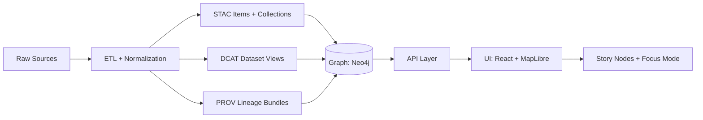

# 📚 Catalog Feature (Open Data Portal) — `web/src/features/catalog`


A developer-focused guide/spec for the **Catalog** feature: the **Open Data Portal** experience where users can **discover datasets**, view **metadata + methodology**, preview data (table/map), and **download or query** via the governed API.

This README is grounded in the project’s architecture + governance documents (STAC/DCAT/PROV pipeline ordering, API boundary, evidence-first, FAIR+CARE, Open Data Portal requirements, and WCAG accessibility constraints). [oai_citation:0‡MARKDOWN_GUIDE_v13.md.gdoc](file-service://file-UYVruFXfueR8veHMUKeugU) [oai_citation:1‡Kansas Frontier Matrix (KFM) – Unified Technical Blueprint.pdf](sediment://file_0000000000d8722f9ee56b2c59e5a887) [oai_citation:2‡Kansas Frontier Matrix Comprehensive System Documentation.pdf](sediment://file_00000000ef40722faf17987b69730695)

---

## 🧭 Table of contents

- [What this feature is](#-what-this-feature-is)
- [Non-negotiable invariants](#-non-negotiable-invariants)
- [Where it sits in the system](#-where-it-sits-in-the-system)
- [User-facing scope](#-user-facing-scope)
- [Suggested folder layout](#-suggested-folder-layout)
- [Backend contracts used by Catalog](#-backend-contracts-used-by-catalog)
- [Data model expectations](#-data-model-expectations)
- [Governance, privacy, and sovereignty](#-governance-privacy-and-sovereignty)
- [Accessibility and UX standards](#-accessibility-and-ux-standards)
- [Performance and scalability notes](#-performance-and-scalability-notes)
- [Telemetry hooks (governance-grade)](#-telemetry-hooks-governance-grade)
- [Testing checklist](#-testing-checklist)
- [Contributing](#-contributing)
- [Glossary](#-glossary)
- [References](#-references)

---

## ✅ What this feature is

The Catalog feature implements the “Open Data Portal” requirements:

- **Dataset Listings**: searchable catalog with title, description, tags, updated date; filter by category and keyword search. [oai_citation:3‡Kansas Frontier Matrix (KFM) – Unified Technical Blueprint.pdf](sediment://file_0000000000d8722f9ee56b2c59e5a887)
- **Dataset Pages**: dataset-level metadata (source, last updated, coverage, methodology notes), preview (table/map), and downloads in multiple formats (CSV/Excel, GeoJSON/Shapefile, etc.). [oai_citation:4‡Kansas Frontier Matrix (KFM) – Unified Technical Blueprint.pdf](sediment://file_0000000000d8722f9ee56b2c59e5a887)
- **API Access**: every dataset is accessible via API; portal should provide clear programmatic access + documentation/console-like affordances. [oai_citation:5‡Kansas Frontier Matrix (KFM) – Unified Technical Blueprint.pdf](sediment://file_0000000000d8722f9ee56b2c59e5a887)
- **Lightweight Visualization Tools**: quick chart/map previews so users can understand contents without leaving the site. [oai_citation:6‡Kansas Frontier Matrix (KFM) – Unified Technical Blueprint.pdf](sediment://file_0000000000d8722f9ee56b2c59e5a887)

This feature is also where **“evidence-first” UX** is made real: metadata, provenance, licenses, and citations are not optional decoration—they’re the product. [oai_citation:7‡MARKDOWN_GUIDE_v13.md.gdoc](file-service://file-UYVruFXfueR8veHMUKeugU) [oai_citation:8‡Kansas Frontier Matrix Comprehensive System Documentation.pdf](sediment://file_00000000ef40722faf17987b69730695)

---

## 🧱 Non-negotiable invariants

> [!IMPORTANT]
> **Pipeline ordering is absolute**  
> ETL → **Catalogs (STAC/DCAT/PROV)** → Graph → API → UI → Story Nodes → Focus Mode.  
> The UI must not consume anything that has not passed through the formal catalog outputs + checks. [oai_citation:9‡MARKDOWN_GUIDE_v13.md.gdoc](file-service://file-UYVruFXfueR8veHMUKeugU)

> [!IMPORTANT]
> **API boundary rule**  
> The frontend **must never** query the graph directly. All data access goes through the governed API layer so that access control, redaction, and schema guarantees apply consistently. [oai_citation:10‡MARKDOWN_GUIDE_v13.md.gdoc](file-service://file-UYVruFXfueR8veHMUKeugU)

> [!IMPORTANT]
> **Provenance first / fail-closed**  
> Any dataset shown as “published” must have catalog metadata + a PROV lineage record. Missing provenance ⇒ not publishable. Governance is “fail closed”: missing metadata, missing license, broken links, policy not satisfied ⇒ blocked (including via CI gates). [oai_citation:11‡Kansas Frontier Matrix Comprehensive System Documentation.pdf](sediment://file_00000000ef40722faf17987b69730695) [oai_citation:12‡Kansas Frontier Matrix Comprehensive System Documentation.pdf](sediment://file_00000000ef40722faf17987b69730695) [oai_citation:13‡MARKDOWN_GUIDE_v13.md.gdoc](file-service://file-UYVruFXfueR8veHMUKeugU)

---

## 🧩 Where it sits in the system

The Catalog UI is a consumer of standardized catalog artifacts (STAC/DCAT/PROV) exposed via the API layer.



This aligns with the platform’s explicit “catalogs as first-class outputs” philosophy—STAC/DCAT/PROV are the durable contracts that everything else references. [oai_citation:14‡Scalable Data Management for Future Hardware.pdf](sediment://file_000000007d74722fa87beabc663630f7) [oai_citation:15‡MARKDOWN_GUIDE_v13.md.gdoc](file-service://file-UYVruFXfueR8veHMUKeugU)

---

## 🧑‍💻 User-facing scope

### 🗂️ Catalog landing (/catalog)
- Search box (keyword)
- Facets/filters (category, tags, time, spatial extent)
- Result cards: title, short description, tags, last updated, access level badge
- Sorting: relevance, last updated, title A→Z
- Pagination (or infinite scroll w/ virtualization)

### 📄 Dataset detail (/catalog/datasets/:id)
- Header: title, owning org/provider, last updated, license
- **About this data**: source, methodology notes, caveats, coverage (spatial/temporal) [oai_citation:16‡Kansas Frontier Matrix (KFM) – Unified Technical Blueprint.pdf](sediment://file_0000000000d8722f9ee56b2c59e5a887) [oai_citation:17‡Kansas Frontier Matrix (KFM) – Unified Technical Blueprint.pdf](sediment://file_00000000ec9c71f8ab8a6826cbce8605)
- Preview:
  - Table preview (sample rows)
  - Map preview (if spatial), optional “Add to Map”
- Downloads:
  - CSV / Excel for tabular
  - GeoJSON / Shapefile for spatial
  - For very large datasets, show instructions/links rather than direct download [oai_citation:18‡Kansas Frontier Matrix (KFM) – Unified Technical Blueprint.pdf](sediment://file_0000000000d8722f9ee56b2c59e5a887)
- Provenance panel:
  - PROV file link + lineage summary
  - Citations / source references
- Governance panel:
  - Access level, redactions applied, content warnings if relevant [oai_citation:19‡Kansas Frontier Matrix (KFM) – Comprehensive Technical Blueprint.pdf](sediment://file_000000006dbc71f89a5094ce310a452d)

---

## 🗃️ Suggested folder layout

> This is a **recommended** shape for `web/src/features/catalog/` to keep contracts, UI, and behavior cleanly separated.

```text
📁 web/
  📁 src/
    📁 features/
      📁 catalog/
        📄 README.md  ✅ (you are here)
        📄 index.ts (public exports)
        📁 routes/
          📄 CatalogRoutes.tsx
        📁 pages/
          📄 CatalogHomePage.tsx
          📄 DatasetDetailPage.tsx
        📁 components/
          📄 CatalogSearchBar.tsx
          📄 CatalogFilters.tsx
          📄 DatasetCard.tsx
          📄 DatasetDownloads.tsx
          📄 DatasetPreviewTable.tsx
          📄 DatasetPreviewMap.tsx
          📄 ProvenancePanel.tsx
          📄 GovernanceBadges.tsx
        📁 hooks/
          📄 useCatalogSearch.ts
          📄 useDataset.ts
          📄 useDatasetDataPreview.ts
        📁 api/
          📄 catalogClient.ts
          📄 catalogContracts.ts
        📁 utils/
          📄 queryString.ts
          📄 formatters.ts
          📄 redaction.ts
        📁 __tests__/
          📄 catalogSearch.test.ts
          📄 datasetDetail.test.tsx
```

---

## 🔌 Backend contracts used by Catalog

The backend exposes a “Data Catalog & Datasets” API surface that the Catalog feature should use directly (and only via the API layer). [oai_citation:20‡Kansas Frontier Matrix Comprehensive System Documentation.pdf](sediment://file_00000000ef40722faf17987b69730695)

### Endpoints (current documented set)

| Purpose | Method | Path | Notes |
|---|---:|---|---|
| Dataset metadata | GET | `/api/v1/datasets/{id}` | Returns DCAT-ish dataset details (title, description, license, etc.) [oai_citation:21‡Kansas Frontier Matrix Comprehensive System Documentation.pdf](sediment://file_00000000ef40722faf17987b69730695) |
| Dataset data | GET | `/api/v1/datasets/{id}/data?format=geojson&bbox=...` | Returns data in requested format; spatial query supported via bbox. [oai_citation:22‡Kansas Frontier Matrix Comprehensive System Documentation.pdf](sediment://file_00000000ef40722faf17987b69730695) |
| Catalog search | GET | `/api/v1/catalog/search?query=...&bbox=...&time=...` | Keyword + spatial + temporal filtering for discovery. [oai_citation:23‡Kansas Frontier Matrix Comprehensive System Documentation.pdf](sediment://file_00000000ef40722faf17987b69730695) |
| STAC item detail | GET | `/api/v1/catalog/items/{item_id}` | Fetch STAC item JSON for map preview / asset links. [oai_citation:24‡Kansas Frontier Matrix Comprehensive System Documentation.pdf](sediment://file_00000000ef40722faf17987b69730695) |
| Safe ad-hoc query | POST | `/api/v1/query` | For advanced UI surfaces; must remain governed and role-checked. [oai_citation:25‡Kansas Frontier Matrix Comprehensive System Documentation.pdf](sediment://file_00000000ef40722faf17987b69730695) |
| Map tiles | GET | `/tiles/{z}/{x}/{y}.pbf?layer=foo` | Vector tiles (MVT) for performant map previews. [oai_citation:26‡Kansas Frontier Matrix Comprehensive System Documentation.pdf](sediment://file_00000000ef40722faf17987b69730695) |
| Raster tiles | GET | `/tiles/{z}/{x}/{y}.png?layer=foo` | Raster tiles for simple overlays. [oai_citation:27‡Kansas Frontier Matrix Comprehensive System Documentation.pdf](sediment://file_00000000ef40722faf17987b69730695) |

### Local dev quick links

> Keep URLs in code blocks (easy copy/paste).

```txt
Swagger (FastAPI): http://localhost:8000/docs
GraphQL (if enabled): http://localhost:8000/graphql
```

(Dev environment + API docs are explicitly called out in the blueprint.) [oai_citation:28‡Kansas Frontier Matrix (KFM) – Comprehensive Technical Blueprint.pdf](sediment://file_000000006dbc71f89a5094ce310a452d)

---

## 🧬 Data model expectations

### Catalog artifacts (STAC/DCAT/PROV)

The platform treats STAC + DCAT + PROV as the canonical catalog outputs and requires them before graph/UI consumption. [oai_citation:29‡MARKDOWN_GUIDE_v13.md.gdoc](file-service://file-UYVruFXfueR8veHMUKeugU)

A STAC item typically contains (at minimum):
- `bbox`, `geometry`, `datetime`
- `keywords`, `license`, `provider`
- links to:
  - the raw/curated data
  - **a provenance file** (lineage) [oai_citation:30‡Kansas Frontier Matrix (KFM) – Comprehensive Technical Blueprint.pdf](sediment://file_000000006dbc71f89a5094ce310a452d)

DCAT “dataset views” are expected to provide user-facing summaries for discovery (title, description, tags, temporal/spatial coverage, distributions/downloads). [oai_citation:31‡Kansas Frontier Matrix (KFM) – Comprehensive Technical Blueprint.pdf](sediment://file_000000006dbc71f89a5094ce310a452d)

### Suggested TypeScript contracts (frontend)

> Treat these as **UI contracts**. They should align with backend schema and evolve via explicit versioned changes.

```ts
export type AccessLevel = "public" | "internal" | "confidential" | "restricted";

export interface CatalogSearchParams {
  query?: string;         // keyword search
  bbox?: [number, number, number, number]; // [minX, minY, maxX, maxY]
  time?: string;          // ISO8601 interval "YYYY-MM-DD/YYYY-MM-DD"
  tags?: string[];
  category?: string;
  page?: number;
  pageSize?: number;
  sort?: "relevance" | "updated_desc" | "title_asc";
}

export interface DatasetDistribution {
  format: "csv" | "xlsx" | "geojson" | "shp" | "parquet" | string;
  href: string;
  mediaType?: string;
  sizeBytes?: number;
}

export interface DatasetSummary {
  id: string;
  title: string;
  description?: string;
  keywords?: string[];
  category?: string;
  updated?: string; // ISO
  accessLevel: AccessLevel;
  license?: string;
  spatial?: { bbox?: [number, number, number, number] };
  temporal?: { start?: string; end?: string };
}

export interface DatasetDetail extends DatasetSummary {
  provider?: { name?: string; url?: string };
  methodology?: string;
  caveats?: string[];
  provenance?: { href: string; type?: "prov" | "jsonld" | string };
  distributions: DatasetDistribution[];
  stac?: { itemId?: string; collectionId?: string };
  citations?: Array<{ label: string; href?: string }>;
  redactions?: Array<{ field: string; reason: string }>;
}
```

---

## 🛡 Governance, privacy, and sovereignty

This feature is a **governance surface**, not just a UI.

### 🧷 “Fail closed” behavior in UI

KFM governance is designed to block publication/visibility when requirements are not satisfied (metadata, license, sensitivity labels, provenance). The UI should reflect this clearly (e.g., “Draft / Not publishable: missing provenance”). [oai_citation:32‡Kansas Frontier Matrix Comprehensive System Documentation.pdf](sediment://file_00000000ef40722faf17987b69730695) [oai_citation:33‡Kansas Frontier Matrix Comprehensive System Documentation.pdf](sediment://file_00000000ef40722faf17987b69730695)

### 🔐 Access levels & policy enforcement

Data is classified (e.g., public/internal/sensitive/confidential), and access is enforced via authenticated requests + OPA policies; CI also enforces rules (e.g., missing license or sensitivity label fails). [oai_citation:34‡Kansas Frontier Matrix Comprehensive System Documentation.pdf](sediment://file_00000000ef40722faf17987b69730695)

**UI responsibilities:**
- Always display an **Access Level badge** (`public`, `restricted`, etc.).
- If the API returns partial/redacted values, show a **“Redactions applied”** banner and list reasons when safe.
- If the user lacks access, show a clear, non-leaky message (“You don’t have access to this dataset.”).

### 🧭 Sensitive location handling (maps + previews)

For sensitive contexts, the system can:
- generalize/hide precise locations (e.g., sacred lands, archeological sites),
- apply coordinate rounding/aggregation,
- use differential privacy and thresholds for small-n counts,
- audit/limit overly specific queries to prevent misuse. [oai_citation:35‡Kansas Frontier Matrix Comprehensive System Documentation.pdf](sediment://file_00000000ef40722faf17987b69730695)

**UI responsibilities:**
- Never “reconstruct” sensitive detail client-side.
- Treat API output as the governed truth.
- Prefer aggregated previews for sensitive datasets (e.g., county-level choropleth instead of point map).

### 🪶 Indigenous Data Sovereignty and CARE

Indigenous Data Sovereignty emphasizes Indigenous control over data collection, ownership, and use. [oai_citation:36‡Indigenous Statistics.pdf](sediment://file_0000000033ec72308e1f791a79f61bfe) Indigenous Data Sovereignty networks share common features: self-determination focus, data as cultural resource, collective data rights, and Indigenous values as the basis for governance. [oai_citation:37‡Indigenous Statistics.pdf](sediment://file_0000000033ec72308e1f791a79f61bfe)

CARE Principles were designed to address the tension between open data and Indigenous rights/interests by setting minimum expectations for data sharing, and they explicitly connect to implementation pathways and standards synergies. [oai_citation:38‡Indigenous Statistics.pdf](sediment://file_0000000033ec72308e1f791a79f61bfe)

Metadata is also a key sovereignty mechanism, including **Traditional Knowledge (TK)** and **Biocultural (BC)** labels to help identify provenance/origin/authority over biocultural material and data. [oai_citation:39‡Indigenous Statistics.pdf](sediment://file_0000000033ec72308e1f791a79f61bfe)

**UI responsibilities (minimum):**
- Provide a dedicated “Community Governance” panel when datasets are marked Indigenous/community-governed:
  - governance contact / owner group
  - CARE/OCAP/TK/BC labels (if present)
  - access constraints (“restricted to group”, “withdrawn”) and status messaging
- Support “takedown/withdrawn” states as first-class UX (dataset removed from public lists or presented as withdrawn depending on policy). [oai_citation:40‡Kansas Frontier Matrix (KFM) – Comprehensive Technical Blueprint.pdf](sediment://file_000000006dbc71f89a5094ce310a452d)

---

## ♿ Accessibility and UX standards

Accessibility is not optional: public interfaces must meet WCAG 2.1 AA, including contrast, screen-reader compatibility, and keyboard navigation; use plain language with legends/help text for technical terms. [oai_citation:41‡Kansas Frontier Matrix (KFM) – Unified Technical Blueprint.pdf](sediment://file_00000000ec9c71f8ab8a6826cbce8605) [oai_citation:42‡Kansas Frontier Matrix Comprehensive System Documentation.pdf](sediment://file_00000000ef40722faf17987b69730695)

**Implementation checklist:**
- ✅ Keyboard navigation for all interactive controls (filters, results list, dataset tabs). [oai_citation:43‡Kansas Frontier Matrix Comprehensive System Documentation.pdf](sediment://file_00000000ef40722faf17987b69730695)
- ✅ Text alternatives for non-text content; sensible ARIA only where needed. [oai_citation:44‡Kansas Frontier Matrix Comprehensive System Documentation.pdf](sediment://file_00000000ef40722faf17987b69730695)
- ✅ Responsive layout (mobile/tablet/desktop), touch-friendly controls where relevant. [oai_citation:45‡Kansas Frontier Matrix Comprehensive System Documentation.pdf](sediment://file_00000000ef40722faf17987b69730695)
- ✅ “Details on demand”: show the essentials first; reveal deeper detail in a panel/drawer/modal when requested. [oai_citation:46‡Kansas Frontier Matrix (KFM) – Unified Technical Blueprint.pdf](sediment://file_00000000ec9c71f8ab8a6826cbce8605)
- ✅ Every dataset page includes an “About this data” explanation with sources and caveats. [oai_citation:47‡Kansas Frontier Matrix (KFM) – Unified Technical Blueprint.pdf](sediment://file_00000000ec9c71f8ab8a6826cbce8605)

**Map preview aids (optional but powerful):**
- Include classic map navigation aids: scale bar, north arrow, optional coordinate displays / grid overlays (lat/long, UTM/MGRS) as appropriate for the overall app map system. [oai_citation:48‡Kansas Frontier Matrix (KFM) – Comprehensive Technical Blueprint.pdf](sediment://file_000000006dbc71f89a5094ce310a452d)

---

## ⚡ Performance and scalability notes

- Prefer **tiles for map previews** (vector/raster) instead of fetching full-geometry GeoJSON for large layers. [oai_citation:49‡Kansas Frontier Matrix Comprehensive System Documentation.pdf](sediment://file_00000000ef40722faf17987b69730695)
- Use pagination + virtualization for large catalog lists (search index can scale).
- Cache “hot” searches client-side (query cache) while respecting access control boundaries.
- For huge datasets (e.g., LiDAR), show instructions or external storage links instead of direct downloads. [oai_citation:50‡Kansas Frontier Matrix (KFM) – Unified Technical Blueprint.pdf](sediment://file_0000000000d8722f9ee56b2c59e5a887)

---

## 📈 Telemetry hooks (governance-grade)

KFM explicitly anticipates governance-driven telemetry: logging when sensitive data is accessed, when redactions occur, or when publication is blocked by policy. [oai_citation:51‡MARKDOWN_GUIDE_v13.md.gdoc](file-service://file-UYVruFXfueR8veHMUKeugU)

**Catalog should emit UI telemetry events** (names are suggestions):
- `catalog_search_executed`
- `dataset_viewed`
- `dataset_download_clicked`
- `dataset_api_example_copied`
- `dataset_redaction_banner_shown`
- `dataset_access_denied`
- `dataset_withdrawn_seen`

> [!NOTE]
> Telemetry must never leak sensitive values. Log identifiers + policy decisions, not raw results.

---

## 🧪 Testing checklist

> CI gates exist at the repo level and reject missing provenance, broken links, or policy violations; treat tests as part of the governance machine. [oai_citation:52‡MARKDOWN_GUIDE_v13.md.gdoc](file-service://file-UYVruFXfueR8veHMUKeugU)

### Unit tests ✅
- Query serialization/parsing (search params → URL → params)
- Access level badge mapping
- Redaction banner logic

### Component tests ✅
- `CatalogFilters` keyboard navigation
- `DatasetDownloads` renders correct format links
- `ProvenancePanel` hides when missing (or shows “not publishable” state)

### Integration tests ✅
- Mock API responses for:
  - public dataset
  - restricted dataset (403)
  - redacted dataset (partial fields + redaction reasons)
  - withdrawn dataset
- Tiles loading (happy path + 404)

### A11y tests ✅
- Axe checks on catalog home + dataset detail (especially tab/accordion patterns)
- Screen-reader name/role/value for filter controls

---

## 🤝 Contributing

### Definition of Done ✅ (Catalog)

- [ ] Listing/search UI is keyboard navigable and readable in plain language. [oai_citation:53‡Kansas Frontier Matrix (KFM) – Unified Technical Blueprint.pdf](sediment://file_00000000ec9c71f8ab8a6826cbce8605)
- [ ] Dataset page includes sources/methodology/caveats (“About this data”). [oai_citation:54‡Kansas Frontier Matrix (KFM) – Unified Technical Blueprint.pdf](sediment://file_0000000000d8722f9ee56b2c59e5a887) [oai_citation:55‡Kansas Frontier Matrix (KFM) – Unified Technical Blueprint.pdf](sediment://file_00000000ec9c71f8ab8a6826cbce8605)
- [ ] Access level is visible; restricted handling doesn’t leak details. [oai_citation:56‡Kansas Frontier Matrix Comprehensive System Documentation.pdf](sediment://file_00000000ef40722faf17987b69730695)
- [ ] Provenance is surfaced; missing provenance is treated as not publishable. [oai_citation:57‡Kansas Frontier Matrix Comprehensive System Documentation.pdf](sediment://file_00000000ef40722faf17987b69730695)
- [ ] No direct graph calls; only governed API usage. [oai_citation:58‡MARKDOWN_GUIDE_v13.md.gdoc](file-service://file-UYVruFXfueR8veHMUKeugU)
- [ ] Large spatial previews default to tiles, not raw geometry downloads. [oai_citation:59‡Kansas Frontier Matrix Comprehensive System Documentation.pdf](sediment://file_00000000ef40722faf17987b69730695)

### Adding a new filter (developer recipe) 🧩
1. Add UI control in `CatalogFilters`
2. Add serialization in `utils/queryString.ts`
3. Ensure backend supports it (or feature-flag it)
4. Add unit tests for parsing/serialization
5. Add integration test w/ mocked API response for the new filter

---

## 📘 Glossary

- **STAC**: SpatioTemporal Asset Catalog — standardized geospatial catalog items/collections used for discovery & assets. [oai_citation:60‡Kansas Frontier Matrix (KFM) – Comprehensive Technical Blueprint.pdf](sediment://file_000000006dbc71f89a5094ce310a452d)
- **DCAT**: Data Catalog Vocabulary — dataset-level discovery metadata (title, tags, distributions/downloads). [oai_citation:61‡Kansas Frontier Matrix (KFM) – Comprehensive Technical Blueprint.pdf](sediment://file_000000006dbc71f89a5094ce310a452d)
- **PROV**: provenance/lineage record capturing how data was produced; required for publishability. [oai_citation:62‡Kansas Frontier Matrix Comprehensive System Documentation.pdf](sediment://file_00000000ef40722faf17987b69730695)
- **MVT**: Mapbox Vector Tiles (served as `.pbf`), used for fast map rendering. [oai_citation:63‡Kansas Frontier Matrix Comprehensive System Documentation.pdf](sediment://file_00000000ef40722faf17987b69730695)
- **FAIR + CARE**: Open data + Indigenous governance principles; enforceable as policy and UI behaviors. [oai_citation:64‡Kansas Frontier Matrix Comprehensive System Documentation.pdf](sediment://file_00000000ef40722faf17987b69730695) [oai_citation:65‡Indigenous Statistics.pdf](sediment://file_0000000033ec72308e1f791a79f61bfe)
- **TK/BC Labels**: metadata labels that help communicate provenance/origin/authority and support community governance expectations. [oai_citation:66‡Indigenous Statistics.pdf](sediment://file_0000000033ec72308e1f791a79f61bfe)

---

## 📎 References

Primary project docs used to ground this feature:

- **System invariants & v13 structure** — pipeline ordering, API boundary, provenance-first, CI gates. [oai_citation:67‡MARKDOWN_GUIDE_v13.md.gdoc](file-service://file-UYVruFXfueR8veHMUKeugU) [oai_citation:68‡MARKDOWN_GUIDE_v13.md.gdoc](file-service://file-UYVruFXfueR8veHMUKeugU)  [oai_citation:69‡Scalable Data Management for Future Hardware.pdf](sediment://file_000000007d74722fa87beabc663630f7)  
- **Catalog + dataset API surface** — datasets, catalog search, tiles, query endpoint. [oai_citation:70‡Kansas Frontier Matrix Comprehensive System Documentation.pdf](sediment://file_00000000ef40722faf17987b69730695)  [oai_citation:71‡Kansas Frontier Matrix Comprehensive System Documentation.pdf](sediment://file_00000000ef40722faf17987b69730695)  
- **Open Data Portal requirements** — listings, dataset pages, previews, downloads, APIs, viz tools. [oai_citation:72‡Kansas Frontier Matrix (KFM) – Unified Technical Blueprint.pdf](sediment://file_0000000000d8722f9ee56b2c59e5a887)  [oai_citation:73‡Kansas Frontier Matrix (KFM) – Unified Technical Blueprint.pdf](sediment://file_0000000000d8722f9ee56b2c59e5a887)  
- **Accessibility requirements** — WCAG 2.1 AA, keyboard navigation, plain language, responsive design. [oai_citation:74‡Kansas Frontier Matrix (KFM) – Unified Technical Blueprint.pdf](sediment://file_00000000ec9c71f8ab8a6826cbce8605) [oai_citation:75‡Kansas Frontier Matrix Comprehensive System Documentation.pdf](sediment://file_00000000ef40722faf17987b69730695)  [oai_citation:76‡Kansas Frontier Matrix (KFM) - Unified Technical Bluprint & Supporting Ideas.pdf](sediment://file_00000000e6e07230834be9e2958cb309)  
- **Privacy + sensitive data handling** — coordinate rounding/aggregation, differential privacy, auditing, classification tags drive display/access. [oai_citation:77‡Kansas Frontier Matrix Comprehensive System Documentation.pdf](sediment://file_00000000ef40722faf17987b69730695)  [oai_citation:78‡Kansas Frontier Matrix Comprehensive System Documentation.pdf](sediment://file_00000000ef40722faf17987b69730695)  
- **Indigenous Data Governance & CARE + metadata labels** — CARE principles, governance mechanisms, TK/BC labels for provenance/origin/authority signals. [oai_citation:79‡Indigenous Statistics.pdf](sediment://file_0000000033ec72308e1f791a79f61bfe) [oai_citation:80‡Indigenous Statistics.pdf](sediment://file_0000000033ec72308e1f791a79f61bfe)  [oai_citation:81‡Indigenous Statistics.pdf](sediment://file_0000000033ec72308e1f791a79f61bfe)  

---
