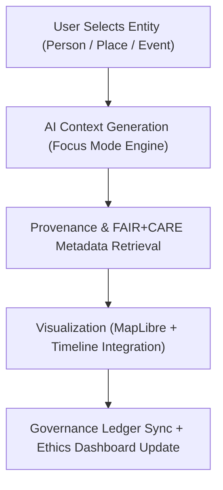

<div align="center">

# 🧠 **Kansas Frontier Matrix — Focus Mode Feature Module (v2.1.1 · Tier-Ω+∞ Certified)**  
`web/src/features/focus-mode/README.md`

**Mission:** Enable users to explore people, places, events, and datasets contextually through **AI-driven insights**,  
**provenance-linked reasoning**, and **FAIR+CARE-aligned ethical guidance** within the **Kansas Frontier Matrix (KFM)** interface.

[](../../../../docs/)
[](../../../../docs/standards/faircare-validation.md)
[](../../../../docs/standards/accessibility.md)
[](../../../../LICENSE)

</div>

---

## 📚 Overview

The **Focus Mode Module** provides the AI-assisted, context-driven exploration environment of the  
Kansas Frontier Matrix (KFM) web application. It connects spatial, temporal, and semantic layers —  
allowing users to “zoom in” on any entity and view related datasets, provenance logs, and ethical metadata.

Focus Mode unifies:
- 🌍 **Spatial Context** → map-linked entities and relationships.  
- 🕰️ **Temporal Context** → timeline-aligned events and provenance chains.  
- 🧠 **AI Reasoning Context** → explainable AI summaries and ethical metadata.  
- ♿ **Accessibility Context** → keyboard + ARIA navigation with readable explanations.  

---

## 🗂️ Directory Layout

```bash
web/src/features/focus-mode/
├── README.md                         # This file — Documentation for Focus Mode module
│
├── context-panel/                    # Entity, relationship, and dataset summaries
│   ├── context-summary.tsx            # Displays AI contextual summary for selected entity
│   ├── provenance-links.tsx           # Displays provenance chain and ledger references
│   └── related-entities.tsx           # Suggests linked places, events, or datasets
│
└── ai-explainability/                # AI model interpretability and drift tracking
    ├── model-explanation.tsx          # Visualizes model decision weights and confidence
    ├── bias-metrics.tsx               # FAIR+CARE-aligned bias and accountability metrics
    └── audit-panel.tsx                # Displays audit reports and governance sign-offs
```

---

## ⚙️ Focus Mode Architecture


<!-- END OF MERMAID -->

---

## 🧩 Core Components

| Component | Description | FAIR+CARE Function | Validation Workflow |
|:--|:--|:--|:--|
| **Context Summary** | Generates entity overview from datasets and AI models. | Findable + Responsible | `ai-validate.yml` |
| **Provenance Links** | Connects entities to metadata, datasets, and ledger entries. | Traceability + Transparency | `stac-validate.yml` |
| **Related Entities** | Suggests relationships and spatial/temporal proximity. | Collective Benefit (CARE) | `faircare-validate.yml` |
| **Model Explanation** | Displays explainability metrics for AI outputs. | Ethics + Responsibility | `ai-validate.yml` |
| **Bias Metrics** | Reports AI fairness and bias drift over time. | Responsibility + Ethics | `faircare-validate.yml` |
| **Audit Panel** | Summarizes validation and ledger sign-off results. | Governance Accountability | `governance-ledger.yml` |

---

## 🧠 FAIR + CARE Integration

| Principle | Implementation | Validation |
|:--|:--|:--|
| **Findable** | Entities linked to STAC/DCAT IDs with searchable metadata. | `stac-validate.yml` |
| **Accessible** | Context panel and AI insights fully accessible (WCAG 2.1 AA). | `design-validate.yml` |
| **Interoperable** | AI outputs serialized to JSON-LD for governance review. | `policy-check.yml` |
| **Reusable** | Exports Focus Mode state for reproducibility and audit. | `ui-validate.yml` |
| **Collective Benefit (CARE)** | Ethical AI reinforces inclusion and transparency. | `faircare-validate.yml` |

---

## ♿ Accessibility Standards

| Category | Implementation | Validation Workflow |
|:--|:--|:--|
| **Keyboard Navigation** | Fully tab-navigable Focus Mode interface. | `ui-validate.yml` |
| **ARIA Roles** | Roles and regions defined for AI and provenance panels. | `design-validate.yml` |
| **Readable AI Summaries** | AI explanations include plain-language descriptions. | `faircare-validate.yml` |
| **Contrast Ratio** | Minimum 4.5:1 for text and graphics. | `design-validate.yml` |

---

## 🔍 Provenance & AI Governance Integration

| Artifact | Purpose | Path |
|:--|:--|:--|
| **AI Model Ledger** | Logs explainability metrics and ethical validations. | `data/reports/audit/ai_hazards_ledger.json` |
| **Governance Ledger** | Tracks checksum and Council approval records. | `data/reports/audit/data_provenance_ledger.json` |
| **FAIR+CARE Validation Report** | Stores AI and dataset ethical compliance results. | `data/reports/fair/data_care_assessment.json` |

---

## 🧮 Observability Metrics

| Metric | Description | Target | Workflow |
|:--|:--|:--|:--|
| **AI Explainability Coverage** | % of models with explanation panels implemented. | 100% | `ai-validate.yml` |
| **FAIR+CARE Compliance Rate** | Governance-approved AI contextual output. | ≥ 95% | `faircare-validate.yml` |
| **Accessibility Score (WCAG)** | Compliance for ARIA + keyboard support. | ≥ 95 | `design-validate.yml` |
| **Governance Ledger Sync Rate** | Focus Mode provenance registered successfully. | 100% | `governance-ledger.yml` |

---

## 🧾 Example Component Metadata

```yaml
---
feature_id: "web_feature_focus-mode_v2.1.1"
authors: ["@kfm-web"]
faircare_status: "Tier-Ω+∞ Verified"
checksum: "sha256:de7b1a72b8e41c9a..."
governance_ledger_entry: "data/reports/audit/data_provenance_ledger.json"
accessibility_compliance: "WCAG 2.1 AA"
license: "MIT"
---
```

---

## 🧩 Validation Workflows

| Workflow | Function | Output |
|:--|:--|:--|
| `ai-validate.yml` | Evaluates AI explainability and governance compliance. | `reports/validation/ai_validation.json` |
| `faircare-validate.yml` | Audits ethical and cultural data compliance. | `reports/fair/data_care_assessment.json` |
| `stac-validate.yml` | Validates metadata and entity provenance. | `reports/validation/stac_validation_report.json` |
| `design-validate.yml` | Runs WCAG accessibility tests. | `reports/validation/a11y_validation.json` |
| `governance-ledger.yml` | Logs checksums and Council approval metadata. | `data/reports/audit/data_provenance_ledger.json` |

---

## 🕰 Version History

| Version | Date | Author | Summary |
|:--|:--|:--|:--|
| **v2.1.1** | 2025-11-16 | @kfm-web | Added full explainability and FAIR+CARE provenance integration. |
| v2.0.0 | 2025-10-25 | @kfm-architecture | Introduced Focus Mode AI reasoning panel and metadata linkages. |
| v1.0.0 | 2025-10-04 | @kfm-docs | Initial Focus Mode documentation and accessibility validation. |

---

<div align="center">

**Kansas Frontier Matrix © 2025**  
*“Context Is Knowledge — Provenance Is Integrity.”*  
📍 `web/src/features/focus-mode/README.md` — FAIR+CARE-aligned Focus Mode feature documentation for the Kansas Frontier Matrix.

</div>

