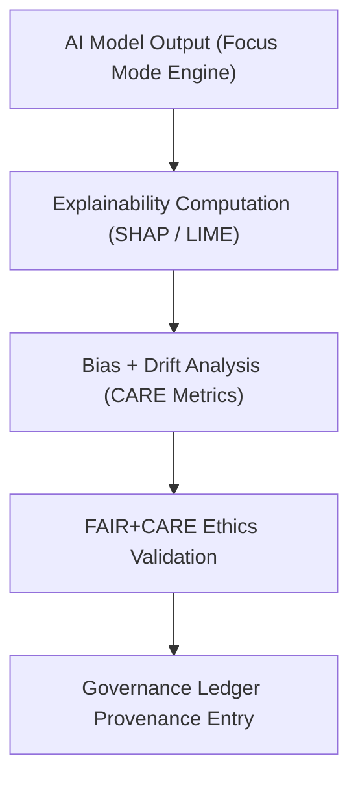

<div align="center">

# 🤖 **Kansas Frontier Matrix — Focus Mode AI Explainability Module (v2.1.1 · Tier-Ω+∞ Certified)**  
`web/src/features/focus-mode/ai-explainability/README.md`

**Mission:** Enable transparent, FAIR+CARE-compliant AI reasoning visualization for the **Kansas Frontier Matrix (KFM)**  
Focus Mode — providing interpretability dashboards, bias monitoring, and provenance-linked explainability for AI-driven insights.

[](../../../../../docs/)
[](../../../../../docs/standards/faircare-validation.md)
[](../../../../../docs/standards/accessibility.md)
[](../../../../../LICENSE)

</div>

---

## 📚 Overview

The **AI Explainability Module** provides real-time interpretability tools for the **Focus Mode** experience,  
enabling users and governance councils to understand, audit, and verify how AI models generate context summaries,  
insights, and data correlations.

Core capabilities:
- 🧩 Visualize **model reasoning** and feature importance (SHAP, LIME, Grad-CAM).  
- ⚖️ Log **bias metrics**, model drift, and ethical performance in the governance ledger.  
- 📊 Render interactive dashboards for **AI explainability** and provenance tracking.  
- ♿ Provide **accessible visualizations** under WCAG 2.1 AA guidelines.  

---

## 🗂️ Directory Layout

```bash
web/src/features/focus-mode/ai-explainability/
├── README.md                       # This file — AI explainability module documentation
│
├── model-explanation.tsx            # Model explainability component (SHAP/LIME visualization)
├── bias-metrics.tsx                 # Displays fairness, drift, and bias metrics for AI models
└── audit-panel.tsx                  # Governance audit and ethics dashboard with ledger linkage
```

---

## ⚙️ Explainability Governance Model


<!-- END OF MERMAID -->

---

## 🧱 Core Components

| Component | Description | FAIR+CARE Function | Validation Workflow |
|:--|:--|:--|:--|
| **Model Explanation** | Visualizes reasoning behind AI predictions. | Transparency + Accountability | `ai-validate.yml` |
| **Bias Metrics** | Displays fairness metrics and model drift indicators. | Responsibility + Ethics | `faircare-validate.yml` |
| **Audit Panel** | Summarizes validation results, governance decisions, and ledger sign-offs. | Governance Oversight | `governance-ledger.yml` |

---

## 🧠 FAIR + CARE Integration

| Principle | Implementation | Validation |
|:--|:--|:--|
| **Findable** | AI outputs tagged with unique model and dataset IDs. | `ai-validate.yml` |
| **Accessible** | Visuals accessible via keyboard navigation and ARIA annotations. | `design-validate.yml` |
| **Interoperable** | AI metadata exported as JSON-LD for governance reviews. | `policy-check.yml` |
| **Reusable** | Results stored for reproducibility and audits. | `ui-validate.yml` |
| **Collective Benefit (CARE)** | Governance dashboards promote ethical transparency. | `faircare-validate.yml` |

---

## ♿ Accessibility Standards (WCAG 2.1 AA)

| Feature | Implementation | Validation Workflow |
|:--|:--|:--|
| **Keyboard Navigation** | Tab-order through AI visualization and metrics. | `design-validate.yml` |
| **ARIA Descriptions** | Explainable visuals labeled with ARIA and `alt` text. | `docs-validate.yml` |
| **Color Contrast** | ≥ 4.5:1 ratio for charts and text. | `design-validate.yml` |
| **Text Equivalents** | AI feature weights summarized in plain language. | `faircare-validate.yml` |

---

## 🔍 Provenance & Governance Integration

| Artifact | Purpose | Path |
|:--|:--|:--|
| **AI Model Ledger** | Stores explainability, bias, and performance logs. | `data/reports/audit/ai_hazards_ledger.json` |
| **Governance Ledger** | Records checksum and validation entries. | `data/reports/audit/data_provenance_ledger.json` |
| **FAIR+CARE Ethics Report** | Summarizes ethical impact assessment. | `data/reports/fair/data_care_assessment.json` |

---

## 🧮 Observability Metrics

| Metric | Description | Target | Workflow |
|:--|:--|:--|:--|
| **Explainability Coverage** | % of AI predictions with visual explanations. | 100% | `ai-validate.yml` |
| **Bias Drift Index** | Average deviation of fairness metric over time. | ≤ 0.05 | `faircare-validate.yml` |
| **Ethics Compliance Rate** | FAIR+CARE adherence score across models. | ≥ 95 | `faircare-validate.yml` |
| **Governance Sync Rate** | Ledger integration success rate. | 100% | `governance-ledger.yml` |

---

## 🧾 Example Component Metadata

```yaml
---
component_id: "focus_ai_explainability_v2.1.1"
authors: ["@kfm-ai","@kfm-web"]
faircare_status: "Tier-Ω+∞ Verified"
checksum: "sha256:8f6a27d2e8d9183b..."
governance_ledger_entry: "data/reports/audit/data_provenance_ledger.json"
accessibility_compliance: "WCAG 2.1 AA"
license: "MIT"
---
```

---

## 🧾 Validation Workflows

| Workflow | Function | Output |
|:--|:--|:--|
| `ai-validate.yml` | Verifies AI explainability outputs and interpretability metrics. | `reports/validation/ai_validation.json` |
| `faircare-validate.yml` | Ensures ethics and fairness alignment across models. | `reports/fair/data_care_assessment.json` |
| `design-validate.yml` | Runs accessibility and ARIA compliance audits. | `reports/validation/a11y_validation.json` |
| `governance-ledger.yml` | Records provenance and checksum signatures. | `data/reports/audit/data_provenance_ledger.json` |

---

## 🕰 Version History

| Version | Date | Author | Summary |
|:--|:--|:--|:--|
| **v2.1.1** | 2025-11-16 | @kfm-ai | Added bias metrics and FAIR+CARE compliance dashboard integration. |
| v2.0.0 | 2025-10-25 | @kfm-web | Introduced explainability visualization and ethics review workflows. |
| v1.0.0 | 2025-10-04 | @kfm-docs | Initial AI explainability documentation and audit hooks. |

---

<div align="center">

**Kansas Frontier Matrix © 2025**  
*“Understanding AI Is a Human Right — Provenance Makes It Possible.”*  
📍 `web/src/features/focus-mode/ai-explainability/README.md` — FAIR+CARE-aligned AI explainability module documentation for the Kansas Frontier Matrix.

</div>

