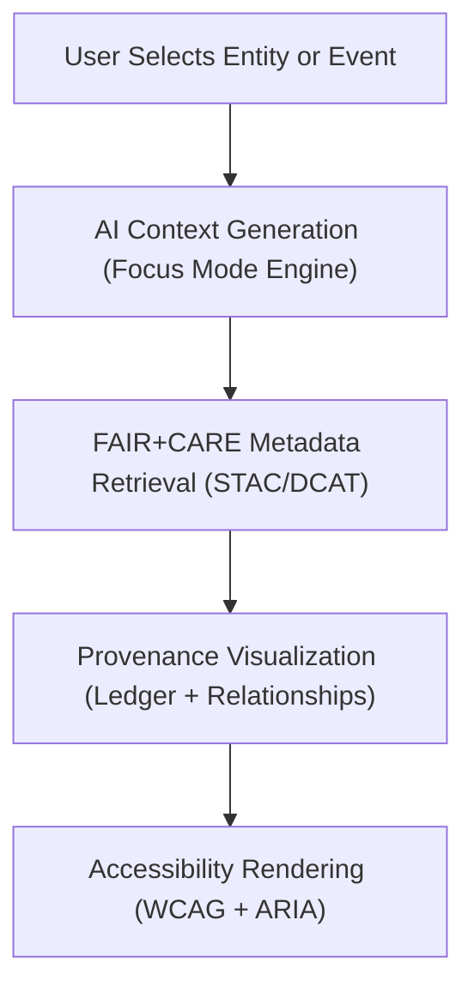

<div align="center">

# 🧩 **Kansas Frontier Matrix — Focus Mode Context Panel (v2.1.1 · Tier-Ω+∞ Certified)**  
`web/src/features/focus-mode/context-panel/README.md`

**Mission:** Provide a contextual, FAIR+CARE-aligned AI-driven interface that unifies spatial, temporal,  
and semantic data about entities (people, places, events, datasets) within the **Kansas Frontier Matrix (KFM)** Focus Mode.

[](../../../../../docs/)
[](../../../../../docs/standards/faircare-validation.md)
[](../../../../../docs/standards/accessibility.md)
[](../../../../../LICENSE)

</div>

---

## 📚 Overview

The **Focus Mode Context Panel** provides dynamic AI-generated summaries, provenance chains, and  
related dataset visualizations for a selected entity or event. It acts as the **primary knowledge interface**  
in the KFM web application’s Focus Mode.

Core goals:
- 🧠 Present **AI contextual summaries** for selected entities (places, people, events).  
- 🔗 Display **provenance and FAIR+CARE metadata** from STAC/DCAT catalogs.  
- ♿ Maintain **WCAG 2.1 AA** accessibility with readable, explainable content.  
- ⚙️ Sync dynamically with MapLibre map layers and timeline events.

---

## 🗂️ Directory Layout

```bash
web/src/features/focus-mode/context-panel/
├── README.md                      # This file — Documentation for context panel
│
├── context-summary.tsx             # AI-generated summaries with FAIR+CARE metadata
├── provenance-links.tsx            # Provenance chain viewer with governance ledger links
└── related-entities.tsx            # Displays connected entities, datasets, and events
```

---

## ⚙️ Context Panel Governance Model


<!-- END OF MERMAID -->

---

## 🧱 Core Components

| Component | Description | FAIR+CARE Function | Validation Workflow |
|:--|:--|:--|:--|
| **Context Summary** | Displays AI-generated summaries for selected entities. | Findable + Responsible | `ai-validate.yml` |
| **Provenance Links** | Shows metadata lineage and governance entries. | Transparency + Ethics | `governance-ledger.yml` |
| **Related Entities** | Lists connected datasets, events, and people. | Collective Benefit (CARE) | `faircare-validate.yml` |

---

## 🧠 FAIR + CARE Integration

| Principle | Implementation | Validation |
|:--|:--|:--|
| **Findable** | Entities indexed with STAC/DCAT identifiers and timestamps. | `stac-validate.yml` |
| **Accessible** | Plain-text summaries and keyboard focusable interface. | `design-validate.yml` |
| **Interoperable** | JSON-LD semantic tagging for AI context output. | `policy-check.yml` |
| **Reusable** | Modular React components and AI summaries exportable to JSON. | `ui-validate.yml` |
| **Collective Benefit (CARE)** | Highlights Indigenous, cultural, and community data ethically. | `faircare-validate.yml` |

---

## ♿ Accessibility Standards (WCAG 2.1 AA)

| Feature | Implementation | Validation Workflow |
|:--|:--|:--|
| **Keyboard Navigation** | Fully tab-navigable and screen-reader accessible. | `ui-validate.yml` |
| **ARIA Roles** | Context panels labeled via `role="region"` and `aria-label`. | `design-validate.yml` |
| **Readable AI Text** | Summaries written at or below grade 9 reading level. | `faircare-validate.yml` |
| **Color Contrast** | Minimum 4.5:1 ratio for text, background, and links. | `design-validate.yml` |

---

## 🔍 Provenance & Metadata Integration

| Artifact | Description | Path |
|:--|:--|:--|
| **STAC Item Metadata** | Links contextual entities to datasets. | `data/stac/items/` |
| **DCAT Catalog** | Lists cross-domain metadata and linked datasets. | `data/meta/dcat_catalog.json` |
| **Governance Ledger** | Logs provenance and checksum for contextual data. | `data/reports/audit/data_provenance_ledger.json` |

---

## 🧩 Example Metadata Record

```yaml
---
component_id: "focus_context_panel_v2.1.1"
authors: ["@kfm-web","@kfm-ai"]
faircare_status: "Tier-Ω+∞ Verified"
checksum: "sha256:a57b8e9b39ce427d..."
governance_ledger_entry: "data/reports/audit/data_provenance_ledger.json"
accessibility_compliance: "WCAG 2.1 AA"
license: "MIT"
---
```

---

## 🧮 Observability Metrics

| Metric | Description | Target | Workflow |
|:--|:--|:--|:--|
| **FAIR Metadata Link Accuracy** | Linked entities to valid STAC/DCAT entries. | 100% | `stac-validate.yml` |
| **Accessibility Compliance (WCAG)** | Score from accessibility audits. | ≥ 95 | `design-validate.yml` |
| **AI Explanation Completeness** | % of summaries with full provenance chain. | 100% | `ai-validate.yml` |
| **Governance Ledger Sync Rate** | Entries successfully logged in ledger. | 100% | `governance-ledger.yml` |

---

## 🧾 Validation Workflows

| Workflow | Function | Output |
|:--|:--|:--|
| `ai-validate.yml` | Evaluates AI summary explainability and ethical alignment. | `reports/validation/ai_validation.json` |
| `stac-validate.yml` | Validates STAC/DCAT metadata linkage. | `reports/validation/stac_validation_report.json` |
| `faircare-validate.yml` | Verifies cultural and community ethics. | `reports/fair/data_care_assessment.json` |
| `design-validate.yml` | Ensures WCAG accessibility compliance. | `reports/validation/a11y_validation.json` |
| `governance-ledger.yml` | Records checksum and provenance chain. | `data/reports/audit/data_provenance_ledger.json` |

---

## 🕰 Version History

| Version | Date | Author | Summary |
|:--|:--|:--|:--|
| **v2.1.1** | 2025-11-16 | @kfm-web | Added explainability metrics, FAIR+CARE metadata sync, and accessibility audit schema. |
| v2.0.0 | 2025-10-25 | @kfm-architecture | Introduced provenance linking and related-entity relationships. |
| v1.0.0 | 2025-10-04 | @kfm-docs | Initial Focus Mode Context Panel documentation. |

---

<div align="center">

**Kansas Frontier Matrix © 2025**  
*“Context Makes Knowledge — Provenance Makes Truth.”*  
📍 `web/src/features/focus-mode/context-panel/README.md` — FAIR+CARE-aligned Focus Mode Context Panel documentation for the Kansas Frontier Matrix.

</div>

