<div align="center">

# 🔍 **Focus Mode — AI Narrative Engine & Contextual Explorer**  
`web/src/features/focus/README.md`

**Purpose:**  
Enable users to explore **entities (people, places, events)** as **living story networks** through AI-generated summaries, contextual maps, and linked timeline insights.  
This module binds KFM’s **knowledge graph**, **MapLibre timeline**, and **Focus Transformer v2** model into one interactive experience aligned with **MCP-DL v6.3** and **FAIR+CARE governance**.

[](../../../docs/)
[](../../../LICENSE)
[](../../../docs/standards/)
[](#)

</div>

---

## 📘 Overview

**Focus Mode** allows users to "zoom in" semantically — centering the interface on a single entity (person, event, tribe, or site) — while the entire map, timeline, and narrative panels reorganize around it.  
Powered by the **Focus Transformer v2** model, it fuses **graph queries**, **AI summarization**, and **telemetry feedback** into contextualized insights.

**Core Goals**
- 🧠 Summarize complex, cross-domain relationships via AI (Focus Transformer).  
- 🌐 Visually link map, timeline, and story nodes around a chosen entity.  
- 🧩 Support interactive exploration: related people, events, and places.  
- ⚙️ Provide transparency and explainability (bias, drift, confidence telemetry).  
- ♻️ Ensure FAIR+CARE alignment: ethical handling of sensitive cultural data.

---

## 🗂️ Directory Layout

```plaintext
web/
└─ src/
   └─ features/
      └─ focus/
         README.md                # This file — Focus Mode overview
         focus-panel.tsx          # React component: summary + related entities
         focus-context.ts         # Global state for selected entity
         useFocus.ts              # Hook: Focus lifecycle + AI pipeline bindings
         focus-transformer.ts     # API client for Focus AI model
         explainability.ts        # SHAP/LIME drift visualization helpers
         focus-utils.ts           # Formatting, caching, debounce utilities
         focus-metadata.json      # Versioned schema & model config
```

---

## ⚙️ Component Architecture

```mermaid
flowchart TD
  A["User selects entity (map/timeline/search)"]
  B["Focus Context updates with entity ID"]
  C["GraphQL query → /api/focus/{id}"]
  D["Focus Transformer v2 (AI summarization)"]
  E["FocusPanel renders summary, map, related items"]
  F["Telemetry logs insights + governance tags"]

  A --> B --> C --> D --> E --> F
  D -->|Explainability data| G["Drift & bias visualization (explainability.ts)"]
```



**Modules**
- `focus-context.ts`: React context storing current entity, AI output, related data.  
- `focus-transformer.ts`: Handles API requests to the **Focus Transformer v2** model.  
- `focus-panel.tsx`: Displays AI narrative + relationships (people, places, events).  
- `explainability.ts`: Generates model explainability graphs (LIME/SHAP).  
- `focus-utils.ts`: Provides caching, telemetry hooks, and error resilience.

---

## 🧠 Focus Transformer v2 — Pipeline Summary

| Stage | Function | Output |
|-------|-----------|---------|
| **1. Graph Query** | Fetch subgraph for selected entity. | JSON node/edge structure. |
| **2. Embedding & Context Building** | Encode subgraph + related text. | Semantic embedding tensor. |
| **3. Summarization** | Generate natural-language narrative. | Markdown or HTML summary. |
| **4. Explainability** | Compute SHAP/LIME scores. | Bias, drift, and feature impact data. |
| **5. Telemetry Logging** | Record latency, confidence, and usage. | Logged to `focus-telemetry.json`. |

> The model operates client-assisted (browser request → backend AI service). Responses include structured provenance for transparency.

---

## 🧾 Example Response (from `/api/focus/{id}`)

```json
{
  "entity": {
    "id": "fort-larned",
    "label": "Fort Larned",
    "type": "Place",
    "years": [1859, 1878],
    "coords": [-99.219, 38.183]
  },
  "summary": "Fort Larned (est. 1859) served as a U.S. Army post on the Santa Fe Trail. It was pivotal in treaty negotiations and supply routes during the Indian Wars.",
  "related": {
    "people": ["William Bent", "Black Kettle"],
    "events": ["Medicine Lodge Treaty (1867)"],
    "places": ["Pawnee Rock", "Santa Fe Trail"]
  },
  "explainability": {
    "confidence": 0.92,
    "bias_score": 0.03,
    "important_terms": ["Santa Fe Trail", "Army post", "Indian Wars"]
  },
  "governance": { "care_tag": "public", "ethical_review": "approved" }
}
```

---

## 🖥️ FocusPanel (React component)

Renders the entity summary, relations, and explainability insights.

```tsx
export function FocusPanel({ data }) {
  return (
    <section aria-labelledby="focus-heading">
      <h2 id="focus-heading">{data.entity.label}</h2>
      <p>{data.summary}</p>
      <ul>
        {data.related.people.map(p => <li key={p}>👤 {p}</li>)}
        {data.related.events.map(e => <li key={e}>📅 {e}</li>)}
        {data.related.places.map(l => <li key={l}>📍 {l}</li>)}
      </ul>
      <aside>
        <strong>Confidence:</strong> {(data.explainability.confidence * 100).toFixed(1)}%
      </aside>
    </section>
  );
}
```

---

## 🧭 User Interactions & Context Sync

| Action | Trigger | Effect |
|--------|----------|--------|
| Click on map feature | `kfm:focus:select` | Load entity data & update context. |
| Select timeline event | `kfm:timeline:focus` | Align slider to event year & update panel. |
| Search result click | `kfm:search:select` | Prefetch AI summary. |
| Focus close | `kfm:focus:clear` | Reset UI and telemetry. |

---

## ♻️ Telemetry & Governance Integration

Each Focus event logs to telemetry and governance layers:

```json
{
  "event": "focus-select",
  "entity": "fort-larned",
  "timestamp": "2025-11-08T14:35:00Z",
  "user_role": "public",
  "latency_ms": 184,
  "ai_confidence": 0.92,
  "faircare": "approved"
}
```

Telemetry schema: `schemas/telemetry/web-focus-v2.json`

> Telemetry ensures reproducibility, monitors bias drift, and validates ethical access under FAIR+CARE Council supervision.

---

## ♿ Accessibility Standards

- All panels use **semantic HTML regions** with **ARIA roles** (`region`, `heading`, `navigation`).  
- Support **keyboard navigation** (`Tab`, `Shift+Tab`, `Enter`, `Esc`).  
- High-contrast themes follow WCAG 2.1 AA.  
- Sensitive or restricted summaries are hidden for non-privileged users.  
- Summary text supports screen reader dynamic updates via `aria-live="polite"`.

---

## ⚙️ Governance & Ethical Review

| Tag | Meaning | Policy |
|------|---------|--------|
| `public` | Openly accessible. | Render summary + relations. |
| `restricted` | Requires login or clearance. | Mask sensitive text. |
| `sensitive` | Indigenous or private heritage data. | Omit or anonymize. |

All governance enforcement hooks align with `DATA-GOVERNANCE.md` and are validated through FAIR+CARE audits.

---

## 🧾 Internal Citation

```text
Kansas Frontier Matrix (2025). Focus Mode — AI Narrative Engine & Contextual Explorer (v9.9.0).
MCP-DL v6.3, FAIR+CARE compliant web feature for contextual knowledge exploration.
Integrates Neo4j, AI Focus Transformer, and explainability telemetry for transparent insights.
```

---

## 🕰️ Version History

| Version | Date       | Author | Summary |
|--------:|------------|--------|----------|
| v9.9.0 | 2025-11-08 | `@kfm-web` | Focus Transformer v2 integration, telemetry & explainability architecture added. |
| v9.8.0 | 2025-11-05 | `@kfm-ui` | Timeline & focus synchronization refactor. |
| v9.7.0 | 2025-11-02 | `@kfm-core` | Established baseline Focus Mode with graph linking. |

---

<div align="center">

**Kansas Frontier Matrix**  
*AI Context × FAIR+CARE Governance × Transparent Exploration*  
© 2025 Kansas Frontier Matrix · Master Coder Protocol v6.3 · FAIR+CARE Certified · Diamond⁹ Ω / Crown∞Ω Ultimate Certified  

[Back to Web Features](../README.md) · [Governance Charter](../../../docs/standards/governance/DATA-GOVERNANCE.md)

</div>

