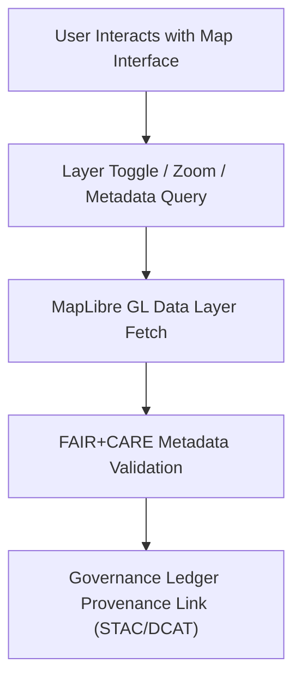

<div align="center">

# 🗺️ **Kansas Frontier Matrix — Map Feature Module (v2.1.1 · Tier-Ω+∞ Certified)**  
`web/src/features/map/README.md`

**Mission:** Provide an interactive, FAIR+CARE-aligned **MapLibre GL visualization system** for the Kansas Frontier Matrix (KFM) web application.  
This module displays geospatial data layers, overlays, and provenance-linked STAC metadata while maintaining accessibility and reproducibility.

[](../../../../docs/)
[](../../../../docs/standards/faircare-validation.md)
[](../../../../docs/standards/accessibility.md)
[](../../../../LICENSE)

</div>

---

## 📚 Overview

The **Map Feature Module** powers the spatial experience of the KFM web platform using **MapLibre GL JS**.  
It allows users to:
- Visualize environmental, historical, and treaty datasets via geospatial layers.  
- Toggle overlays for hazards, hydrology, archival, and cultural data.  
- Access provenance-linked metadata for each map layer (FAIR+CARE).  
- Support accessibility (WCAG 2.1 AA) with ARIA-compliant controls and visual contrast validation.  

---

## 🗂️ Directory Layout

```bash
web/src/features/map/
├── README.md                      # This file — Map feature documentation
│
├── layers/                        # Geospatial data layers
│   ├── hazards-layer.tsx          # NOAA/FEMA hazard maps
│   ├── treaties-layer.tsx         # Treaty boundaries and archival maps
│   ├── hydrology-layer.tsx        # River and watershed overlays
│   └── cultural-layer.tsx         # Indigenous cultural regions (CARE-aligned)
│
├── controls/                      # Interactive map controls and legends
│   ├── legend.tsx                 # Dynamic layer legend component
│   ├── zoom-controls.tsx          # Zoom and reset view controls
│   ├── layer-toggle.tsx           # Layer visibility switcher
│   └── basemap-selector.tsx       # Selects base map style (satellite, terrain, archival)
│
└── hooks/                         # Map and state management utilities
    ├── use-map.ts                 # Map instance and layer hooks
    ├── use-layer-visibility.ts    # Layer toggle management
    └── use-provenance-link.ts     # STAC/DCAT provenance linking utility
```

---

## ⚙️ Map Governance Model


<!-- END OF MERMAID -->

---

## 🧩 Core Features

| Feature | Description | FAIR+CARE Function | Validation Workflow |
|:--|:--|:--|:--|
| **Hazard Layers** | Displays tornado, flood, and drought data from NOAA/FEMA. | Findable & Accessible (FAIR) | `stac-validate.yml` |
| **Treaty Layers** | Visualizes Indigenous land cession and treaty maps. | Collective Benefit (CARE) | `faircare-validate.yml` |
| **Hydrology Layers** | Depicts river basins and water resource data (USGS). | Interoperable & Reusable | `stac-validate.yml` |
| **Cultural Layers** | CARE-focused overlays for heritage datasets. | Ethics & Responsibility (CARE) | `faircare-validate.yml` |
| **Legend & Controls** | Interactive legend, basemap switcher, zoom, and a11y. | Accessible & Transparent | `design-validate.yml` |

---

## 🧠 Accessibility Standards

| WCAG Category | Implementation | Validation |
|:--|:--|:--|
| **Contrast Ratio** | ≥ 4.5:1 for text and line features. | `design-validate.yml` |
| **Keyboard Navigation** | Tab-ordered ARIA controls for layers and zoom. | `design-validate.yml` |
| **ARIA Roles** | Map and controls labeled via `aria-label`. | `docs-validate.yml` |
| **Alt Text / Descriptions** | Each map layer includes descriptive alt text. | `faircare-validate.yml` |
| **User Preferences** | Adjustable color contrast and base map style. | `ui-validate.yml` |

---

## 🧾 Provenance Integration

Each dataset visualized through the map includes STAC or DCAT metadata linking it to a  
provenance ledger entry for full reproducibility and audit traceability.

| Metadata Standard | Description | Repository Path |
|:--|:--|:--|
| **STAC 1.0** | Spatiotemporal metadata and bounding boxes. | `data/stac/catalog.json` |
| **DCAT 3.0** | Dataset catalog for interoperability and APIs. | `data/meta/dcat_catalog.json` |
| **Governance Ledger** | Checksum and provenance verification logs. | `data/reports/audit/data_provenance_ledger.json` |

---

## 🧮 Observability Metrics

| Metric | Description | Target | Validation Workflow |
|:--|:--|:--|:--|
| **Layer Load Time** | Average load time for map layers. | ≤ 1.5s | `ui-validate.yml` |
| **Accessibility Score (WCAG)** | A11y compliance of UI controls. | ≥ 95 | `design-validate.yml` |
| **FAIR+CARE Metadata Linkage** | % of layers with provenance. | 100% | `faircare-validate.yml` |
| **Rendering Performance (FPS)** | Map render consistency. | ≥ 55 FPS | Manual & CI Perf Audit |

---

## 🧾 Governance Metadata Example

```yaml
---
feature_id: "web_feature_map_v2.1.1"
authors: ["@kfm-web"]
faircare_status: "Tier-Ω+∞ Verified"
checksum: "sha256:fc8b6d3e9e2a5d9f..."
governance_ledger_entry: "data/reports/audit/data_provenance_ledger.json"
license: "MIT"
accessibility_compliance: "WCAG 2.1 AA"
---
```

---

## 🕰 Version History

| Version | Date | Author | Summary |
|:--|:--|:--|:--|
| **v2.1.1** | 2025-11-16 | @kfm-web | Added FAIR+CARE linkage and accessibility audit workflow integration. |
| v2.0.0 | 2025-10-25 | @kfm-architecture | Added layer toggles and provenance linkage utilities. |
| v1.0.0 | 2025-10-04 | @kfm-docs | Initial MapLibre GL feature module documentation. |

---

<div align="center">

**Kansas Frontier Matrix © 2025**  
*“Every Map Has Provenance — Every Layer Has Meaning.”*  
📍 `web/src/features/map/README.md` — FAIR+CARE-compliant Map feature module documentation for the Kansas Frontier Matrix web platform.

</div>

