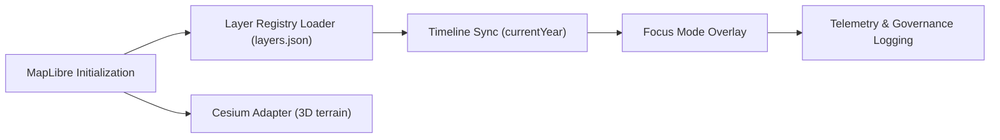

<div align="center">

# 🗺️ **MapLibre Integration — Interactive Map & 3D Layer Engine**  
`web/src/features/map/README.md`

**Purpose:**  
Defines the **interactive mapping engine** for the Kansas Frontier Matrix (KFM) web application using **MapLibre GL** and **CesiumJS**.  
Enables synchronized **2D/3D visualization**, **timeline integration**, and **AI-driven Focus overlays**, governed under **FAIR+CARE** and **MCP-DL v6.3**.

[](../../../docs/)
[](../../../LICENSE)
[](../../../docs/standards/)
[](#)

</div>

---

## 📘 Overview

The **Map feature** provides the **spatial foundation** of the Kansas Frontier Matrix — rendering layers for:
- Historical maps and boundaries  
- Environmental and hazard datasets  
- Archaeological and cultural sites  
- Focus Mode entity highlights  
- AI-predicted change overlays  

It supports **MapLibre GL JS** for 2D visualization and **CesiumJS** for 3D terrain and temporal reconstructions, all tied to KFM’s **timeline** and **graph APIs**.

---

## 🗂️ Directory Layout

```plaintext
web/
└─ src/
   └─ features/
      └─ map/
         README.md              # This file — MapLibre integration guide
         map-init.ts            # Map initialization and basemap setup
         layers.json            # Layer registry and metadata
         controls.tsx           # UI controls (zoom, basemap, legend)
         useMap.ts              # React hook managing map context
         map-context.ts         # Shared state for layer registry
         cesium-adapter.ts      # Optional Cesium 3D bridge
         utils/
         ├─ pmtiles-protocol.ts # PMTiles integration
         ├─ map-style-utils.ts  # Style helpers and expressions
         └─ telemetry.ts        # Performance logging and governance hooks
```

---

## ⚙️ Core Architecture



**Subsystems**
- 🗺️ **MapLibre Core:** Base renderer for 2D vector/raster layers.  
- 🌎 **Cesium Bridge:** 3D terrain visualization with time-enabled animations.  
- 🔁 **Sync Engine:** Coordinates updates between map, timeline, and Focus Mode.  
- ⚙️ **Governance Hooks:** Enforce layer-level ethical visibility.  

---

## 🧩 Layer Registry (`layers.json`)

```json
{
  "layers": [
    {
      "id": "basemap",
      "type": "raster",
      "source": "https://tiles.stadiamaps.com/tiles/alidade_smooth/{z}/{x}/{y}.png",
      "visible": true,
      "governance": { "care_tag": "public" }
    },
    {
      "id": "settlements",
      "type": "vector",
      "source": "pmtiles://datasets/settlements.pmtiles",
      "visible": true,
      "timeline": true,
      "style": "/src/features/timeline/styles/timeline-style.json",
      "governance": { "care_tag": "public" }
    }
  ]
}
```

Each layer defines:
- **Type:** `raster`, `vector`, or `3d`.  
- **Source:** URL or PMTiles reference.  
- **Timeline:** Whether it reacts to `currentYear`.  
- **Governance:** CARE tagging for ethical rendering.  
- **Style:** Path to custom MapLibre style (optional).  

---

## 🧠 Timeline Integration

The **Map** listens to the global **`currentYear`** variable to reveal or hide temporal layers dynamically.

```ts
import maplibregl from 'maplibre-gl';

export function bindTimeline(map: maplibregl.Map) {
  window.addEventListener('kfm:timeline:year', (e: any) => {
    const y = e.detail.year;
    if ((map as any).setStyleVar) (map as any).setStyleVar('currentYear', y);
  });
}
```

> *Tip:* Avoid reloading styles — update via style variables for instant UI response.

---

## 🌍 PMTiles Integration (`utils/pmtiles-protocol.ts`)

Register the **PMTiles protocol** to support compressed, local-first datasets:

```ts
import { Protocol } from 'pmtiles';
import maplibregl from 'maplibre-gl';
const protocol = new Protocol();
maplibregl.addProtocol('pmtiles', protocol.tile);
```

**Advantages**
- Offline caching support.  
- Instant seek within multi-GB archives.  
- Compatible with MapLibre & Cesium simultaneously.

---

## 🛰️ Cesium 3D Adapter (`cesium-adapter.ts`)

Allows toggling between **MapLibre 2D view** and **Cesium 3D terrain view**.

```ts
import { Viewer } from "cesium";

export function initCesium(container: string) {
  const viewer = new Viewer(container, { terrainProvider: "CesiumWorldTerrain" });
  viewer.scene.globe.enableLighting = true;
  return viewer;
}
```

**Features**
- Timeline-driven camera animation.  
- Focus Mode overlay (entity labels + extrusions).  
- STAC-derived terrain and elevation maps.  
- FAIR+CARE enforced layers (no restricted 3D scenes for sensitive data).

---

## 🧮 Map Context & React Hook (`useMap.ts`)

```ts
import { createContext, useContext } from "react";
import maplibregl from "maplibre-gl";

export const MapContext = createContext<maplibregl.Map | null>(null);
export const useMap = () => useContext(MapContext);
```

Provides global map reference across **Timeline**, **Focus**, and **Search** components.  
Enables live updates, telemetry logging, and layer visibility toggles.

---

## 📊 Telemetry & Governance

Every map interaction (zoom, pan, layer toggle) emits telemetry:

```json
{
  "event": "map-interaction",
  "zoom": 7.3,
  "center": [-98.1, 38.7],
  "layers_active": 9,
  "fps": 58,
  "user_role": "public"
}
```

Telemetry stored in:  
`releases/v9.9.0/focus-telemetry.json`  
Schema: `schemas/telemetry/web-map-v1.json`

> CI validates governance visibility using `faircare-validate.yml`.

---

## ♿ Accessibility & UI

| Element | Feature | Standard |
|----------|----------|-----------|
| Map Controls | Keyboard navigable, aria-labeled | WCAG 2.1 AA |
| Layer Toggles | Focus outline + screen reader announcements | WAI-ARIA |
| Legend | Text + color/pattern cues (color-blind safe) | FAIR+CARE |
| Animations | Reduced motion mode supported | OS Prefers Reduced Motion |

---

## 🧱 Data Governance Rules

| Tag | Definition | Behavior |
|-----|-------------|-----------|
| `public` | Open and approved for public viewing | Full visibility |
| `restricted` | Requires login or data license | Semi-transparent overlay |
| `sensitive` | Protected heritage or private data | Hidden in UI |

Governance enforced by KFM middleware and verified in telemetry logs.

---

## 🧾 Internal Citation

```text
Kansas Frontier Matrix (2025). MapLibre Integration — Interactive Map & 3D Layer Engine (v9.9.0).
Defines FAIR+CARE compliant 2D/3D spatial visualization framework for the Kansas Frontier Matrix.
Integrates MapLibre, Cesium, and PMTiles for reproducible, ethical, and accessible geospatial storytelling.
```

---

## 🕰️ Version History

| Version | Date       | Author | Summary |
|--------:|------------|--------|----------|
| v9.9.0 | 2025-11-08 | `@kfm-web` | Added Cesium adapter, PMTiles integration, and governance telemetry hooks. |
| v9.8.0 | 2025-11-05 | `@kfm-ui` | Improved layer registry and Focus Mode overlays. |
| v9.7.0 | 2025-11-02 | `@kfm-core` | Initial MapLibre + Timeline synchronization architecture. |

---

<div align="center">

**Kansas Frontier Matrix**  
*Geospatial Integrity × FAIR+CARE Governance × Reproducible Mapping*  
© 2025 Kansas Frontier Matrix · Master Coder Protocol v6.3 · FAIR+CARE Certified · Diamond⁹ Ω / Crown∞Ω Ultimate Certified  

[Back to Web Features](../README.md) · [Governance Charter](../../../docs/standards/governance/DATA-GOVERNANCE.md)

</div>

