# 🗺️ Map Feature (`web/src/features/map`)


> The Map feature is the **spatiotemporal exploration surface** of KFM: a 2D/3D map + timeline UI that renders *cataloged* datasets (raster + vector) and connects them to governed narrative experiences (Story Nodes / Focus Mode).

---

<details>
  <summary><strong>📌 Table of contents</strong></summary>

- [🎯 What this feature owns](#-what-this-feature-owns)
- [🚦Non-negotiables](#-non-negotiables)
- [🧱 Architecture](#-architecture)
- [🗂️ Folder layout](#️-folder-layout)
- [🔌 Data contracts](#-data-contracts)
- [⏱️ Timeline + time filtering](#️-timeline--time-filtering)
- [🧩 Layer registry](#-layer-registry)
- [🧷 Interaction patterns](#-interaction-patterns)
- [🔒 Sensitive data](#-sensitive-data)
- [♿ Cartographic + accessibility checklist](#-cartographic--accessibility-checklist)
- [⚡ Performance](#-performance)
- [🧪 Testing](#-testing)
- [➕ Playbook: add a new map layer](#-playbook-add-a-new-map-layer)
- [🧯 Troubleshooting](#-troubleshooting)
- [📚 References](#-references)

</details>

---

## 🎯 What this feature owns

**This folder owns (✅):**
- 🗺️ **Map rendering** (2D Web map: *MapLibre GL JS* preferred; *Leaflet* is acceptable for lighter/non-WebGL needs)
- 🌍 **Optional 3D mode** (Cesium) with lazy loading
- 🧭 **Navigation + view state** (center/zoom/bounds, selection, hover)
- 🧱 **Layer management UX** (toggle groups, ordering, opacity, legend)
- 🕰️ **Timeline slider** (scrub + optional playback) that drives map layer time windows
- 🔎 **Discovery hooks** (search box, “jump to” geometry, deep links)
- 🧾 **Evidence/metadata presentation** (provenance badges, uncertainty hints, dataset IDs)

**This folder does NOT own (⛔):**
- Direct database access (especially Neo4j) ❌
- “Hidden datasets” bundled into the frontend build ❌
- Historical interpretation prose without citations (that belongs in governed Story Nodes) ❌

---

## 🚦 Non-negotiables

KFM’s pipeline and governance rules show up **directly** in the Map feature’s implementation choices:

1. **Pipeline ordering is absolute**  
   Data must come through: **ETL → Catalogs (STAC/DCAT/PROV) → Graph → API → UI → Story Nodes → Focus Mode**.  
   The Map UI only consumes *API outputs* and only renders *cataloged* artifacts.

2. **API boundary rule**  
   The frontend must **never** query the Neo4j graph directly. All data access goes through `src/server/` APIs.

3. **Provenance-first, evidence-first**  
   Anything visible on the map must be traceable to **versioned evidence** (catalog entries + lineage). No “mystery layers”.

4. **Sovereignty + sensitivity propagate**  
   If an upstream artifact is restricted/sensitive, the UI must respect it (and default to the safest rendering).

> If you’re making a change that violates any of the above, it’s not a “map feature change” — it’s a *pipeline/governance break*.

---

## 🧱 Architecture

### 🌐 KFM pipeline (context)

```mermaid
flowchart LR
  subgraph Data
    A["Raw Sources"] --> B["ETL + Normalization"]
    B --> C["STAC Items + Collections"]
    C --> D["DCAT Dataset Views"]
    C --> E["PROV Lineage Bundles"]
  end

  C --> G["Neo4j Graph (refs back to catalogs)"]
  G --> H["API Layer (contracts + redaction)"]
  H --> I["Map UI — React · MapLibre · (optional) Cesium"]
  I --> J["Story Nodes (governed narratives)"]
  J --> K["Focus Mode (provenance-linked bundle)"]
```



### 🧩 Map feature internal flow (recommended mental model)

```mermaid
flowchart TD
  U[User] -->|pan/zoom/click| MV[MapView]
  U -->|toggle layers| LP[LayerPanel]
  U -->|scrub time| TS[TimelineSlider]

  TS -->|dispatch setTime()| S[(Map State)]
  LP -->|dispatch setLayers()| S
  MV -->|reads state| S

  S -->|request layer catalog| API[API Client]
  API -->|HTTP| SVR[src/server APIs]

  SVR -->|cataloged payloads| API
  API -->|sources + styles| MV

  MV -->|selection| EP[Evidence / Context Panel]
  EP -->|open story| SN[Story Node / Focus Mode]
```

---

## 🗂️ Folder layout

> Keep this README aligned with reality. If you add/move files, update the tree 👇

```text
📁 web/
  📁 src/
    📁 features/
      📁 map/
        📄 README.md
        📄 index.ts                         # public exports for the feature
        📁 components/
          🗺️ MapView.tsx                    # the interactive map surface
          🧭 MapControls.tsx                # zoom, reset, basemap, 2D/3D toggle
          🧩 LayerPanel.tsx                 # layer toggles + ordering
          🗺️ Legend.tsx                     # legend / symbology
          🕰️ TimelineSlider.tsx             # time scrubber + playback
          🧷 MapPopup.tsx                   # lightweight popup
          🧾 EvidencePanel.tsx              # richer context (provenance, links)
        📁 hooks/
          🪝 useMapController.ts            # adapter around map engine
          🪝 useLayerRegistry.ts            # layer catalog + user toggles
          🪝 useTimeline.ts                 # time window + playback
          🪝 useDeepLink.ts                 # URL <-> state
        📁 state/
          🧠 mapSlice.ts                    # reducers/actions (or Zustand store)
          🧠 selectors.ts
          🧠 types.ts
        📁 services/
          🔌 mapApi.ts                      # API calls (catalog/layers/features)
          🧾 provenance.ts                  # formatting + evidence helpers
          🧩 layerRegistry.ts               # config-driven layer definitions
        📁 utils/
          ⏱️ time.ts                        # parsing + time window helpers
          🧮 filters.ts                     # spatial/time filters
          🧭 bounds.ts                      # bbox/fitBounds helpers
          🔒 redaction.ts                   # UI-side safety defaults
```

---

## 🔌 Data contracts

The Map feature is **contract-first**. Treat incoming data as *versioned interfaces*, not ad-hoc JSON.

### What the map consumes (at minimum)

- **Layer catalog / registry**  
  A list of renderable layers with:
  - identity (`id`, `title`, `kind`)
  - spatial footprint (`bbox` or geometry)
  - temporal footprint (`timeExtent` or `start/end`)
  - how to fetch tiles/features (URL templates / endpoints)
  - styling hints (or style references)
  - governance metadata (license, provenance refs, sensitivity/classification)

- **Feature payloads (vector layers)**  
  GeoJSON-like features with enough properties to:
  - filter by time
  - render symbology
  - show a provenance-backed “details” panel

- **Raster payloads (imagery layers)**  
  Tile endpoints (XYZ/WMTS/WMS) or a server-provided “rendered layer for time T”.

### Suggested TypeScript shapes (example)

> Align these with `src/server/contracts/` and any `schemas/ui/` validation.

```ts
export type LayerKind = "vector" | "raster" | "terrain" | "model";

export type Sensitivity =
  | "open"
  | "public"
  | "restricted"
  | "sensitive"
  | "redacted";

export interface ProvenanceRef {
  stacItemId?: string;     // stable catalog id
  dcatDatasetId?: string;  // stable catalog id
  provBundleId?: string;   // stable lineage id
  citation?: string;       // short human-readable reference
}

export interface TimeExtent {
  start: string; // ISO-8601 (inclusive)
  end: string;   // ISO-8601 (inclusive)
  step?: "day" | "month" | "year";
}

export interface LayerDescriptor {
  id: string;
  title: string;
  kind: LayerKind;
  description?: string;

  bbox?: [number, number, number, number]; // [west,south,east,north]
  time?: TimeExtent;

  // how to fetch/render
  source: {
    type: "geojson" | "vectorTiles" | "rasterTiles" | "wms" | "wmts";
    url: string; // template or endpoint
    attribution?: string;
  };

  // governance + trust
  sensitivity: Sensitivity;
  provenance: ProvenanceRef[];

  // UI hints (keep small; the style is still “data”, but not “truth”)
  ui?: {
    group?: string;          // "Boundaries", "Imagery", "History", etc.
    defaultVisible?: boolean;
    opacity?: number;        // 0..1
    legend?: Array<{ label: string; swatch?: string }>;
  };
}
```

---

## ⏱️ Timeline + time filtering

KFM’s map UI is explicitly **time-aware**.

### Timeline expectations
- Timeline is a first-class control (scrub + optional playback).
- Time changes update:
  - visible layers (enable/disable or swap sources)
  - in-layer filtering (feature visibility by time window)
  - dependent views (charts, stats panels) through shared state

### How time filtering works (common patterns)

**Pattern A — filter features within a single source**  
Vector features contain `start`/`end` (or `datetime`) properties; we update the map engine’s filter expression.

Example (MapLibre/Mapbox-style expression):
```ts
// visible if feature.start <= t <= feature.end
const filter = [
  "all",
  ["<=", ["get", "start"], currentIso],
  [">=", ["get", "end"], currentIso],
];
map.setFilter(layerId, filter as any);
```

**Pattern B — swap the source for time T**  
Raster/imagery layers often require a different tile URL per timestep.

Example:
```ts
const url = `/api/tiles/ndvi/${year}/{z}/{x}/{y}.png`;
map.getSource(sourceId).setTiles([url]);
```

**Pattern C — multi-resolution time windows**  
When zoomed out, show aggregated summaries; when zoomed in, show raw data (if permitted by sensitivity).

---

## 🧩 Layer registry

Layer definitions should be **config-driven** and **schema-validated** (ideally via `schemas/ui/`).

**Why:**  
- layer lists change frequently
- we want deterministic behavior
- we need governance metadata on every layer (license, provenance, sensitivity)

**Rules of thumb ✅**
- Every layer must have a stable `id`
- Every layer must declare `sensitivity` + `provenance[]`
- UI should only render layers returned by APIs (or a registry that is itself API-backed)

---

## 🧷 Interaction patterns

### Click / select
On click, prefer this flow:
1. Identify the selected feature (client-side hit test).
2. Request “details” from API using a stable identifier.
3. Render EvidencePanel with:
   - short summary
   - provenance refs (STAC/DCAT/PROV IDs)
   - links to Story Nodes / documents

### Hover
- Keep hover lightweight.
- Avoid API calls on hover unless throttled and cached.

### Deep links 🔗
Deep links are a feature, not a nice-to-have.

✅ Encode:
- `lat`, `lng`, `zoom`
- active layers + opacity
- selected time (or time window)
- optional selected feature id

Example (illustrative):
```text
/map?z=8&lat=38.92&lng=-98.33&t=1870-01-01&layers=boundaries,railroads
```

---

## 🔒 Sensitive data

The API enforces redaction; the UI must still have **safe defaults**.

**UI safety defaults (recommended):**
- If `sensitivity in ["restricted","sensitive","redacted"]`:
  - cap max zoom *or*
  - render aggregated geometry (centroid → county-level) *or*
  - blur/jitter the displayed location (only if policy allows)
  - show a “restricted” badge + explanation
- Never cache sensitive payloads in localStorage
- Never export raw coordinates for restricted entities

> If you aren’t sure: assume it’s sensitive, and ask governance before widening visibility.

---

## ♿ Cartographic + accessibility checklist

**Map UX is part of trust.** Cartography failures read as “data failures”.

✅ Minimum UI elements:
- 🧩 Clear legend (always matches active layers)
- 🧭 Scale indicator (or distance tool)
- 🗺️ Basemap selector (when multiple contexts exist)
- 🧾 Attribution & licensing (visible / accessible)

✅ Visual hierarchy (avoid “everything at once”):
- Keep the basemap quiet
- Use opacity carefully for rasters
- Limit simultaneous “heavy” layers (e.g., two satellite layers)

✅ Accessibility:
- Keyboard reachable controls (timeline, toggles, zoom)
- ARIA labels for sliders and buttons
- Colorblind-safe palettes where possible
- Provide a non-map fallback for key insights (table/summary) if feasible

---

## ⚡ Performance

Map UIs are *performance traps*. Budget your main thread. 💸

**Client-side guidelines:**
- ✅ Debounce timeline slider updates (avoid 60 API calls/sec)
- ✅ Prefer `requestAnimationFrame` for paint-heavy updates
- ✅ Memoize React components around the map engine container
- ✅ Use code splitting for heavy dependencies (Cesium in particular)
- ✅ Simplify or tile large GeoJSON datasets (vector tiles preferred at scale)

**3D mode (Cesium)**
- Only initialize Cesium **after** user toggles into 3D
- Provide a “Low-power mode” (disable terrain, reduce overlays)
- Reduce vector density in 3D (simplified geometries, clustering)

---

## 🧪 Testing

**Unit tests**
- time window helpers (`utils/time.ts`)
- filter builders (`utils/filters.ts`)
- redaction defaults (`utils/redaction.ts`)

**Component tests**
- TimelineSlider ticks + playback behavior
- LayerPanel toggles and ordering
- EvidencePanel rendering with provenance metadata

**E2E tests (recommended)**
- deep link loads correct view state
- toggling layers triggers correct requests
- time scrub updates visible data deterministically

---

## ➕ Playbook: add a new map layer

> Add layers “the KFM way”: data → catalogs → graph → API → UI.

### ✅ Steps
1. **Confirm the dataset is pipeline-produced**
   - exists under `data/processed/<domain>/...`
   - has STAC/DCAT records + a PROV bundle

2. **Expose via API contracts**
   - update `src/server/contracts/` (and version appropriately)
   - implement server endpoints with redaction + sensitivity enforcement

3. **Register the layer in the map UI**
   - add a `LayerDescriptor` (or reference API-provided descriptors)
   - include: `sensitivity`, `provenance[]`, and `legend` hints

4. **Style responsibly**
   - ensure the map remains readable
   - add legend entries
   - verify color accessibility

5. **Test**
   - unit: filter/time parsing
   - component: layer toggle
   - e2e: deep link + rendering

### ✅ Definition of Done (Map layer)
- [ ] Layer renders from API (no embedded data files)
- [ ] Provenance references present and displayed
- [ ] Sensitivity respected (safe defaults)
- [ ] Timeline behavior defined (filter vs swap vs aggregated)
- [ ] Performance acceptable (no jank on pan/zoom)
- [ ] Tests added/updated

---

## 🧯 Troubleshooting

**Blank map**
- check style URL / tiles endpoint
- confirm WebGL enabled (for MapLibre/Mapbox-based engines)
- verify network requests are not blocked (CORS)

**Tiles 404 / missing imagery**
- confirm the server generated the correct URL template for the selected time
- check time formatting (`YYYY-MM-DD` vs ISO datetime)

**Timeline feels laggy**
- add debouncing
- move expensive work off slider “onChange” into “onCommit” style event
- ensure derived state isn’t triggering full React re-renders

**3D mode crashes**
- ensure Cesium is lazy-loaded
- reduce layer density / disable terrain
- verify the device supports required WebGL features

---

## 📚 References

**KFM internal (repo)**
- `docs/MASTER_GUIDE_v13.md` (pipeline ordering + invariants)
- `docs/architecture/KFM_REDESIGN_BLUEPRINT_v13.md` (structure + rationale)
- `docs/standards/` (`KFM_STAC_PROFILE.md`, `KFM_DCAT_PROFILE.md`, `KFM_PROV_PROFILE.md`)
- `src/server/contracts/` (API contracts — the UI’s source of truth)

**External**
- STAC: https://stacspec.org/
- W3C PROV: https://www.w3.org/TR/prov-overview/
- DCAT: https://www.w3.org/TR/vocab-dcat-3/
- MapLibre GL JS docs: https://maplibre.org/maplibre-gl-js/docs/
- CesiumJS docs: https://cesium.com/learn/cesiumjs/ref-doc/