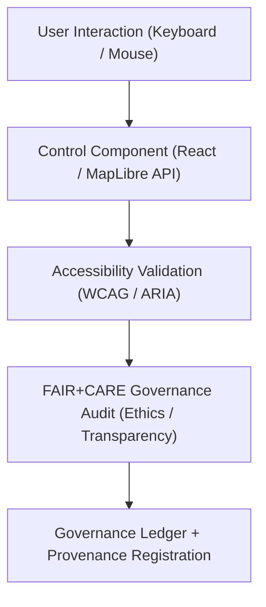

<div align="center">

# 🧭 **Kansas Frontier Matrix — Map Controls Module (v2.1.1 · Tier-Ω+∞ Certified)**  
`web/src/features/map/controls/README.md`

**Mission:** Define and document the **interactive map control components** used in the  
**Kansas Frontier Matrix (KFM)** web application — ensuring accessibility, usability, and FAIR+CARE compliance  
across all map interaction layers and visualization tools.

[](../../../../../docs/)
[](../../../../../docs/standards/faircare-validation.md)
[](../../../../../docs/standards/accessibility.md)
[](../../../../../LICENSE)

</div>

---

## 📚 Overview

The **Map Controls Module** provides reusable, accessible UI components for interacting with  
the MapLibre-based visualization engine. Each control is designed for **universal accessibility**,  
FAIR+CARE compliance, and compliance with W3C **WCAG 2.1 AA** and **ARIA** authoring standards.

Key goals:
- 🧭 Simplify map navigation and layer management.  
- ♿ Ensure accessible and keyboard-navigable controls.  
- 🧩 Integrate FAIR+CARE ethics (transparency + provenance linkage).  
- 🧠 Maintain modular design following MCP-DL and React best practices.

---

## 🗂️ Directory Layout

```bash
web/src/features/map/controls/
├── README.md                     # This file — Map control module documentation
│
├── legend.tsx                    # Dynamic legend reflecting visible map layers
├── zoom-controls.tsx             # Zoom-in/out, reset view, and keyboard shortcuts
├── layer-toggle.tsx              # Multi-layer visibility toggle with ARIA labels
├── basemap-selector.tsx          # Dropdown to switch map styles (terrain, archival, satellite)
└── attribution-control.tsx       # FAIR+CARE attribution and metadata reference control
```

---

## ⚙️ Control Governance Model


<!-- END OF MERMAID -->

---

## 🧱 Core Controls

| Control | Description | Accessibility Feature | FAIR+CARE Role | Validation |
|:--|:--|:--|:--|:--|
| **Legend** | Displays visible layers with metadata tooltips. | ARIA roles + high-contrast text. | Provenance Transparency | `design-validate.yml` |
| **Zoom Controls** | Keyboard and pointer navigation for zoom. | Full keyboard + tab index order. | Accessible Exploration | `ui-validate.yml` |
| **Layer Toggle** | Enables or disables data overlays. | Toggle buttons with ARIA states. | Ethical Visualization Control | `faircare-validate.yml` |
| **Basemap Selector** | Switches between terrain, satellite, and archival layers. | Screen-reader friendly dropdown. | Historical Context Awareness | `docs-validate.yml` |
| **Attribution Control** | Displays dataset and licensing info. | Focusable link structure (WCAG). | Licensing Transparency | `governance-ledger.yml` |

---

## ♿ Accessibility & WCAG Compliance

| WCAG Category | Implementation | Validation |
|:--|:--|:--|
| **Perceivable** | Color contrast ≥ 4.5:1 and text size ≥ 14px. | `design-validate.yml` |
| **Operable** | All controls usable via keyboard and screen readers. | `ui-validate.yml` |
| **Understandable** | Intuitive icons with alt text and tooltips. | `docs-validate.yml` |
| **Robust** | ARIA roles and attributes conform to WAI-ARIA 1.2. | `faircare-validate.yml` |

---

## 🧩 FAIR + CARE Integration

| Principle | Implementation | Governance Workflow |
|:--|:--|:--|
| **Findable** | Layer controls display metadata tooltips linking to STAC/DCAT catalogs. | `stac-validate.yml` |
| **Accessible** | Keyboard + screen reader accessible interface. | `design-validate.yml` |
| **Interoperable** | Reusable UI components using standard React patterns. | `policy-check.yml` |
| **Reusable** | Open-source UI controls documented under MIT. | `governance-ledger.yml` |
| **Collective Benefit (CARE)** | Inclusive visual design for accessibility and transparency. | `faircare-validate.yml` |

---

## 🧠 Example Component Metadata

```yaml
---
component_id: "map_control_zoom_v2.1.1"
authors: ["@kfm-web"]
accessibility_compliance: "WCAG 2.1 AA"
aria_roles: ["button","tooltip","status"]
faircare_status: "Compliant"
checksum: "sha256:7a9e1cb88d41b3e4..."
governance_ledger_entry: "data/reports/audit/data_provenance_ledger.json"
license: "MIT"
---
```

---

## 🧾 Observability & Performance Metrics

| Metric | Description | Target | Validation |
|:--|:--|:--|:--|
| **Control Load Time** | Avg time to initialize control components. | ≤ 0.5s | `ui-validate.yml` |
| **Accessibility Score (WCAG)** | Lighthouse or axe-core accessibility score. | ≥ 95 | `design-validate.yml` |
| **FAIR+CARE Compliance** | Ethics & transparency verification rate. | 100% | `faircare-validate.yml` |
| **Governance Sync Rate** | Provenance link success rate. | 100% | `governance-ledger.yml` |

---

## 🧾 Validation Workflows

| Workflow | Function | Output |
|:--|:--|:--|
| `ui-validate.yml` | Validates UI component structure and accessibility. | `reports/validation/ui_validation.json` |
| `design-validate.yml` | Runs WCAG/ARIA compliance audits. | `reports/fair/a11y_validation.json` |
| `faircare-validate.yml` | Confirms CARE ethics and transparency metrics. | `reports/fair/data_care_assessment.json` |
| `governance-ledger.yml` | Records provenance and checksum verification. | `data/reports/audit/data_provenance_ledger.json` |

---

## 🕰 Version History

| Version | Date | Author | Summary |
|:--|:--|:--|:--|
| **v2.1.1** | 2025-11-16 | @kfm-web | Added provenance-linked attribution control and expanded WCAG validation mapping. |
| v2.0.0 | 2025-10-25 | @kfm-architecture | Introduced modular control pattern and FAIR+CARE governance hooks. |
| v1.0.0 | 2025-10-04 | @kfm-docs | Initial map control module documentation. |

---

<div align="center">

**Kansas Frontier Matrix © 2025**  
*“Every Control Enables Access — Every Access Expands Understanding.”*  
📍 `web/src/features/map/controls/README.md` — FAIR+CARE-aligned Map control component documentation for the Kansas Frontier Matrix.

</div>

