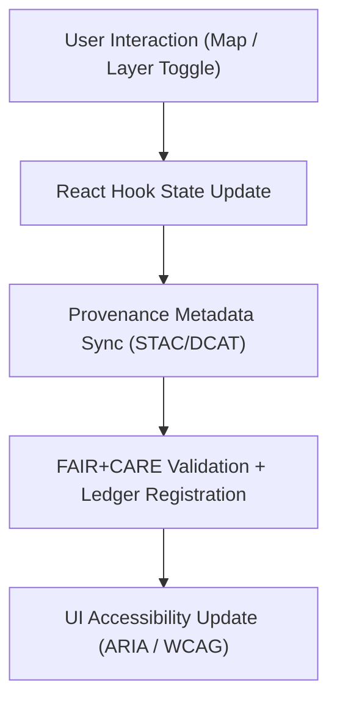
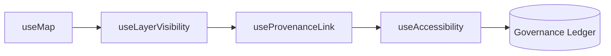

<div align="center">

# 🪝 **Kansas Frontier Matrix — Map Hooks Module (v2.1.1 · Tier-Ω+∞ Certified)**  
`web/src/features/map/hooks/README.md`

**Mission:** Provide reusable React hooks for **state management, provenance linking, and accessibility features**  
within the MapLibre visualization stack of the **Kansas Frontier Matrix (KFM)** web application.

[](../../../../../docs/)
[](../../../../../docs/standards/faircare-validation.md)
[](../../../../../docs/standards/accessibility.md)
[](../../../../../LICENSE)

</div>

---

## 📚 Overview

The **Map Hooks Module** encapsulates shared logic for managing MapLibre GL JS instances,  
layer visibility, metadata provenance, and FAIR+CARE accessibility integration.  

Each hook is built in **TypeScript**, unit-tested, and validated via CI/CD to ensure:
- FAIR+CARE metadata linkage  
- Accessibility and interaction consistency  
- Provenance synchronization with the governance ledger  
- Cross-component reusability and modular architecture  

---

## 🗂️ Directory Layout

```bash
web/src/features/map/hooks/
├── README.md                        # This file — Documentation for hooks module
│
├── use-map.ts                       # Initializes MapLibre map instance and manages events
├── use-layer-visibility.ts          # Controls layer visibility states and toggling logic
├── use-provenance-link.ts           # Links visible layers to STAC/DCAT metadata records
└── use-accessibility.ts             # Provides ARIA and WCAG compliance utilities for map UI
```

---

## ⚙️ Hook Governance Model


<!-- END OF MERMAID -->

---

## 🧱 Core Hooks

| Hook | Description | FAIR+CARE Role | Validation |
|:--|:--|:--|:--|
| **useMap** | Initializes and manages MapLibre map instance and state. | Findable + Accessible | `ui-validate.yml` |
| **useLayerVisibility** | Manages toggling and state persistence for map layers. | Responsibility (CARE) | `ui-validate.yml` |
| **useProvenanceLink** | Connects visible datasets to STAC/DCAT metadata. | Provenance + Transparency | `stac-validate.yml` |
| **useAccessibility** | Manages ARIA roles, keyboard navigation, and contrast modes. | Accessibility + Ethics | `design-validate.yml` |

---

## 🧠 Hook Implementation Standards

| Standard | Description | Enforced By |
|:--|:--|:--|
| **Type Safety** | All hooks written in TypeScript 5 with explicit return types. | `policy-check.yml` |
| **Reusability** | Hooks must be framework-agnostic and unit-tested. | `ui-validate.yml` |
| **Accessibility** | Keyboard and ARIA compliance integrated directly into hooks. | `design-validate.yml` |
| **Governance** | Hooks record provenance and checksum updates for datasets. | `governance-ledger.yml` |

---

## 🧩 FAIR + CARE Integration

| Principle | Implementation | Validation |
|:--|:--|:--|
| **Findable** | Each map instance includes a metadata reference ID. | `stac-validate.yml` |
| **Accessible** | ARIA + WCAG validation hooks for UI elements. | `design-validate.yml` |
| **Interoperable** | Hooks share common API signatures for reuse across modules. | `policy-check.yml` |
| **Reusable** | Common hooks distributed via `web/src/hooks/`. | `ui-validate.yml` |
| **Collective Benefit (CARE)** | Promotes ethical, transparent access to spatial data. | `faircare-validate.yml` |

---

## 🧩 Example Hook Metadata

```yaml
---
hook_id: "use-provenance-link_v2.1.1"
authors: ["@kfm-web"]
faircare_status: "Compliant"
checksum: "sha256:91b4ef7c8b2a53e8..."
governance_ledger_entry: "data/reports/audit/data_provenance_ledger.json"
accessibility_compliance: "WCAG 2.1 AA"
license: "MIT"
---
```

---

## 🧩 Hook Dependency Graph


<!-- END OF MERMAID -->

---

## 🧾 Validation Workflows

| Workflow | Function | Output |
|:--|:--|:--|
| `ui-validate.yml` | Verifies UI and state consistency across hooks. | `reports/validation/ui_validation.json` |
| `design-validate.yml` | Runs WCAG and accessibility audits. | `reports/validation/a11y_validation.json` |
| `stac-validate.yml` | Ensures proper metadata linkages and STAC compliance. | `reports/validation/stac_validation_report.json` |
| `governance-ledger.yml` | Logs checksum and FAIR+CARE provenance data. | `data/reports/audit/data_provenance_ledger.json` |

---

## 🧮 Observability Metrics

| Metric | Description | Target | Validation |
|:--|:--|:--|:--|
| **Hook Render Stability** | % of hooks with consistent re-renders. | ≥ 95% | Jest CI |
| **Accessibility Compliance (WCAG)** | Score from automated accessibility scans. | ≥ 95 | `design-validate.yml` |
| **Metadata Link Accuracy** | Ratio of valid STAC/DCAT linkages. | 100% | `stac-validate.yml` |
| **Governance Sync Rate** | Hooks successfully logging to provenance ledger. | 100% | `governance-ledger.yml` |

---

## 🕰 Version History

| Version | Date | Author | Summary |
|:--|:--|:--|:--|
| **v2.1.1** | 2025-11-16 | @kfm-web | Added provenance and FAIR+CARE governance integration across hooks. |
| v2.0.0 | 2025-10-25 | @kfm-architecture | Introduced accessibility and modular hook design. |
| v1.0.0 | 2025-10-04 | @kfm-docs | Initial React hooks module documentation. |

---

<div align="center">

**Kansas Frontier Matrix © 2025**  
*“Reusable Logic, Transparent Data, Ethical Design.”*  
📍 `web/src/features/map/hooks/README.md` — FAIR+CARE-compliant React hooks documentation for the Kansas Frontier Matrix web map system.

</div>

