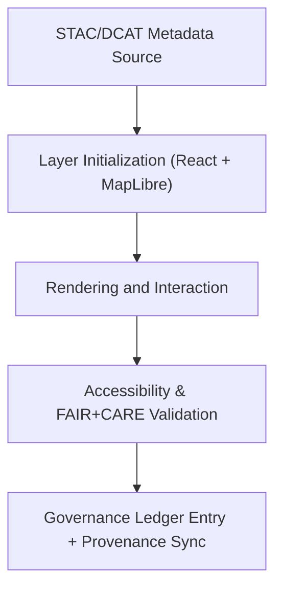

<div align="center">

# 🧩 **Kansas Frontier Matrix — Map Layers Module (v2.1.1 · Tier-Ω+∞ Certified)**  
`web/src/features/map/layers/README.md`

**Mission:** Define and govern the implementation of **geospatial map layers** within the **Kansas Frontier Matrix (KFM)** web application.  
These layers visualize historical, environmental, and cultural datasets while ensuring provenance, accessibility, and FAIR+CARE compliance.

[](../../../../../docs/)
[](../../../../../docs/standards/faircare-validation.md)
[](../../../../../docs/standards/accessibility.md)
[](../../../../../LICENSE)

</div>

---

## 📚 Overview

The **Map Layers Module** manages the rendering, styling, and metadata linkage of all geospatial overlays used in the  
KFM web platform. Each layer corresponds to a data source defined in `data/stac/` or `data/meta/` and is registered  
in the FAIR+CARE governance ledger for transparency and provenance tracking.

Core objectives:
- 🗺️ Integrate geospatial datasets using **MapLibre GL JS**.  
- 🧭 Link layers to metadata schemas (STAC/DCAT).  
- ♿ Maintain accessibility and color-contrast validation for users.  
- 🔗 Ensure each layer includes checksum and FAIR+CARE governance traceability.

---

## 🗂️ Directory Layout

```bash
web/src/features/map/layers/
├── README.md                        # This file — layer documentation and governance standards
│
├── hazards-layer.tsx                # NOAA & FEMA hazard visualizations (tornado, flood, drought)
├── treaties-layer.tsx               # Historical and Indigenous treaty map overlays
├── hydrology-layer.tsx              # USGS hydrological maps and river networks
├── cultural-layer.tsx               # CARE-aligned cultural heritage map
└── base-layer.tsx                   # Common rendering logic and map sources registry
```

---

## ⚙️ Layer Governance Model


<!-- END OF MERMAID -->

---

## 🧱 Core Layer Types

| Layer | Description | Data Source | FAIR+CARE Role | Validation |
|:--|:--|:--|:--|:--|
| **Hazards Layer** | Displays tornado, flood, and drought datasets. | NOAA / FEMA | Findable & Accessible | `stac-validate.yml` |
| **Treaties Layer** | Visualizes Indigenous land cessions and historical boundaries. | Kansas Historical Society / NARA | Ethics & Authority to Control | `faircare-validate.yml` |
| **Hydrology Layer** | Shows rivers, basins, and aquifers. | USGS / KGS | Interoperable & Reusable | `stac-validate.yml` |
| **Cultural Layer** | CARE-governed cultural regions and heritage sites. | Tribal Repositories / OSAGE GIS | Collective Benefit & Ethics | `faircare-validate.yml` |

---

## 🧩 Accessibility Standards

| Standard | Implementation | Validation Workflow |
|:--|:--|:--|
| **WCAG 2.1 AA** | High-contrast map color schemes and ARIA labels for controls. | `design-validate.yml` |
| **Keyboard Navigation** | Layer toggles and map legend accessible via tab order. | `ui-validate.yml` |
| **Alt Text** | Each dataset represented with descriptive captions. | `docs-validate.yml` |
| **Color Blindness Modes** | Alternative palettes supported via accessibility preferences. | `design-validate.yml` |

---

## 🧠 FAIR + CARE Metadata Integration

| Field | Description | Example |
|:--|:--|:--|
| `id` | Unique identifier for dataset/layer. | `"hazards_v9.3.2"` |
| `title` | Layer title displayed on map. | `"NOAA Storm Events – Tornado Tracks"` |
| `provider` | Dataset source or author. | `"NOAA National Centers for Environmental Information"` |
| `license` | Licensing terms for dataset. | `"Public Domain"` |
| `checksum` | Integrity hash recorded in governance ledger. | `"sha256:cb3ef8b79..."` |
| `governance_ref` | FAIR+CARE governance linkage. | `"docs/standards/governance/ROOT-GOVERNANCE.md"` |

---

## 🔍 FAIR+CARE Evaluation Summary

| Principle | Implementation | Validation | Status |
|:--|:--|:--|:--:|
| **Findable** | Indexed via STAC catalog + legend UI. | `stac-validate.yml` | ✅ |
| **Accessible** | Public access and colorblind-friendly display. | `design-validate.yml` | ✅ |
| **Interoperable** | Uses OGC-compliant GeoJSON/MapLibre standards. | `policy-check.yml` | ✅ |
| **Reusable** | Metadata versioned and documented. | `governance-ledger.yml` | ✅ |
| **Collective Benefit (CARE)** | Data co-curated with Indigenous and cultural groups. | `faircare-validate.yml` | ✅ |

---

## 🧾 Provenance Metadata Example

```yaml
---
layer_id: "hazards_v9.3.2"
source: "NOAA Storm Events Database"
stac_reference: "data/stac/items/hazards_2025.json"
checksum: "sha256:a81d32e87b5e3b..."
governance_ledger_entry: "data/reports/audit/data_provenance_ledger.json"
license: "Public Domain"
faircare_status: "Compliant"
---
```

---

## 🧮 Performance & Observability Metrics

| Metric | Description | Target | Validation Workflow |
|:--|:--|:--|:--|
| **Render Time (per layer)** | Time to draw vector tiles on map. | ≤ 1.0s | `ui-validate.yml` |
| **FAIR Metadata Sync** | Metadata link accuracy per layer. | 100% | `stac-validate.yml` |
| **Accessibility Compliance (WCAG)** | Validation of alt text, contrast, and keyboard nav. | ≥ 95% | `design-validate.yml` |
| **Governance Ledger Sync Rate** | % of layers linked to ledger entry. | 100% | `governance-ledger.yml` |

---

## 🧾 Governance Validation Workflows

| Workflow | Function | Output |
|:--|:--|:--|
| `stac-validate.yml` | Verifies geospatial metadata integrity. | `reports/validation/stac_validation_report.json` |
| `faircare-validate.yml` | Ensures ethical and inclusive representation. | `reports/fair/data_care_assessment.json` |
| `governance-ledger.yml` | Logs provenance and checksum records. | `data/reports/audit/data_provenance_ledger.json` |
| `design-validate.yml` | Runs accessibility and a11y design checks. | `reports/validation/a11y_validation.json` |

---

## 🕰 Version History

| Version | Date | Author | Summary |
|:--|:--|:--|:--|
| **v2.1.1** | 2025-11-16 | @kfm-web | Finalized FAIR+CARE metadata integration and accessibility metrics. |
| v2.0.0 | 2025-10-25 | @kfm-architecture | Added provenance and cultural layer alignment. |
| v1.0.0 | 2025-10-04 | @kfm-docs | Initial map layer module structure. |

---

<div align="center">

**Kansas Frontier Matrix © 2025**  
*“Every Layer Carries History — Every Pixel Holds Provenance.”*  
📍 `web/src/features/map/layers/README.md` — FAIR+CARE-governed map layer documentation for the Kansas Frontier Matrix.

</div>

