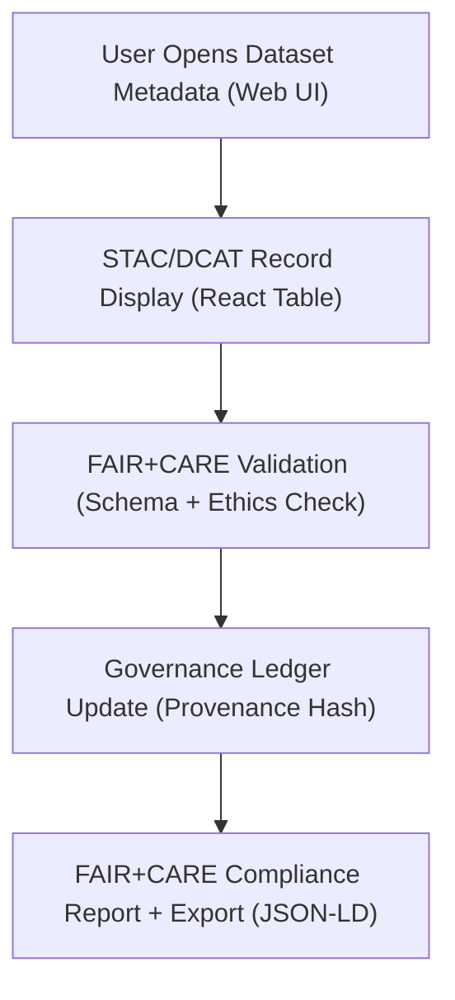

<div align="center">

# 🧾 **Kansas Frontier Matrix — Metadata Feature Module (v2.1.1 · Tier-Ω+∞ Certified)**  
`web/src/features/metadata/README.md`

**Mission:** Deliver a FAIR+CARE-compliant interface for viewing, editing, and validating metadata records  
across the **Kansas Frontier Matrix (KFM)** web application.  
Integrates **STAC**, **DCAT**, and **FAIR+CARE governance frameworks** to ensure data transparency, provenance,  
and accessibility across all datasets and documents.

[](../../../../docs/)
[](../../../../docs/standards/faircare-validation.md)
[](../../../../docs/standards/accessibility.md)
[](../../../../LICENSE)

</div>

---

## 📚 Overview

The **Metadata Module** is the governance and validation interface for dataset records  
used throughout the Kansas Frontier Matrix (KFM).  
It centralizes metadata display, schema validation, and governance checks for all STAC and DCAT records,  
linking them to FAIR+CARE ethics and provenance chains.

Core objectives:
- 🧭 Display dataset metadata with human-readable schema visualization.  
- 🔗 Link metadata entries to STAC/DCAT catalogs and governance ledgers.  
- 🧠 Validate FAIR+CARE fields automatically via CI integration.  
- ♿ Maintain WCAG 2.1 AA accessibility and JSON-LD export compatibility.  

---

## 🗂️ Directory Layout

```bash
web/src/features/metadata/
├── README.md                        # This file — Metadata feature documentation
│
├── records/                         # Metadata table and dataset viewer components
│   ├── metadata-table.tsx            # Displays metadata in structured, sortable tables
│   ├── metadata-detail.tsx           # Shows individual dataset details with provenance
│   └── metadata-editor.tsx           # Inline editor for updating FAIR+CARE fields
│
└── validator/                       # Client-side metadata validation utilities
    ├── schema-checker.ts             # Validates metadata JSON against STAC/DCAT schemas
    ├── faircare-checker.ts           # Verifies ethical and governance fields
    └── validation-panel.tsx          # UI panel displaying validation results
```

---

## ⚙️ Metadata Governance Model


<!-- END OF MERMAID -->

---

## 🧱 Core Components

| Component | Description | FAIR+CARE Function | Validation Workflow |
|:--|:--|:--|:--|
| **Metadata Table** | Displays searchable, sortable dataset metadata. | Findable + Accessible | `ui-validate.yml` |
| **Metadata Detail** | Renders full metadata with provenance and license info. | Reusable + Responsible | `stac-validate.yml` |
| **Metadata Editor** | Inline editor for FAIR+CARE fields (license, provenance, ethics). | Authority to Control | `faircare-validate.yml` |
| **Schema Checker** | Validates metadata against STAC/DCAT schemas. | Interoperable | `policy-check.yml` |
| **Validation Panel** | Displays compliance results and governance report link. | Ethics + Transparency | `governance-ledger.yml` |

---

## 🧠 FAIR + CARE Integration

| Principle | Implementation | Validation |
|:--|:--|:--|
| **Findable** | STAC/DCAT datasets fully indexed in `catalog.json`. | `stac-validate.yml` |
| **Accessible** | Web-based interface and JSON exports for all metadata. | `design-validate.yml` |
| **Interoperable** | Uses DCAT 3.0 and STAC 1.0 schemas with JSON-LD support. | `policy-check.yml` |
| **Reusable** | Metadata editable and versioned with provenance. | `governance-ledger.yml` |
| **Collective Benefit (CARE)** | Ensures culturally sensitive metadata tagging. | `faircare-validate.yml` |

---

## ♿ Accessibility Standards

| Feature | Implementation | Validation |
|:--|:--|:--|
| **Keyboard Navigation** | Full tab navigation for metadata fields. | `ui-validate.yml` |
| **ARIA Labels** | All table cells and buttons have ARIA tags. | `design-validate.yml` |
| **Contrast Compliance** | ≥ 4.5:1 ratio for all metadata fields. | `design-validate.yml` |
| **Screen Reader Support** | Descriptive metadata summaries available via `aria-describedby`. | `docs-validate.yml` |

---

## 🔍 Provenance & Governance Integration

| Artifact | Description | Path |
|:--|:--|:--|
| **STAC Items** | Dataset metadata and lineage for each record. | `data/stac/items/` |
| **DCAT Catalog** | Aggregated dataset index for discoverability. | `data/meta/dcat_catalog.json` |
| **Governance Ledger** | Provenance, checksum, and FAIR+CARE audit results. | `data/reports/audit/data_provenance_ledger.json` |

> 🧩 Each metadata edit automatically generates a checksum  
> and updates the corresponding governance ledger entry.

---

## 🧾 Example Component Metadata

```yaml
---
component_id: "metadata_feature_v2.1.1"
authors: ["@kfm-web","@kfm-data"]
faircare_status: "Tier-Ω+∞ Verified"
checksum: "sha256:9cd71ef4a8915b3f..."
governance_ledger_entry: "data/reports/audit/data_provenance_ledger.json"
accessibility_compliance: "WCAG 2.1 AA"
license: "MIT"
---
```

---

## 🧮 Observability Metrics

| Metric | Description | Target | Workflow |
|:--|:--|:--|:--|
| **Schema Validation Accuracy** | % of metadata passing schema check. | 100% | `stac-validate.yml` |
| **FAIR+CARE Compliance Score** | Metadata ethics audit compliance rate. | ≥ 95 | `faircare-validate.yml` |
| **Accessibility Score (WCAG)** | Lighthouse accessibility audit rating. | ≥ 95 | `design-validate.yml` |
| **Governance Sync Rate** | Successful provenance ledger updates. | 100% | `governance-ledger.yml` |

---

## 🧾 Validation Workflows

| Workflow | Purpose | Output |
|:--|:--|:--|
| `stac-validate.yml` | Validates STAC 1.0 schema conformity. | `reports/validation/stac_validation_report.json` |
| `faircare-validate.yml` | Ensures ethics compliance for metadata. | `reports/fair/data_care_assessment.json` |
| `policy-check.yml` | Verifies license and provenance metadata fields. | `reports/audit/policy_check.json` |
| `design-validate.yml` | Runs accessibility and WCAG tests. | `reports/validation/a11y_validation.json` |
| `governance-ledger.yml` | Records checksums and validation outcomes. | `data/reports/audit/data_provenance_ledger.json` |

---

## 🕰 Version History

| Version | Date | Author | Summary |
|:--|:--|:--|:--|
| **v2.1.1** | 2025-11-16 | @kfm-web | Added inline FAIR+CARE editor and accessibility validations. |
| v2.0.0 | 2025-10-25 | @kfm-data | Integrated schema validation and governance audit workflow. |
| v1.0.0 | 2025-10-04 | @kfm-docs | Initial metadata viewer documentation. |

---

<div align="center">

**Kansas Frontier Matrix © 2025**  
*“Metadata Is Memory — Provenance Is Proof.”*  
📍 `web/src/features/metadata/README.md` — FAIR+CARE-aligned metadata feature documentation for the Kansas Frontier Matrix web platform.

</div>

