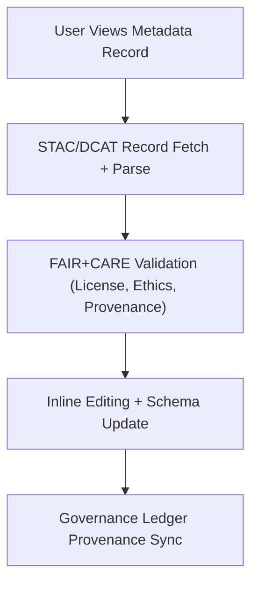

<div align="center">

# 🧮 **Kansas Frontier Matrix — Metadata Records Module (v2.1.1 · Tier-Ω+∞ Certified)**  
`web/src/features/metadata/records/README.md`

**Mission:** Provide FAIR+CARE-compliant data visualization and editing of metadata records for  
the **Kansas Frontier Matrix (KFM)** web interface — integrating STAC/DCAT schema validation,  
provenance tracking, and governance-aware editing tools.

[](../../../../../docs/)
[](../../../../../docs/standards/faircare-validation.md)
[](../../../../../docs/standards/accessibility.md)
[](../../../../../LICENSE)

</div>

---

## 📚 Overview

The **Metadata Records Module** is responsible for rendering dataset metadata in a human-readable  
and interactive format. It connects each record to **FAIR+CARE metadata schemas**, **STAC/DCAT catalogs**,  
and **governance-ledger provenance logs** to guarantee transparency, accessibility, and ethical stewardship.

Core objectives:
- 🔍 Visualize metadata records for datasets, documents, and models.  
- ✏️ Support inline FAIR+CARE field editing and validation.  
- 🧩 Integrate with the governance ledger for checksum and provenance sync.  
- ♿ Ensure full accessibility under WCAG 2.1 AA.  

---

## 🗂️ Directory Layout

```bash
web/src/features/metadata/records/
├── README.md                        # This file — Metadata records documentation
│
├── metadata-table.tsx               # Displays searchable dataset metadata table
├── metadata-detail.tsx              # Shows detailed metadata for selected records
└── metadata-editor.tsx              # Inline FAIR+CARE metadata editing interface
```

---

## ⚙️ Records Governance Model


<!-- END OF MERMAID -->

---

## 🧱 Core Components

| Component | Description | FAIR+CARE Role | Validation Workflow |
|:--|:--|:--|:--|
| **Metadata Table** | Displays all metadata entries in sortable table view. | Findable + Accessible | `ui-validate.yml` |
| **Metadata Detail** | Expands to show complete metadata JSON with lineage. | Interoperable + Responsible | `stac-validate.yml` |
| **Metadata Editor** | Allows editing FAIR+CARE fields such as license and provenance. | Authority to Control | `faircare-validate.yml` |

---

## 🧠 FAIR + CARE Integration

| Principle | Implementation | Validation |
|:--|:--|:--|
| **Findable** | Indexed via STAC/DCAT `id` in metadata table. | `stac-validate.yml` |
| **Accessible** | Accessible controls, ARIA labels, and color contrast support. | `design-validate.yml` |
| **Interoperable** | DCAT + STAC + FAIR JSON schema support. | `policy-check.yml` |
| **Reusable** | Versioned records with checksum tracking. | `governance-ledger.yml` |
| **Collective Benefit (CARE)** | Ethical review integrated into metadata editing. | `faircare-validate.yml` |

---

## ♿ Accessibility Standards (WCAG 2.1 AA)

| Feature | Implementation | Validation |
|:--|:--|:--|
| **Keyboard Navigation** | Tab-indexed metadata cells and edit buttons. | `ui-validate.yml` |
| **ARIA Support** | `aria-label` and `aria-describedby` for all data fields. | `design-validate.yml` |
| **Color Contrast** | Minimum 4.5:1 ratio for text and table borders. | `design-validate.yml` |
| **Readable Tooltips** | Plain-language tooltips describing metadata fields. | `docs-validate.yml` |

---

## 🔍 Provenance & Governance Integration

| Artifact | Description | Path |
|:--|:--|:--|
| **STAC Items** | Dataset-level metadata references. | `data/stac/items/` |
| **DCAT Catalog** | Dataset interoperability metadata. | `data/meta/dcat_catalog.json` |
| **Governance Ledger** | Provenance and checksum verification records. | `data/reports/audit/data_provenance_ledger.json` |

---

## 🧾 Example Component Metadata

```yaml
---
component_id: "metadata_records_v2.1.1"
authors: ["@kfm-web","@kfm-data"]
faircare_status: "Tier-Ω+∞ Verified"
checksum: "sha256:f32e3b4dc9a1c07a..."
governance_ledger_entry: "data/reports/audit/data_provenance_ledger.json"
accessibility_compliance: "WCAG 2.1 AA"
license: "MIT"
---
```

---

## 🧮 Observability Metrics

| Metric | Description | Target | Workflow |
|:--|:--|:--|:--|
| **Schema Validation Accuracy** | % of records passing STAC/DCAT validation. | 100% | `stac-validate.yml` |
| **FAIR+CARE Compliance Rate** | % of edited records maintaining compliance. | ≥ 95 | `faircare-validate.yml` |
| **Accessibility Score (WCAG)** | UI compliance rate for table and details. | ≥ 95 | `design-validate.yml` |
| **Governance Sync Rate** | Metadata ledger entries successfully logged. | 100% | `governance-ledger.yml` |

---

## 🧾 Validation Workflows

| Workflow | Purpose | Output |
|:--|:--|:--|
| `ui-validate.yml` | Validates table rendering and edit interactions. | `reports/validation/ui_validation.json` |
| `stac-validate.yml` | Confirms STAC/DCAT metadata structure. | `reports/validation/stac_validation_report.json` |
| `faircare-validate.yml` | Reviews ethical metadata fields and cultural sensitivity. | `reports/fair/data_care_assessment.json` |
| `design-validate.yml` | Audits accessibility and color contrast compliance. | `reports/validation/a11y_validation.json` |
| `governance-ledger.yml` | Logs checksum and provenance verification. | `data/reports/audit/data_provenance_ledger.json` |

---

## 🕰 Version History

| Version | Date | Author | Summary |
|:--|:--|:--|:--|
| **v2.1.1** | 2025-11-16 | @kfm-web | Added FAIR+CARE field editing and accessibility metrics. |
| v2.0.0 | 2025-10-25 | @kfm-data | Introduced metadata detail expansion and governance logging. |
| v1.0.0 | 2025-10-04 | @kfm-docs | Initial metadata record viewer documentation. |

---

<div align="center">

**Kansas Frontier Matrix © 2025**  
*“Every Record Holds Provenance — Every Provenance Builds Trust.”*  
📍 `web/src/features/metadata/records/README.md` — FAIR+CARE-aligned metadata records documentation for the Kansas Frontier Matrix web platform.

</div>

