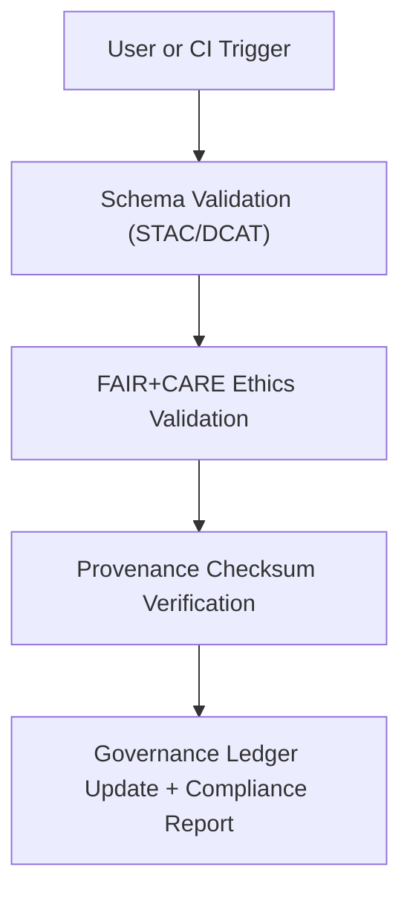

<div align="center">

# ✅ **Kansas Frontier Matrix — Metadata Validator Module (v2.1.1 · Tier-Ω+∞ Certified)**  
`web/src/features/metadata/validator/README.md`

**Mission:** Provide a FAIR+CARE-compliant validation engine and user interface for verifying dataset  
metadata against STAC/DCAT schemas and governance rules within the **Kansas Frontier Matrix (KFM)**.  
Ensures reproducibility, provenance traceability, and ethical metadata stewardship across the data ecosystem.

[](../../../../../docs/)
[](../../../../../docs/standards/faircare-validation.md)
[](../../../../../docs/standards/accessibility.md)
[](../../../../../LICENSE)

</div>

---

## 📚 Overview

The **Metadata Validator Module** ensures every dataset or document in KFM meets  
FAIR+CARE and STAC/DCAT metadata standards before public deployment or governance sign-off.  
It validates ethical metadata fields, schema structure, and provenance alignment with the  
governance ledger for full traceability and compliance.

Core objectives:
- ✅ Validate dataset metadata schemas (STAC 1.0, DCAT 3.0, FAIR+CARE).  
- 🧩 Display validation results in an interactive dashboard.  
- 🔗 Log compliance results to governance ledger.  
- ♿ Maintain accessible validation outputs for all users.  

---

## 🗂️ Directory Layout

```bash
web/src/features/metadata/validator/
├── README.md                      # This file — Metadata validator documentation
│
├── schema-checker.ts              # JSON schema validator for STAC/DCAT metadata
├── faircare-checker.ts            # Ethics and governance validation for FAIR+CARE fields
└── validation-panel.tsx           # React component rendering validation results to users
```

---

## ⚙️ Validation Governance Model


<!-- END OF MERMAID -->

---

## 🧱 Core Components

| Component | Description | FAIR+CARE Function | Validation Workflow |
|:--|:--|:--|:--|
| **Schema Checker** | Validates JSON metadata against STAC/DCAT schemas. | Findable + Interoperable | `stac-validate.yml` |
| **FAIR+CARE Checker** | Ensures ethical and governance metadata completeness. | Responsibility + Ethics | `faircare-validate.yml` |
| **Validation Panel** | Displays validation results and compliance score. | Transparency + Accessibility | `ui-validate.yml` |

---

## 🧠 FAIR + CARE Integration

| Principle | Implementation | Validation |
|:--|:--|:--|
| **Findable** | Schema and metadata records indexed via STAC/DCAT catalog. | `stac-validate.yml` |
| **Accessible** | Validation dashboard meets WCAG 2.1 AA standards. | `design-validate.yml` |
| **Interoperable** | JSON schemas harmonized with FAIR+CARE metadata rules. | `policy-check.yml` |
| **Reusable** | Validation outputs logged to governance ledger for reuse. | `governance-ledger.yml` |
| **Collective Benefit (CARE)** | FAIR+CARE checks promote transparency and inclusivity. | `faircare-validate.yml` |

---

## ♿ Accessibility Standards

| Feature | Implementation | Validation Workflow |
|:--|:--|:--|
| **Screen Reader Support** | `aria-live` updates announce validation progress. | `design-validate.yml` |
| **Color Contrast** | Validation pass/fail states meet ≥ 4.5:1 ratio. | `design-validate.yml` |
| **Keyboard Navigation** | Tab and arrow key navigation for result browsing. | `ui-validate.yml` |
| **Tooltip Readability** | Each validation error includes plain-text explanation. | `docs-validate.yml` |

---

## 🔍 Provenance & Governance Integration

| Artifact | Description | Path |
|:--|:--|:--|
| **STAC Items** | Dataset metadata reference. | `data/stac/items/` |
| **DCAT Catalog** | Dataset discoverability metadata. | `data/meta/dcat_catalog.json` |
| **Governance Ledger** | Provenance and checksum verification log. | `data/reports/audit/data_provenance_ledger.json` |

---

## 🧩 Example Metadata Validation Record

```json
{
  "id": "noaa_storm_events_2025",
  "validation_date": "2025-11-16T14:00:00Z",
  "schema": "STAC 1.0",
  "faircare_compliance": "Compliant",
  "checksum": "sha256:37bdf12a1e6f38f2...",
  "governance_ledger": "data/reports/audit/data_provenance_ledger.json",
  "status": "approved"
}
```

---

## 🧾 Example Component Metadata

```yaml
---
component_id: "metadata_validator_v2.1.1"
authors: ["@kfm-web","@kfm-data"]
faircare_status: "Tier-Ω+∞ Verified"
checksum: "sha256:19bcd43af6f8c73b..."
governance_ledger_entry: "data/reports/audit/data_provenance_ledger.json"
accessibility_compliance: "WCAG 2.1 AA"
license: "MIT"
---
```

---

## 🧮 Observability Metrics

| Metric | Description | Target | Workflow |
|:--|:--|:--|:--|
| **Schema Pass Rate** | % of metadata successfully validated. | 100% | `stac-validate.yml` |
| **FAIR+CARE Pass Rate** | % of metadata with complete ethical fields. | ≥ 95 | `faircare-validate.yml` |
| **Accessibility Score (WCAG)** | Score from Lighthouse/axe-core audits. | ≥ 95 | `design-validate.yml` |
| **Governance Sync Rate** | Records successfully logged to ledger. | 100% | `governance-ledger.yml` |

---

## 🧾 Validation Workflows

| Workflow | Function | Output |
|:--|:--|:--|
| `stac-validate.yml` | Validates STAC/DCAT schema alignment. | `reports/validation/stac_validation_report.json` |
| `faircare-validate.yml` | Audits FAIR+CARE compliance and ethics metadata. | `reports/fair/data_care_assessment.json` |
| `ui-validate.yml` | Verifies validation dashboard accessibility. | `reports/validation/ui_validation.json` |
| `design-validate.yml` | Checks visual and color accessibility standards. | `reports/validation/a11y_validation.json` |
| `governance-ledger.yml` | Logs checksum and compliance results. | `data/reports/audit/data_provenance_ledger.json` |

---

## 🕰 Version History

| Version | Date | Author | Summary |
|:--|:--|:--|:--|
| **v2.1.1** | 2025-11-16 | @kfm-web | Added interactive validation panel and FAIR+CARE ethics checker integration. |
| v2.0.0 | 2025-10-25 | @kfm-data | Introduced schema and governance validation workflows. |
| v1.0.0 | 2025-10-04 | @kfm-docs | Initial metadata validator documentation and governance model. |

---

<div align="center">

**Kansas Frontier Matrix © 2025**  
*“Validation Builds Trust — Governance Makes It Endure.”*  
📍 `web/src/features/metadata/validator/README.md` — FAIR+CARE-aligned metadata validation documentation for the Kansas Frontier Matrix web platform.

</div>

